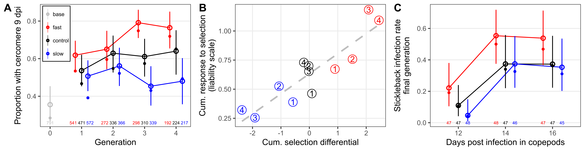
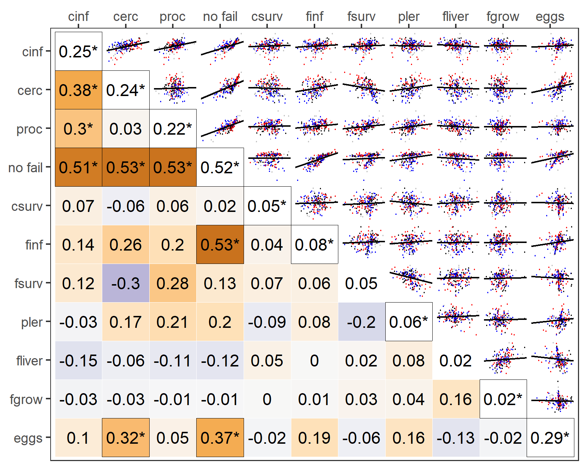

The scripts in this repository were used to analyze a selection experiment. Specifically, I artificially selected tapeworms for 4 generations to develop faster or slower in their first host.

# Introduction

Some parasite strategies are puzzling. For instance, parasitic worms with complex life cycles typically risk developing for weeks in small, short-lived first intermediate hosts, despite being able to grow faster, larger, and safer in their subsequent hosts. Why do parasites risk prolonged development in first host with low life expectancy? To understand this, I selected a tapeworm (*Schistocephalus solidus*) for faster larval development in its copepod first host. Among tapeworms, *S. solidus* and its relatives have some of the shortest developmental times (see analysis [here](analyses/01macroevol_pattern.md)), albeit not as short as optimality models might predict, so selection pushed a conserved-but-counterintuitive phenotype towards a limit on known strategies. My goals were to test whether faster development can evolve and to assess why it has not.

# Results

The response to selection over time was analysed [here](analyses/02testing_selection_response.Rmd). Faster parasite development evolved and enabled earlier infectivity to the next host, sticklebacks.

Although this suggests that evolving faster development is advantageous, selection itself increased the frequency of parasite families with reduced infectivity to copepods, developmental stability, and fecundity. This release of cryptic, deleterious genetic variation for development (decanalization), and the limited genetic covariation with fish infectivity, both constrain adaptive change. 

Canalized development, as well as stasis in the lineage and convergent strategies in other copepod-infecting helminths, are all consistent with stabilizing selection, in which rapid development has costs. Nevertheless, these costs were not obvious from the experiment; fast-developing genotypes did not decrease copepod survival, even under host starvation, nor did they underperform in the next hosts. This can be seen in the pattern of genetic covariance (the G-matrix below; analysis [here](analyses/05quant_gen_multivariate.md)); most correlations with larval development (cerc) are positive, not negative. 

I speculate that, on longer time scales, the ultimate cost of abbreviated development in small first hosts is a reduced ability to infect the larger second host.

# Reference

Benesh, D.P. 2023. Selection on an extreme-yet-conserved larval life-history strategy in a tapeworm. Evolution. In revision.
