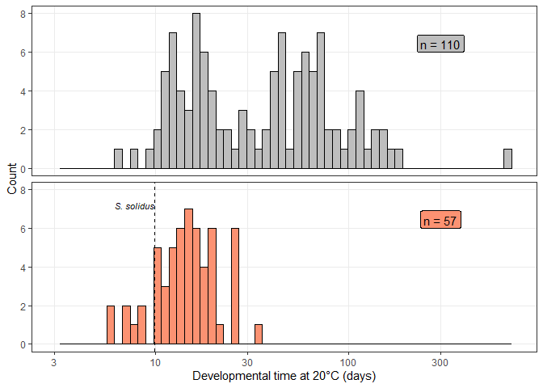
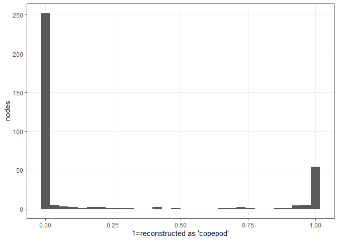
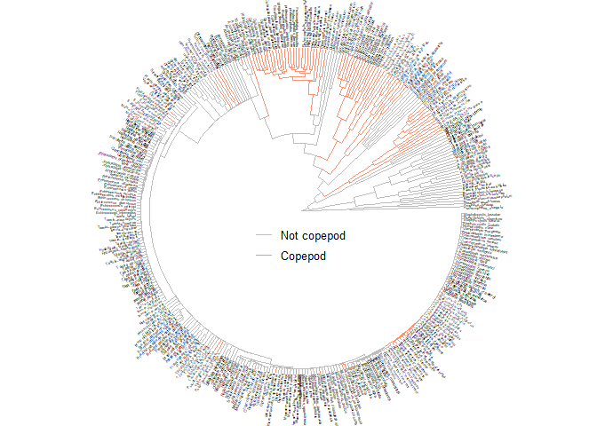
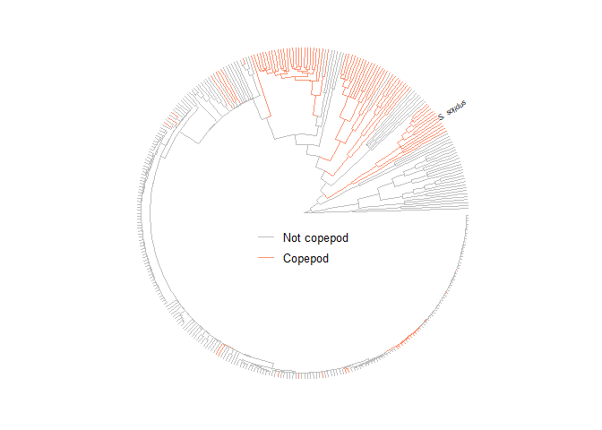
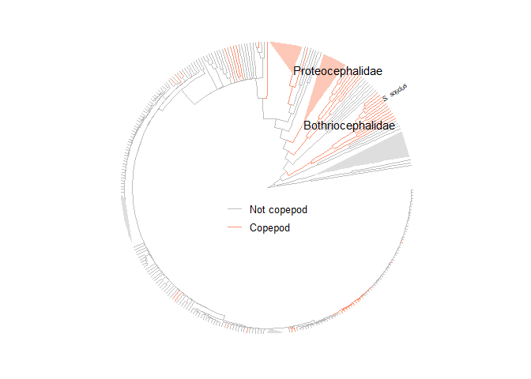
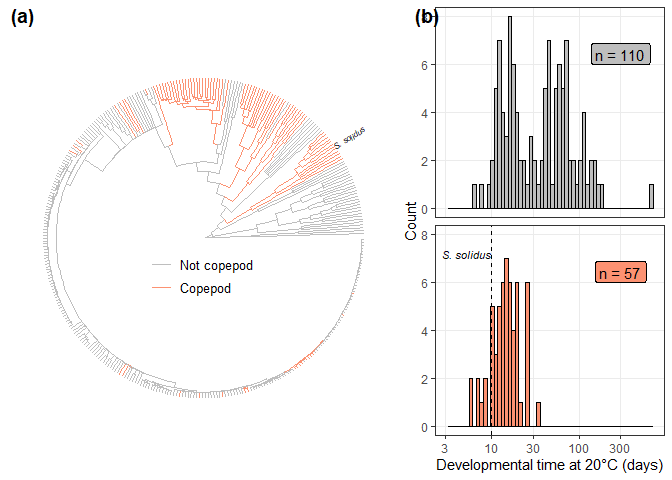

Macroevolutionary pattern of larval cestode development
================

Tapeworms have evolved to infect many different kinds of first hosts.
The species that infect copepods tend to have short developmental times.
However, they have not evolved paratenic strategies (i.e. no
development) in the first host. To examine potential genetic constraints
preventing shorter development, we experimentally evolved a tapeworm,
*S. solidus*, to have longer and shorter development in its copepod
first host. To put the results into a broader context, here I examine
the macroevolutionary patterns in larval development in cestodes.

The comparative data on larval development are from a life cycle
database. The database included acanthocephalans, nematodes, and
cestodes, but we will focus just on the cestodes.

Here are the number of cestodes in the database with information on
their first host:

    ## [1] 344

Not all of these have developmental time data though. Here are the
number of species for which temperature-corrected developmental time
(i.e. in degree-days) was available:

    ## [1] 167

Let’s look at the distribution of developmental times, distinguishing
between species that have copepod first hosts (like our focal species,
*S. solidus*) and those that do not. We can see that the shortest larval
developmental times are about 10 days at 20 C, and often these are worms
with copepod first hosts. The dashed vertical line represents *S.
solidus*, so even among tapeworms with copepod first hosts, it tends to
develop quickly.

<!-- -->

Diverse tapeworms infect copepods. But is this a novel strategy, such
that there may not have been enough time to evolve shorter development?
Or is it an old life cycle, suggesting shorter development either is
constrained or not favored? To answer this, let’s import a molecular
phylogeny. We restrict the tree to cestodes, make it dichotomous and
ultrametric.

Then, we perform ancestral state reconstruction

Here is the distribution of state likelihoods for all the nodes on the
tree. Most nodes were confidently reconstructed (low or high
likelihood).

<!-- -->

Let’s visualize the reconstruction.

Some of the earliest branching clades include groups that infect
copepods.

<!-- -->

In fact, if we only label *S. solidus*, we see that it belongs to this
early branching clade. Thus, the lineage has probably had a long time to
adapt to copepods, likely hundreds of millions of years.

<!-- -->

To try and improve the visualization, we can collapse certain clades.
However, collapsing and then zooming out of those clades results in
misplaced labels.

<!-- -->

Let’s put the two plots together.

<!-- -->
