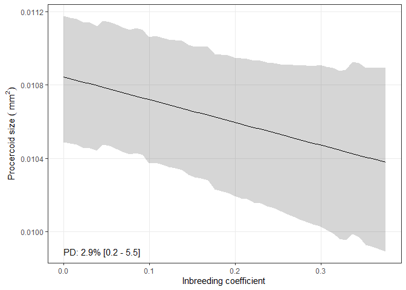
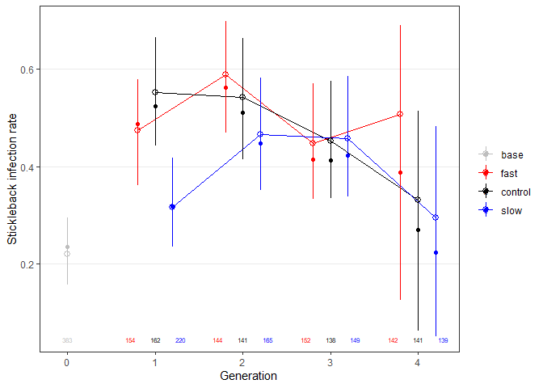
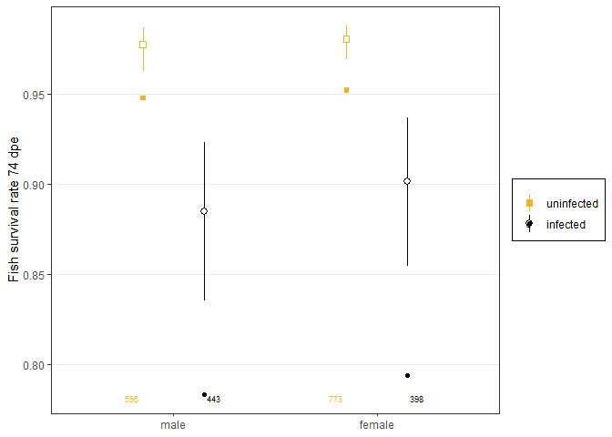
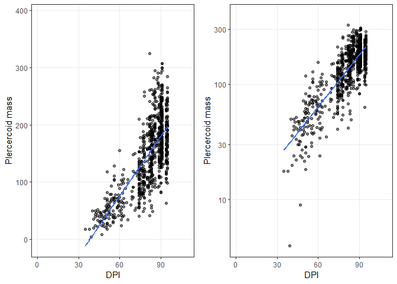
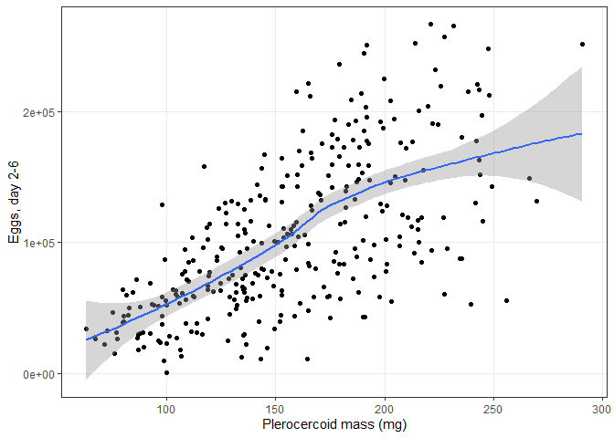
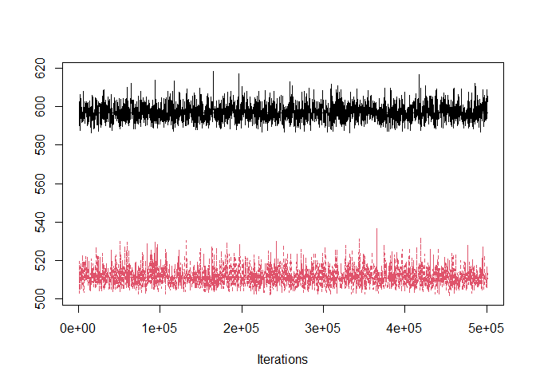
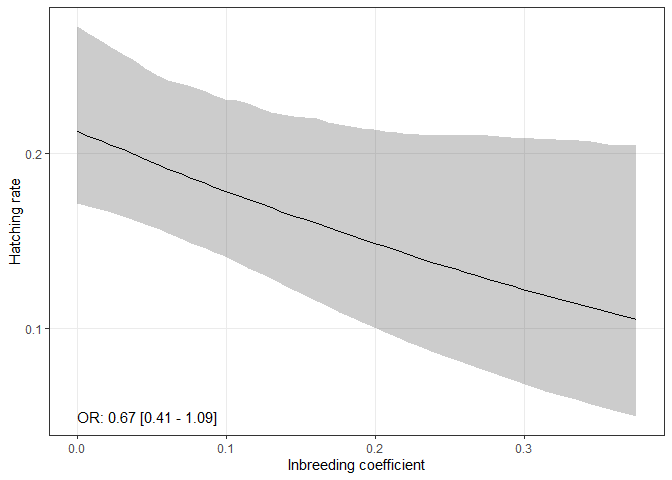
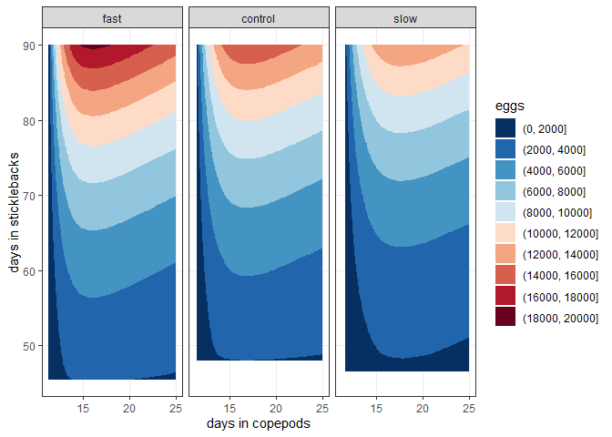

Testing response to selection
================

-   [Focal selection response: larval
    development](#focal-selection-response-larval-development)
    -   [Response to selection](#response-to-selection)
    -   [Response vs selection
        differential](#response-vs-selection-differential)
-   [Correlated selection responses](#correlated-selection-responses)
    -   [Traits in copepods](#traits-in-copepods)
        -   [Copepod infection rate](#copepod-infection-rate)
        -   [Procercoid size](#procercoid-size)
        -   [Developmental defects](#developmental-defects)
        -   [Copepod survival](#copepod-survival)
    -   [Traits in fish](#traits-in-fish)
        -   [Fish infection rate](#fish-infection-rate)
        -   [Fish survival](#fish-survival)
        -   [Plerocercoid size](#plerocercoid-size)
        -   [Fish liver size](#fish-liver-size)
        -   [Fish growth](#fish-growth)
    -   [Breeding traits](#breeding-traits)
        -   [Egg production](#egg-production)
        -   [Hatching](#hatching)
-   [Fitness over full life cycle](#fitness-over-full-life-cycle)
    -   [Probability of surviving until infecting second
        host](#probability-of-surviving-until-infecting-second-host)
    -   [Probability of surviving until breeding and expected egg
        production](#probability-of-surviving-until-breeding-and-expected-egg-production)
    -   [Fitness calculations](#fitness-calculations)
-   [Conclusions](#conclusions)

I experimentally selected tapeworms (*S. solidus*) for faster and slower
development in their intermediate host. In this notebook, I test whether
there was a response to selection, as well as whether there were
correlated responses in other traits.

Let’s start by looking at the trait we selected upon: cercomere presence
9 day post infection.

# Focal selection response: larval development

Infected copepods were checked under a microscope 9 dpi. Worms were
scored as either having or not having a cercomere. The cercomere is a
sign of infectivity. Parasite development may be affected by several
things besides the imposed selection. For instance, developmental rate
may vary between infection rounds, and within rounds depending on
copepod stage. Let’s look at some of these predictors.

## Response to selection

To handle the many copepods, the experiment was broken in several rounds
per generation. Here are the copepod blocks; the first number in the
name is the generation, the second is the round.

| cop_block |   n |
|:----------|----:|
| 0_1       | 406 |
| 0_2       | 480 |
| 0_3       | 480 |
| 0_4       | 576 |
| 1_1       | 552 |
| 1_2       | 288 |
| 1_3       | 264 |
| 1_4       | 288 |
| 1_5       | 408 |
| 1_6       | 408 |
| 1_7       | 408 |
| 2_1       | 408 |
| 2_2       | 408 |
| 2_3       | 432 |
| 2_4       | 456 |
| 3_1       | 408 |
| 3_2       | 408 |
| 3_3       | 408 |
| 3_4       | 408 |
| 4_1       | 432 |
| 4_2       | 432 |
| 4_3       | 432 |

The experiment involved 22 rounds of copepod infections. The number of
copepods per round ranged from `r`min(dx$n)\` to 576. Usually, copepods
were checked for infection 2 or 3 days post exposure.

    ## 
    ##    2    3    4    5    6 
    ## 6380 1868  600  216   70

When the copepods were checked, we recorded the stage. Here is the table
of stages. Some copepods lack a stage.

    ## 
    ##        C1   C2   C3   C4 
    ##  585 1233 5705 1607  124

These are almost all copepods that died before infection was checked,
though a few (25) had infection recorded.

    ##                   cop_inf
    ## cop_stage_checking    0    1 <NA>
    ##                      24    1  560
    ##               C1    257  976    0
    ##               C2   1576 4125    4
    ##               C3    532 1073    2
    ##               C4     58   66    0
    ##               <NA>    0    0    0

Looking at these, we see they correspond to one plate of uninfected
copepods, in which stages were probably accidentally not recorded. Also,
there is one copepod from generation 3, in which 2 cops were present in
the well.

| gen | cop_id   | cop_checked_dpe | cop_inf | cop_dead_13dpe | cerc_bi | cop_remarks      |
|----:|:---------|----------------:|--------:|---------------:|--------:|:-----------------|
|   0 | 0_015_1A |               3 |       0 |              0 |      NA |                  |
|   0 | 0_015_1B |               3 |       0 |              0 |      NA |                  |
|   0 | 0_015_1C |               3 |       0 |              1 |      NA |                  |
|   0 | 0_015_1D |               3 |       0 |              0 |      NA |                  |
|   0 | 0_015_2A |               3 |       0 |              1 |      NA |                  |
|   0 | 0_015_2B |               3 |       0 |              0 |      NA |                  |
|   0 | 0_015_2C |               3 |       0 |              0 |      NA |                  |
|   0 | 0_015_2D |               3 |       0 |              0 |      NA |                  |
|   0 | 0_015_3A |               3 |       0 |              0 |      NA |                  |
|   0 | 0_015_3B |               3 |       0 |              1 |      NA |                  |
|   0 | 0_015_3C |               3 |       0 |              0 |      NA |                  |
|   0 | 0_015_3D |               3 |       0 |              0 |      NA |                  |
|   0 | 0_015_4A |               3 |       0 |              0 |      NA |                  |
|   0 | 0_015_4B |               3 |       0 |              0 |      NA |                  |
|   0 | 0_015_4C |               3 |       0 |              0 |      NA |                  |
|   0 | 0_015_4D |               3 |       0 |              1 |      NA |                  |
|   0 | 0_015_5A |               3 |       0 |              0 |      NA |                  |
|   0 | 0_015_5B |               3 |       0 |              0 |      NA |                  |
|   0 | 0_015_5C |               3 |       0 |              0 |      NA |                  |
|   0 | 0_015_5D |               3 |       0 |              0 |      NA |                  |
|   0 | 0_015_6A |               3 |       0 |              0 |      NA |                  |
|   0 | 0_015_6B |               3 |       0 |              1 |      NA |                  |
|   0 | 0_015_6C |               3 |       0 |              1 |      NA |                  |
|   0 | 0_015_6D |               3 |       0 |              0 |      NA |                  |
|   3 | 3_057_3C |               2 |       1 |             NA |      NA | 2 cops, both inf |

We’ll exclude all the cases in which the copepod stage was not recorded.

Now, ‘stage’ is available for every copepod for which we recorded
cercomere presence.

    ##                   cerc_bi
    ## cop_stage_checking    0    1
    ##                 C1  156  449
    ##                 C2 1623 1813
    ##                 C3  698  167
    ##                 C4   19    4

Here’s the number of copepods for which cercomere presence was recorded:

    ## [1] 4929

We tried to avoid inbreeding, but sometimes we found that, after the
fact, some of the parasites bred were related. For instance, the small
peak at 0.25 is breeding between full-sibs. But most parasites are fully
outbred.

<!-- -->

Since we are using a finite population, we would expect inbreeding to
creep up from one generation to the next. Indeed, it does. Thus, we
should account for inbreeding in our models.

<!-- -->
Inbreeding might be slightly more common in the selection lines.

<!-- -->

Let’s start to fit models. We’ll use the following approach for this
trait, as well as the other traits. First, we’ll fit a model including
nuisance variables (i.e. variables we are not interested in, but that
might affect the trait), like copepod block and stage. Essentially, this
attempts to account for variation in the trait caused by the
*environment*, Second, we will add selection line and generation to see
if the selected lines diverged from each other over time. We will fit
models using `MCMCglmm`, which is very flexible, allowing fixed and
random effects, as well as different error structures.

For cercomere presence, we fit a generalized linear mixed model with
block as a random effect, copepod stage as a fixed effect, inbreeding
coefficient as a fixed effect, and binomial errors.

The first model suggests that parasites develop slower in more developed
copepods (C1 \> C2 \> C3, C4) and when there is inbreeding. It also
suggests significant variation between experimental blocks.

    ## 
    ##  Iterations = 1001:188426
    ##  Thinning interval  = 75
    ##  Sample size  = 2500 
    ## 
    ##  DIC: 6084.827 
    ## 
    ##  G-structure:  ~cop_block
    ## 
    ##           post.mean l-95% CI u-95% CI eff.samp
    ## cop_block    0.3708   0.1589   0.6542     2659
    ## 
    ##  R-structure:  ~units
    ## 
    ##       post.mean l-95% CI u-95% CI eff.samp
    ## units         1        1        1        0
    ## 
    ##  Location effects: cerc_bi ~ cop_stage_checking + ib 
    ## 
    ##                      post.mean l-95% CI u-95% CI eff.samp  pMCMC    
    ## (Intercept)             1.2648   0.8959   1.5708     2500 <4e-04 ***
    ## cop_stage_checkingC2   -1.0207  -1.2562  -0.7811     2500 <4e-04 ***
    ## cop_stage_checkingC3   -2.7867  -3.0854  -2.4709     2500 <4e-04 ***
    ## cop_stage_checkingC4   -2.6961  -4.0793  -1.4339     2026 <4e-04 ***
    ## ib                     -3.8581  -5.0760  -2.7486     2500 <4e-04 ***
    ## ---
    ## Signif. codes:  0 '***' 0.001 '**' 0.01 '*' 0.05 '.' 0.1 ' ' 1

Adding the selection line and generation into the model is an
improvement; the model deviance decreases.

<!-- -->

Here are the parameters of the second model. Several of the terms
contrasting the selection lines are significant. Also, the variance
attributed to “block” decreased, which makes sense, as it is overlaps
with “generation”.

    ## 
    ##  Iterations = 1001:188426
    ##  Thinning interval  = 75
    ##  Sample size  = 2500 
    ## 
    ##  DIC: 5972.738 
    ## 
    ##  G-structure:  ~cop_block
    ## 
    ##           post.mean l-95% CI u-95% CI eff.samp
    ## cop_block    0.1837  0.05886   0.3487     2500
    ## 
    ##  R-structure:  ~units
    ## 
    ##       post.mean l-95% CI u-95% CI eff.samp
    ## units         1        1        1        0
    ## 
    ##  Location effects: cerc_bi ~ cop_stage_checking + ib + gen_line 
    ## 
    ##                      post.mean l-95% CI u-95% CI eff.samp  pMCMC    
    ## (Intercept)             0.4119  -0.1385   0.9113     2500 0.1176    
    ## cop_stage_checkingC2   -1.1071  -1.3383  -0.8602     2331 <4e-04 ***
    ## cop_stage_checkingC3   -2.8650  -3.1786  -2.5560     2270 <4e-04 ***
    ## cop_stage_checkingC4   -2.6569  -3.9578  -1.3322     2161 <4e-04 ***
    ## ib                     -4.1159  -5.2640  -2.8552     2500 <4e-04 ***
    ## gen_line1_control       0.8730   0.2865   1.5431     2334 0.0112 *  
    ## gen_line1_fast          1.2621   0.6621   1.9147     2526 0.0008 ***
    ## gen_line1_slow          0.7319   0.1233   1.3638     2500 0.0288 *  
    ## gen_line2_control       1.3096   0.6675   2.0382     2301 0.0008 ***
    ## gen_line2_fast          1.4220   0.7224   2.1344     2212 0.0008 ***
    ## gen_line2_slow          0.9840   0.3471   1.7155     2344 0.0080 ** 
    ## gen_line3_control       1.2113   0.4829   1.8918     2500 0.0016 ** 
    ## gen_line3_fast          2.2398   1.5054   2.9585     2500 <4e-04 ***
    ## gen_line3_slow          0.4696  -0.2385   1.1718     2500 0.1840    
    ## gen_line4_control       1.3723   0.6512   2.1736     2821 0.0016 ** 
    ## gen_line4_fast          2.0608   1.2578   2.8394     2461 <4e-04 ***
    ## gen_line4_slow          0.5919  -0.2318   1.3469     2500 0.1312    
    ## ---
    ## Signif. codes:  0 '***' 0.001 '**' 0.01 '*' 0.05 '.' 0.1 ' ' 1

Let’s look at the marginal predictions from the models (i.e. excluding
the random effect of block).

Here is the main effect of copepod stage from the first model. The open
circle is the model estimate + CI. The solid circle is the raw,
uncorrected average. The raw and model-derived estimates were similar,
suggesting that copepod stage is rather randomized across experimental
blocks.

<!-- -->

Here is the effect of inbreeding.

<!-- -->
This is the predicted cercomere proportion without inbreeding:

    ##    var1 
    ## 0.55474

And here is the expected proportion from full-sib mating:

    ##      var1 
    ## 0.3452016

Here is the odds ratio associated with full-sib mating:

    ## 
    ## Iterations = 1001:188426
    ## Thinning interval = 75 
    ## Number of chains = 1 
    ## Sample size per chain = 2500 
    ## 
    ## 1. Empirical mean and standard deviation for each variable,
    ##    plus standard error of the mean:
    ## 
    ##           Mean             SD       Naive SE Time-series SE 
    ##       0.634199       0.053266       0.001065       0.001065 
    ## 
    ## 2. Quantiles for each variable:
    ## 
    ##   2.5%    25%    50%    75%  97.5% 
    ## 0.5325 0.5971 0.6338 0.6685 0.7402

The relationship may be easier to see without the data.

<!-- -->

Now, let’s plot the response to selection, the main goal of the
experiment. Again, the open circle is the model estimate, this time
estimated in C2 copepods, the most common stage in the experiment. The
filled circle is the raw proportion. The model moves some values up or
down, after accounting for stage and block. Importantly, it does not
seem to bias the lines in any particular direction.

<!-- -->

By the end of the experiment, parasites in the ‘fast’ line developed
significantly faster than those in the ‘slow’ line. As a measure of
effect size, we can compare odds ratios among groups. All odds ratios
hold copepod stage constant (at C2 level).

We start by comparing the selected lines in generation 4 with the
initial base population. The parasites selected for faster development
were about 2.1 times as likely to have a cercomere. Even the lower CI of
the odds was 62.5 % larger than in the base population.

    ## 
    ## Iterations = 1001:188426
    ## Thinning interval = 75 
    ## Number of chains = 1 
    ## Sample size per chain = 2500 
    ## 
    ## 1. Empirical mean and standard deviation for each variable,
    ##    plus standard error of the mean:
    ## 
    ##           Mean             SD       Naive SE Time-series SE 
    ##       2.177112       0.338845       0.006777       0.006777 
    ## 
    ## 2. Quantiles for each variable:
    ## 
    ##  2.5%   25%   50%   75% 97.5% 
    ## 1.625 1.942 2.145 2.360 2.967

However, this comparison is somewhat inflated because all lines tended
to have faster development after the first generation. By the end of the
experiment, the slow line had a similar developmental rate to the base
population (odd ratio overlapping 1).

    ## 
    ## Iterations = 1001:188426
    ## Thinning interval = 75 
    ## Number of chains = 1 
    ## Sample size per chain = 2500 
    ## 
    ## 1. Empirical mean and standard deviation for each variable,
    ##    plus standard error of the mean:
    ## 
    ##           Mean             SD       Naive SE Time-series SE 
    ##       1.368457       0.272371       0.005447       0.005447 
    ## 
    ## 2. Quantiles for each variable:
    ## 
    ##   2.5%    25%    50%    75%  97.5% 
    ## 0.8928 1.1847 1.3474 1.5242 1.9711

A better comparison is between control and selected lines in the final
generation. Here, the odds of having a cercomere were about 18.6 %
higher in the fast line than the control line.

    ## 
    ## Iterations = 1001:188426
    ## Thinning interval = 75 
    ## Number of chains = 1 
    ## Sample size per chain = 2500 
    ## 
    ## 1. Empirical mean and standard deviation for each variable,
    ##    plus standard error of the mean:
    ## 
    ##           Mean             SD       Naive SE Time-series SE 
    ##       1.195354       0.090450       0.001809       0.001809 
    ## 
    ## 2. Quantiles for each variable:
    ## 
    ##  2.5%   25%   50%   75% 97.5% 
    ## 1.045 1.131 1.186 1.249 1.395

The slow line was 25.3 % less likely to develop a cercomere than the
control.

    ## 
    ## Iterations = 1001:188426
    ## Thinning interval = 75 
    ## Number of chains = 1 
    ## Sample size per chain = 2500 
    ## 
    ## 1. Empirical mean and standard deviation for each variable,
    ##    plus standard error of the mean:
    ## 
    ##           Mean             SD       Naive SE Time-series SE 
    ##       0.747465       0.076742       0.001535       0.001535 
    ## 
    ## 2. Quantiles for each variable:
    ## 
    ##   2.5%    25%    50%    75%  97.5% 
    ## 0.5967 0.6967 0.7471 0.7982 0.9005

And to show that selection in both directions worked, we can compare the
fast and slow lines in the final generation. The fast line was about
twice as likely to develop a cercomere.

    ## 
    ## Iterations = 1001:188426
    ## Thinning interval = 75 
    ## Number of chains = 1 
    ## Sample size per chain = 2500 
    ## 
    ## 1. Empirical mean and standard deviation for each variable,
    ##    plus standard error of the mean:
    ## 
    ##           Mean             SD       Naive SE Time-series SE 
    ##       1.612917       0.179635       0.003593       0.003593 
    ## 
    ## 2. Quantiles for each variable:
    ## 
    ##  2.5%   25%   50%   75% 97.5% 
    ## 1.324 1.484 1.596 1.716 2.016

## Response vs selection differential

Another way to quantify the response to selection is to compare it with
the selection differential. We expect stronger selection to cause a
stronger response. With binary traits, the selection differential
depends on the average proportion of individuals expressing a trait. For
instance, it is harder and harder to select individuals for cercomere
development when more and more have cercomeres. We used the calculations
for binary traits presented in [Walsh and Lynch’s 2018
book](https://www.google.de/books/edition/Evolution_and_Selection_of_Quantitative/L2liDwAAQBAJ?hl=en&gbpv=0)
(see example on page 515). For this, we need the proportion of parasites
with cercomeres in each generation, as well as the proportion of
breeding parents with cercomeres.

We first calculated selection differentials and responses using the raw
data, uncorrected for copepod stage or block.

Here is the cumulative response to selection as a function of the
cumulative selection differential. The labels indicate generation. One
thing to notice is that the cumulative selection differential is
comparable in fast and slow lines. The maximum in the fast line was
2.86, whereas the minimum in the slow line was -1.99. The line indicates
that there was a response to selection, whereas the slope is the
realized heritability.

<!-- -->

Here is the slope:

    ## 
    ## Call:
    ## lm(formula = cum_liab_resp ~ cum_sel_diff, data = sel_diff_out)
    ## 
    ## Residuals:
    ##      Min       1Q   Median       3Q      Max 
    ## -0.29582 -0.13524  0.01787  0.10946  0.26239 
    ## 
    ## Coefficients:
    ##              Estimate Std. Error t value Pr(>|t|)    
    ## (Intercept)   0.66295    0.05432   12.21 2.49e-07 ***
    ## cum_sel_diff  0.15315    0.03699    4.14  0.00201 ** 
    ## ---
    ## Signif. codes:  0 '***' 0.001 '**' 0.01 '*' 0.05 '.' 0.1 ' ' 1
    ## 
    ## Residual standard error: 0.1825 on 10 degrees of freedom
    ## Multiple R-squared:  0.6315, Adjusted R-squared:  0.5946 
    ## F-statistic: 17.14 on 1 and 10 DF,  p-value: 0.002013

The realized heritability may be decreased by the environmental noise in
the data. Thus, let’s make the same plot, but this time use means
corrected for experimental block and copepod stage (i.e. the model
means).

The pattern is similar, though it does seem like we removed some of the
variation around the relationship.

<!-- -->

Accordingly, the realized heritability estimate increased slightly.

    ## 
    ## Call:
    ## lm(formula = cum_liab_resp ~ cum_sel_diff, data = sel_diff_out2)
    ## 
    ## Residuals:
    ##      Min       1Q   Median       3Q      Max 
    ## -0.18206 -0.11710  0.02613  0.08214  0.18843 
    ## 
    ## Coefficients:
    ##              Estimate Std. Error t value Pr(>|t|)    
    ## (Intercept)   0.63467    0.03689  17.205 9.30e-09 ***
    ## cum_sel_diff  0.17355    0.02597   6.682 5.49e-05 ***
    ## ---
    ## Signif. codes:  0 '***' 0.001 '**' 0.01 '*' 0.05 '.' 0.1 ' ' 1
    ## 
    ## Residual standard error: 0.1276 on 10 degrees of freedom
    ## Multiple R-squared:  0.817,  Adjusted R-squared:  0.7987 
    ## F-statistic: 44.65 on 1 and 10 DF,  p-value: 5.487e-05

# Correlated selection responses

Since we observed a response to selection, we can ask if any other
parasite traits had a correlated response due to underlying genetic
correlations. One possibility is that fast developers are more virulent
and likely to kill their copepod hosts - we tested this in a separate
experiment that is analysed in a different
[notebook](03virulence_in_final_generation.md). Within the larger
selection experiment, we recorded several fitness components in the
parasites. We go through this traits one by one.

## Traits in copepods

### Copepod infection rate

We usually checked copepods for infection within a few days of exposure;
90% were checked after 2 or 3 days. Thus, there was little opportunity
for differential mortality to bias estimates of infection rate.

In total, this many copepods were checked for infection:

    ## [1] 8688

A few, though, lacked stage information, so we end up with this many
copepods for the model:

    ## [1] 8663

We’ll fit essentially the same models for copepod infection that we did
for cercomere presence: first, inbreeding coef, copepod block and stage
as nuisance variables, then add generation and selection line.

Similar to cercomere presence, we see a trend for lower susceptibility
in more developed copepods. Inbreeding is also associated with lower
infection rates. There is also variation between blocks - sometimes
infection rates are higher, sometimes they are lower.

    ## 
    ##  Iterations = 1001:250901
    ##  Thinning interval  = 100
    ##  Sample size  = 2500 
    ## 
    ##  DIC: 9749.4 
    ## 
    ##  G-structure:  ~cop_block
    ## 
    ##           post.mean l-95% CI u-95% CI eff.samp
    ## cop_block    0.3876   0.1658   0.6552     2711
    ## 
    ##  R-structure:  ~units
    ## 
    ##       post.mean l-95% CI u-95% CI eff.samp
    ## units         1        1        1        0
    ## 
    ##  Location effects: cop_inf ~ cop_stage_checking + ib 
    ## 
    ##                      post.mean l-95% CI u-95% CI eff.samp  pMCMC    
    ## (Intercept)             1.6465   1.3251   1.9639     2335 <4e-04 ***
    ## cop_stage_checkingC2   -0.3414  -0.5273  -0.1592     2500 <4e-04 ***
    ## cop_stage_checkingC3   -0.6741  -0.8986  -0.4526     2500 <4e-04 ***
    ## cop_stage_checkingC4   -1.1366  -1.6530  -0.6746     2500 <4e-04 ***
    ## ib                     -1.7093  -2.6255  -0.8675     2500 <4e-04 ***
    ## ---
    ## Signif. codes:  0 '***' 0.001 '**' 0.01 '*' 0.05 '.' 0.1 ' ' 1

Adding the selection line and generation into the model looks like a
slight improvement based on the model deviance.

<!-- -->

Here are the parameters of the second model. As before, the the variance
attributed to “block” decreased, and several of the terms contrasting
the selection lines are significant.

    ## 
    ##  Iterations = 1001:250901
    ##  Thinning interval  = 100
    ##  Sample size  = 2500 
    ## 
    ##  DIC: 9690.52 
    ## 
    ##  G-structure:  ~cop_block
    ## 
    ##           post.mean l-95% CI u-95% CI eff.samp
    ## cop_block    0.1688  0.06195   0.3079     2500
    ## 
    ##  R-structure:  ~units
    ## 
    ##       post.mean l-95% CI u-95% CI eff.samp
    ## units         1        1        1        0
    ## 
    ##  Location effects: cop_inf ~ cop_stage_checking + ib + gen_line 
    ## 
    ##                      post.mean l-95% CI u-95% CI eff.samp  pMCMC    
    ## (Intercept)            0.78106  0.34353  1.26425     2500 0.0008 ***
    ## cop_stage_checkingC2  -0.34036 -0.52974 -0.15577     2669 <4e-04 ***
    ## cop_stage_checkingC3  -0.67264 -0.91120 -0.45435     2677 <4e-04 ***
    ## cop_stage_checkingC4  -1.09983 -1.57608 -0.62154     2500 <4e-04 ***
    ## ib                    -1.47279 -2.35436 -0.58901     2500 <4e-04 ***
    ## gen_line1_control      1.30763  0.75045  1.90569     2500 <4e-04 ***
    ## gen_line1_fast         1.55869  0.98409  2.11372     2500 <4e-04 ***
    ## gen_line1_slow         1.04350  0.49892  1.59735     2500 <4e-04 ***
    ## gen_line2_control      1.74581  1.11160  2.44413     3039 <4e-04 ***
    ## gen_line2_fast         0.62207 -0.01274  1.23851     2500 0.0520 .  
    ## gen_line2_slow         1.33850  0.68716  1.96981     2657 <4e-04 ***
    ## gen_line3_control      0.60018 -0.01936  1.23590     2724 0.0624 .  
    ## gen_line3_fast         0.61817 -0.02900  1.23534     2500 0.0616 .  
    ## gen_line3_slow         0.64666  0.03474  1.29746     2500 0.0520 .  
    ## gen_line4_control      0.98932  0.31668  1.68023     2500 0.0096 ** 
    ## gen_line4_fast         0.49086 -0.20473  1.16326     2500 0.1440    
    ## gen_line4_slow         1.19957  0.54604  1.92956     2500 0.0008 ***
    ## ---
    ## Signif. codes:  0 '***' 0.001 '**' 0.01 '*' 0.05 '.' 0.1 ' ' 1

Let’s look at the marginal predictions from the models (i.e. excluding
the random effect of block).

Here is the main effect of copepod stage from the first model. Larger
copepods are less susceptible.

<!-- -->

Here is the effect of inbreeding.

<!-- -->

This is the predicted infection rate proportion without inbreeding:

    ##      var1 
    ## 0.7579902

And here is the expected proportion from full-sib mating:

    ##      var1 
    ## 0.6889293

Here is the odds ratio associated with full-sib mating:

    ## 
    ## Iterations = 1001:250901
    ## Thinning interval = 100 
    ## Number of chains = 1 
    ## Sample size per chain = 2500 
    ## 
    ## 1. Empirical mean and standard deviation for each variable,
    ##    plus standard error of the mean:
    ## 
    ##           Mean             SD       Naive SE Time-series SE 
    ##      0.9011379      0.0284615      0.0005692      0.0005692 
    ## 
    ## 2. Quantiles for each variable:
    ## 
    ##   2.5%    25%    50%    75%  97.5% 
    ## 0.8438 0.8824 0.9013 0.9210 0.9545

The relationship may be easier to see without the data.

<!-- -->

And here is the effect of lines on copepod infection. There was not a
consistent difference. Perhaps the infection rate in the fast line
decreased over time. But these differences seem small in general.

<!-- -->

### Procercoid size

Another trait associated with fitness is procercoid size - larger
procercoids are more likely to establish infection in fish. We recorded
parasite size 13 dpi for worms that were above the copepod gut (those
below are hard to photograph and measure in vivo). When recording
parasite size, copepod length was also measured. So, one strategy would
be to use copepod size instead of stage in the model. However, copepod
length was closely related to copepod stage at checking.

<!-- -->

Since copepod stage was recorded earlier in the infection and thus
better represents starting conditions (e.g. parasites could influence
host growth), let’s keep stage in our model. Thus, we are fitting the
same two models as above, but with gaussian instead of binomial errors.

Here is the number of parasites that were measured as procercoids:

    ## [1] 2892

Although parasites developed fastest in small copepods, they grow
biggest in big coppepods. Inbred worms were slightly smaller. There is
also variation between experimental blocks.

    ## 
    ##  Iterations = 1001:250901
    ##  Thinning interval  = 100
    ##  Sample size  = 2500 
    ## 
    ##  DIC: 12315.85 
    ## 
    ##  G-structure:  ~cop_block
    ## 
    ##           post.mean l-95% CI u-95% CI eff.samp
    ## cop_block    0.6183   0.2759     1.06     2500
    ## 
    ##  R-structure:  ~units
    ## 
    ##       post.mean l-95% CI u-95% CI eff.samp
    ## units      4.11    3.881    4.305     2500
    ## 
    ##  Location effects: proc_size2 ~ cop_stage_checking + ib 
    ## 
    ##                      post.mean  l-95% CI  u-95% CI eff.samp  pMCMC    
    ## (Intercept)           8.681843  8.194955  9.098944     2500 <4e-04 ***
    ## cop_stage_checkingC2  2.162303  1.853416  2.471100     2646 <4e-04 ***
    ## cop_stage_checkingC3  3.962892  3.596428  4.359005     2500 <4e-04 ***
    ## cop_stage_checkingC4  4.780787  3.296325  6.200567     2564 <4e-04 ***
    ## ib                   -1.243174 -2.315984  0.001143     2500 0.0336 *  
    ## ---
    ## Signif. codes:  0 '***' 0.001 '**' 0.01 '*' 0.05 '.' 0.1 ' ' 1

Adding the selection line and generation into the model is an
improvement based on the model deviance.

<!-- -->

Here are the parameters of the second model. The ‘block’ variance
decreased a bit. Some of the parameters for selection lines are
significant, but only marginally so.

    ## 
    ##  Iterations = 1001:250901
    ##  Thinning interval  = 100
    ##  Sample size  = 2500 
    ## 
    ##  DIC: 12296.08 
    ## 
    ##  G-structure:  ~cop_block
    ## 
    ##           post.mean l-95% CI u-95% CI eff.samp
    ## cop_block    0.4745   0.1745   0.8727     2500
    ## 
    ##  R-structure:  ~units
    ## 
    ##       post.mean l-95% CI u-95% CI eff.samp
    ## units     4.069    3.866    4.294     2500
    ## 
    ##  Location effects: proc_size2 ~ cop_stage_checking + ib + gen_line 
    ## 
    ##                      post.mean l-95% CI u-95% CI eff.samp  pMCMC    
    ## (Intercept)            9.10567  8.36699  9.87048     2500 <4e-04 ***
    ## cop_stage_checkingC2   2.16361  1.85724  2.48184     2102 <4e-04 ***
    ## cop_stage_checkingC3   3.97762  3.59964  4.39184     2233 <4e-04 ***
    ## cop_stage_checkingC4   4.76236  3.36638  6.22400     2359 <4e-04 ***
    ## ib                    -1.57757 -2.70049 -0.34721     2500 0.0072 ** 
    ## gen_line1_control     -0.97174 -1.86138 -0.04252     2500 0.0344 *  
    ## gen_line1_fast        -0.66516 -1.55202  0.23870     2500 0.1288    
    ## gen_line1_slow        -0.44338 -1.39366  0.36216     2500 0.3080    
    ## gen_line2_control     -0.87511 -1.86007  0.16438     2500 0.0912 .  
    ## gen_line2_fast        -0.40364 -1.34351  0.63698     2677 0.3984    
    ## gen_line2_slow        -0.25023 -1.23211  0.79007     2662 0.5960    
    ## gen_line3_control     -0.12259 -1.17573  0.84015     2662 0.8072    
    ## gen_line3_fast         0.18039 -0.82230  1.20364     2500 0.7176    
    ## gen_line3_slow         0.70901 -0.33568  1.67189     2500 0.1784    
    ## gen_line4_control     -1.30878 -2.46793 -0.26223     2500 0.0256 *  
    ## gen_line4_fast        -1.18656 -2.33469 -0.12344     2284 0.0368 *  
    ## gen_line4_slow        -0.99638 -2.16206  0.02502     2500 0.0784 .  
    ## ---
    ## Signif. codes:  0 '***' 0.001 '**' 0.01 '*' 0.05 '.' 0.1 ' ' 1

Let’s look at the marginal predictions from the models (i.e. excluding
the random effect of block).

Here is the main effect of copepod stage from the first model.

<!-- -->

Parasites that infected C3s were this much larger than those in C1s (in
percent):

    ## 
    ## Iterations = 1001:250901
    ## Thinning interval = 100 
    ## Number of chains = 1 
    ## Sample size per chain = 2500 
    ## 
    ## 1. Empirical mean and standard deviation for each variable,
    ##    plus standard error of the mean:
    ## 
    ##           Mean             SD       Naive SE Time-series SE 
    ##       45.70832        3.07457        0.06149        0.06149 
    ## 
    ## 2. Quantiles for each variable:
    ## 
    ##  2.5%   25%   50%   75% 97.5% 
    ## 39.92 43.53 45.71 47.70 51.98

Here is the effect of inbreeding. There is a very slight negative trend.

<!-- -->

Full-sib mating decreases procercoid size by this percent:

    ## 
    ## Iterations = 1001:250901
    ## Thinning interval = 100 
    ## Number of chains = 1 
    ## Sample size per chain = 2500 
    ## 
    ## 1. Empirical mean and standard deviation for each variable,
    ##    plus standard error of the mean:
    ## 
    ##           Mean             SD       Naive SE Time-series SE 
    ##        2.86330        1.33896        0.02678        0.02678 
    ## 
    ## 2. Quantiles for each variable:
    ## 
    ##   2.5%    25%    50%    75%  97.5% 
    ## 0.1775 1.9622 2.8955 3.7439 5.5366

<!-- -->

And here is the change in procercoid size over time. Although worm size
varied a bit from one generation to the next, there were not clear
differences between the selection lines.

<!-- -->

### Developmental defects

When measuring worms at 13 dpi, some worms had clearly not developed
normally; they lacked a cercomere after 13 days or had not grown much.
About 95% of worms developed normally, but a few exhibited defects.

    ## 
    ##          0          1 
    ## 0.94651484 0.05348516

In total, this many parasites were scored for defects:

    ## [1] 2898

Here is a comparison of the size of worms that did and did not develop
normally. The left-tail of the distribution, the smallest parasites, are
made up of parasites that did not develop properly.

<!-- -->

Let’s model this binary trait like we did for copepod infection and
cercomere presence: first, copepod block and stage as nuisance
variables, then add generation and selection line.

Copepod stage does not have an obvious effect, although failed
development was a little more common in C3s than C1/C2s. There is a
clear effect of inbreeding. We do not see clear variation among blocks,
suggesting environmental ‘noise’ does not cause developmental defects.

    ## 
    ##  Iterations = 1001:625751
    ##  Thinning interval  = 250
    ##  Sample size  = 2500 
    ## 
    ##  DIC: 1159.021 
    ## 
    ##  G-structure:  ~cop_block
    ## 
    ##           post.mean  l-95% CI u-95% CI eff.samp
    ## cop_block   0.04282 0.0002015   0.1584     1970
    ## 
    ##  R-structure:  ~units
    ## 
    ##       post.mean l-95% CI u-95% CI eff.samp
    ## units         1        1        1        0
    ## 
    ##  Location effects: failed_devo_bi ~ cop_stage_checking + ib 
    ## 
    ##                      post.mean l-95% CI u-95% CI eff.samp  pMCMC    
    ## (Intercept)            -3.8254  -4.5981  -3.0790     2285 <4e-04 ***
    ## cop_stage_checkingC2    0.1444  -0.5763   0.9452     2328 0.7336    
    ## cop_stage_checkingC3    1.0732   0.2052   1.8876     2168 0.0112 *  
    ## cop_stage_checkingC4    1.1371  -1.8391   3.9305     2298 0.4128    
    ## ib                      5.3431   3.5559   7.3261     2500 <4e-04 ***
    ## ---
    ## Signif. codes:  0 '***' 0.001 '**' 0.01 '*' 0.05 '.' 0.1 ' ' 1

Adding the selection line and generation into the model looks like an
improvement.

<!-- -->

The parameters of the second model suggest that failure is more likely
in the ‘slow’ line.

    ## 
    ##  Iterations = 1001:625751
    ##  Thinning interval  = 250
    ##  Sample size  = 2500 
    ## 
    ##  DIC: 1127.129 
    ## 
    ##  G-structure:  ~cop_block
    ## 
    ##           post.mean  l-95% CI u-95% CI eff.samp
    ## cop_block    0.1068 0.0002424   0.3506     1724
    ## 
    ##  R-structure:  ~units
    ## 
    ##       post.mean l-95% CI u-95% CI eff.samp
    ## units         1        1        1        0
    ## 
    ##  Location effects: failed_devo_bi ~ cop_stage_checking + ib + gen_line 
    ## 
    ##                      post.mean l-95% CI u-95% CI eff.samp  pMCMC    
    ## (Intercept)           -3.93836 -4.91501 -3.00287   2223.4 <4e-04 ***
    ## cop_stage_checkingC2   0.19576 -0.60907  0.99181   2264.6 0.6552    
    ## cop_stage_checkingC3   1.22570  0.35118  2.21862   2307.9 0.0080 ** 
    ## cop_stage_checkingC4   1.29462 -1.61992  4.01278   2500.0 0.3440    
    ## ib                     4.95086  2.70487  7.03514   2500.0 <4e-04 ***
    ## gen_line1_control     -0.98000 -2.18371  0.06829   1948.1 0.0800 .  
    ## gen_line1_fast        -0.86270 -1.82382  0.10263   2214.9 0.0680 .  
    ## gen_line1_slow         0.81804  0.14740  1.62566   3238.6 0.0320 *  
    ## gen_line2_control     -0.66662 -1.89383  0.46929   2095.3 0.2440    
    ## gen_line2_fast        -0.09659 -1.08739  0.84889   2256.1 0.8544    
    ## gen_line2_slow         0.68584 -0.16186  1.50713   2306.8 0.1072    
    ## gen_line3_control     -1.02017 -2.24575  0.29672   1677.4 0.1152    
    ## gen_line3_fast         0.18649 -0.75716  1.15923   2358.1 0.6920    
    ## gen_line3_slow         0.34502 -0.58398  1.19502   2198.5 0.4496    
    ## gen_line4_control     -0.68777 -2.17489  0.83840   1765.5 0.3416    
    ## gen_line4_fast        -2.54058 -5.23756 -0.26523    634.2 0.0160 *  
    ## gen_line4_slow         0.93786 -0.11186  1.88270   2500.0 0.0616 .  
    ## ---
    ## Signif. codes:  0 '***' 0.001 '**' 0.01 '*' 0.05 '.' 0.1 ' ' 1

Let’s plot the marginal predictions from the models (i.e. excluding the
random effect of block).

Failed development is a bit more common in the older copepods, which
fits with the pattern for cercomere development.

<!-- -->

Inbreeding increases the chance of developmental failure.

<!-- -->

This is the predicted failure rate without inbreeding:

    ##       var1 
    ## 0.03919026

And here is the rate with full-sib mating:

    ##      var1 
    ## 0.1239649

Here is the odds ratio for failed development associated with full-sib
mating:

    ## 
    ## Iterations = 1001:625751
    ## Thinning interval = 250 
    ## Number of chains = 1 
    ## Sample size per chain = 2500 
    ## 
    ## 1. Empirical mean and standard deviation for each variable,
    ##    plus standard error of the mean:
    ## 
    ##           Mean             SD       Naive SE Time-series SE 
    ##        2.95801        0.56145        0.01123        0.01123 
    ## 
    ## 2. Quantiles for each variable:
    ## 
    ##  2.5%   25%   50%   75% 97.5% 
    ## 1.985 2.556 2.915 3.314 4.168

Alternatively, the odds ratio can be expressed as how much full-sib
mating decreases successful development:

    ## 
    ## Iterations = 1001:625751
    ## Thinning interval = 250 
    ## Number of chains = 1 
    ## Sample size per chain = 2500 
    ## 
    ## 1. Empirical mean and standard deviation for each variable,
    ##    plus standard error of the mean:
    ## 
    ##           Mean             SD       Naive SE Time-series SE 
    ##       0.350564       0.068343       0.001367       0.001367 
    ## 
    ## 2. Quantiles for each variable:
    ## 
    ##   2.5%    25%    50%    75%  97.5% 
    ## 0.2399 0.3017 0.3431 0.3912 0.5039

The relationship may be easier to see without the data and flipped so
that inbreeding decreases successful development.

<!-- -->

And here is the dependence of failure on selection line. Selection for
slow development seems to more often cause failed development. Perhaps
selection is revealing some hidden genetic load in this line.

<!-- -->

Here is the odds ratio comparing slow and control lines in the final
generation.

    ## 
    ## Iterations = 1001:625751
    ## Thinning interval = 250 
    ## Number of chains = 1 
    ## Sample size per chain = 2500 
    ## 
    ## 1. Empirical mean and standard deviation for each variable,
    ##    plus standard error of the mean:
    ## 
    ##           Mean             SD       Naive SE Time-series SE 
    ##        4.67065        3.74243        0.07485        0.08758 
    ## 
    ## 2. Quantiles for each variable:
    ## 
    ##   2.5%    25%    50%    75%  97.5% 
    ##  1.226  2.494  3.657  5.608 14.118

### Copepod survival

On day 13 post infection, copepods were checked for survival. Usually
this was done as part of measuring worm size, before exposing fish on
day 14. However, in the final generation, some infected copepods were
taken to infect fish at 12 dpe (to test the evolution of faster
development). These copepods were thus excluded from the survival
measurement. Note that in a separate experiment in the final generation
we also examined host survival under starvation over a longer
observation period. That is analysed
[elsewhere](03virulence_in_final_generation.md).

We can look at copepod survival during the experiment in two steps.
First, we can check whether infection affects survival. Second, we can
see if parasites from the different lines affect host survival
differently.

Here is the number of copepods for which both survival and infection
were recorded:

    ## [1] 8497

The proportion of copepods dying did not massively differ between
uninfecteds and infecteds (about 20% in each case):

    ##        cop_dead_13dpe
    ## cop_inf    0    1
    ##       0 0.79 0.21
    ##       1 0.76 0.24

Let’s test whether there is an effect of infection on survival. As
before, we fit a model (binomial errors) with with copepod stage and
block, but we also include copepod infection as a fixed effect.
Infection may generally decrease survival or only decrease it in
particular stages. Therefore, we first fit a model with just the main
effect of infection, and then with an interaction between stage and
infection.

This model suggests there are differences in mortality between
experimental blocks and copepod stages. Small copepods have higher
mortality. Finally, infected copepods have an elevated mortality rate.

    ## 
    ##  Iterations = 1001:188426
    ##  Thinning interval  = 75
    ##  Sample size  = 2500 
    ## 
    ##  DIC: 8371.401 
    ## 
    ##  G-structure:  ~cop_block
    ## 
    ##           post.mean l-95% CI u-95% CI eff.samp
    ## cop_block    0.4511    0.193   0.7656     2368
    ## 
    ##  R-structure:  ~units
    ## 
    ##       post.mean l-95% CI u-95% CI eff.samp
    ## units         1        1        1        0
    ## 
    ##  Location effects: cop_dead_13dpe ~ cop_stage_checking + cop_inf 
    ## 
    ##                      post.mean l-95% CI u-95% CI eff.samp  pMCMC    
    ## (Intercept)            -1.7828  -2.0674  -1.4614     2500 <4e-04 ***
    ## cop_stage_checkingC3   -0.5851  -0.7844  -0.4129     2323 <4e-04 ***
    ## cop_stage_checkingC1    1.4328   1.2655   1.5934     2500 <4e-04 ***
    ## cop_stage_checkingC4   -1.3658  -2.0390  -0.6809     1790 <4e-04 ***
    ## cop_inf                 0.2041   0.0598   0.3410     2661 0.0048 ** 
    ## ---
    ## Signif. codes:  0 '***' 0.001 '**' 0.01 '*' 0.05 '.' 0.1 ' ' 1

Here is the odds ratio comparing infected and uninfected copepods (in
C2s):

    ## 
    ## Iterations = 1001:188426
    ## Thinning interval = 75 
    ## Number of chains = 1 
    ## Sample size per chain = 2500 
    ## 
    ## 1. Empirical mean and standard deviation for each variable,
    ##    plus standard error of the mean:
    ## 
    ##           Mean             SD       Naive SE Time-series SE 
    ##       1.229651       0.089296       0.001786       0.001735 
    ## 
    ## 2. Quantiles for each variable:
    ## 
    ##  2.5%   25%   50%   75% 97.5% 
    ## 1.066 1.168 1.227 1.289 1.414

The model with an interaction between stage and infection was not
clearly better.

<!-- -->

However, the model parameters suggest infection mainly affects the
survival of C1s. Let’s plot these results.

    ## 
    ##  Iterations = 1001:188426
    ##  Thinning interval  = 75
    ##  Sample size  = 2500 
    ## 
    ##  DIC: 8373.173 
    ## 
    ##  G-structure:  ~cop_block
    ## 
    ##           post.mean l-95% CI u-95% CI eff.samp
    ## cop_block    0.4529   0.2109   0.8027     2500
    ## 
    ##  R-structure:  ~units
    ## 
    ##       post.mean l-95% CI u-95% CI eff.samp
    ## units         1        1        1        0
    ## 
    ##  Location effects: cop_dead_13dpe ~ cop_stage_checking * factor(cop_inf) 
    ## 
    ##                                       post.mean l-95% CI u-95% CI eff.samp
    ## (Intercept)                            -1.71384 -2.03689 -1.40492     2500
    ## cop_stage_checkingC3                   -0.71058 -1.02853 -0.38264     2136
    ## cop_stage_checkingC1                    1.12915  0.76063  1.45698     2500
    ## cop_stage_checkingC4                   -1.55767 -2.57779 -0.53979     1446
    ## factor(cop_inf)1                        0.10950 -0.04675  0.29783     1900
    ## cop_stage_checkingC3:factor(cop_inf)1   0.17248 -0.21585  0.55544     2229
    ## cop_stage_checkingC1:factor(cop_inf)1   0.39403  0.02258  0.81669     2500
    ## cop_stage_checkingC4:factor(cop_inf)1   0.29429 -1.11977  1.62232     1843
    ##                                        pMCMC    
    ## (Intercept)                           <4e-04 ***
    ## cop_stage_checkingC3                  <4e-04 ***
    ## cop_stage_checkingC1                  <4e-04 ***
    ## cop_stage_checkingC4                  0.0024 ** 
    ## factor(cop_inf)1                      0.2168    
    ## cop_stage_checkingC3:factor(cop_inf)1 0.3800    
    ## cop_stage_checkingC1:factor(cop_inf)1 0.0496 *  
    ## cop_stage_checkingC4:factor(cop_inf)1 0.6664    
    ## ---
    ## Signif. codes:  0 '***' 0.001 '**' 0.01 '*' 0.05 '.' 0.1 ' ' 1

Infection mainly reduced survival in C1s, the smallest copepods.

<!-- -->

Now let’s focus on just the infected copepods. Do the lines differ in
survival rates?

The effect of copepod stage and block in the infected-only model was
comparable to the larger model (see previous figure). Inbred worms were
not more likely to kill their copepod hosts.

    ## 
    ##  Iterations = 1001:188426
    ##  Thinning interval  = 75
    ##  Sample size  = 2500 
    ## 
    ##  DIC: 6097.065 
    ## 
    ##  G-structure:  ~cop_block
    ## 
    ##           post.mean l-95% CI u-95% CI eff.samp
    ## cop_block    0.3847   0.1731   0.6642     2500
    ## 
    ##  R-structure:  ~units
    ## 
    ##       post.mean l-95% CI u-95% CI eff.samp
    ## units         1        1        1        0
    ## 
    ##  Location effects: cop_dead_13dpe ~ cop_stage_checking + ib 
    ## 
    ##                      post.mean l-95% CI u-95% CI eff.samp  pMCMC    
    ## (Intercept)            -0.1109  -0.4325   0.1914     2596  0.475    
    ## cop_stage_checkingC2   -1.4673  -1.6583  -1.2735     2356 <4e-04 ***
    ## cop_stage_checkingC3   -1.9768  -2.2481  -1.7040     2121 <4e-04 ***
    ## cop_stage_checkingC4   -2.6893  -3.6433  -1.8454     2022 <4e-04 ***
    ## ib                     -0.4007  -1.5704   0.6956     2345  0.477    
    ## ---
    ## Signif. codes:  0 '***' 0.001 '**' 0.01 '*' 0.05 '.' 0.1 ' ' 1

Adding generation and line does not reduce model deviance much.

<!-- -->

Most of the ‘line’ parameters are not significant.

    ## 
    ##  Iterations = 1001:188426
    ##  Thinning interval  = 75
    ##  Sample size  = 2500 
    ## 
    ##  DIC: 6098.511 
    ## 
    ##  G-structure:  ~cop_block
    ## 
    ##           post.mean l-95% CI u-95% CI eff.samp
    ## cop_block    0.2564  0.08578   0.4711     2500
    ## 
    ##  R-structure:  ~units
    ## 
    ##       post.mean l-95% CI u-95% CI eff.samp
    ## units         1        1        1        0
    ## 
    ##  Location effects: cop_dead_13dpe ~ cop_stage_checking + ib + gen_line 
    ## 
    ##                      post.mean l-95% CI u-95% CI eff.samp  pMCMC    
    ## (Intercept)            0.16822 -0.41167  0.70899     2500 0.5392    
    ## cop_stage_checkingC2  -1.45384 -1.63962 -1.24997     2462 <4e-04 ***
    ## cop_stage_checkingC3  -1.96306 -2.21397 -1.67087     2420 <4e-04 ***
    ## cop_stage_checkingC4  -2.66404 -3.54798 -1.72321     1921 <4e-04 ***
    ## ib                    -0.50281 -1.64045  0.64663     2185 0.4208    
    ## gen_line1_control     -0.74569 -1.49063 -0.06599     2278 0.0424 *  
    ## gen_line1_fast        -0.33904 -1.03988  0.34504     2356 0.3120    
    ## gen_line1_slow        -0.85914 -1.56599 -0.18212     2500 0.0168 *  
    ## gen_line2_control     -0.05613 -0.79241  0.73068     2500 0.8808    
    ## gen_line2_fast         0.01699 -0.74731  0.83457     2752 0.9808    
    ## gen_line2_slow         0.01028 -0.74114  0.81347     2500 0.9928    
    ## gen_line3_control     -0.91991 -1.70830 -0.05615     2500 0.0320 *  
    ## gen_line3_fast        -0.68319 -1.47655  0.13843     2500 0.0952 .  
    ## gen_line3_slow        -0.74850 -1.56616  0.02555     2500 0.0688 .  
    ## gen_line4_control      0.35011 -0.47049  1.22064     2500 0.4016    
    ## gen_line4_fast         0.38259 -0.44896  1.27757     2500 0.3584    
    ## gen_line4_slow         0.29960 -0.51722  1.19467     2779 0.4864    
    ## ---
    ## Signif. codes:  0 '***' 0.001 '**' 0.01 '*' 0.05 '.' 0.1 ' ' 1

Copepod survival did not depend on parasite inbreeding.

<!-- -->

This is the odds ratio associated with full-sib mating:

    ## 
    ## Iterations = 1001:188426
    ## Thinning interval = 75 
    ## Number of chains = 1 
    ## Sample size per chain = 2500 
    ## 
    ## 1. Empirical mean and standard deviation for each variable,
    ##    plus standard error of the mean:
    ## 
    ##           Mean             SD       Naive SE Time-series SE 
    ##       1.077933       0.107117       0.002142       0.002210 
    ## 
    ## 2. Quantiles for each variable:
    ## 
    ##   2.5%    25%    50%    75%  97.5% 
    ## 0.8771 1.0038 1.0721 1.1441 1.3037

The relationship may be easier to see without the data.

<!-- -->

Survival rates varied among generations of the experiment, but there
were not clear difference between lines (the dashed line is the average
survival of uninfected copepods). Also, the model estimates and raw
proportions diverged noticeably, especially in the last generation,
suggesting differences in survival among blocks might impact model
means.

<!-- -->

Indeed, survival was lower in generation 4 (and 2 to a lesser degree),
which the model compensates for by estimating higher survival.

<!-- -->

Furthermore, the proportion of C1s, the stage least likely to survive
the experiment, were most abundant in the 2nd and 4th generations of the
experiment. This is another reason why mean survival was ‘corrected’ to
be higher in these generations.

<!-- -->

## Traits in fish

Let’s turn our attention from the first host to the second host, the
stickleback.

### Fish infection rate

What impacts infection rates in sticklebacks? Sticklebacks were exposed
at 14 dpi but in the penultimate generation they were exposed 16 dpi to
avoid potential selection against slow developers that would not yet be
infective. Moreover, in the final generation, fish were exposed at 12,
14, and 16 dpi to test whether selection impacted when parasites become
infective. Thus, we consider exposure day in the models. We also
consider initial fish size, fish sex, and tank effects on infection
rates.

Here’s the number of fish that were exposed in total:

    ## [1] 2343

Fish were maintained together in tanks in groups of about 12 fish. After
fish were dissected to check for infection, they were microsatellite
typed to match up individuals with the copepods they had been exposed
to. However, microsatellite matching failed in some cases, usually
because fish had died during the experiment and DNA could not be
extracted. Here is the number that were not matched:

    ## [1] 58

Infection was not scored for any of these fish. After we exclude them,
we can check how many fish were still not scored as uninfected/infected
(55).

    ## schisto_inf
    ##    0    1 <NA> 
    ## 1376  854   55

These unscored fish died during the experiment. Many of them died
shortly after exposure, such that infection by tiny worms could not be
determined confidently. Others died later, but went unnoticed and were
so decomposed that the infection rate could not be confidently
determined.

These fish can still be used in the model, particularly if the other
predictors like fish size or sex impact infection rates. Five of these
fish lacked data on initial size. Looking back at my notes, these fish
died within days of being isolated for infection. Thus, they can be
removed.

    ## [1] "3_317" "3_383" "3_347" "3_346" "3_413"

After removing these fish, all remaining fish had values for initial
size and tank id, but they were often missing ‘sex’. Here is the number
of fish lacking values for ‘sex’:

    ## [1] 42

Fish sex was scored during dissections. The fish that lacked ‘sex’ had
died during the experiment and ‘sex’ was not confidently scored. Since
we centered fish sex, we can simply impute a value of zero for these
fish.

We are left with this many exposed fish:

    ## [1] 2280

We can break down the exposed fish into three groups: uninfected,
infected, and unknown (not scored for infection). Here is that table:

    ## 
    ##    0    1 <NA> 
    ## 1376  854   50

And the table expressed as proportions:

    ## 
    ##      0      1   <NA> 
    ## 0.6035 0.3746 0.0219

Now let’s begin fitting models. We take the same approach as above,
first checking nuisance variables before comparing selection lines.

There are two potential random effects: copepod block and tank id. Tank
is nested within copepod block, since all fish in a tank were exposed at
the same time as part of a given infection round. On the one hand,
copepod block may capture ‘noise’ variation in copepod ‘quality’ from
round to round. On the other hand, some tanks may exhibit higher or
lower infections, due to random variation in social behavior, feeding,
water flow rates, etc. Therefore, we fit models with both random effects
to see which explains more variation in infection rate. The model
includes the fixed predictors of initial fish mass, fish sex, and dpi in
copepods.

In this model, the variance for ‘copepod block’ was larger than for
‘tank’, even though there were far fewer ‘blocks’ than ‘tanks’. Thus,
we’ll retain block as the lone random effect in the models.

    ## 
    ##  Iterations = 1001:188426
    ##  Thinning interval  = 75
    ##  Sample size  = 2500 
    ## 
    ##  DIC: 2797.332 
    ## 
    ##  G-structure:  ~cop_block
    ## 
    ##           post.mean l-95% CI u-95% CI eff.samp
    ## cop_block    0.3475  0.09927   0.6667     2500
    ## 
    ##                ~tank_id
    ## 
    ##         post.mean l-95% CI u-95% CI eff.samp
    ## tank_id    0.1907 0.001157   0.3678    810.4
    ## 
    ##  R-structure:  ~units
    ## 
    ##       post.mean l-95% CI u-95% CI eff.samp
    ## units         1        1        1        0
    ## 
    ##  Location effects: schisto_inf ~ fish_initial_bm_cen + fish_sex_cen + fish_exp_on_cop_dpe_fct 
    ## 
    ##                           post.mean l-95% CI u-95% CI eff.samp  pMCMC    
    ## (Intercept)                 -2.4662  -3.2411  -1.7793     2038 <4e-04 ***
    ## fish_initial_bm_cen          0.1774  -0.7198   1.1856     2500  0.712    
    ## fish_sex_cen                -0.4771  -0.6809  -0.2479     2500 <4e-04 ***
    ## fish_exp_on_cop_dpe_fct14    1.9459   1.2747   2.7447     2420 <4e-04 ***
    ## fish_exp_on_cop_dpe_fct16    1.9621   1.1937   2.7103     2112 <4e-04 ***
    ## ---
    ## Signif. codes:  0 '***' 0.001 '**' 0.01 '*' 0.05 '.' 0.1 ' ' 1

In addition to the two models - (i) nuisance variables and (ii)
generation x line - we need to test a third model. In the final
generation of the experiment, fish were exposed to every line at three
time points (12, 14, and 16 dpi in copepods). Since infection rates may
depend on dpi and line (e.g. if fast developers are better at infection
at early but not late time points), we need to fit an interaction term.

The first model suggested that fish size has little effect on
susceptibility, males were more susceptible than females, inbred worms
were less infective, and that infection rates were lower at 12 dpi.

    ## 
    ##  Iterations = 1001:188426
    ##  Thinning interval  = 75
    ##  Sample size  = 2500 
    ## 
    ##  DIC: 2802.993 
    ## 
    ##  G-structure:  ~cop_block
    ## 
    ##           post.mean l-95% CI u-95% CI eff.samp
    ## cop_block    0.3951   0.1441   0.7611     2500
    ## 
    ##  R-structure:  ~units
    ## 
    ##       post.mean l-95% CI u-95% CI eff.samp
    ## units         1        1        1        0
    ## 
    ##  Location effects: schisto_inf ~ ib + fish_initial_bm_cen + fish_sex_cen + fish_exp_on_cop_dpe_fct 
    ## 
    ##                           post.mean l-95% CI u-95% CI eff.samp  pMCMC    
    ## (Intercept)                -0.43249 -0.75613 -0.12098     2500 0.0176 *  
    ## ib                         -2.78674 -4.63273 -1.04591     2286 0.0008 ***
    ## fish_initial_bm_cen         0.15844 -0.69848  1.19594     2500 0.7320    
    ## fish_sex_cen               -0.47627 -0.68571 -0.26257     2500 <4e-04 ***
    ## fish_exp_on_cop_dpe_fct12  -1.86410 -2.57046 -1.20582     2274 <4e-04 ***
    ## fish_exp_on_cop_dpe_fct16   0.05128 -0.40370  0.54119     2500 0.8496    
    ## ---
    ## Signif. codes:  0 '***' 0.001 '**' 0.01 '*' 0.05 '.' 0.1 ' ' 1

Let’s plot these effects.

Here is the initial size of fish that did and did not get infected with
*S. solidus*.

<!-- -->

And here is the relationship predicted by the model. It is quite flat.

<!-- -->

Males were more likely to be infected than females. Here’s the odds
ratio for fish sex:

    ## 
    ## Iterations = 1001:188426
    ## Thinning interval = 75 
    ## Number of chains = 1 
    ## Sample size per chain = 2500 
    ## 
    ## 1. Empirical mean and standard deviation for each variable,
    ##    plus standard error of the mean:
    ## 
    ##           Mean             SD       Naive SE Time-series SE 
    ##       1.276695       0.072792       0.001456       0.001456 
    ## 
    ## 2. Quantiles for each variable:
    ## 
    ##  2.5%   25%   50%   75% 97.5% 
    ## 1.144 1.226 1.275 1.324 1.425

And the plot for fish sex (notice the y-axis is quite narrow):

<!-- -->

Inbred worms were less likely to infect fish.

<!-- -->

This is the predicted fish infection rate without inbreeding:

    ##      var1 
    ## 0.4132128

And here is the rate with full-sib mating:

    ##      var1 
    ## 0.2662064

Here is the odds ratio for fish infection rate associated with full-sib
mating:

    ## 
    ## Iterations = 1001:188426
    ## Thinning interval = 75 
    ## Number of chains = 1 
    ## Sample size per chain = 2500 
    ## 
    ## 1. Empirical mean and standard deviation for each variable,
    ##    plus standard error of the mean:
    ## 
    ##           Mean             SD       Naive SE Time-series SE 
    ##       0.677279       0.095460       0.001909       0.002003 
    ## 
    ## 2. Quantiles for each variable:
    ## 
    ##   2.5%    25%    50%    75%  97.5% 
    ## 0.5005 0.6083 0.6759 0.7392 0.8768

<!-- -->

So, we want to compare the selection lines holding sex and body size
constant. Adding selection lines seems to improve the model (red line),
but adding the interaction between dpi and line in the final generation
may not be as important. However, the fish were only exposed at
different times in the last generation, and some of this variation may
have been explained by the ‘dpi’ term in the original model.

<!-- -->

Here are the results from the second model. Several of the ‘line’ terms
are significant. Also, the variance attributed to block decreased
substantially, such that it overlaps zero.

    ## 
    ##  Iterations = 1001:188426
    ##  Thinning interval  = 75
    ##  Sample size  = 2500 
    ## 
    ##  DIC: 2778.155 
    ## 
    ##  G-structure:  ~cop_block
    ## 
    ##           post.mean l-95% CI u-95% CI eff.samp
    ## cop_block    0.1512  0.01763    0.338     2500
    ## 
    ##  R-structure:  ~units
    ## 
    ##       post.mean l-95% CI u-95% CI eff.samp
    ## units         1        1        1        0
    ## 
    ##  Location effects: schisto_inf ~ ib + fish_initial_bm_cen + fish_sex_cen + fish_exp_on_cop_dpe_fct + gen_line 
    ## 
    ##                           post.mean l-95% CI u-95% CI eff.samp  pMCMC    
    ## (Intercept)                -1.47016 -1.96929 -1.03165     2500 <4e-04 ***
    ## ib                         -2.99708 -4.79827 -1.05518     2199 0.0016 ** 
    ## fish_initial_bm_cen        -0.04638 -0.99054  0.95605     2500 0.9176    
    ## fish_sex_cen               -0.48081 -0.68996 -0.25878     2500 <4e-04 ***
    ## fish_exp_on_cop_dpe_fct12  -1.97333 -2.70724 -1.28650     2179 <4e-04 ***
    ## fish_exp_on_cop_dpe_fct16  -0.05448 -0.68544  0.51074     2500 0.8784    
    ## gen_line1_control           1.72037  1.05335  2.43371     2500 <4e-04 ***
    ## gen_line1_fast              1.34550  0.66834  2.02802     2315 <4e-04 ***
    ## gen_line1_slow              0.58415 -0.09860  1.25614     2500 0.0856 .  
    ## gen_line2_control           1.66891  0.91162  2.43261     2500 <4e-04 ***
    ## gen_line2_fast              1.88936  1.07590  2.60047     2500 <4e-04 ***
    ## gen_line2_slow              1.30590  0.57372  2.02735     2500 0.0008 ***
    ## gen_line3_control           1.30047  0.36296  2.23622     2500 0.0064 ** 
    ## gen_line3_fast              1.28530  0.29603  2.17719     2500 0.0080 ** 
    ## gen_line3_slow              1.33066  0.42189  2.29183     2500 0.0064 ** 
    ## gen_line4_control           0.92394  0.03412  1.72297     2500 0.0352 *  
    ## gen_line4_fast              1.77339  0.92259  2.69813     2500 0.0008 ***
    ## gen_line4_slow              0.74034 -0.14206  1.65567     2500 0.1072    
    ## ---
    ## Signif. codes:  0 '***' 0.001 '**' 0.01 '*' 0.05 '.' 0.1 ' ' 1

Here are infection rates across generations. They are variable. The
lower infection rates in the slow line in the first two generations
prompted the later exposure day in generation 3. Also, note the wide CIs
in the final generation. This was expected because fish were exposed at
3 different time points.

<!-- -->

Thus, let’s zoom in on generation 4 and split infection rate by dpi.
Now, we see that the fast line was generally more infectious but
especially early on (12 dpi). The slow line also seems to differ from
the control most at this time point. This suggests that our selection
protocol did produce worms that were more/less likely to infect fish
when transmitted after less time in the copepod.

<!-- -->

Let’s check the odds ratios in plot above, starting with 12 dpi.

The odds ratio for fast vs control lines at 12 dpi was well above 1, but
the CI overlapped 1, indicating the difference was not significant.

    ## 
    ## Iterations = 1001:188426
    ## Thinning interval = 75 
    ## Number of chains = 1 
    ## Sample size per chain = 2500 
    ## 
    ## 1. Empirical mean and standard deviation for each variable,
    ##    plus standard error of the mean:
    ## 
    ##           Mean             SD       Naive SE Time-series SE 
    ##        2.28036        1.28706        0.02574        0.02856 
    ## 
    ## 2. Quantiles for each variable:
    ## 
    ##   2.5%    25%    50%    75%  97.5% 
    ## 0.7701 1.4200 1.9605 2.7867 5.4790

The odds ratio for slow vs control lines at 12 dpi also overlapped 1.

    ## 
    ## Iterations = 1001:188426
    ## Thinning interval = 75 
    ## Number of chains = 1 
    ## Sample size per chain = 2500 
    ## 
    ## 1. Empirical mean and standard deviation for each variable,
    ##    plus standard error of the mean:
    ## 
    ##           Mean             SD       Naive SE Time-series SE 
    ##       0.566091       0.467913       0.009358       0.012266 
    ## 
    ## 2. Quantiles for each variable:
    ## 
    ##    2.5%     25%     50%     75%   97.5% 
    ## 0.07407 0.25296 0.44006 0.72672 1.83596

The odds ratio for fast vs slow line at 12 dpe was significant.

    ## 
    ## Iterations = 1001:188426
    ## Thinning interval = 75 
    ## Number of chains = 1 
    ## Sample size per chain = 2500 
    ## 
    ## 1. Empirical mean and standard deviation for each variable,
    ##    plus standard error of the mean:
    ## 
    ##           Mean             SD       Naive SE Time-series SE 
    ##         6.5818         7.2078         0.1442         0.2428 
    ## 
    ## 2. Quantiles for each variable:
    ## 
    ##   2.5%    25%    50%    75%  97.5% 
    ##  1.320  2.831  4.512  7.704 25.450

However, at 14 dpi, the same contrast was not quite significant.

    ## 
    ## Iterations = 1001:188426
    ## Thinning interval = 75 
    ## Number of chains = 1 
    ## Sample size per chain = 2500 
    ## 
    ## 1. Empirical mean and standard deviation for each variable,
    ##    plus standard error of the mean:
    ## 
    ##           Mean             SD       Naive SE Time-series SE 
    ##       1.526178       0.397209       0.007944       0.007678 
    ## 
    ## 2. Quantiles for each variable:
    ## 
    ##   2.5%    25%    50%    75%  97.5% 
    ## 0.9332 1.2486 1.4558 1.7400 2.4607

Further, there was little difference between slow and control lines at
14 dpi.

    ## 
    ## Iterations = 1001:188426
    ## Thinning interval = 75 
    ## Number of chains = 1 
    ## Sample size per chain = 2500 
    ## 
    ## 1. Empirical mean and standard deviation for each variable,
    ##    plus standard error of the mean:
    ## 
    ##           Mean             SD       Naive SE Time-series SE 
    ##        1.05200        0.31151        0.00623        0.00623 
    ## 
    ## 2. Quantiles for each variable:
    ## 
    ##   2.5%    25%    50%    75%  97.5% 
    ## 0.5742 0.8269 1.0132 1.2230 1.8049

### Fish survival

Most exposed fish survived until dissection (\~80%). We can explore fish
survival like we did for copepod survival. First, we check whether
infection affects survival. Second, we can see if parasites from the
different lines affect host survival differently.

    ##              fish_surv
    ## used_fish_inf    0    1 <NA>
    ##             1 1916  410   17

Infection did seem to be associated with higher mortality - there were
more infected fish among the dead.

    ##          schisto_inf
    ## fish_surv    0    1 <NA>
    ##      0    1294  622    0
    ##      1      82  232   96
    ##      <NA>    0    0   17

Here is the same table but expressed in proportions - almost 3x as many
dead ones were infected.

    ##          schisto_inf
    ## fish_surv    0    1 <NA>
    ##      0    0.68 0.32 0.00
    ##      1    0.20 0.57 0.23
    ##      <NA> 0.00 0.00 1.00

Let’s fit a model, focusing just on fish for which infection was
recorded. The model includes two random effects, copepod block and tank
id, and the following fixed effects: fish size at exposure, fish sex,
and infection. Further, we allowed the effect of infection to depend on
initial size, e.g. infection may only kill small fish

A preliminary model suggests that ‘tank’ is more important for
determining survival than experimental copepod block, which makes sense.
Further, big fish and uninfected fish had higher survival (and to a
lesser degree, female fish). The size x infection interaction is also
significant.

    ## 
    ##  Iterations = 1001:500801
    ##  Thinning interval  = 200
    ##  Sample size  = 2500 
    ## 
    ##  DIC: 1235.905 
    ## 
    ##  G-structure:  ~tank_id
    ## 
    ##         post.mean l-95% CI u-95% CI eff.samp
    ## tank_id     2.647    1.695    3.718     1285
    ## 
    ##  R-structure:  ~units
    ## 
    ##       post.mean l-95% CI u-95% CI eff.samp
    ## units         1        1        1        0
    ## 
    ##  Location effects: fish_surv ~ fish_sex_cen * schisto_inf_2 + fish_initial_bm_cen * schisto_inf_2 
    ## 
    ##                                             post.mean  l-95% CI  u-95% CI
    ## (Intercept)                                  -1.77572  -2.10828  -1.43680
    ## fish_sex_cen                                 -0.55666  -1.02923  -0.07482
    ## schisto_inf_2uninfected                      -2.28698  -2.69018  -1.87695
    ## fish_initial_bm_cen                          -8.93316 -10.78645  -6.86676
    ## fish_sex_cen:schisto_inf_2uninfected          0.39337  -0.38464   1.10994
    ## schisto_inf_2uninfected:fish_initial_bm_cen   8.27637   5.81049  10.73308
    ##                                             eff.samp  pMCMC    
    ## (Intercept)                                     2500 <4e-04 ***
    ## fish_sex_cen                                    2500 0.0224 *  
    ## schisto_inf_2uninfected                         1713 <4e-04 ***
    ## fish_initial_bm_cen                             2520 <4e-04 ***
    ## fish_sex_cen:schisto_inf_2uninfected            2217 0.2872    
    ## schisto_inf_2uninfected:fish_initial_bm_cen     2112 <4e-04 ***
    ## ---
    ## Signif. codes:  0 '***' 0.001 '**' 0.01 '*' 0.05 '.' 0.1 ' ' 1

Here is the difference between male and female fish, separated by
infection. There is little difference between males and females. Rather,
survival seems to be determined by fish size and infection.

<!-- -->

We can also plot the model predictions.

<!-- -->

This plot visualizes the relationship between initial size, infection,
and survival. Small infected fish died during the experiment, whereas
size did not impact the mortality of uninfected fish. Also, many of the
fish that died and could not be scored for infection were probably
infected.

<!-- -->

We can also plot the model predictions for this relationship. Clearly,
small infected fish have lower survival, but large infected fish survive
at a rate comparable to uninfected fish.

<!-- -->

Let’s now focus on just the infected fish. We fit two models, the first
with the previous fixed effects (fish size and sex) and the second with
the generation and selection line added.

The effect of fish size is still significant but there is little effect
of fish sex. And there is not a clear effect of inbreeding.

    ## 
    ##  Iterations = 1001:500801
    ##  Thinning interval  = 200
    ##  Sample size  = 2500 
    ## 
    ##  DIC: 797.0874 
    ## 
    ##  G-structure:  ~tank_id
    ## 
    ##         post.mean l-95% CI u-95% CI eff.samp
    ## tank_id     1.646   0.7655    2.732     1858
    ## 
    ##  R-structure:  ~units
    ## 
    ##       post.mean l-95% CI u-95% CI eff.samp
    ## units         1        1        1        0
    ## 
    ##  Location effects: fish_surv ~ ib + fish_sex_cen + fish_initial_bm_cen 
    ## 
    ##                     post.mean  l-95% CI  u-95% CI eff.samp  pMCMC    
    ## (Intercept)          -1.68033  -2.03968  -1.33363     1988 <4e-04 ***
    ## ib                    0.81057  -3.24408   4.48274     2684 0.6632    
    ## fish_sex_cen         -0.42579  -0.88320   0.02872     2500 0.0656 .  
    ## fish_initial_bm_cen  -8.23046 -10.02602  -6.34713     2301 <4e-04 ***
    ## ---
    ## Signif. codes:  0 '***' 0.001 '**' 0.01 '*' 0.05 '.' 0.1 ' ' 1

Fish survival did not depend on parasite inbreeding.

<!-- -->

Here is the odds ratio for fish survival (outbred vs full-sib mating):

    ## 
    ## Iterations = 1001:500801
    ## Thinning interval = 200 
    ## Number of chains = 1 
    ## Sample size per chain = 2500 
    ## 
    ## 1. Empirical mean and standard deviation for each variable,
    ##    plus standard error of the mean:
    ## 
    ##           Mean             SD       Naive SE Time-series SE 
    ##       0.931661       0.333345       0.006667       0.006395 
    ## 
    ## 2. Quantiles for each variable:
    ## 
    ##   2.5%    25%    50%    75%  97.5% 
    ## 0.4774 0.6985 0.8693 1.0847 1.7521

Here is the relationship without the data points.

<!-- -->

Adding the selection line does not have a clear impact on the model
deviance, but some of the ‘line’ parameters were significant in the
model.

<!-- -->

    ## 
    ##  Iterations = 1001:500801
    ##  Thinning interval  = 200
    ##  Sample size  = 2500 
    ## 
    ##  DIC: 783.0787 
    ## 
    ##  G-structure:  ~tank_id
    ## 
    ##         post.mean l-95% CI u-95% CI eff.samp
    ## tank_id     1.516   0.5511     2.64     1726
    ## 
    ##  R-structure:  ~units
    ## 
    ##       post.mean l-95% CI u-95% CI eff.samp
    ## units         1        1        1        0
    ## 
    ##  Location effects: fish_surv ~ ib + fish_sex_cen + fish_initial_bm_cen + gen_line 
    ## 
    ##                     post.mean  l-95% CI  u-95% CI eff.samp  pMCMC    
    ## (Intercept)          -3.76291  -4.80076  -2.72804     2041 <4e-04 ***
    ## ib                   -0.80551  -5.07549   3.86459     2267 0.7152    
    ## fish_sex_cen         -0.40345  -0.88275   0.04906     2500 0.0864 .  
    ## fish_initial_bm_cen  -8.96043 -11.44420  -6.71826     1947 <4e-04 ***
    ## gen_line1_control     2.17511   0.97208   3.58465     2500 0.0016 ** 
    ## gen_line1_fast        2.69621   1.30630   3.96622     2327 <4e-04 ***
    ## gen_line1_slow        2.54060   1.22533   3.83395     2500 0.0008 ***
    ## gen_line2_control     1.36461  -0.43425   2.94620     2294 0.1120    
    ## gen_line2_fast        2.00825   0.43640   3.48825     2289 0.0088 ** 
    ## gen_line2_slow        2.07560   0.50157   3.62071     2330 0.0088 ** 
    ## gen_line3_control     2.11044   0.64771   3.81799     2500 0.0080 ** 
    ## gen_line3_fast        3.55020   2.05713   4.96995     2210 <4e-04 ***
    ## gen_line3_slow        2.47241   0.97582   3.98948     1605 <4e-04 ***
    ## gen_line4_control     2.42463   0.81740   4.08581     2211 0.0048 ** 
    ## gen_line4_fast        2.32109   0.75576   3.86619     2303 0.0048 ** 
    ## gen_line4_slow        2.18505   0.34768   4.04718     2286 0.0272 *  
    ## ---
    ## Signif. codes:  0 '***' 0.001 '**' 0.01 '*' 0.05 '.' 0.1 ' ' 1

Let’s plot the differences between selection lines.

Although fish survival varies, fish infected with the different lines do
not consistently differ survival. The model-estimated survival rates in
the base and first generations were higher that the observed rates,
suggesting these groups may be characterized by small initial sizes.

<!-- -->

Indeed they were, which is why the expected survival at an average fish
mass was estimated to be higher by the model.

<!-- -->

Some fish were observed longer than others, as dissection times varied
among generations. The survival models above did not account for this.
One way to do this is with Cox regression, but survival was measured
haphazardly, making survival times harder to interpret. An alternative
is to take survival to a specific time, like the earliest dissection
time (74 dpi). Thus, let’s rerun the models but with a different
survival metric: survival to 74 dpi.

This need not have a pronounced impact on the results. Only about 2% of
the fish will change from “died” to “survived”.

| dead_before_dissection | dead_before_earliest_dissection |    n |
|-----------------------:|--------------------------------:|-----:|
|                    314 |                             264 | 2230 |

There are still effects of infection and fish size.

    ## 
    ##  Iterations = 1001:500801
    ##  Thinning interval  = 200
    ##  Sample size  = 2500 
    ## 
    ##  DIC: 1054.589 
    ## 
    ##  G-structure:  ~tank_id
    ## 
    ##         post.mean l-95% CI u-95% CI eff.samp
    ## tank_id     3.668    2.298    5.165    936.7
    ## 
    ##  R-structure:  ~units
    ## 
    ##       post.mean l-95% CI u-95% CI eff.samp
    ## units         1        1        1        0
    ## 
    ##  Location effects: fish_surv75 ~ fish_sex_cen * schisto_inf_2 + fish_initial_bm_cen * schisto_inf_2 
    ## 
    ##                                             post.mean  l-95% CI  u-95% CI
    ## (Intercept)                                  -2.47656  -2.93567  -2.05533
    ## fish_sex_cen                                 -0.20270  -0.72507   0.31122
    ## schisto_inf_2uninfected                      -1.99109  -2.46102  -1.57062
    ## fish_initial_bm_cen                          -9.77639 -12.13221  -7.63356
    ## fish_sex_cen:schisto_inf_2uninfected          0.02419  -0.75847   0.85973
    ## schisto_inf_2uninfected:fish_initial_bm_cen   9.06044   6.22537  11.77115
    ##                                             eff.samp  pMCMC    
    ## (Intercept)                                     1475 <4e-04 ***
    ## fish_sex_cen                                    2500  0.426    
    ## schisto_inf_2uninfected                         1799 <4e-04 ***
    ## fish_initial_bm_cen                             2796 <4e-04 ***
    ## fish_sex_cen:schisto_inf_2uninfected            2188  0.970    
    ## schisto_inf_2uninfected:fish_initial_bm_cen     1912 <4e-04 ***
    ## ---
    ## Signif. codes:  0 '***' 0.001 '**' 0.01 '*' 0.05 '.' 0.1 ' ' 1

The difference between sexes is still small.

<!-- -->

And small infected fish still have lower survival, but large infected
fish survive at a rate comparable to uninfected fish.

<!-- -->

Now we focus on just the infected fish. We fit two models, the first
with the previous fixed effects (fish size and sex) and the second with
the generation and selection line added.

Fish survival did not depend on parasite inbreeding. Here is the odds
ratio for fish survival (outbred vs full-sib mating):

    ## 
    ## Iterations = 1001:500801
    ## Thinning interval = 200 
    ## Number of chains = 1 
    ## Sample size per chain = 2500 
    ## 
    ## 1. Empirical mean and standard deviation for each variable,
    ##    plus standard error of the mean:
    ## 
    ##           Mean             SD       Naive SE Time-series SE 
    ##       0.803792       0.370332       0.007407       0.007623 
    ## 
    ## 2. Quantiles for each variable:
    ## 
    ##   2.5%    25%    50%    75%  97.5% 
    ## 0.3451 0.5484 0.7210 0.9531 1.7900

Here is the relationship without the data points.

<!-- -->

Adding the selection line does not have a clear impact on the model
deviance.

<!-- -->

    ## 
    ##  Iterations = 1001:500801
    ##  Thinning interval  = 200
    ##  Sample size  = 2500 
    ## 
    ##  DIC: 656.3296 
    ## 
    ##  G-structure:  ~tank_id
    ## 
    ##         post.mean l-95% CI u-95% CI eff.samp
    ## tank_id     2.516   0.9747    4.038     1210
    ## 
    ##  R-structure:  ~units
    ## 
    ##       post.mean l-95% CI u-95% CI eff.samp
    ## units         1        1        1        0
    ## 
    ##  Location effects: fish_surv75 ~ ib + fish_sex_cen + fish_initial_bm_cen + gen_line 
    ## 
    ##                     post.mean  l-95% CI  u-95% CI eff.samp  pMCMC    
    ## (Intercept)          -4.53844  -5.80720  -3.22242     1654 <4e-04 ***
    ## ib                   -0.20395  -4.98640   5.01337     2460 0.9520    
    ## fish_sex_cen         -0.04958  -0.58016   0.49283     2500 0.8424    
    ## fish_initial_bm_cen -10.18605 -12.98553  -7.15688     1942 <4e-04 ***
    ## gen_line1_control     2.18711   0.66744   3.82241     2500 0.0048 ** 
    ## gen_line1_fast        2.52570   0.91560   4.04649     2255 <4e-04 ***
    ## gen_line1_slow        2.59677   0.95735   4.01408     1951 <4e-04 ***
    ## gen_line2_control     0.82946  -1.48192   3.11926     1796 0.4488    
    ## gen_line2_fast        1.59553  -0.40236   3.55393     2347 0.1184    
    ## gen_line2_slow        0.96763  -1.31689   3.04261     2002 0.3720    
    ## gen_line3_control     2.14441   0.21107   4.03774     2397 0.0296 *  
    ## gen_line3_fast        4.08798   2.40668   5.90309     2232 <4e-04 ***
    ## gen_line3_slow        2.81319   0.88121   4.58690     1803 0.0008 ***
    ## gen_line4_control     3.09925   1.17262   5.06542     2169 0.0008 ***
    ## gen_line4_fast        2.63239   0.87490   4.56203     2327 0.0056 ** 
    ## gen_line4_slow        2.51644   0.27356   4.69768     2297 0.0344 *  
    ## ---
    ## Signif. codes:  0 '***' 0.001 '**' 0.01 '*' 0.05 '.' 0.1 ' ' 1

Let’s plot the differences between selection lines.

Although fish survival varies, fish infected with the different lines do
not consistently differ survival. The model-estimated survival rates in
the base and first generations were higher that the observed rates,
suggesting these groups may be characterized by small initial sizes.

<!-- -->

### Plerocercoid size

Next, we examine how much parasites grew in fish. For the majority of
fish that were scored as infected, we measured parasite body mass.

    ##            
    ## schisto_inf FALSE TRUE
    ##        0     1376    0
    ##        1       55  799
    ##        <NA>  6960   64

First, we can plot the distribution of parasite masses, both raw and
log-transformed. There is a bit of a left-hand tail because of some very
small worms from dead fish.

<!-- -->

Here is the dependence of worm mass on dpi. Log-transforming parasite
size may result in better residual behavior. This would be expected
since size vs age is usually an exponential relationship.

<!-- -->

Here is the distribution of dissection ages for fish that did and did
not survive until dissection. The dashed vertical line is the mean value
for survivors - that’s a good place to center the data.

<!-- -->

Let’s start fitting models. The first model includes tank as a random
effect and fish sex, fish size, and time to dissection as fixed effects.
Then, we add generation and line.

First, we should decide whether or not to log transform plerocercoid
size. Let’s look at the residual plots from models with untransformed or
log transformed plerocercoid size as the response variable. With
untransformed data, there is too little residual variation when worms
are small. By contrast, the problem is reversed by log transformation,
with too little variation in large worms. Since most fish were dissected
later in the experiment (and are thus more comparable), we prefer the
models with untransformed body sizes.

<!-- -->

The first model suggests that worms grow larger in bigger fish,
particularly female fish. Inbred worms are smaller than completely
outbred worms. There is also a significant tank effect.

    ## 
    ##  Iterations = 1001:250901
    ##  Thinning interval  = 100
    ##  Sample size  = 2500 
    ## 
    ##  DIC: 8000.182 
    ## 
    ##  G-structure:  ~tank_id
    ## 
    ##         post.mean l-95% CI u-95% CI eff.samp
    ## tank_id     313.6    182.3    459.7     2228
    ## 
    ##  R-structure:  ~units
    ## 
    ##       post.mean l-95% CI u-95% CI eff.samp
    ## units      1157     1028     1287     2500
    ## 
    ##  Location effects: worm_bm_mg ~ ib + fish_sex_cen + fish_initial_bm_cen + age_diss_cen 
    ## 
    ##                     post.mean l-95% CI u-95% CI eff.samp  pMCMC    
    ## (Intercept)           162.711  158.596  166.663     2500 <4e-04 ***
    ## ib                    -57.301 -102.401  -13.037     2755 0.0088 ** 
    ## fish_sex_cen            7.818    2.986   13.046     2913 0.0048 ** 
    ## fish_initial_bm_cen   159.552  139.554  181.840     2500 <4e-04 ***
    ## age_diss_cen            2.604    2.367    2.867     2500 <4e-04 ***
    ## ---
    ## Signif. codes:  0 '***' 0.001 '**' 0.01 '*' 0.05 '.' 0.1 ' ' 1

These effects were also observed with log transformed plerocercoid size.

    ## 
    ##  Iterations = 1001:250901
    ##  Thinning interval  = 100
    ##  Sample size  = 2500 
    ## 
    ##  DIC: 292.4129 
    ## 
    ##  G-structure:  ~tank_id
    ## 
    ##         post.mean l-95% CI u-95% CI eff.samp
    ## tank_id   0.02484  0.01434    0.036     2500
    ## 
    ##  R-structure:  ~units
    ## 
    ##       post.mean l-95% CI u-95% CI eff.samp
    ## units   0.07402  0.06576  0.08302     2500
    ## 
    ##  Location effects: log(worm_bm_mg) ~ ib + fish_sex_cen + fish_initial_bm_cen + age_diss_cen 
    ## 
    ##                     post.mean l-95% CI u-95% CI eff.samp  pMCMC    
    ## (Intercept)           5.04740  5.01239  5.08243     2225 <4e-04 ***
    ## ib                   -0.49702 -0.89089 -0.16138     2772 0.0088 ** 
    ## fish_sex_cen          0.05821  0.01307  0.09696     2500 0.0048 ** 
    ## fish_initial_bm_cen   0.95336  0.77261  1.10225     2500 <4e-04 ***
    ## age_diss_cen          0.03088  0.02885  0.03299     2500 <4e-04 ***
    ## ---
    ## Signif. codes:  0 '***' 0.001 '**' 0.01 '*' 0.05 '.' 0.1 ' ' 1

Let’s look at the marginal predictions from the models (i.e. excluding
the random effect of block).

Here is the relationship between initial fish size and plerocercoid
mass.

<!-- -->

The predicted relationship is not much different from the log model,
though it expects more variability in bigger fish.

<!-- -->

Here is the increase in plerocercoid size with time post infection.

<!-- -->

The relationship looks much better in the log model.

<!-- -->

There’s only a small effect of sex, with worms growing slightly larger
in females.

<!-- -->

This difference looks even smaller when plerocercoid size is log
transformed.

<!-- -->

Here are the predicted means from the log model:

<!-- -->
This is the difference in plerocercoid mass (mg) between male and female
fish, all else equal:

    ## 
    ## Iterations = 1001:250901
    ## Thinning interval = 100 
    ## Number of chains = 1 
    ## Sample size per chain = 2500 
    ## 
    ## 1. Empirical mean and standard deviation for each variable,
    ##    plus standard error of the mean:
    ## 
    ##           Mean             SD       Naive SE Time-series SE 
    ##        9.06403        3.27632        0.06553        0.06553 
    ## 
    ## 2. Quantiles for each variable:
    ## 
    ##   2.5%    25%    50%    75%  97.5% 
    ##  2.409  6.907  9.090 11.186 15.687

All else equal, inbred worms tended to be smaller than outbred worms.

<!-- -->

In an average fish, for an average dissection time, an outbred worm is
expected to weigh this much:

    ##     var1 
    ## 155.3854

A worm from full-sib breeding is expected to weigh this much:

    ##     var1 
    ## 136.8162

Thus, full-sib mating decreases plerocercoid size by this percent:

    ## 
    ## Iterations = 1001:250901
    ## Thinning interval = 100 
    ## Number of chains = 1 
    ## Sample size per chain = 2500 
    ## 
    ## 1. Empirical mean and standard deviation for each variable,
    ##    plus standard error of the mean:
    ## 
    ##           Mean             SD       Naive SE Time-series SE 
    ##       11.58576        4.18068        0.08361        0.07934 
    ## 
    ## 2. Quantiles for each variable:
    ## 
    ##   2.5%    25%    50%    75%  97.5% 
    ##  3.152  8.766 11.665 14.449 19.603

Here is the trend without the points:

<!-- -->

Adding the selection line to the model does not seem to be much of an
improvement.

<!-- -->

Here are the parameters of the model.

    ## 
    ##  Iterations = 1001:250901
    ##  Thinning interval  = 100
    ##  Sample size  = 2500 
    ## 
    ##  DIC: 7969.864 
    ## 
    ##  G-structure:  ~tank_id
    ## 
    ##         post.mean l-95% CI u-95% CI eff.samp
    ## tank_id     130.8     31.1    238.5      633
    ## 
    ##  R-structure:  ~units
    ## 
    ##       post.mean l-95% CI u-95% CI eff.samp
    ## units      1153     1023     1283     1231
    ## 
    ##  Location effects: worm_bm_mg ~ ib + fish_sex_cen + fish_initial_bm_cen + age_diss_cen + gen_line 
    ## 
    ##                      post.mean   l-95% CI   u-95% CI eff.samp  pMCMC    
    ## (Intercept)          176.71385  167.87801  184.92251     2500 <4e-04 ***
    ## ib                   -60.02136 -104.47049  -11.84361     2500 0.0120 *  
    ## fish_sex_cen           7.85597    2.66041   12.81848     2500 0.0016 ** 
    ## fish_initial_bm_cen  173.52200  152.28257  196.72240     2500 <4e-04 ***
    ## age_diss_cen           2.62348    2.36730    2.87351     2500 <4e-04 ***
    ## gen_line1_control    -13.17284  -25.68420    0.75245     2500 0.0616 .  
    ## gen_line1_fast        -7.98176  -21.88863    5.13992     2500 0.2528    
    ## gen_line1_slow       -13.03016  -26.63000    0.02146     2500 0.0552 .  
    ## gen_line2_control    -31.47033  -46.38640  -17.44956     2500 <4e-04 ***
    ## gen_line2_fast       -22.34889  -35.71627   -7.94715     3150 0.0024 ** 
    ## gen_line2_slow       -27.49157  -41.60182  -13.06527     2664 <4e-04 ***
    ## gen_line3_control    -36.02287  -49.88445  -21.57158     2401 <4e-04 ***
    ## gen_line3_fast       -32.92714  -48.62531  -19.04172     2862 <4e-04 ***
    ## gen_line3_slow       -20.59615  -33.91403   -5.64364     2289 0.0056 ** 
    ## gen_line4_control     -7.26693  -22.64856    8.71407     2500 0.3592    
    ## gen_line4_fast        12.71739   -2.67548   27.16715     2500 0.0936 .  
    ## gen_line4_slow        18.25177    1.36723   36.79557     2500 0.0416 *  
    ## ---
    ## Signif. codes:  0 '***' 0.001 '**' 0.01 '*' 0.05 '.' 0.1 ' ' 1

Here are the model predictions for plerocercoid size across generations.

<!-- -->

And log transformed…

<!-- -->

The reason that observed means and model estimates differed across
generations is that covariate values differed from one generation to the
next. For example, in the generation 1, where estimated means were
higher than observed ones, fish were smaller and dissected earlier.

<!-- -->

### Fish liver size

Liver mass was measured in dissected fish, so all fish that were scored
for infection also had a liver mass measurement. Having a large liver,
relative to body mass, is considered a sign of good energetic condition.

Here is the log-log plot of initial fish size versus liver mass. It is
linear, so we should log-transform both variables in the model. Also,
some of the residual variation here is probably due to differences in
dissection age.

<!-- -->

When we plot dpi versus liver mass, we see a positive relationship,
though it is less clear than the relationship with body size .

<!-- -->

Let’s first model the differences between infected and uninfected fish.
We consider tank as a random effect and fish initial size, sex, and dpi
as fixed effects. Further, all these fixed effects were allowed to
interact with infection status.

The model suggests bigger, older, female fish that are uninfected have
the biggest livers. However, there are significant interactions with
infection, which are explored by plotting. Also, the model suggests a
significant tank effect.

    ## 
    ##  Iterations = 1001:250901
    ##  Thinning interval  = 100
    ##  Sample size  = 2500 
    ## 
    ##  DIC: 2037.671 
    ## 
    ##  G-structure:  ~tank_id
    ## 
    ##         post.mean l-95% CI u-95% CI eff.samp
    ## tank_id   0.06675  0.05034  0.08509     2683
    ## 
    ##  R-structure:  ~units
    ## 
    ##       post.mean l-95% CI u-95% CI eff.samp
    ## units    0.1556   0.1447   0.1659     2500
    ## 
    ##  Location effects: log(fish_liver_mg) ~ schisto_inf * age_diss_cen + schisto_inf * fish_sex_cen + schisto_inf * log_fish_initial_bm_cen 
    ## 
    ##                                     post.mean  l-95% CI  u-95% CI eff.samp
    ## (Intercept)                          2.966919  2.924754  3.008659     2663
    ## schisto_inf                         -0.581846 -0.621957 -0.539701     2272
    ## age_diss_cen                         0.012876  0.005815  0.020204     2500
    ## fish_sex_cen                         0.278363  0.233340  0.324311     2690
    ## log_fish_initial_bm_cen              0.899083  0.828727  0.972761     2700
    ## schisto_inf:age_diss_cen            -0.020554 -0.029582 -0.012596     2808
    ## schisto_inf:fish_sex_cen            -0.100803 -0.181208 -0.024546     2500
    ## schisto_inf:log_fish_initial_bm_cen  0.207098  0.090887  0.316354     2818
    ##                                      pMCMC    
    ## (Intercept)                         <4e-04 ***
    ## schisto_inf                         <4e-04 ***
    ## age_diss_cen                        <4e-04 ***
    ## fish_sex_cen                        <4e-04 ***
    ## log_fish_initial_bm_cen             <4e-04 ***
    ## schisto_inf:age_diss_cen            <4e-04 ***
    ## schisto_inf:fish_sex_cen            0.0104 *  
    ## schisto_inf:log_fish_initial_bm_cen <4e-04 ***
    ## ---
    ## Signif. codes:  0 '***' 0.001 '**' 0.01 '*' 0.05 '.' 0.1 ' ' 1

Here is the predicted difference in liver mass between uninfected and
infected fish (holding, size, sex, and age constant). It is almost twice
as large in uninfected fish.

|      | infected   |      fit |      lwr |      upr |
|:-----|:-----------|---------:|---------:|---------:|
| 1920 | uninfected | 19.43197 | 18.62964 | 20.26021 |
| 1921 | infected   | 10.85986 | 10.29211 | 11.35350 |

Here is the effect size expressed in percent change (as both variables
were log transformed):

    ## 
    ## Iterations = 1001:250901
    ## Thinning interval = 100 
    ## Number of chains = 1 
    ## Sample size per chain = 2500 
    ## 
    ## 1. Empirical mean and standard deviation for each variable,
    ##    plus standard error of the mean:
    ## 
    ##           Mean             SD       Naive SE Time-series SE 
    ##      0.7897291      0.0374086      0.0007482      0.0007855 
    ## 
    ## 2. Quantiles for each variable:
    ## 
    ##   2.5%    25%    50%    75%  97.5% 
    ## 0.7165 0.7642 0.7886 0.8147 0.8640

Bigger fish have bigger livers, regardless of infection. But small,
infected fish might have relatively small livers compared to small,
uninfected fish.

Although liver size did not vary strongly with days pi, there was a
tendency for liver mass to increase in uninfected fish but decrease in
infected fish, perhaps reflecting worsening condition as worms grew
larger.

<!-- -->

Female fish tended to have slightly larger livers, regardless of
infection.

<!-- -->

This can be seen clearer when we do not plot the raw data, just the
model means. The difference between sexes was a bit more pronounced in
uninfected fish.

<!-- -->

Now let’s focus on just the infected fish. Does liver mass differ among
our selection lines?

The effects of tank, fish size, sex, and age were similar in the
infected-only model, so we do not reproduce the plots again. Fish
infected with inbred worms tended to have larger livers.

    ## 
    ##  Iterations = 1001:250901
    ##  Thinning interval  = 100
    ##  Sample size  = 2500 
    ## 
    ##  DIC: 660.8097 
    ## 
    ##  G-structure:  ~tank_id
    ## 
    ##         post.mean l-95% CI u-95% CI eff.samp
    ## tank_id    0.1049  0.07161    0.138     2695
    ## 
    ##  R-structure:  ~units
    ## 
    ##       post.mean l-95% CI u-95% CI eff.samp
    ## units     0.139   0.1217   0.1569     2463
    ## 
    ##  Location effects: log(fish_liver_mg) ~ ib + age_diss_cen + fish_sex_cen + log_fish_initial_bm_cen 
    ## 
    ##                         post.mean  l-95% CI  u-95% CI eff.samp  pMCMC    
    ## (Intercept)              2.364508  2.299023  2.422507     2500 <4e-04 ***
    ## ib                       0.686545  0.111463  1.243694     2500 0.0136 *  
    ## age_diss_cen            -0.012826 -0.023849 -0.002829     2500 0.0216 *  
    ## fish_sex_cen             0.168468  0.100612  0.231822     2288 <4e-04 ***
    ## log_fish_initial_bm_cen  1.172641  1.053184  1.286185     2500 <4e-04 ***
    ## ---
    ## Signif. codes:  0 '***' 0.001 '**' 0.01 '*' 0.05 '.' 0.1 ' ' 1

All else equal, fish infected with inbred worms tended to have larger
livers.

<!-- -->

Here is the percent increase in liver mass associated with full-sib
mating:

    ## 
    ## Iterations = 1001:250901
    ## Thinning interval = 100 
    ## Number of chains = 1 
    ## Sample size per chain = 2500 
    ## 
    ## 1. Empirical mean and standard deviation for each variable,
    ##    plus standard error of the mean:
    ## 
    ##           Mean             SD       Naive SE Time-series SE 
    ##        19.0354         8.6345         0.1727         0.1727 
    ## 
    ## 2. Quantiles for each variable:
    ## 
    ##   2.5%    25%    50%    75%  97.5% 
    ##  3.138 12.983 18.736 24.754 37.172

Here is the trend without the points

<!-- -->

Adding the selection line to the infected-only model does not seem to
reduce the deviance much.

<!-- -->

Most of the line parameters were not significant, though a few were, so
we plot the predictions.

    ## 
    ##  Iterations = 1001:250901
    ##  Thinning interval  = 100
    ##  Sample size  = 2500 
    ## 
    ##  DIC: 631.4832 
    ## 
    ##  G-structure:  ~tank_id
    ## 
    ##         post.mean l-95% CI u-95% CI eff.samp
    ## tank_id   0.03812  0.01994  0.05733     2500
    ## 
    ##  R-structure:  ~units
    ## 
    ##       post.mean l-95% CI u-95% CI eff.samp
    ## units    0.1395   0.1214    0.158     2500
    ## 
    ##  Location effects: log(fish_liver_mg) ~ ib + age_diss_cen + fish_sex_cen + log_fish_initial_bm_cen + gen_line 
    ## 
    ##                          post.mean   l-95% CI   u-95% CI eff.samp  pMCMC    
    ## (Intercept)              2.3495169  2.2392090  2.4818413     2648 <4e-04 ***
    ## ib                       0.3445193 -0.2110614  0.8954300     2500 0.2256    
    ## age_diss_cen            -0.0106306 -0.0217584  0.0009357     2500 0.0688 .  
    ## fish_sex_cen             0.1869906  0.1226757  0.2526682     2500 <4e-04 ***
    ## log_fish_initial_bm_cen  1.0729236  0.9585764  1.1852332     3065 <4e-04 ***
    ## gen_line1_control       -0.1772973 -0.3932185  0.0409013     2916 0.1040    
    ## gen_line1_fast          -0.1859606 -0.4046975  0.0295762     2500 0.1136    
    ## gen_line1_slow          -0.1178826 -0.3271534  0.0871072     2245 0.2632    
    ## gen_line2_control       -0.0684108 -0.2678860  0.1441356     2500 0.5016    
    ## gen_line2_fast          -0.0151057 -0.2141737  0.2017100     2500 0.8808    
    ## gen_line2_slow          -0.0990809 -0.3056330  0.1075038     2517 0.3368    
    ## gen_line3_control       -0.1591681 -0.3594353  0.0349138     2500 0.1168    
    ## gen_line3_fast          -0.2072906 -0.4217049 -0.0027900     2688 0.0480 *  
    ## gen_line3_slow          -0.1184457 -0.3198159  0.0960934     2500 0.2696    
    ## gen_line4_control        0.5510826  0.3392100  0.7770210     2826 <4e-04 ***
    ## gen_line4_fast           0.5307888  0.3156549  0.7436425     2781 <4e-04 ***
    ## gen_line4_slow           0.7186898  0.4822015  0.9610389     2500 <4e-04 ***
    ## ---
    ## Signif. codes:  0 '***' 0.001 '**' 0.01 '*' 0.05 '.' 0.1 ' ' 1

There are not clear differences in liver mass between lines. However,
the fish in the final generation tended to have larger livers, on par
with those in uninfected fish (the horizontal dashed line). Worm size
was also larger in these fish, suggesting the fish used for this
generation just tended to be in better condition.

<!-- -->

|      | pred |  ib | cop_block | tank_id | gen_line | fish_initial_bm_cen | fish_sex_cen | fish_exp_on_cop_dpe | age_diss_cen | log_fish_initial_bm_cen | schisto_inf | gen | line | cop_stage_checking |      fit |      lwr |      upr |
|:-----|:-----|----:|:----------|:--------|:---------|--------------------:|-------------:|--------------------:|-------------:|------------------------:|------------:|----:|:-----|:-------------------|---------:|---------:|---------:|
| 1920 | yesi |   0 | 0_2       | 0_7     | 0_base   |                   0 |            0 |                  14 |            0 |                       0 |           0 |  NA | NA   | NA                 | 19.43197 | 18.62964 | 20.26021 |

We may think that bigger worms would be worse for host condition
(smaller livers), but when we add worm size into the model, we find a
positive relationship.

    ## 
    ##  Iterations = 1001:250901
    ##  Thinning interval  = 100
    ##  Sample size  = 2500 
    ## 
    ##  DIC: 487.984 
    ## 
    ##  G-structure:  ~tank_id
    ## 
    ##         post.mean l-95% CI u-95% CI eff.samp
    ## tank_id    0.0245  0.01185  0.03836     2329
    ## 
    ##  R-structure:  ~units
    ## 
    ##       post.mean l-95% CI u-95% CI eff.samp
    ## units    0.1123  0.09792    0.126     2691
    ## 
    ##  Location effects: log(fish_liver_mg) ~ ib + age_diss_cen + fish_sex_cen + log_fish_initial_bm_cen + gen_line + worm_bm_mg 
    ## 
    ##                         post.mean  l-95% CI  u-95% CI eff.samp  pMCMC    
    ## (Intercept)              1.416701  1.241042  1.580379     2500 <4e-04 ***
    ## ib                       0.619662  0.117056  1.104692     2500 0.0144 *  
    ## age_diss_cen            -0.016575 -0.026490 -0.005872     2739 0.0008 ***
    ## fish_sex_cen             0.135956  0.082734  0.195279     2500 <4e-04 ***
    ## log_fish_initial_bm_cen  0.663241  0.541966  0.778142     2500 <4e-04 ***
    ## gen_line1_control       -0.096222 -0.284371  0.078393     2735 0.2936    
    ## gen_line1_fast          -0.129668 -0.306908  0.067146     2722 0.2008    
    ## gen_line1_slow          -0.023534 -0.190709  0.152970     2500 0.7808    
    ## gen_line2_control        0.065629 -0.106354  0.239797     2500 0.4456    
    ## gen_line2_fast           0.082451 -0.089303  0.260011     2500 0.3648    
    ## gen_line2_slow           0.011958 -0.162872  0.182194     2500 0.8776    
    ## gen_line3_control        0.048733 -0.128269  0.229264     2500 0.5800    
    ## gen_line3_fast           0.013354 -0.161927  0.205764     2500 0.8976    
    ## gen_line3_slow           0.003174 -0.179339  0.179671     2500 0.9656    
    ## gen_line4_control        0.603075  0.413272  0.792343     2500 <4e-04 ***
    ## gen_line4_fast           0.478786  0.296291  0.658503     2500 <4e-04 ***
    ## gen_line4_slow           0.624540  0.428675  0.833148     2500 <4e-04 ***
    ## worm_bm_mg               0.005074  0.004254  0.005832     2346 <4e-04 ***
    ## ---
    ## Signif. codes:  0 '***' 0.001 '**' 0.01 '*' 0.05 '.' 0.1 ' ' 1

We can see this by plotting residual liver size (adjusted for fish size,
sex, age) vs worm mass. Worms grow larger in hosts that exhibit better
condition.

<!-- -->

### Fish growth

Another way to judge infection’s impact on fish, and whether this
differs between selection lines, is to examine fish growth. One could
calculate fish growth directly (final - initial size) or model final
size as response and initial size as a covariate (similar to above for
liver mass). The plot of initial vs final mass is rather linear without
log transformation (unlike for liver mass) suggesting fish did not grow
enough in the 2-3 month infection to exhibit an exponential
relationship.

<!-- -->

This above relationship might be easier to model than pure growth (final
- initial size). The plot of growth vs initial size looks less linear
with more heterogeneous variance. Still, it shows that bigger fish added
more mass than smaller fish, as expected.

<!-- -->

To compare infected and uninfected fish, we can use the same model as
for liver mass, but this time without log transforming initial fish
size. We test how final size (and thus growth) depends on initial size,
days post infection, sex, and their interactions with infection.

Fish grew more when they were dissected later, females, and larger to
begin with. The effects were not clearly dependent on infection.

    ## 
    ##  Iterations = 1001:125951
    ##  Thinning interval  = 50
    ##  Sample size  = 2500 
    ## 
    ##  DIC: -4425.285 
    ## 
    ##  G-structure:  ~tank_id
    ## 
    ##         post.mean l-95% CI u-95% CI eff.samp
    ## tank_id  0.002138 0.001599 0.002677     2500
    ## 
    ##  R-structure:  ~units
    ## 
    ##       post.mean l-95% CI u-95% CI eff.samp
    ## units   0.00676  0.00633 0.007194     2500
    ## 
    ##  Location effects: fish_final_bm_g_noworm ~ schisto_inf * age_diss_cen + schisto_inf * fish_sex_cen + schisto_inf * fish_initial_bm_cen 
    ## 
    ##                                 post.mean  l-95% CI  u-95% CI eff.samp  pMCMC
    ## (Intercept)                      0.574111  0.565971  0.582044     2500 <4e-04
    ## schisto_inf                     -0.100053 -0.108467 -0.091882     2738 <4e-04
    ## age_diss_cen                     0.004312  0.003584  0.005002     2500 <4e-04
    ## fish_sex_cen                     0.032782  0.023085  0.041758     2500 <4e-04
    ## fish_initial_bm_cen              1.077080  1.040838  1.114190     2500 <4e-04
    ## schisto_inf:age_diss_cen        -0.002285 -0.003134 -0.001501     2500 <4e-04
    ## schisto_inf:fish_sex_cen        -0.003691 -0.018688  0.012807     2500  0.650
    ## schisto_inf:fish_initial_bm_cen -0.011099 -0.066153  0.038901     2500  0.674
    ##                                    
    ## (Intercept)                     ***
    ## schisto_inf                     ***
    ## age_diss_cen                    ***
    ## fish_sex_cen                    ***
    ## fish_initial_bm_cen             ***
    ## schisto_inf:age_diss_cen        ***
    ## schisto_inf:fish_sex_cen           
    ## schisto_inf:fish_initial_bm_cen    
    ## ---
    ## Signif. codes:  0 '***' 0.001 '**' 0.01 '*' 0.05 '.' 0.1 ' ' 1

Here is the predicted difference in final mass (g) between an uninfected
and infected fish (holding, size, sex, and age constant).

|      | infected   |       fit |       lwr |       upr |
|:-----|:-----------|----------:|----------:|----------:|
| 2124 | uninfected | 0.5741113 | 0.5659714 | 0.5820438 |
| 2125 | infected   | 0.4740588 | 0.4647072 | 0.4834904 |

Here is the effect size expressed as mg difference in final size.
Interestingly, the reduction in fish mass accumulation is similar to the
size of small plerocercoids.

    ## 
    ## Iterations = 1001:125951
    ## Thinning interval = 50 
    ## Number of chains = 1 
    ## Sample size per chain = 2500 
    ## 
    ## 1. Empirical mean and standard deviation for each variable,
    ##    plus standard error of the mean:
    ## 
    ##           Mean             SD       Naive SE Time-series SE 
    ##      100.05255        4.30374        0.08607        0.08224 
    ## 
    ## 2. Quantiles for each variable:
    ## 
    ##   2.5%    25%    50%    75%  97.5% 
    ##  91.89  97.14  99.98 102.98 108.46

Here is the predicted relationship between initial and final fish size.
Infected fish grow to smaller final sizes, regardless of starting size
(i.e. the lines are parallel).

<!-- -->

Instead of final size, we can plot the same data as growth in mg, which
might be more intuitive. Here is growth as a function of initial fish
size.

<!-- -->

The relationship between final size and age at dissection was a little
more complex. Older uninfected fish were larger than older, infected
fish.

<!-- -->

Female fish tended to grow slightly larger than male fish.

<!-- -->

When we remove the raw data and just plot the model means, the
difference between sexes is clear, but the effect was similar in
uninfected and infected fish.

<!-- -->

Here’s the same plot, but with the y-axis as growth.

<!-- -->

As else equal, female fish grew this many more mg than male fish:

    ## 
    ## Iterations = 1001:125951
    ## Thinning interval = 50 
    ## Number of chains = 1 
    ## Sample size per chain = 2500 
    ## 
    ## 1. Empirical mean and standard deviation for each variable,
    ##    plus standard error of the mean:
    ## 
    ##           Mean             SD       Naive SE Time-series SE 
    ##       32.78217        4.77588        0.09552        0.09552 
    ## 
    ## 2. Quantiles for each variable:
    ## 
    ##  2.5%   25%   50%   75% 97.5% 
    ## 22.93 29.61 32.81 36.05 41.74

Now let’s focus on just the infected fish. Does final mass differ among
our selection lines?

The effects of fish size, sex, and age were similar in the infected-only
model, so we do not reproduce the plots again. Like for liver mass, fish
with inbred worms were somewhat larger than those with outbred worms.

    ## 
    ##  Iterations = 1001:125951
    ##  Thinning interval  = 50
    ##  Sample size  = 2500 
    ## 
    ##  DIC: -1754.551 
    ## 
    ##  G-structure:  ~tank_id
    ## 
    ##         post.mean l-95% CI u-95% CI eff.samp
    ## tank_id  0.001849 0.001173  0.00261     2217
    ## 
    ##  R-structure:  ~units
    ## 
    ##       post.mean l-95% CI u-95% CI eff.samp
    ## units   0.00541 0.004799  0.00602     2500
    ## 
    ##  Location effects: fish_final_bm_g_noworm ~ ib + age_diss_cen + fish_sex_cen + fish_initial_bm_cen 
    ## 
    ##                     post.mean l-95% CI u-95% CI eff.samp  pMCMC    
    ## (Intercept)          0.468162 0.458350 0.477503     2500 <4e-04 ***
    ## ib                   0.134641 0.037491 0.236679     2500 0.0064 ** 
    ## age_diss_cen         0.002223 0.001623 0.002783     2500 <4e-04 ***
    ## fish_sex_cen         0.029413 0.019150 0.040981     2500 <4e-04 ***
    ## fish_initial_bm_cen  1.052073 1.008157 1.096980     2500 <4e-04 ***
    ## ---
    ## Signif. codes:  0 '***' 0.001 '**' 0.01 '*' 0.05 '.' 0.1 ' ' 1

Fish infected with inbred worms grew more than those with oubred worms.
The dashed line is mean growth in uninfected fish.

<!-- -->

Here is the percent increase in final fish size associated with full-sib
mating:

    ## 
    ## Iterations = 1001:125951
    ## Thinning interval = 50 
    ## Number of chains = 1 
    ## Sample size per chain = 2500 
    ## 
    ## 1. Empirical mean and standard deviation for each variable,
    ##    plus standard error of the mean:
    ## 
    ##           Mean             SD       Naive SE Time-series SE 
    ##        7.20007        2.74828        0.05497        0.05497 
    ## 
    ## 2. Quantiles for each variable:
    ## 
    ##   2.5%    25%    50%    75%  97.5% 
    ##  1.973  5.308  7.158  9.035 12.674

Here is the trend without the points.

<!-- -->

Adding the selection line to the infected-only model does not seem to
reduce the deviance much; actually, it might be a worse model.

<!-- -->

Some of the line variables were significant, though.

    ## 
    ##  Iterations = 1001:125951
    ##  Thinning interval  = 50
    ##  Sample size  = 2500 
    ## 
    ##  DIC: -1771.427 
    ## 
    ##  G-structure:  ~tank_id
    ## 
    ##         post.mean  l-95% CI u-95% CI eff.samp
    ## tank_id 0.0009448 0.0004671 0.001509     2362
    ## 
    ##  R-structure:  ~units
    ## 
    ##       post.mean l-95% CI u-95% CI eff.samp
    ## units  0.005456 0.004845 0.006064     2500
    ## 
    ##  Location effects: fish_final_bm_g_noworm ~ ib + age_diss_cen + fish_sex_cen + fish_initial_bm_cen + gen_line 
    ## 
    ##                     post.mean  l-95% CI  u-95% CI eff.samp  pMCMC    
    ## (Intercept)          0.498459  0.479919  0.517633     2500 <4e-04 ***
    ## ib                   0.119020  0.014606  0.216375     2500 0.0184 *  
    ## age_diss_cen         0.002111  0.001506  0.002663     2500 <4e-04 ***
    ## fish_sex_cen         0.029639  0.018582  0.041158     3687 <4e-04 ***
    ## fish_initial_bm_cen  1.069426  1.020822  1.121698     2500 <4e-04 ***
    ## gen_line1_control   -0.030015 -0.060253  0.002540     2500 0.0624 .  
    ## gen_line1_fast      -0.033445 -0.067612 -0.003996     2317 0.0488 *  
    ## gen_line1_slow      -0.049018 -0.077878 -0.016573     2500 0.0032 ** 
    ## gen_line2_control   -0.044106 -0.079638 -0.012533     2500 0.0144 *  
    ## gen_line2_fast      -0.025744 -0.059268  0.007389     2500 0.1280    
    ## gen_line2_slow      -0.066929 -0.102304 -0.035535     2787 <4e-04 ***
    ## gen_line3_control   -0.063765 -0.098030 -0.030851     2500 <4e-04 ***
    ## gen_line3_fast      -0.064042 -0.097864 -0.027484     2359 <4e-04 ***
    ## gen_line3_slow      -0.075717 -0.107638 -0.040209     2500 <4e-04 ***
    ## gen_line4_control    0.011635 -0.025631  0.049080     2500 0.5384    
    ## gen_line4_fast       0.020151 -0.012620  0.058177     2500 0.2608    
    ## gen_line4_slow       0.029172 -0.013122  0.069116     2500 0.1536    
    ## ---
    ## Signif. codes:  0 '***' 0.001 '**' 0.01 '*' 0.05 '.' 0.1 ' ' 1

There are not clear differences in final fish size between lines,
although raw means vary due to differences in fish size, age, etc.
However, the fish in the final generation grew a bit bigger than
expected, matching trends in liver and plerocercoid size. Fish seem to
have simply been in better condition in that generation.

<!-- -->

We can also convert the plot to growth (final - initial size). The
dashed line shows the average for uninfected fish. The raw means are not
so off now, because growth mostly removes the effect of initial size.

<!-- -->

## Breeding traits

After dissecting fish, a subset of worms were used for breeding the next
generation.

### Egg production

Here is a table of how many worms were bred. They were bred in pairs, so
there were half as many clutches (i.e. full-sib families). In the last
generation of the experiment, worms were not bred.

    ##    used_breeding
    ## gen bred for other exp  no yes
    ##   0                  1  23  66
    ##   1                  0 140  90
    ##   2                  0 137  90
    ##   3                 36  75  72
    ##   4                  0 124   0

    ## [1] "avg worms per gen: 79.5"

Worms were bred in pairs for two days to allow sperm exchange before
being separated to collect eggs with defined mothers and fathers (see
[here](https://onlinelibrary.wiley.com/doi/full/10.1111/jeb.12165)).
Therefore, portions of the eggs produced by a worm could (day 2-6) and
could not (day 0-2) be assigned to individuals. We’ll focus on the
portion that can be assigned to individuals.

Clutch mass is determined by egg size and egg number. However, egg size
did not vary much across clutches, so clutch mass was entirely
determined by egg number.

<!-- -->

It is also not clear that egg size variation indicates quality. Egg size
is not correlated with hatching rate (panels are generation).

<!-- -->

Nor is it correlated with average copepod infection rates (these rates
don’t account for copepod stage or block, though).

<!-- -->

Making larger eggs is also not associated with producing fewer eggs,
i.e. there is not a quantity-quality tradeoff.

<!-- -->

Thus, we do not consider egg size further. Rather, we focus on fecundity
(egg number), which is essentially equivalent to clutch mass.

Larger worms produce more eggs. Fecundity variance also increases with
worm size, suggesting we may need to log transform fecundity.

<!-- -->

Here’s the log-log plot. The relationship is linear and the residual
variance is more homogeneous, but there are some worms that produce far
fewer eggs than expected.

<!-- -->

Let’s plot eggs per mg as a function of worm mass. The relationship is
still positive, suggesting that larger worms produce proportionally more
eggs, relative to body size.

<!-- -->

So, plerocercoid size determines fecundity, but plerocercoid size is
determined by fish characteristics like size, sex, etc. Thus, we can
take two approaches to modelling. First, we could use fish size, sex,
and age as fixed effects. This tests which parasites produce lots of
eggs, given the traits of their fish hosts. Second, we could just use
parasite mass as a fixed effect, testing which worms produce more/fewer
eggs relative to body size. We’ll use both approaches to compare the
selection lines.

We also should reconsider using tank as the random effect. While it is
possible that parasites from different fish tanks differ in fecundity,
there may not be enough information to test this. Most tanks yielded
just 1 or 2 worms that were bred.

<!-- -->

Thus, including a tank effect for fecundity gets quite close to having
an observation-level predictor. The worms were bred in two rounds per
generation. Therefore, instead of a tank effect, we’ll include a
‘breeding’ block effect.

First, we’ll fit the models that just use fish characteristics to
predict fecundity.

Worms from larger fish, and perhap female fish, produce more eggs. There
is not an effect of day pi, which is not surprising; all worms for
breeding were dissected from fish around the same dpi. There was a
non-significant decrease in fecundity with inbreeding. There was no
variance between breeding blocks in fecundity.

    ## 
    ##  Iterations = 1001:500801
    ##  Thinning interval  = 200
    ##  Sample size  = 2500 
    ## 
    ##  DIC: 605.8129 
    ## 
    ##  G-structure:  ~breeding_block
    ## 
    ##                post.mean  l-95% CI u-95% CI eff.samp
    ## breeding_block   0.01418 0.0002723  0.05046     2500
    ## 
    ##  R-structure:  ~units
    ## 
    ##       post.mean l-95% CI u-95% CI eff.samp
    ## units    0.3841   0.3297   0.4475     2500
    ## 
    ##  Location effects: log(eggnum_d2_6_indiv) ~ ib + log_fish_initial_bm_cen + fish_sex_cen + age_diss_cen 
    ## 
    ##                         post.mean  l-95% CI  u-95% CI eff.samp  pMCMC    
    ## (Intercept)             11.414730 11.295808 11.523568     2500 <4e-04 ***
    ## ib                      -0.957876 -2.379872  0.291776     2302  0.150    
    ## log_fish_initial_bm_cen  0.705004  0.448649  0.930286     2716 <4e-04 ***
    ## fish_sex_cen             0.111235 -0.027067  0.247566     2500  0.110    
    ## age_diss_cen             0.011754 -0.003975  0.029265     2504  0.162    
    ## ---
    ## Signif. codes:  0 '***' 0.001 '**' 0.01 '*' 0.05 '.' 0.1 ' ' 1

This is the number of eggs produced by a worm from an average fish host:

    ## 
    ## Iterations = 1001:500801
    ## Thinning interval = 200 
    ## Number of chains = 1 
    ## Sample size per chain = 2500 
    ## 
    ## 1. Empirical mean and standard deviation for each variable,
    ##    plus standard error of the mean:
    ## 
    ##           Mean             SD       Naive SE Time-series SE 
    ##        90800.6         5276.3          105.5          105.5 
    ## 
    ## 2. Quantiles for each variable:
    ## 
    ##   2.5%    25%    50%    75%  97.5% 
    ##  80502  87556  90870  93903 101061

A 10% increase in initial fish mass results in this percent increase in
fecundity (of course there is some fish survivor bias here);

    ## 
    ## Iterations = 1001:500801
    ## Thinning interval = 200 
    ## Number of chains = 1 
    ## Sample size per chain = 2500 
    ## 
    ## 1. Empirical mean and standard deviation for each variable,
    ##    plus standard error of the mean:
    ## 
    ##           Mean             SD       Naive SE Time-series SE 
    ##      0.0695756      0.0124593      0.0002492      0.0002391 
    ## 
    ## 2. Quantiles for each variable:
    ## 
    ##    2.5%     25%     50%     75%   97.5% 
    ## 0.04437 0.06130 0.06982 0.07796 0.09384

Here is the percent difference in fecundity between worms from female
and male fish.

    ## 
    ## Iterations = 1001:500801
    ## Thinning interval = 200 
    ## Number of chains = 1 
    ## Sample size per chain = 2500 
    ## 
    ## 1. Empirical mean and standard deviation for each variable,
    ##    plus standard error of the mean:
    ## 
    ##           Mean             SD       Naive SE Time-series SE 
    ##        0.12040        0.07851        0.00157        0.00157 
    ## 
    ## 2. Quantiles for each variable:
    ## 
    ##     2.5%      25%      50%      75%    97.5% 
    ## -0.02628  0.06656  0.11801  0.17032  0.28178

Here is the percent decrease in fecundity with half-sib breeding (F =
0.25).

    ## 
    ## Iterations = 1001:500801
    ## Thinning interval = 200 
    ## Number of chains = 1 
    ## Sample size per chain = 2500 
    ## 
    ## 1. Empirical mean and standard deviation for each variable,
    ##    plus standard error of the mean:
    ## 
    ##           Mean             SD       Naive SE Time-series SE 
    ##       0.201560       0.136343       0.002727       0.002848 
    ## 
    ## 2. Quantiles for each variable:
    ## 
    ##     2.5%      25%      50%      75%    97.5% 
    ## -0.09972  0.11811  0.21225  0.29741  0.43949

Let’s plot these effects.

Here is the relationship between initial fish size and fecundity. Note
the axes are not log-transformed.

<!-- -->

Here is the change in fecundity with time post infection.

<!-- -->

There’s hardly an effect of sex when we control for fish size.

<!-- -->

When we zoom in on the model predictions, though, we see that worms from
female fish tended to produce more eggs, though the difference is not
significant.

<!-- -->

Presumably, this is because worms were slightly bigger from female fish.
Here is the difference in egg production of worms from male and female
fish:

    ## 
    ## Iterations = 1001:500801
    ## Thinning interval = 200 
    ## Number of chains = 1 
    ## Sample size per chain = 2500 
    ## 
    ## 1. Empirical mean and standard deviation for each variable,
    ##    plus standard error of the mean:
    ## 
    ##           Mean             SD       Naive SE Time-series SE 
    ##        10113.0         6425.8          128.5          128.5 
    ## 
    ## 2. Quantiles for each variable:
    ## 
    ##  2.5%   25%   50%   75% 97.5% 
    ## -2420  5778 10147 14349 22969

Here is the effect of inbreeding.

<!-- -->

Here is how many eggs an outcrossed worm is expected to produce:

    ## [1] 90870.46

And how many a worm for full-mating is expected to produce:

    ## [1] 71312.9

This is the percent decrease.

    ## 
    ## Iterations = 1001:500801
    ## Thinning interval = 200 
    ## Number of chains = 1 
    ## Sample size per chain = 2500 
    ## 
    ## 1. Empirical mean and standard deviation for each variable,
    ##    plus standard error of the mean:
    ## 
    ##           Mean             SD       Naive SE Time-series SE 
    ##        20.1560        13.6343         0.2727         0.2848 
    ## 
    ## 2. Quantiles for each variable:
    ## 
    ##   2.5%    25%    50%    75%  97.5% 
    ## -9.972 11.811 21.225 29.741 43.949

Here is the inbreeding trend without the data points.

<!-- -->

Once we control for host effects, do the selection lines differ in
fecundity? Here are the model parameters; just a few line parameters
were significant.

    ## 
    ##  Iterations = 1001:500801
    ##  Thinning interval  = 200
    ##  Sample size  = 2500 
    ## 
    ##  DIC: 601.6895 
    ## 
    ##  G-structure:  ~breeding_block
    ## 
    ##                post.mean l-95% CI u-95% CI eff.samp
    ## breeding_block   0.01189 0.000195  0.04401     2500
    ## 
    ##  R-structure:  ~units
    ## 
    ##       post.mean l-95% CI u-95% CI eff.samp
    ## units    0.3701   0.3155   0.4287     2500
    ## 
    ##  Location effects: log(eggnum_d2_6_indiv) ~ ib + log_fish_initial_bm_cen + fish_sex_cen + age_diss_cen + gen_line 
    ## 
    ##                         post.mean  l-95% CI  u-95% CI eff.samp  pMCMC    
    ## (Intercept)             11.226638 11.014349 11.414370     2500 <4e-04 ***
    ## ib                      -0.970936 -2.441942  0.337753     2500 0.1600    
    ## log_fish_initial_bm_cen  0.641026  0.400418  0.895020     2500 <4e-04 ***
    ## fish_sex_cen             0.101858 -0.038261  0.231387     2629 0.1368    
    ## age_diss_cen             0.009693 -0.013011  0.030285     2500 0.3720    
    ## gen_line1_control        0.457806  0.110331  0.812399     2886 0.0152 *  
    ## gen_line1_fast           0.121603 -0.235032  0.491653     2512 0.5024    
    ## gen_line1_slow           0.058390 -0.299608  0.413010     3047 0.7304    
    ## gen_line2_control        0.481766  0.117803  0.858662     2500 0.0176 *  
    ## gen_line2_fast           0.308112 -0.061892  0.691458     2500 0.1032    
    ## gen_line2_slow           0.180772 -0.176863  0.574588     2500 0.3088    
    ## gen_line3_control        0.350220 -0.048591  0.726859     2500 0.0728 .  
    ## gen_line3_fast           0.006949 -0.352717  0.425984     2500 0.9960    
    ## gen_line3_slow           0.168218 -0.224068  0.576388     2486 0.3944    
    ## ---
    ## Signif. codes:  0 '***' 0.001 '**' 0.01 '*' 0.05 '.' 0.1 ' ' 1

However, model deviance was clearly lower in the model with selection
lines.

<!-- -->

Let’s plot the predicted fecundity in the lines for an average fish.

After adjusting for host traits, there is little variation in fecundity
from one generation to the next. However, it looks like fecundity in the
selected lines was lower than in the control line. This suggests there
is a cost of developing faster or slower in copepods, i.e. of being an
extreme phenotype.

<!-- -->

To formally test this, we’ll pool the fast and slow breeders and leave
out ‘generation’ (it is not significant as a main effect).

This is an improvement (green) compared to the model with just host
traits (black) or with host traits and generation x line (red).

<!-- -->

We can plot the difference between control and selected lines.

<!-- -->

When we zoom in on the model predictions, we see that, all else equal,
worms from the control line produced more eggs than those from the
initial population and from the selected lines.

<!-- -->

This is the percent increase in fecundity in the control line relative
to the selected lines.

    ## 
    ## Iterations = 1001:500801
    ## Thinning interval = 200 
    ## Number of chains = 1 
    ## Sample size per chain = 2500 
    ## 
    ## 1. Empirical mean and standard deviation for each variable,
    ##    plus standard error of the mean:
    ## 
    ##           Mean             SD       Naive SE Time-series SE 
    ##       0.356489       0.110531       0.002211       0.002211 
    ## 
    ## 2. Quantiles for each variable:
    ## 
    ##   2.5%    25%    50%    75%  97.5% 
    ## 0.1516 0.2798 0.3528 0.4276 0.5773

In absolute terms, this corresponds to this many more eggs from controls
than selecteds:

    ## 
    ## Iterations = 1001:500801
    ## Thinning interval = 200 
    ## Number of chains = 1 
    ## Sample size per chain = 2500 
    ## 
    ## 1. Empirical mean and standard deviation for each variable,
    ##    plus standard error of the mean:
    ## 
    ##           Mean             SD       Naive SE Time-series SE 
    ##        30045.0         8675.0          173.5          183.0 
    ## 
    ## 2. Quantiles for each variable:
    ## 
    ##  2.5%   25%   50%   75% 97.5% 
    ## 13439 23974 29863 35770 47261

Now, let’s refit our models using worm body mass instead of using fish
traits to predict fecundity. We first fit a model with only worm mass
and then one with worm mass and line. Since fish traits predicted
plerocercoid size and fecundity well, we would expect the results with
worm mass to be comparable to those with fish traits.

The model with worm mass instead of fish traits is better, suggesting
worm mass is a better predictor of fecundity than fish traits, which
makes sense.

<!-- -->

This is the number of eggs produced by an average-sized worm:

    ## 
    ## Iterations = 1001:500801
    ## Thinning interval = 200 
    ## Number of chains = 1 
    ## Sample size per chain = 2500 
    ## 
    ## 1. Empirical mean and standard deviation for each variable,
    ##    plus standard error of the mean:
    ## 
    ##           Mean             SD       Naive SE Time-series SE 
    ##        85419.7         9938.0          198.8          198.8 
    ## 
    ## 2. Quantiles for each variable:
    ## 
    ##   2.5%    25%    50%    75%  97.5% 
    ##  67581  79354  85007  90719 105991

Fecundity increased disproportionally with body mass. A 10% increase in
plerocercoid size results in this percent increase in fecundity:

    ## 
    ## Iterations = 1001:500801
    ## Thinning interval = 200 
    ## Number of chains = 1 
    ## Sample size per chain = 2500 
    ## 
    ## 1. Empirical mean and standard deviation for each variable,
    ##    plus standard error of the mean:
    ## 
    ##           Mean             SD       Naive SE Time-series SE 
    ##      0.1532614      0.0133063      0.0002661      0.0002661 
    ## 
    ## 2. Quantiles for each variable:
    ## 
    ##   2.5%    25%    50%    75%  97.5% 
    ## 0.1272 0.1443 0.1527 0.1622 0.1806

Now we can plot the relationship between plerocercoid size and
fecundity. Note the axes are not log-transformed.

<!-- -->

Based on the previous models, we would expected parasites from the
selected lines to fall below the line, i.e. they produce fewer eggs for
their size. The model with the selection lines looks like an improvement
compared to the one with just worm mass.

<!-- -->

Here are the model parameters.

    ## 
    ##  Iterations = 1001:500801
    ##  Thinning interval  = 200
    ##  Sample size  = 2500 
    ## 
    ##  DIC: 509.7821 
    ## 
    ##  G-structure:  ~breeding_block
    ## 
    ##                post.mean  l-95% CI u-95% CI eff.samp
    ## breeding_block   0.02201 0.0001885  0.08015     2500
    ## 
    ##  R-structure:  ~units
    ## 
    ##       post.mean l-95% CI u-95% CI eff.samp
    ## units    0.2793   0.2383   0.3282     3126
    ## 
    ##  Location effects: log(eggnum_d2_6_indiv) ~ log_ww_cen + gen_line 
    ## 
    ##                   post.mean l-95% CI u-95% CI eff.samp  pMCMC    
    ## (Intercept)        11.04653 10.84005 11.24608     2500 <4e-04 ***
    ## log_ww_cen          1.46815  1.23735  1.70957     2875 <4e-04 ***
    ## gen_line1_control   0.62959  0.27686  0.95150     2500 0.0048 ** 
    ## gen_line1_fast      0.33425 -0.01836  0.64870     2500 0.0512 .  
    ## gen_line1_slow      0.26601 -0.10952  0.61365     2500 0.1128    
    ## gen_line2_control   0.70447  0.35323  1.03999     2741 0.0024 ** 
    ## gen_line2_fast      0.46978  0.13865  0.84254     2500 0.0208 *  
    ## gen_line2_slow      0.35585  0.04668  0.71165     2963 0.0408 *  
    ## gen_line3_control   0.69688  0.28276  1.07533     2500 0.0072 ** 
    ## gen_line3_fast      0.35635 -0.02501  0.75597     2500 0.0624 .  
    ## gen_line3_slow      0.38085 -0.03266  0.76455     2682 0.0648 .  
    ## ---
    ## Signif. codes:  0 '***' 0.001 '**' 0.01 '*' 0.05 '.' 0.1 ' ' 1

And when we plot the model predictions, we see that, holding worm size
constant, the selected lines have consistently lower fecundity.

<!-- -->

To formally test this, we’ll again pool the fast and slow breeders and
leave out ‘generation’ which was not significant anyhow.

As before, this simpler model is an improvement.

<!-- -->

The difference in fecundity between control and selected lines is
similar to before with the host traits.

<!-- -->

When we zoom in on the model predictions, we see that, all else equal,
worms from the control line produced more eggs than those from the
initial population and from the selected lines.

<!-- -->

This is the percent increase in fecundity in the control line relative
to the selected lines.

    ## 
    ## Iterations = 1001:500801
    ## Thinning interval = 200 
    ## Number of chains = 1 
    ## Sample size per chain = 2500 
    ## 
    ## 1. Empirical mean and standard deviation for each variable,
    ##    plus standard error of the mean:
    ## 
    ##           Mean             SD       Naive SE Time-series SE 
    ##       0.372763       0.099528       0.001991       0.001991 
    ## 
    ## 2. Quantiles for each variable:
    ## 
    ##   2.5%    25%    50%    75%  97.5% 
    ## 0.1902 0.3032 0.3676 0.4383 0.5794

In absolute terms, this many more eggs were produced by average-sized
controls than by selecteds:

    ## 
    ## Iterations = 1001:500801
    ## Thinning interval = 200 
    ## Number of chains = 1 
    ## Sample size per chain = 2500 
    ## 
    ## 1. Empirical mean and standard deviation for each variable,
    ##    plus standard error of the mean:
    ## 
    ##           Mean             SD       Naive SE Time-series SE 
    ##        33506.6         8359.5          167.2          167.2 
    ## 
    ## 2. Quantiles for each variable:
    ## 
    ##  2.5%   25%   50%   75% 97.5% 
    ## 17773 27774 33206 39049 50486

### Hatching

The last trait to consider is egg hatching rate. In contrast to egg
quantity, egg hatching does not clearly depend on fish traits.

<!-- -->

Hatching is also not clearly determined by parasite size, by the size of
the breeding partner, by the size difference between worms, or by how
many eggs were produced by the worm. So, bigger worms, which tend to
invest relatively more into female function, do not clearly have
impaired sperm and unfertilized eggs. Also, conflict between worms
caused by size differences (the hermaphrodite’s dilemma) do not result
in low hatching (we tried to avoid this dilemma through size matching).
Parasites also do not clearly run out of sperm when they produce
proportionally more eggs.

<!-- -->

Hatching rates could of course vary due to being measured at different
times. Indeed, they were lower in some generations and breeding blocks
than others.

<!-- -->

Hatching may be less an individual trait and more a clutch trait (i.e. a
characteristic of the breeding pair). To examine this, let’s compare
hatching rates between worms that mated with each other. There is a
clear correlation, which suggests the genetic combination is an
important determinant of hatching.

<!-- -->

Since some worms produced eggs that were more inbred than others, let’s
look at the inbreeding coefficient of offspring as a predictor of
hatching. Eggs that are inbred appear less likely to hatch.

<!-- -->

Let’s fit a model comparable to the fecundity model. Fish size, sex, and
dpe are used as fixed effects and breeding block is a random effect. We
also include inbreeding coefficent of the offspring and the parent.
Further, we include ‘clutch’ as a random effect (i.e. worms that were
bred together and then separated; the offspring should be genetically
identical but with different mothers and fathers). Then, we add
selection lines in the second model. The model has quasibinomial errors.

The model suggests hatching is higher for eggs from larger fish, from
outbred worms, and when worms are unrelated. Also, there is a clear
‘clutch’ effect.

    ## 
    ##  Iterations = 1001:125951
    ##  Thinning interval  = 50
    ##  Sample size  = 2500 
    ## 
    ##  DIC: 28962.95 
    ## 
    ##  G-structure:  ~breeding_block
    ## 
    ##                post.mean  l-95% CI u-95% CI eff.samp
    ## breeding_block    0.1248 0.0002137   0.5184     2500
    ## 
    ##                ~eggs_clutch_id
    ## 
    ##                post.mean l-95% CI u-95% CI eff.samp
    ## eggs_clutch_id    0.9372   0.6344    1.287     2500
    ## 
    ##  R-structure:  ~units
    ## 
    ##       post.mean l-95% CI u-95% CI eff.samp
    ## units     0.523   0.3841   0.6805     2483
    ## 
    ##  Location effects: cbind(hatched, eggs_checked - hatched) ~ ib + ib_offspring + fish_initial_bm_cen + fish_sex_cen + age_diss_cen 
    ## 
    ##                     post.mean l-95% CI u-95% CI eff.samp  pMCMC    
    ## (Intercept)          -1.41355 -1.72859 -1.07702     2500 <4e-04 ***
    ## ib                   -2.07829 -4.64805  0.32609     2093 0.1104    
    ## ib_offspring         -2.42420 -4.75626  0.08989     2500 0.0472 *  
    ## fish_initial_bm_cen   1.44205  0.36969  2.48920     2500 0.0112 *  
    ## fish_sex_cen         -0.06236 -0.28598  0.16280     2193 0.5768    
    ## age_diss_cen         -0.08262 -0.12685 -0.03131     2152 0.0056 ** 
    ## ---
    ## Signif. codes:  0 '***' 0.001 '**' 0.01 '*' 0.05 '.' 0.1 ' ' 1

There was twice as much variance between clutches (clutch RE) as within
them (residual variance).

    ## 
    ## Iterations = 1001:125951
    ## Thinning interval = 50 
    ## Number of chains = 1 
    ## Sample size per chain = 2500 
    ## 
    ## 1. Empirical mean and standard deviation for each variable,
    ##    plus standard error of the mean:
    ## 
    ##           Mean             SD       Naive SE Time-series SE 
    ##       1.839590       0.469594       0.009392       0.009968 
    ## 
    ## 2. Quantiles for each variable:
    ## 
    ##  2.5%   25%   50%   75% 97.5% 
    ## 1.047 1.499 1.804 2.118 2.862

Here is a slope plot to visualize the variance within and between
clutches.

<!-- -->

The differences between clutches are easier to see in a dot plot. The
points are color coded by fish mass. Given the model parameters, we
would expect more red points to the right and blue points on the left
(i.e. worms from big fish and small fish have high and low hatching
rates respectively). But there is not an obvious pattern.

<!-- -->

Let’s plot the predicted correlation between fish mass and hatching
rate.

The trend is positive but not steep. The relationship also does not fit
the data particularly well.

<!-- -->

The positive relationship is clearer when we look within ‘breeding
blocks’. Here is the same plot, but with panels separating breeding
blocks. Within blocks, the trend is often positive, though the mean
hatching (the intercept) varies.

<!-- -->

The age vs hatching rate relationship was negative, but this was
confounded with block effects; the blocks characterized by low hatching
also happened to be those in which fish were dissected later. Since I do
not see why age would impact hatching negatively, I suspect this
relationship is spurious.

<!-- -->

Here is the effect of the parent’s inbreeding coefficient. Inbred worms
produce eggs that are less likely to hatch.

<!-- -->

Moreover, if the worm was paired with a relative, such that the eggs are
inbred, they are less likely to hatch.

<!-- -->

The model suggested this trend with offspring IB was stronger. Here is
the odds ratio associated with full-sib mating:

    ## 
    ## Iterations = 1001:125951
    ## Thinning interval = 50 
    ## Number of chains = 1 
    ## Sample size per chain = 2500 
    ## 
    ## 1. Empirical mean and standard deviation for each variable,
    ##    plus standard error of the mean:
    ## 
    ##           Mean             SD       Naive SE Time-series SE 
    ##       0.693129       0.175253       0.003505       0.003809 
    ## 
    ## 2. Quantiles for each variable:
    ## 
    ##   2.5%    25%    50%    75%  97.5% 
    ## 0.4119 0.5698 0.6749 0.8005 1.0904

<!-- -->

Now, let’s compare lines. There is maybe a slight improvement by adding
line to the model.

<!-- -->

Here are the model parameters. A few line terms are significant.

    ## 
    ##  Iterations = 1001:125951
    ##  Thinning interval  = 50
    ##  Sample size  = 2500 
    ## 
    ##  DIC: 28958.87 
    ## 
    ##  G-structure:  ~breeding_block
    ## 
    ##                post.mean  l-95% CI u-95% CI eff.samp
    ## breeding_block    0.1116 0.0002208   0.4726     2500
    ## 
    ##                ~eggs_clutch_id
    ## 
    ##                post.mean l-95% CI u-95% CI eff.samp
    ## eggs_clutch_id     0.845   0.5508    1.177     2267
    ## 
    ##  R-structure:  ~units
    ## 
    ##       post.mean l-95% CI u-95% CI eff.samp
    ## units    0.5173   0.3846    0.678     2500
    ## 
    ##  Location effects: cbind(hatched, eggs_checked - hatched) ~ ib + ib_offspring + fish_initial_bm_cen + fish_sex_cen + age_diss_cen + gen_line 
    ## 
    ##                     post.mean  l-95% CI  u-95% CI eff.samp  pMCMC   
    ## (Intercept)         -1.357660 -1.923004 -0.855074     2500 0.0040 **
    ## ib                  -1.459832 -3.951822  1.031081     2192 0.2608   
    ## ib_offspring        -1.969526 -4.246280  0.546216     2500 0.1048   
    ## fish_initial_bm_cen  1.486034  0.363299  2.586063     2500 0.0136 * 
    ## fish_sex_cen        -0.041719 -0.268811  0.171584     2500 0.7096   
    ## age_diss_cen        -0.052865 -0.100708 -0.005133     1855 0.0480 * 
    ## gen_line1_control    1.007567  0.107632  1.883278     2207 0.0368 * 
    ## gen_line1_fast       0.323513 -0.594099  1.316127     2190 0.4800   
    ## gen_line1_slow       0.297830 -0.600265  1.307965     2500 0.4832   
    ## gen_line2_control   -0.274772 -1.283155  0.632045     2500 0.5672   
    ## gen_line2_fast      -0.277262 -1.329334  0.673054     2666 0.5328   
    ## gen_line2_slow      -1.491624 -2.494736 -0.475922     2500 0.0112 * 
    ## gen_line3_control   -0.091446 -1.145260  0.919577     2500 0.8656   
    ## gen_line3_fast      -0.662001 -1.690747  0.435469     2651 0.1824   
    ## gen_line3_slow       0.060913 -0.900906  1.188764     2500 0.9048   
    ## ---
    ## Signif. codes:  0 '***' 0.001 '**' 0.01 '*' 0.05 '.' 0.1 ' ' 1

However, when we plot the model predictions, we see that hatching rates
do not differ consistently between groups. For example, compared to
controls, the slow line had lower hatching in generation 2, whereas the
fast line had lower hatching in generation 3.

<!-- -->

# Fitness over full life cycle

So, the parasites selected for fast development are more likely to
infect fish, but produce fewer eggs. Do these effects cancel out? Let’s
calculate the probability that parasites from the different lines
survive particular life stages and then mass fecundity by survival
probability.

## Probability of surviving until infecting second host

For fitness calculations, we’ll extract the mean infection rates,
survival, and fecundity from the models’ posterior distribution, so the
estimates are standardized for things like copepod stage, fish size,
etc. First, we want to extract copepod infection rates, copepod survival
rates, and fish infection rates. Moreover, for survival and fish
infectivity, we want to express these rates as functions of time.

Survival probability as a function of time is simply (e^(mortality rate
x time in copepods)). But fish infection rates are more complex, as they
are zero prior to infectivity and then they asymptote. So, we fit a
non-linear function, with three parameters: the minimum time to
infectivity, the asymptotic infection rate in fish, and the rate at
which the asymptote is approached. Fitting such curves to limited data
is difficult (n = 3 time points per line in the final generation), so we
estimated the parameters as follows. First, using the whole set of
infection rates, we estimated time to infectivity (tmin) for each sample
in the posterior distribution. Then, we used this as the starting value
to estimate the rate at which the asymptote is approached (estimating
both parameters simultaneously often did not converge, e.g. late
infectivity and then huge slopes). Finally, we re-estimated the minimum
value to infectivitiy separately for each line. In all models, the
asymptote was set as the maximum infectivity.

After fitting the curves, we want to look at how copepod survival and
infectivity to fish change as a function of time spent in copepods.

Here is the predicted survival in copepods. The solid line is the best
estimate, the dashed and dotted lines are the upper and lower 95% CIs,
respectively. The dots are the mean estimates from the final generation.
Copepod survival did not differ among lines.

<!-- -->

We can also take into account the fact that not every coracidia will
infect a copepod. Here is the probability that parasites first infect
and then survive in copepods. The fast line had slightly lower infection
rates, but this was not a general trend.

<!-- -->

Here are the asymptotic curves fit to the fish infection rates in the
final generation. The fast line had earlier infectivity and a higher
asymptote, but there are wide CIs around these trends.

<!-- -->

We can multiply survival probability by fish infectivity to obtain the
probability that a parasite will successfully infect fish (assuming a
constant consumption rate by fish). The probability increases before
slowing decreasing as copepod die off.

<!-- -->

## Probability of surviving until breeding and expected egg production

After infecting fish, parasites must survive, grow, and be transmitted
to birds. Fish mortality rates we can take from the experiment. We can
also extract fish growth curves for each selection line (plerocercoid
size vs age of dissection). Then, we can use plerocercoid size to
predict fecundity.

Here is the predicted survival of fish; it does not differ among the
lines. The dots represent the mean estimates from the final generation.

<!-- -->

Here is the estimated parasite growth in fish; again it is similar among
groups. The horizontal line represents the estimated threshold size
needed to infect birds (50 mg). This threshold is crossed in just under
50 days, which fits other experiments well. Note that, with long
observations, we would need to fit a growth curve that levels off,
i.e. mass does not keep accumulating exponentially.

<!-- -->

The increase in fecundity follows basically the same trajectory
(actually, it should be a bit steeper, since fecundity increase with
body size more than proportionally). The control line produced more eggs
than the selected lines.

<!-- -->

However, only worms that survive transmission to birds will produce
eggs. When we include this, then there is a threshold pattern; below 50
mg worms die upon tranmission to birds, but above 50 mg, then produce
eggs relative to their body size.

<!-- -->

## Fitness calculations

Now, let’s combine the calculations from the two hosts. Fitness is a
function of time spent in both hosts (i.e. time in copepods determines
infectivity, whereas time in fish determines fecundity). Therefore, we
can make a contour plot with fitness on the z-axis as a function of time
in the two hosts.

Fitness (removing non-zero values) tends to be highest when spending
little time in copepods and more time in fish.

<!-- -->
The maximum fitness tends to be around 16 days in copepods and longer in
fish (i.e. fecundity increases faster than fish mortality).

| line | days_cop | fit.prob_to_inf_fish | days_fish | fit.expected_eggs | expected_eggs_dX | relative_fitness |
|:-----|---------:|---------------------:|----------:|------------------:|-----------------:|-----------------:|
| fast |     16.0 |            0.2388558 |        90 |          77413.16 |         18490.58 |         1.183544 |
| fast |     15.8 |            0.2387018 |        90 |          77413.16 |         18478.66 |         1.187953 |
| fast |     16.2 |            0.2386841 |        90 |          77413.16 |         18477.29 |         1.179494 |
| fast |     16.4 |            0.2383655 |        90 |          77413.16 |         18452.63 |         1.176972 |
| fast |     15.6 |            0.2382666 |        90 |          77413.16 |         18444.97 |         1.192284 |

Absolute fitness impacts population growth but understanding genotype
spread can be better evaluated with relative fitness. Here is the
relative fitness of parasites in the fast and slow lines. Relative
fitness is maximized at earlier transmission times. Still, over large
parts of the parameter space, there is not a big advantage to fast
development.

<!-- -->

These contour plots do not show the confidence in the fitness
calculations. Therefore, it may be preferable to calculate fitness
holding time in one host constant, i.e. take a vertical cross section of
the contour plot. We consider four cross-sections from the contour plots
above, short time in copepods, long time in copepods, short time in
fish, long time in fish. Let’s start by calculating the expected eggs
for different times spent in copepods, assuming that worms then
reproduce after 90 days in fish (i.e. bird predation is low - worms will
be big).

Although the fast line had higher infectivity than controls, the
controls had higher fecundity. These seem to cancel each other out. Slow
genotypes have lower fitness than fast ones.

<!-- -->

The largest difference in relative fitness is at early time points. And
it is skewed - the slow developers have a bigger disadvantage than the
advantage of the fast developers. Later on, there is little benefit to
fast development.

<!-- -->
Here is the relative advantage (%) of the fast line in the above plot.

    ##    Min. 1st Qu.  Median    Mean 3rd Qu.    Max. 
    ##  0.1293  0.1353  0.1511  0.1951  0.2089  0.6435

Here is the relative disadvantage (%) of the slow line in the above
plot.

    ##    Min. 1st Qu.  Median    Mean 3rd Qu.    Max. 
    ## 0.09631 0.10200 0.11947 0.15378 0.16898 0.53670

Now, let’s make the same two plots, but assume that fish experience
higher bird predation, i.e. transmission to birds occurs earlier at 60
dpi.

The pattern is similar, though overall egg production is lower.

<!-- -->

The pattern in relative fitness is also about the same.

<!-- -->

Here is the relative advantage (%) of the fast line in the above plot.

    ##    Min. 1st Qu.  Median    Mean 3rd Qu.    Max. 
    ## 0.09623 0.10285 0.11928 0.15974 0.16875 0.59097

Here is the relative disadvantage (%) of the slow line in the above
plot.

    ##    Min. 1st Qu.  Median    Mean 3rd Qu.    Max. 
    ##  0.1236  0.1325  0.1449  0.1802  0.1934  0.5488

Now, we focus on the other host. Let’s compare the lines when
transmitted to fish at 12 dpi in copepods. This early transmission time
is when the differences between lines should be largest.

Indeed, the fast line has the highest fecundity here, but only slightly
higher than the controls. The slow line, though, has much lower
fecundity.

<!-- -->

The plot of relative fitness also shows that the difference among groups
is largest early on, because there is a big difference between some
reproduction and no reproduction.

<!-- -->

Here is the relative advantage (%) of the fast line in the above plot.

    ##    Min. 1st Qu.  Median    Mean 3rd Qu.    Max. 
    ##  0.3834  0.3998  0.4227  0.6331  0.4387  8.2743

Here is the relative disadvantage (%) of the slow line in the above
plot.

    ##    Min. 1st Qu.  Median    Mean 3rd Qu.    Max. 
    ##  0.1881  0.3745  0.3783  0.3723  0.3793  0.3804

Finally, let’s assume that fish predation is weaker and thus that
parasites spend more time in copepods before transmisson. Let’s look at
expected egg output if parasites spend 16 days in copepods.

The difference between selection lines is smaller because the fast line
no longer enjoys the advantage of earlier transmission.

<!-- -->

Accordingly, the differences in relative fitness are much smaller.

<!-- -->
Here is the relative advantage (%) of the fast line in the above plot.

    ##    Min. 1st Qu.  Median    Mean 3rd Qu.    Max. 
    ##  0.1154  0.1294  0.1457  0.2176  0.1602  2.9670

Here is the relative disadvantage (%) of the slow line in the above
plot.

    ##    Min. 1st Qu.  Median    Mean 3rd Qu.    Max. 
    ## 0.02338 0.14431 0.14887 0.14399 0.14947 0.15009

One caveat to these fitness calculations is that they assume traits are
uncorrelated. For instance, the posterior samples to calculate infection
rate were independent of those used to calculate survival. But traits
could be correlated (e.g. large plerocercoids, high fecundity), which
would affect the CIs. Therefore, it is worth attempting to fit
multivariate models.

# Conclusions

We selected tapeworms for faster and slower development in copepods. We
observed a significant response to selection. Moreover, by the final
generation, worms were able to infect fish earlier in the fast line.
Correlated responses included more developmental defects in procercoids
in the slow line and lower fecundity in the selected lines. The reduced
fecundity offsets the gains in infectivity in the fast line

    ## R version 4.0.2 (2020-06-22)
    ## Platform: x86_64-w64-mingw32/x64 (64-bit)
    ## Running under: Windows 10 x64 (build 19045)
    ## 
    ## Matrix products: default
    ## 
    ## locale:
    ## [1] LC_COLLATE=English_United States.1252 
    ## [2] LC_CTYPE=English_United States.1252   
    ## [3] LC_MONETARY=English_United States.1252
    ## [4] LC_NUMERIC=C                          
    ## [5] LC_TIME=English_United States.1252    
    ## 
    ## attached base packages:
    ## [1] stats     graphics  grDevices utils     datasets  methods   base     
    ## 
    ## other attached packages:
    ##  [1] MCMCglmm_2.32   ape_5.5         coda_0.19-4     Matrix_1.2-18  
    ##  [5] forcats_0.5.1   stringr_1.4.0   dplyr_1.0.7     purrr_0.3.4    
    ##  [9] readr_2.0.2     tidyr_1.1.4     tibble_3.1.4    ggplot2_3.3.5  
    ## [13] tidyverse_1.3.1
    ## 
    ## loaded via a namespace (and not attached):
    ##  [1] Rcpp_1.0.7         lubridate_1.7.10   lattice_0.20-41    corpcor_1.6.10    
    ##  [5] assertthat_0.2.1   digest_0.6.28      utf8_1.2.2         R6_2.5.1          
    ##  [9] cellranger_1.1.0   backports_1.2.1    reprex_2.0.1       evaluate_0.14     
    ## [13] highr_0.9          httr_1.4.2         pillar_1.6.3       rlang_0.4.11      
    ## [17] readxl_1.3.1       cubature_2.0.4.2   rstudioapi_0.13    rmarkdown_2.11    
    ## [21] splines_4.0.2      labeling_0.4.2     munsell_0.5.0      broom_0.7.9       
    ## [25] compiler_4.0.2     modelr_0.1.8       xfun_0.26          pkgconfig_2.0.3   
    ## [29] mgcv_1.8-31        htmltools_0.5.2    tidyselect_1.1.1   tensorA_0.36.2    
    ## [33] fansi_0.5.0        crayon_1.4.1       tzdb_0.1.2         dbplyr_2.1.1      
    ## [37] withr_2.4.2        grid_4.0.2         nlme_3.1-148       jsonlite_1.7.2    
    ## [41] gtable_0.3.0       lifecycle_1.0.1    DBI_1.1.1          magrittr_2.0.1    
    ## [45] scales_1.1.1       cli_3.0.1          stringi_1.7.4      farver_2.1.0      
    ## [49] fs_1.5.0           xml2_1.3.2         ellipsis_0.3.2     generics_0.1.0    
    ## [53] vctrs_0.3.8        cowplot_1.1.1      boot_1.3-25        RColorBrewer_1.1-2
    ## [57] tools_4.0.2        glue_1.4.2         hms_1.1.1          parallel_4.0.2    
    ## [61] fastmap_1.1.0      yaml_2.2.1         colorspace_2.0-2   isoband_0.2.5     
    ## [65] rvest_1.0.1        knitr_1.36         haven_2.4.3
