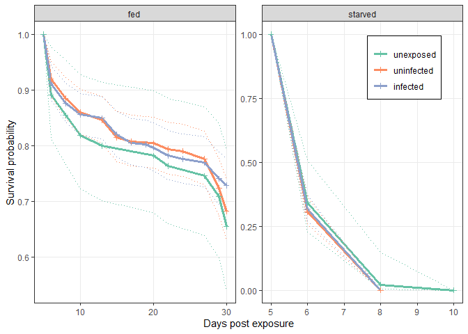

Survival experiment in final generation
================

We selected a tapeworm *S. solidus* for faster development in its
copepod first host. We observed a significant response to selection. It
is commonly assumed that parasites do not grow/develop faster in their
hosts because the increased consumption of host resources would decrease
host survival and, by association, parasite survival. To test the idea
that faster development comes at the cost of higher virulence/lower host
survival, we infected copepods with parasites from our selection lines
and then followed their survival for 30 days. Furthermore, half the
parasites were fed well and half were starved.

After exposing copepods, they were checked for infection. Most copepods
were checked on day 2, but some copepods were not checked at all. The
unchecked copepods died before days 2 to 5.

    ## 
    ##    2    3    5 <NA> 
    ## 1046  154  304  224

Here is the same table, but expressed as proportions.

    ## 
    ##     2     3     5  <NA> 
    ## 0.605 0.089 0.176 0.130

The majority were checked by day 3: 69.4%. Still, 13% were not checked
for infection. This early mortality is unlikely to be due to infection,
but let’s nonetheless explore the possibility that this mortality would
bias group comparisons. Here are the numbers of copepods that were and
were not checked for infection. There are not clear differences between
the selection lines, but the starved copepods might have higher
mortality.

| starved\_fct | line    | n\_not\_checked | n\_checked | prop\_not\_checked |
|:-------------|:--------|----------------:|-----------:|-------------------:|
| fed          |         |               6 |         61 |              0.090 |
| fed          | control |              32 |        237 |              0.119 |
| fed          | fast    |              31 |        232 |              0.118 |
| fed          | slow    |              27 |        238 |              0.102 |
| starved      |         |              15 |         52 |              0.224 |
| starved      | control |              43 |        226 |              0.160 |
| starved      | fast    |              33 |        230 |              0.125 |
| starved      | slow    |              37 |        228 |              0.140 |

We can use chi square tests to compare the proportion of unchecked
copepods across groups. First, we’ll compare all 8 groups above. The
test is not significant.

    ## 
    ##  Pearson's Chi-squared test
    ## 
    ## data:  dx_checked %>% ungroup() %>% select(n_not_checked, n_checked) %>%     as.matrix()
    ## X-squared = 11.083, df = 7, p-value = 0.135

Our main interest, though, is comparing selection lines within feeding
treatments. Therefore, we repeat the chi square test comparing lines
within the ‘starved’ and ‘fed’ groups. Here is the comparison among
starved groups. It is not significant.

    ## 
    ##  Pearson's Chi-squared test
    ## 
    ## data:  dx_checked %>% ungroup() %>% filter(starved_fct == "starved") %>%     select(n_not_checked, n_checked) %>% as.matrix()
    ## X-squared = 4.5608, df = 3, p-value = 0.2069

The comparison among fed groups is also not significant.

    ## 
    ##  Pearson's Chi-squared test
    ## 
    ## data:  dx_checked %>% ungroup() %>% filter(starved_fct == "fed") %>%     select(n_not_checked, n_checked) %>% as.matrix()
    ## X-squared = 0.83302, df = 3, p-value = 0.8416

We can also compare the feeding treatments regardless of selection line.
Here are those numbers. More died prior to checking in the starved
treatment, as might be expected.

| starved\_fct | n\_not\_checked | n\_checked | prop\_not\_checked |
|:-------------|----------------:|-----------:|-------------------:|
| fed          |              96 |        768 |          0.1111111 |
| starved      |             128 |        736 |          0.1481481 |

The chi square test is marginally significant. So, overall, there was
little difference among treatment groups in the proportion of copepods
that died before being checked.

    ## 
    ##  Pearson's Chi-squared test with Yates' continuity correction
    ## 
    ## data:  dx_checked2 %>% ungroup() %>% select(n_not_checked, n_checked) %>%     as.matrix()
    ## X-squared = 4.9291, df = 1, p-value = 0.02641

Thus, let’s exclude the ones that died before checking so that we can
compare copepods where infection status ws known.

After excluding the unchecked copepods, here are the numbers of copepods
in the different groups.

    ##          starved_fct
    ## grp       fed starved
    ##   unexp    61      52
    ##   uninf   323     323
    ##   slow    135     124
    ##   control 115     110
    ##   fast    134     127

Now we can start to fit statistical models. We’ll fit cox regression
models that account for censoring (i.e. copepods that did not die during
the experiment). From the main
[analysis](02testing_selection_response.md), we found that smaller
copepod stages were more likely to die. Thus, we start with a model that
includes copepod stage at checking. We also include starvation. Here is
the summary for this model. Several parameters are significant and the
likelihood ratio test indicates is is much better than an intercept-only
model.

    ## Call:
    ## coxph(formula = Surv(dpi, dead) ~ cop_stage_checking + starved_fct, 
    ##     data = dat2)
    ## 
    ##   n= 1504, number of events= 979 
    ## 
    ##                         coef exp(coef) se(coef)      z Pr(>|z|)    
    ## cop_stage_checkingC1  0.4923    1.6361   0.1183  4.160 3.18e-05 ***
    ## cop_stage_checkingC3 -0.3187    0.7271   0.1829 -1.743   0.0814 .  
    ## starved_fctstarved    3.1080   22.3758   0.1105 28.115  < 2e-16 ***
    ## ---
    ## Signif. codes:  0 '***' 0.001 '**' 0.01 '*' 0.05 '.' 0.1 ' ' 1
    ## 
    ##                      exp(coef) exp(-coef) lower .95 upper .95
    ## cop_stage_checkingC1    1.6361    0.61121     1.297     2.063
    ## cop_stage_checkingC3    0.7271    1.37537     0.508     1.041
    ## starved_fctstarved     22.3758    0.04469    18.017    27.789
    ## 
    ## Concordance= 0.82  (se = 0.006 )
    ## Likelihood ratio test= 1309  on 3 df,   p=<2e-16
    ## Wald test            = 807  on 3 df,   p=<2e-16
    ## Score (logrank) test = 1343  on 3 df,   p=<2e-16

We might also expect starvation to have a bigger effect on small copepod
stages. We can test this by adding an interaction to the model. The
likelihood ratio test suggests this is an improvement.

|    loglik |    Chisq |  Df | P(&gt;\|Chi\|) |
|----------:|---------:|----:|---------------:|
| -6081.765 |       NA |  NA |             NA |
| -6074.946 | 13.63763 |   2 |       0.001093 |

Let’s plot the data.

Starved copepods had a much higher mortality rate, especially the
smaller copepods (C1s and C2s). Notice how the confidence interval for
the C2s is much narrower than for the other groups. This is because most
of the copepods in the experiment were C2s.

<!-- -->

About 90% of copepods were C2s at infection, so comparisons among
infection groups are best made within C2s.

    ## cop_stage_checking
    ##    C2    C1    C3 
    ## 0.896 0.068 0.036

Now, let’s test whether infection impacts survival. We add infection and
its interaction with starvation to the model. There were three infection
groups: unexposed controls, exposed-but-uninfect copepods, and infected
copepods. The likelihood ratio test suggests that adding infection does
not improve the model.

|    loglik |    Chisq |  Df | P(&gt;\|Chi\|) |
|----------:|---------:|----:|---------------:|
| -6074.946 |       NA |  NA |             NA |
| -6074.023 | 1.846622 |   4 |      0.7639425 |

Let’s plot the infection groups, separated by copepod stage and
starvation treatment.

Unexposed controls and uninfected copepods rarely differ, so we can pool
these groups. Infected copepods also did not have higher mortality.

<!-- -->

This is easier to see if we focus on C2 copepods, thereby excluding the
impact of copepod stage. The three infection groups are quite
comparable.

<!-- -->

Instead of ribbons, we can use dotted lines to show the confidence
intervals. This makes it easier to see if certain groups have
overlapping CIs.

<!-- -->

Finally, we can break apart the infected copepods into copepods
harboring parasites from the different selection lines. When we add this
term to the model, it is not an improvement.

|    loglik |    Chisq |  Df | P(&gt;\|Chi\|) |
|----------:|---------:|----:|---------------:|
| -6074.023 |       NA |  NA |             NA |
| -6073.316 | 1.414314 |   2 |      0.4930438 |

Again, we can plot the data, broken down by copepod stage and starvation
treatment.

The groups do not seem to differ at any copepod stage. However, since
there are relatively few C1 and C3 copepods infected with parasites from
each line, it is better to focus on the C2 copepods.

<!-- -->

Here is the survival of the C2 copepods. Copepods infected with the
different lines do not differ much in survival rates.

<!-- -->

The starved treatment died so fast that differences among groups are
harder to detect. Therefore, let’s also make a plot with just the ‘fed’
copepods.

<!-- -->

<!-- -->

In conclusion, parasites that evolved faster or slower development in
copepods were not more likely to kill their copepods. This applied
regardless of whether copepods were stressed through starvation or not.
The results are not consistent with a cost of virulence associated with
rapid development.

    ## R version 4.1.1 (2021-08-10)
    ## Platform: x86_64-w64-mingw32/x64 (64-bit)
    ## Running under: Windows 10 x64 (build 19044)
    ## 
    ## Matrix products: default
    ## 
    ## locale:
    ## [1] LC_COLLATE=English_United States.1252 
    ## [2] LC_CTYPE=English_United States.1252   
    ## [3] LC_MONETARY=English_United States.1252
    ## [4] LC_NUMERIC=C                          
    ## [5] LC_TIME=English_United States.1252    
    ## 
    ## attached base packages:
    ## [1] stats     graphics  grDevices utils     datasets  methods   base     
    ## 
    ## other attached packages:
    ##  [1] survminer_0.4.9 ggpubr_0.4.0    survival_3.2-11 forcats_0.5.1  
    ##  [5] stringr_1.4.0   dplyr_1.0.7     purrr_0.3.4     readr_2.1.2    
    ##  [9] tidyr_1.1.4     tibble_3.1.5    ggplot2_3.3.5   tidyverse_1.3.1
    ## 
    ## loaded via a namespace (and not attached):
    ##  [1] httr_1.4.2         jsonlite_1.7.2     splines_4.1.1      carData_3.0-5     
    ##  [5] modelr_0.1.8       assertthat_0.2.1   highr_0.9          cellranger_1.1.0  
    ##  [9] yaml_2.2.1         pillar_1.6.4       backports_1.4.1    lattice_0.20-44   
    ## [13] glue_1.4.2         digest_0.6.28      RColorBrewer_1.1-2 ggsignif_0.6.3    
    ## [17] rvest_1.0.2        colorspace_2.0-2   htmltools_0.5.2    Matrix_1.3-4      
    ## [21] pkgconfig_2.0.3    broom_0.7.12       haven_2.4.3        xtable_1.8-4      
    ## [25] scales_1.1.1       km.ci_0.5-6        KMsurv_0.1-5       tzdb_0.3.0        
    ## [29] farver_2.1.0       generics_0.1.0     car_3.0-12         ellipsis_0.3.2    
    ## [33] withr_2.4.2        cli_3.0.1          magrittr_2.0.1     crayon_1.4.1      
    ## [37] readxl_1.4.0       evaluate_0.14      fs_1.5.2           fansi_0.5.0       
    ## [41] rstatix_0.7.0      xml2_1.3.3         tools_4.1.1        data.table_1.14.2 
    ## [45] hms_1.1.1          lifecycle_1.0.1    munsell_0.5.0      reprex_2.0.1      
    ## [49] compiler_4.1.1     rlang_0.4.12       grid_4.1.1         rstudioapi_0.13   
    ## [53] labeling_0.4.2     rmarkdown_2.13     gtable_0.3.0       abind_1.4-5       
    ## [57] DBI_1.1.2          R6_2.5.1           gridExtra_2.3      zoo_1.8-10        
    ## [61] lubridate_1.8.0    knitr_1.36         fastmap_1.1.0      survMisc_0.5.6    
    ## [65] utf8_1.2.2         stringi_1.7.5      vctrs_0.3.8        dbplyr_2.1.1      
    ## [69] tidyselect_1.1.1   xfun_0.27
