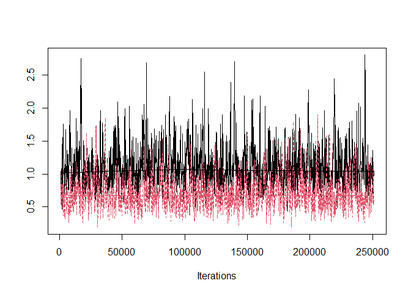
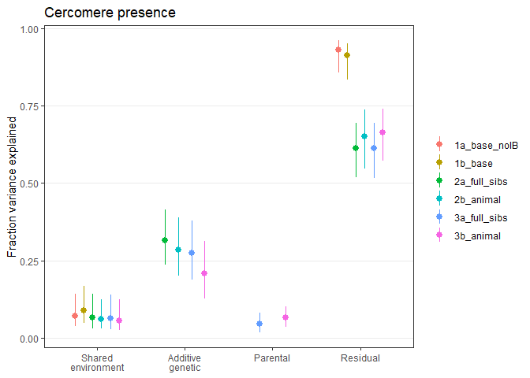
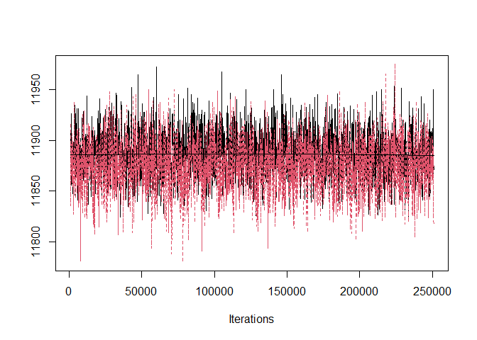
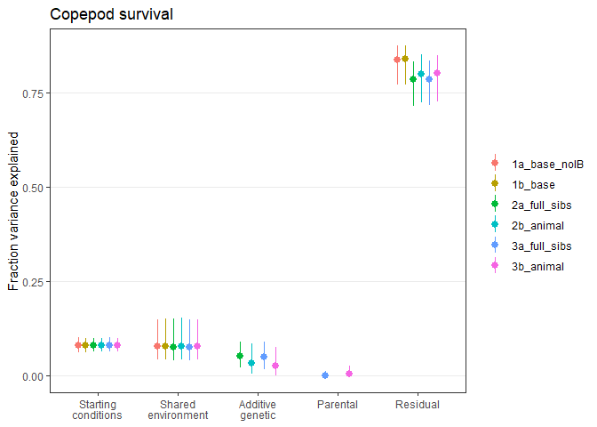
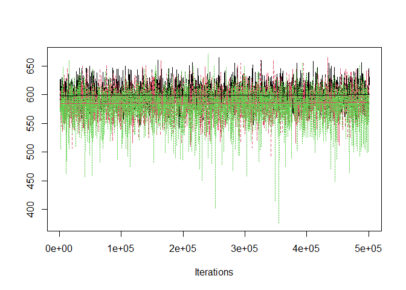

Quantitative genetic parameters, univariate models
================

-   [Traits in copepods](#traits-in-copepods)
    -   [Copepod infection rate](#copepod-infection-rate)
    -   [Cercomere presence](#cercomere-presence)
    -   [Procercoid Size](#procercoid-size)
    -   [Developmental defects](#developmental-defects)
    -   [Copepod survival to day 13](#copepod-survival-to-day-13)
-   [Traits in fish](#traits-in-fish)
    -   [Fish infection rate](#fish-infection-rate)
    -   [Fish survival](#fish-survival)
    -   [Plerocercoid size](#plerocercoid-size)
        -   [Excluding dead fish](#excluding-dead-fish)
    -   [Liver weight](#liver-weight)
    -   [Fish growth](#fish-growth)
-   [Breeding traits](#breeding-traits)
    -   [Fecundity](#fecundity)
    -   [Hatching](#hatching)
-   [Conclusions](#conclusions)
    -   [Trait variance](#trait-variance)
    -   [Skewness](#skewness)

I experimentally selected tapeworms (*S. solidus*) for faster and slower
development in their intermediate host. Throughout the multigeneration
experiment, I tracked the parasite pedigree. Here, I estimate
quantitative genetic parameters like heritability and maternal variance
one trait at a time.

For each parasite trait, we already fit a basic model that tried to
account for nuisance variables, like inbreeding, copepod stage, or fish
size (see [here](02testing_selection_response.md)). To this model, we
added the selection line to look for correlated responses to selection.
Another way to asses genetic variance and covariance among traits is to
add genetic information to the model, such as full-sib family or even
the full pedigree.

For each trait, we consider three additional models beyond the ‘base’
model accounting for things like starting condition (e.g. copepod stage,
fish size) and shared environments (e.g. block, tank id).

First, we add full-sib family to the model. Significant among-family
variance suggests genetic variance in the trait. However, full-sib
heritabilities can be biased upwards by dominance effects and shared
parental effects (maternal but also paternal in this simultaneous
hermaphrodite). Therefore, as a second model, we replace the random
effect of ‘family’ with the full pedigree. This is the so-called animal
model, and it uses all information on relatedness in the experiment to
estimate the additive genetic variance. Finally, within full-sib
families, parasites differ in which worm was the sire and dam. If some
worms differentially invest in their offspring, then some of the
variance within families could be accounted for by such ‘parental’
effects.

# Traits in copepods

## Copepod infection rate

Parent-offspring regression does not work for survival (all parents
survived to reproduce, so there is no variation in x-axis variable.)

Here are the number of full-sib families and the number of offspring
phenotyped per family.

| fs_fams | min_phenotyped | lwrIQR_phenotyped | avg_phenotyped | uprIQR_phenotyped | max_phenotyped |
|--------:|---------------:|------------------:|---------------:|------------------:|---------------:|
|     190 |              3 |                34 |       45.59474 |             61.75 |             89 |

Here are the number of offspring phenotyped per dam/sire.

| maternal_match | dams | min_phenotyped | lwrIQR_phenotyped | avg_phenotyped | uprIQR_phenotyped | max_phenotyped |
|---------------:|-----:|---------------:|------------------:|---------------:|------------------:|---------------:|
|              0 |  268 |              2 |                17 |       22.35075 |             26.00 |             69 |
|              1 |   14 |             16 |                16 |       17.00000 |             18.00 |             18 |
|              2 |   94 |              4 |                18 |       25.90426 |             33.75 |             62 |

Adding full-sibs (red) is an improvement, and the animal model (green)
looks like a further improvement.

<!-- -->

Here is the full sib model. Full sib explains more variation than
experimental block.

    ## 
    ##  Iterations = 1001:250901
    ##  Thinning interval  = 100
    ##  Sample size  = 2500 
    ## 
    ##  DIC: 9311.907 
    ## 
    ##  G-structure:  ~cop_block
    ## 
    ##           post.mean l-95% CI u-95% CI eff.samp
    ## cop_block   0.08922  0.02913   0.1591     2349
    ## 
    ##                ~worm_full_sib_fam_id
    ## 
    ##                      post.mean l-95% CI u-95% CI eff.samp
    ## worm_full_sib_fam_id    0.1849   0.1356   0.2415     2500
    ## 
    ##  R-structure:  ~units
    ## 
    ##       post.mean l-95% CI u-95% CI eff.samp
    ## units         1        1        1        0
    ## 
    ##  Location effects: cop_inf ~ ib + cop_stage_checking 
    ## 
    ##                      post.mean l-95% CI u-95% CI eff.samp  pMCMC    
    ## (Intercept)             0.8137   0.6515   0.9889     2500 <4e-04 ***
    ## ib                     -0.6543  -1.6968   0.3224     2716 0.1952    
    ## cop_stage_checkingC2   -0.1378  -0.2308  -0.0394     2715 0.0072 ** 
    ## cop_stage_checkingC3   -0.3225  -0.4436  -0.2133     2500 <4e-04 ***
    ## cop_stage_checkingC4   -0.5344  -0.7826  -0.2733     2500 <4e-04 ***
    ## ---
    ## Signif. codes:  0 '***' 0.001 '**' 0.01 '*' 0.05 '.' 0.1 ' ' 1

Here is the animal model.

    ## 
    ##  Iterations = 1001:250901
    ##  Thinning interval  = 100
    ##  Sample size  = 2500 
    ## 
    ##  DIC: 9106.058 
    ## 
    ##  G-structure:  ~cop_block
    ## 
    ##           post.mean l-95% CI u-95% CI eff.samp
    ## cop_block    0.1414  0.04881   0.2621     1608
    ## 
    ##                ~id
    ## 
    ##    post.mean l-95% CI u-95% CI eff.samp
    ## id     1.099   0.6115    1.749    603.7
    ## 
    ##  R-structure:  ~units
    ## 
    ##       post.mean l-95% CI u-95% CI eff.samp
    ## units         1        1        1        0
    ## 
    ##  Location effects: cop_inf ~ ib + cop_stage_checking 
    ## 
    ##                      post.mean l-95% CI u-95% CI eff.samp  pMCMC    
    ## (Intercept)            0.47990  0.12573  0.84573     2500 0.0200 *  
    ## ib                    -1.98111 -3.24887 -0.70152     2156 0.0016 ** 
    ## cop_stage_checkingC2  -0.16507 -0.28159 -0.04464     2740 0.0064 ** 
    ## cop_stage_checkingC3  -0.37801 -0.52115 -0.23728     2176 <4e-04 ***
    ## cop_stage_checkingC4  -0.63546 -0.97117 -0.33207     2500 <4e-04 ***
    ## ---
    ## Signif. codes:  0 '***' 0.001 '**' 0.01 '*' 0.05 '.' 0.1 ' ' 1

For, these models, we break down total variance into several components:
fixed effects (starting conditions), shared environment, and genetic
effects.

Here is the percent variation in copepod infection accounted for by
copepod stage in the three models. It is consistently low.

| mod          | v_name | v_fit | v_lwr | v_upr | trait |
|:-------------|:-------|------:|------:|------:|:------|
| 1a_base_noIB | Vf     | 0.011 | 0.006 | 0.018 | cinf  |
| 1b_base      | Vf     | 0.013 | 0.007 | 0.020 | cinf  |
| 2a_full_sibs | Vf     | 0.010 | 0.005 | 0.018 | cinf  |
| 2b_animal    | Vf     | 0.014 | 0.006 | 0.026 | cinf  |

Here is the percent variation in copepod infection accounted for by
shared environments (copepod block). Some of the environmental variation
in the base model is attributed to genes after adding full-sibs or the
pedigree.

| mod          | v_name | v_fit | v_lwr | v_upr | trait |
|:-------------|:-------|------:|------:|------:|:------|
| 1a_base_noIB | Ve     | 0.085 | 0.049 | 0.162 | cinf  |
| 1b_base      | Ve     | 0.088 | 0.049 | 0.166 | cinf  |
| 2a_full_sibs | Ve     | 0.065 | 0.030 | 0.129 | cinf  |
| 2b_animal    | Ve     | 0.058 | 0.029 | 0.120 | cinf  |

Here is the percent variation in copepod infection accounted for by
genetic variance (i.e. the heritability). Note that the variance
component for full-sibs was multipled by two since full-sibs share just
half their alleles on average. The estimate from the animal model was
quite a bit higher.

| mod          | v_name | v_fit | v_lwr | v_upr | trait |
|:-------------|:-------|------:|------:|------:|:------|
| 2a_full_sibs | Vg     | 0.284 | 0.219 | 0.364 | cinf  |
| 2b_animal    | Vg     | 0.471 | 0.362 | 0.609 | cinf  |

Here is the distribution of family-level random effects. It is a little
left-skewed. This suggests the genetic variance represents primarily
represents some families having lower than expected infection rates.

<!-- -->

Here is the total variance explained by each model.

| mod          | v_name | v_fit | v_lwr | v_upr | trait |
|:-------------|:-------|------:|------:|------:|:------|
| 1a_base_noIB | Vr     | 0.096 | 0.173 | 0.059 | cinf  |
| 1b_base      | Vr     | 0.101 | 0.178 | 0.062 | cinf  |
| 2a_full_sibs | Vr     | 0.364 | 0.444 | 0.298 | cinf  |
| 2b_animal    | Vr     | 0.548 | 0.678 | 0.439 | cinf  |

The animal model could be biased upwards by maternal effects. Let’s now
account for parental influences. We again fit the full-sib and animal
models, but we add a random effect of dam/sire.

The full-sib model suggests that some variance within clutches is
explained by parental effects.

<!-- -->

By contrast, the addition of maternal effects seems to worsen the animal
model.

<!-- -->

The additive genetic variance decreased substantially in the animal
model with maternal effects.

<!-- -->

Let’s see how much variation is explained by these models.

Here is the percent variation in copepod infection accounted for by
copepod stage in the five models:

| mod          | v_name | v_fit | v_lwr | v_upr | trait |
|:-------------|:-------|------:|------:|------:|:------|
| 1a_base_noIB | Vf     | 0.011 | 0.006 | 0.018 | cinf  |
| 1b_base      | Vf     | 0.013 | 0.007 | 0.020 | cinf  |
| 2a_full_sibs | Vf     | 0.010 | 0.005 | 0.018 | cinf  |
| 2b_animal    | Vf     | 0.014 | 0.006 | 0.026 | cinf  |
| 3a_full_sibs | Vf     | 0.010 | 0.005 | 0.019 | cinf  |
| 3b_animal    | Vf     | 0.014 | 0.007 | 0.026 | cinf  |

Here is the percent variation in copepod infection accounted for by
copepod block:

| mod          | v_name | v_fit | v_lwr | v_upr | trait |
|:-------------|:-------|------:|------:|------:|:------|
| 1a_base_noIB | Ve     | 0.085 | 0.049 | 0.162 | cinf  |
| 1b_base      | Ve     | 0.088 | 0.049 | 0.166 | cinf  |
| 2a_full_sibs | Ve     | 0.065 | 0.030 | 0.129 | cinf  |
| 2b_animal    | Ve     | 0.058 | 0.029 | 0.120 | cinf  |
| 3a_full_sibs | Ve     | 0.064 | 0.032 | 0.139 | cinf  |
| 3b_animal    | Ve     | 0.055 | 0.028 | 0.116 | cinf  |

Here are the heritability estimates. The animal model estimate comes
down quite a bit after adding maternal effects.

| mod          | v_name | v_fit | v_lwr | v_upr | trait |
|:-------------|:-------|------:|------:|------:|:------|
| 2a_full_sibs | Vg     | 0.284 | 0.219 | 0.364 | cinf  |
| 2b_animal    | Vg     | 0.471 | 0.362 | 0.609 | cinf  |
| 3a_full_sibs | Vg     | 0.251 | 0.178 | 0.334 | cinf  |
| 3b_animal    | Vg     | 0.357 | 0.220 | 0.513 | cinf  |

Here is the percent variation in copepod infection accounted for by
parental effects in the last two models

| mod          | v_name | v_fit | v_lwr | v_upr | trait |
|:-------------|:-------|------:|------:|------:|:------|
| 3a_full_sibs | Vm     | 0.027 | 0.008 | 0.052 | cinf  |
| 3b_animal    | Vm     | 0.037 | 0.015 | 0.067 | cinf  |

Here is the total variance explained.

| mod          | v_name | v_fit | v_lwr | v_upr | trait |
|:-------------|:-------|------:|------:|------:|:------|
| 1a_base_noIB | Vr     | 0.096 | 0.173 | 0.059 | cinf  |
| 1b_base      | Vr     | 0.101 | 0.178 | 0.062 | cinf  |
| 2a_full_sibs | Vr     | 0.364 | 0.444 | 0.298 | cinf  |
| 2b_animal    | Vr     | 0.548 | 0.678 | 0.439 | cinf  |
| 3a_full_sibs | Vr     | 0.358 | 0.439 | 0.289 | cinf  |
| 3b_animal    | Vr     | 0.467 | 0.608 | 0.348 | cinf  |

The fraction of phenotypic variance explained by each term in the
different models is plotted here

<!-- -->

We can make the same plot, but only consider the fraction of phenotypic
variation explained after accounting for starting conditions (i.e. we
leave fixed effect variance out of the denominator).

<!-- -->

## Cercomere presence

The parent offspring regression for cercomere presence was positive,
which is expected since we observed a significant response to selection.

<!-- -->

Here is the slope of the line. It is quite similar to the realized
heritability.

    ## 
    ## Call:
    ## lm(formula = cerc_o ~ cerc_p, data = parent_offspring %>% filter(!is.na(cerc_o)))
    ## 
    ## Residuals:
    ##     Min      1Q  Median      3Q     Max 
    ## -0.5199 -0.1092  0.0196  0.1383  0.4073 
    ## 
    ## Coefficients:
    ##             Estimate Std. Error t value Pr(>|t|)    
    ## (Intercept)  0.44981    0.02366   19.01  < 2e-16 ***
    ## cerc_p       0.18117    0.03471    5.22 5.66e-07 ***
    ## ---
    ## Signif. codes:  0 '***' 0.001 '**' 0.01 '*' 0.05 '.' 0.1 ' ' 1
    ## 
    ## Residual standard error: 0.1873 on 155 degrees of freedom
    ## Multiple R-squared:  0.1495, Adjusted R-squared:  0.144 
    ## F-statistic: 27.25 on 1 and 155 DF,  p-value: 5.66e-07

This heritability is corrected based on the proportion of parasites,
overall, that had a cercomere. See de Villemereuil et a. 2013.

    ##    cerc_p 
    ## 0.3630396

Here are the number of full-sib families and the number of offspring
phenotyped per family.

| fs_fams | min_phenotyped | lwrIQR_phenotyped | avg_phenotyped | uprIQR_phenotyped | max_phenotyped |
|--------:|---------------:|------------------:|---------------:|------------------:|---------------:|
|     189 |              2 |                18 |       26.07937 |                33 |             65 |

Here are the number of offspring phenotyped per dam/sire.

| maternal_match | dams | min_phenotyped | lwrIQR_phenotyped | avg_phenotyped | uprIQR_phenotyped | max_phenotyped |
|---------------:|-----:|---------------:|------------------:|---------------:|------------------:|---------------:|
|              0 |  264 |              1 |               9.0 |       13.76894 |              17.0 |             41 |
|              1 |   14 |              4 |               7.5 |       10.14286 |              12.5 |             16 |
|              2 |   92 |              2 |               8.0 |       12.52174 |              17.0 |             40 |

Again, we will fit 5 models.

Adding full-sibs (red) is an improvement, and the animal model (green)
looks like a further improvement, though there must be more variation in
the parameters.

<!-- -->

The full-sib model suggests that some variance within clutches is
explained by parental effects.

<!-- -->

By contrast, the addition of maternal effects does not improve the
animal model.

<!-- -->

For, these models, we break down total variance into several components:
fixed effects (starting conditions), shared environment, and genetic
effects.

Here is the percent variation in cercomere presence accounted for by
copepod stage across models. It is very consistent.

| mod          | v_name | v_fit | v_lwr | v_upr | trait |
|:-------------|:-------|------:|------:|------:|:------|
| 1a_base_noIB | Vf     | 0.133 | 0.108 | 0.159 | cerc  |
| 1b_base      | Vf     | 0.135 | 0.111 | 0.161 | cerc  |
| 2a_full_sibs | Vf     | 0.134 | 0.108 | 0.159 | cerc  |
| 2b_animal    | Vf     | 0.131 | 0.107 | 0.156 | cerc  |
| 3a_full_sibs | Vf     | 0.134 | 0.110 | 0.159 | cerc  |
| 3b_animal    | Vf     | 0.136 | 0.111 | 0.163 | cerc  |

Here is the percent variation in cercomere presence accounted for by
shared environments (copepod block). Some of the environmental variation
in the base model is attributed to genes after adding full-sibs or the
pedigree.

| mod          | v_name | v_fit | v_lwr | v_upr | trait |
|:-------------|:-------|------:|------:|------:|:------|
| 1a_base_noIB | Ve     | 0.061 | 0.032 | 0.124 | cerc  |
| 1b_base      | Ve     | 0.076 | 0.041 | 0.146 | cerc  |
| 2a_full_sibs | Ve     | 0.057 | 0.026 | 0.123 | cerc  |
| 2b_animal    | Ve     | 0.052 | 0.025 | 0.107 | cerc  |
| 3a_full_sibs | Ve     | 0.054 | 0.025 | 0.122 | cerc  |
| 3b_animal    | Ve     | 0.049 | 0.021 | 0.108 | cerc  |

Here is the percent variation in cercomere presence accounted for by
genetic variance (i.e. the heritability). Note that the variance
component for full-sibs was multipled by two since full-sibs share just
half their alleles on average. The estimate from the animal model was
lower than the full-sib models. The addition of maternal effects
decreased heritability estimates by \~5 points.

| mod          | v_name | v_fit | v_lwr | v_upr | trait |
|:-------------|:-------|------:|------:|------:|:------|
| 2a_full_sibs | Vg     | 0.273 | 0.204 | 0.361 | cerc  |
| 2b_animal    | Vg     | 0.247 | 0.173 | 0.341 | cerc  |
| 3a_full_sibs | Vg     | 0.237 | 0.161 | 0.328 | cerc  |
| 3b_animal    | Vg     | 0.180 | 0.109 | 0.272 | cerc  |

<!-- -->

Here is how families from the different line fall. By the final
generation, the families from the fast line mostly have positive random
effects whereas those from the slow line mostly have negative random
effects.

<!-- -->

Here are the parental influences on cercomere presence (i.e. the effect
of dam/sire).

| mod          | v_name | v_fit | v_lwr | v_upr | trait |
|:-------------|:-------|------:|------:|------:|:------|
| 3a_full_sibs | Vm     | 0.038 | 0.014 | 0.070 | cerc  |
| 3b_animal    | Vm     | 0.056 | 0.031 | 0.088 | cerc  |

Here is the total variance explained by each model.

| mod          | v_name | v_fit | v_lwr | v_upr | trait |
|:-------------|:-------|------:|------:|------:|:------|
| 1a_base_noIB | Vr     | 0.195 | 0.251 | 0.162 | cerc  |
| 1b_base      | Vr     | 0.213 | 0.271 | 0.177 | cerc  |
| 2a_full_sibs | Vr     | 0.468 | 0.546 | 0.401 | cerc  |
| 2b_animal    | Vr     | 0.435 | 0.520 | 0.363 | cerc  |
| 3a_full_sibs | Vr     | 0.469 | 0.551 | 0.400 | cerc  |
| 3b_animal    | Vr     | 0.427 | 0.503 | 0.363 | cerc  |

The fraction of phenotypic variance explained by each term in the
different models is plotted here

<!-- -->

Here is the same plot, but just showing the fraction of variance
explained after accounting for starting conditions (copepod stage).

<!-- -->

## Procercoid Size

Here are the number of full-sib families and the number of offspring
phenotyped per family.

| fs_fams | min_phenotyped | lwrIQR_phenotyped | avg_phenotyped | uprIQR_phenotyped | max_phenotyped |
|--------:|---------------:|------------------:|---------------:|------------------:|---------------:|
|     189 |              1 |                10 |       15.30159 |                21 |             41 |

Here are the number of offspring phenotyped per dam/sire.

| maternal_match | dams | min_phenotyped | lwrIQR_phenotyped | avg_phenotyped | uprIQR_phenotyped | max_phenotyped |
|---------------:|-----:|---------------:|------------------:|---------------:|------------------:|---------------:|
|              0 |  262 |              1 |              5.00 |       7.778626 |              9.00 |             24 |
|              1 |   14 |              2 |              4.25 |       5.428571 |              6.75 |              7 |
|              2 |   91 |              1 |              5.00 |       8.549451 |             12.00 |             24 |

For procercoid size, there is not much of a parenent-offspring
regression.

<!-- -->

The slope suggests a very low heritability.

    ## 
    ## Call:
    ## lm(formula = proc_o ~ proc_p, data = parent_offspring %>% na.omit())
    ## 
    ## Residuals:
    ##     Min      1Q  Median      3Q     Max 
    ## -3.1840 -0.6451  0.0837  0.8073  2.9281 
    ## 
    ## Coefficients:
    ##             Estimate Std. Error t value Pr(>|t|)    
    ## (Intercept) 10.02984    0.69623  14.406   <2e-16 ***
    ## proc_p       0.05201    0.06023   0.864    0.389    
    ## ---
    ## Signif. codes:  0 '***' 0.001 '**' 0.01 '*' 0.05 '.' 0.1 ' ' 1
    ## 
    ## Residual standard error: 1.161 on 155 degrees of freedom
    ## Multiple R-squared:  0.004789,   Adjusted R-squared:  -0.001632 
    ## F-statistic: 0.7458 on 1 and 155 DF,  p-value: 0.3891

But this does not account for environmental influences like copepod size
or block. Thus, let’s fit the same 5 models again.

As in the other models, adding full-sibs (red) and then the pedigree
(green) appear to be improvements.

<!-- -->

The full-sib model suggests that some variance within clutches is
explained by parental effects.

<!-- -->

By contrast, the addition of maternal effects may even worsen the animal
model.

<!-- -->

For, these models, we break down total variance into several components:
fixed effects (starting conditions), shared environment, and genetic
effects.

Here is the percent variation in procercoid size accounted for by
copepod stage across models. It is very consistent.

| mod          | v_name | v_fit | v_lwr | v_upr | trait |
|:-------------|:-------|------:|------:|------:|:------|
| 1a_base_noIB | Vf     | 0.121 | 0.098 | 0.144 | proc  |
| 1b_base      | Vf     | 0.125 | 0.101 | 0.151 | proc  |
| 2a_full_sibs | Vf     | 0.129 | 0.104 | 0.152 | proc  |
| 2b_animal    | Vf     | 0.135 | 0.110 | 0.161 | proc  |
| 3a_full_sibs | Vf     | 0.128 | 0.105 | 0.152 | proc  |
| 3b_animal    | Vf     | 0.136 | 0.111 | 0.163 | proc  |

Here is the percent variation in procercoid size accounted for by shared
environments (copepod block). Little ‘block’ variance is redistributed
to genes after adding full-sibs or the pedigree.

| mod          | v_name | v_fit | v_lwr | v_upr | trait |
|:-------------|:-------|------:|------:|------:|:------|
| 1a_base_noIB | Ve     | 0.111 | 0.064 | 0.199 | proc  |
| 1b_base      | Ve     | 0.108 | 0.063 | 0.197 | proc  |
| 2a_full_sibs | Ve     | 0.090 | 0.050 | 0.171 | proc  |
| 2b_animal    | Ve     | 0.094 | 0.054 | 0.175 | proc  |
| 3a_full_sibs | Ve     | 0.090 | 0.047 | 0.174 | proc  |
| 3b_animal    | Ve     | 0.094 | 0.054 | 0.172 | proc  |

Here is the percent variation in procercoid size accounted for by
genetic variance (i.e. the heritability). Note that the variance
component for full-sibs was multipled by two since full-sibs share just
half their alleles on average. The estimate from the animal model was
higher than the full-sib models. The addition of maternal effects
decreased heritability in the animal model more than the full-sib model.

| mod          | v_name | v_fit | v_lwr | v_upr | trait |
|:-------------|:-------|------:|------:|------:|:------|
| 2a_full_sibs | Vg     | 0.233 | 0.171 | 0.309 | proc  |
| 2b_animal    | Vg     | 0.273 | 0.196 | 0.371 | proc  |
| 3a_full_sibs | Vg     | 0.224 | 0.161 | 0.299 | proc  |
| 3b_animal    | Vg     | 0.236 | 0.148 | 0.341 | proc  |

The distribution of family effects also looks good.

<!-- -->

The influence of ‘parent’ on procercoid size are small.

| mod          | v_name | v_fit | v_lwr | v_upr | trait |
|:-------------|:-------|------:|------:|------:|:------|
| 3a_full_sibs | Vm     | 0.004 | 0.000 | 0.027 | proc  |
| 3b_animal    | Vm     | 0.021 | 0.002 | 0.046 | proc  |

Here is the total variance explained by each model.

| mod          | v_name | v_fit | v_lwr | v_upr | trait |
|:-------------|:-------|------:|------:|------:|:------|
| 1a_base_noIB | Vr     | 0.234 | 0.311 | 0.186 | proc  |
| 1b_base      | Vr     | 0.236 | 0.311 | 0.191 | proc  |
| 2a_full_sibs | Vr     | 0.458 | 0.535 | 0.391 | proc  |
| 2b_animal    | Vr     | 0.510 | 0.603 | 0.434 | proc  |
| 3a_full_sibs | Vr     | 0.454 | 0.534 | 0.394 | proc  |
| 3b_animal    | Vr     | 0.494 | 0.585 | 0.414 | proc  |

The fraction of phenotypic variance explained by each term in the
different models is plotted here

<!-- -->

Procercoid size seems to be impacted more by starting conditions and
shared environment effects than larval developmental rate. This may
explain why the parent-offspring regression underestimates heritability.
Here is a comparison of the variance explained in the two traits by
copepod stage and block combined in the different models.

<!-- -->

Therefore, it is worth looking at variance components after excluding
the effect of starting conditions.

<!-- -->

## Developmental defects

When measuring worms at 13 dpi, some worms had clearly not developed
normally; they lacked a cercomere after 13 days or had not grown much.
For such failed development in copepods, we cannot use parent-offspring
regression to evaluate heritability because all parents successfully
developed.

Here are the number of full-sib families and the number of offspring
phenotyped per family.

| fs_fams | min_phenotyped | lwrIQR_phenotyped | avg_phenotyped | uprIQR_phenotyped | max_phenotyped |
|--------:|---------------:|------------------:|---------------:|------------------:|---------------:|
|     189 |              1 |                10 |       15.33333 |                21 |             41 |

Here are the number of offspring phenotyped per dam/sire.

| maternal_match | dams | min_phenotyped | lwrIQR_phenotyped | avg_phenotyped | uprIQR_phenotyped | max_phenotyped |
|---------------:|-----:|---------------:|------------------:|---------------:|------------------:|---------------:|
|              0 |  262 |              1 |              5.00 |       7.782443 |              9.00 |             24 |
|              1 |   14 |              2 |              4.25 |       5.428571 |              6.75 |              7 |
|              2 |   91 |              1 |              5.00 |       8.604396 |             12.00 |             24 |

Again, we will fit 5 models.

Adding full-sibs (red) is an improvement, and the animal model (green)
looks like a further improvement, though there must be more variation in
the parameters.

<!-- -->

The full-sib model suggests that there is little variance within
clutches.

<!-- -->

By contrast, the addition of maternal effects does not improve the
animal model.

<!-- -->

For, these models, we break down total variance into several components:
fixed effects (starting conditions), shared environment, genetic
effects, and parental effects.

Here is the percent variation in failed development accounted for by
copepod stage across models. It is consistently low.

| mod          | v_name | v_fit | v_lwr | v_upr | trait |
|:-------------|:-------|------:|------:|------:|:------|
| 1a_base_noIB | Vf     | 0.017 | 0.005 | 0.037 | fail  |
| 1b_base      | Vf     | 0.044 | 0.022 | 0.072 | fail  |
| 2a_full_sibs | Vf     | 0.035 | 0.013 | 0.067 | fail  |
| 2b_animal    | Vf     | 0.042 | 0.015 | 0.081 | fail  |
| 3a_full_sibs | Vf     | 0.035 | 0.013 | 0.068 | fail  |
| 3b_animal    | Vf     | 0.042 | 0.015 | 0.083 | fail  |

Here is the percent variation in failed development accounted for by
shared environments (copepod block). It is also low.

| mod          | v_name | v_fit | v_lwr | v_upr | trait |
|:-------------|:-------|------:|------:|------:|:------|
| 1a_base_noIB | Ve     | 0.012 |     0 | 0.060 | fail  |
| 1b_base      | Ve     | 0.010 |     0 | 0.054 | fail  |
| 2a_full_sibs | Ve     | 0.015 |     0 | 0.062 | fail  |
| 2b_animal    | Ve     | 0.018 |     0 | 0.067 | fail  |
| 3a_full_sibs | Ve     | 0.014 |     0 | 0.062 | fail  |
| 3b_animal    | Ve     | 0.017 |     0 | 0.066 | fail  |

Here is the percent variation in failed development accounted for by
genetic variance (i.e. the heritability). It is high, indicating that
defects run in families. The addition of maternal effects did not
decrease heritability in the full sib model, but it did in the animal
model.

| mod          | v_name | v_fit | v_lwr | v_upr | trait |
|:-------------|:-------|------:|------:|------:|:------|
| 2a_full_sibs | Vg     | 0.519 | 0.337 | 0.735 | fail  |
| 2b_animal    | Vg     | 0.639 | 0.367 | 0.849 | fail  |
| 3a_full_sibs | Vg     | 0.492 | 0.293 | 0.719 | fail  |
| 3b_animal    | Vg     | 0.575 | 0.293 | 0.822 | fail  |

Here is the distribution of family effects. It is strongly skewed - most
families have a very low likelihood of defects, but it is higher in some
families.

<!-- -->

Here are the parental influences on failed development (i.e. the effect
of dam/sire).

| mod          | v_name | v_fit | v_lwr | v_upr | trait |
|:-------------|:-------|------:|------:|------:|:------|
| 3a_full_sibs | Vm     | 0.017 |     0 | 0.109 | fail  |
| 3b_animal    | Vm     | 0.028 |     0 | 0.129 | fail  |

Here is the total variance explained by each model.

| mod          | v_name | v_fit | v_lwr | v_upr | trait |
|:-------------|:-------|------:|------:|------:|:------|
| 1a_base_noIB | Vr     | 0.031 | 0.083 | 0.009 | fail  |
| 1b_base      | Vr     | 0.056 | 0.103 | 0.028 | fail  |
| 2a_full_sibs | Vr     | 0.573 | 0.784 | 0.393 | fail  |
| 2b_animal    | Vr     | 0.708 | 0.907 | 0.454 | fail  |
| 3a_full_sibs | Vr     | 0.571 | 0.789 | 0.386 | fail  |
| 3b_animal    | Vr     | 0.675 | 0.898 | 0.426 | fail  |

The fraction of phenotypic variance explained by each term in the
different models is plotted here. Failed development is mostly a genetic
pattern.

<!-- -->

Since starting conditions explained little variation in developmental
defects, little changes when it is excluded from variance calculations.

<!-- -->

## Copepod survival to day 13

On day 13 post infection, copepods were checked for survival. Usually
this was done as part of measuring worm size, before exposing fish on
day 14. However, in the final generation, some infected copepods were
taken to infect fish at 12 dpe (to test the evolution of faster
development). These copepods were thus excluded from the survival
measurement. Since only surviving worms could parent the next
generation, we cannot use parent-offspring regression to estimate
heritability of host survival. Also, we only want to focus on the
copepods that were infected because parasite genes will only impact the
survival of infected copepods.

Here are the number of full-sib families and the number of offspring
phenotyped per family.

| fs_fams | min_phenotyped | lwrIQR_phenotyped | avg_phenotyped | uprIQR_phenotyped | max_phenotyped |
|--------:|---------------:|------------------:|---------------:|------------------:|---------------:|
|     189 |              2 |                23 |       32.04762 |                41 |             76 |

Here are the number of offspring phenotyped per dam/sire.

| maternal_match | dams | min_phenotyped | lwrIQR_phenotyped | avg_phenotyped | uprIQR_phenotyped | max_phenotyped |
|---------------:|-----:|---------------:|------------------:|---------------:|------------------:|---------------:|
|              0 |  263 |              1 |             11.00 |       16.84030 |             20.50 |             50 |
|              1 |   14 |              8 |             11.00 |       12.14286 |             13.75 |             16 |
|              2 |   92 |              2 |             10.75 |       15.84783 |             21.00 |             54 |

Again, we will fit 5 models.

Adding full-sibs (red) and/or the pedigree (green) looks like a slight
improvement.

<!-- -->

There does not appear to be any parental effects on copepod survival in
the full sib model…

<!-- -->

…or the animal model.

<!-- -->

For, these models, we break down total variance into several components:
fixed effects (starting conditions), shared environment, genetic
effects, and parental effects.

Here is the percent variation in copepod survival accounted for by
copepod stage across models. It is consistent.

| mod          | v_name | v_fit | v_lwr | v_upr | trait |
|:-------------|:-------|------:|------:|------:|:------|
| 1a_base_noIB | Vf     | 0.081 | 0.063 | 0.101 | surv  |
| 1b_base      | Vf     | 0.081 | 0.063 | 0.100 | surv  |
| 2a_full_sibs | Vf     | 0.081 | 0.064 | 0.100 | surv  |
| 2b_animal    | Vf     | 0.081 | 0.064 | 0.101 | surv  |
| 3a_full_sibs | Vf     | 0.082 | 0.064 | 0.101 | surv  |
| 3b_animal    | Vf     | 0.081 | 0.064 | 0.100 | surv  |

Here is the percent variation in copepod survival accounted for by
shared environments (copepod block). It is also consistent.

| mod          | v_name | v_fit | v_lwr | v_upr | trait |
|:-------------|:-------|------:|------:|------:|:------|
| 1a_base_noIB | Ve     | 0.078 | 0.043 | 0.150 | surv  |
| 1b_base      | Ve     | 0.079 | 0.044 | 0.152 | surv  |
| 2a_full_sibs | Ve     | 0.077 | 0.041 | 0.152 | surv  |
| 2b_animal    | Ve     | 0.079 | 0.043 | 0.153 | surv  |
| 3a_full_sibs | Ve     | 0.077 | 0.042 | 0.150 | surv  |
| 3b_animal    | Ve     | 0.079 | 0.044 | 0.150 | surv  |

Here is the percent variation in copepod survival accounted for by
genetic variance (i.e. the heritability). It is low.

| mod          | v_name | v_fit | v_lwr | v_upr | trait |
|:-------------|:-------|------:|------:|------:|:------|
| 2a_full_sibs | Vg     | 0.053 | 0.022 | 0.092 | surv  |
| 2b_animal    | Vg     | 0.035 | 0.006 | 0.087 | surv  |
| 3a_full_sibs | Vg     | 0.049 | 0.017 | 0.091 | surv  |
| 3b_animal    | Vg     | 0.026 | 0.001 | 0.076 | surv  |

And the estimated family effects are normally distributed.

<!-- -->

And there is essentially no influence of dam/sire.

| mod          | v_name | v_fit | v_lwr | v_upr | trait |
|:-------------|:-------|------:|------:|------:|:------|
| 3a_full_sibs | Vm     | 0.001 |     0 | 0.012 | surv  |
| 3b_animal    | Vm     | 0.005 |     0 | 0.026 | surv  |

Here is the total variance explained by each model.

| mod          | v_name | v_fit | v_lwr | v_upr | trait |
|:-------------|:-------|------:|------:|------:|:------|
| 1a_base_noIB | Vr     | 0.162 | 0.229 | 0.124 | surv  |
| 1b_base      | Vr     | 0.161 | 0.229 | 0.124 | surv  |
| 2a_full_sibs | Vr     | 0.214 | 0.285 | 0.166 | surv  |
| 2b_animal    | Vr     | 0.200 | 0.275 | 0.147 | surv  |
| 3a_full_sibs | Vr     | 0.215 | 0.283 | 0.164 | surv  |
| 3b_animal    | Vr     | 0.197 | 0.272 | 0.150 | surv  |

The fraction of phenotypic variance explained by each term in the
different models is plotted here. copepod survival is mostly a genetic
pattern.

<!-- -->

This values do not change much when we exclude the effect of the
starting conditions.

<!-- -->

# Traits in fish

Let’s turn our attention from the first host to the second host, the
stickleback.

## Fish infection rate

All parental worms successfully infected fish, so we cannot use
parent-offspring regression to estimate heritability.

Here are the number of full-sib families and the number of offspring
phenotyped per family.

| fs_fams | min_phenotyped | lwrIQR_phenotyped | avg_phenotyped | uprIQR_phenotyped | max_phenotyped |
|--------:|---------------:|------------------:|---------------:|------------------:|---------------:|
|     189 |              1 |                 9 |       11.79894 |                14 |             30 |

Here are the number of offspring phenotyped per dam/sire. There are only
about 6 per dam. Fewer than this, makes the variance component
challenging to estimate.

| maternal_match | dams | min_phenotyped | lwrIQR_phenotyped | avg_phenotyped | uprIQR_phenotyped | max_phenotyped |
|---------------:|-----:|---------------:|------------------:|---------------:|------------------:|---------------:|
|              0 |  262 |              1 |                 4 |       6.152672 |              7.75 |             19 |
|              1 |   14 |              3 |                 4 |       5.285714 |              6.75 |              8 |
|              2 |   89 |              1 |                 4 |       6.112360 |              8.00 |             15 |

Again, we will fit 5 models.

Adding full-sibs (red) is an improvement, and the animal model (green)
looks like a further (noisy) improvement.

<!-- -->

The full-sib model suggests that there is little variance within
clutches.

<!-- -->

By contrast, the addition of maternal effects does not improve the
animal model.

<!-- -->

For, these models, we break down total variance into several components:
fixed effects (starting conditions), shared environment, genetic
effects, and parental effects.

Here is the percent variation in fish infection accounted for by
starting conditions (initial fish size, sex, and day of exposure). It is
positive but low.

| mod          | v_name | v_fit | v_lwr | v_upr | trait |
|:-------------|:-------|------:|------:|------:|:------|
| 1a_base_noIB | Vf     | 0.060 | 0.035 | 0.095 | finf  |
| 1b_base      | Vf     | 0.072 | 0.043 | 0.110 | finf  |
| 2a_full_sibs | Vf     | 0.071 | 0.043 | 0.108 | finf  |
| 2b_animal    | Vf     | 0.087 | 0.052 | 0.130 | finf  |
| 3a_full_sibs | Vf     | 0.071 | 0.043 | 0.110 | finf  |
| 3b_animal    | Vf     | 0.087 | 0.052 | 0.129 | finf  |

Here is the percent variation in fish infection accounted for by shared
environments (copepod block).

| mod          | v_name | v_fit | v_lwr | v_upr | trait |
|:-------------|:-------|------:|------:|------:|:------|
| 1a_base_noIB | Ve     | 0.079 | 0.039 | 0.166 | finf  |
| 1b_base      | Ve     | 0.085 | 0.041 | 0.176 | finf  |
| 2a_full_sibs | Ve     | 0.082 | 0.039 | 0.174 | finf  |
| 2b_animal    | Ve     | 0.059 | 0.027 | 0.129 | finf  |
| 3a_full_sibs | Ve     | 0.081 | 0.038 | 0.166 | finf  |
| 3b_animal    | Ve     | 0.059 | 0.026 | 0.127 | finf  |

Here is the percent variation in fish infection accounted for by genetic
variance (i.e. the heritability). It is rather low, though it is a few
points higher in the animal model. The addition of maternal effects did
not decrease heritability much.

| mod          | v_name | v_fit | v_lwr | v_upr | trait |
|:-------------|:-------|------:|------:|------:|:------|
| 2a_full_sibs | Vg     | 0.084 | 0.020 | 0.166 | finf  |
| 2b_animal    | Vg     | 0.114 | 0.054 | 0.196 | finf  |
| 3a_full_sibs | Vg     | 0.062 | 0.001 | 0.146 | finf  |
| 3b_animal    | Vg     | 0.111 | 0.051 | 0.197 | finf  |

The distribution of family effects is left-skewed, suggesting there is
more genetic variance for low infectivity than high infectivity.

<!-- -->

Here are the parental influences on fish infection (i.e. the effect of
dam/sire).

| mod          | v_name | v_fit | v_lwr | v_upr | trait |
|:-------------|:-------|------:|------:|------:|:------|
| 3a_full_sibs | Vm     | 0.016 |     0 | 0.070 | finf  |
| 3b_animal    | Vm     | 0.005 |     0 | 0.037 | finf  |

Here is the total variance explained by each model.

| mod          | v_name | v_fit | v_lwr | v_upr | trait |
|:-------------|:-------|------:|------:|------:|:------|
| 1a_base_noIB | Vr     | 0.142 | 0.222 | 0.095 | finf  |
| 1b_base      | Vr     | 0.160 | 0.249 | 0.106 | finf  |
| 2a_full_sibs | Vr     | 0.244 | 0.349 | 0.162 | finf  |
| 2b_animal    | Vr     | 0.266 | 0.364 | 0.190 | finf  |
| 3a_full_sibs | Vr     | 0.243 | 0.343 | 0.161 | finf  |
| 3b_animal    | Vr     | 0.272 | 0.364 | 0.195 | finf  |

The fraction of phenotypic variance explained by each term in the
different models is plotted here.

<!-- -->

Since fish size and sex had little impact on infectivity, removing the
fixed effects did not increase heritability much.

<!-- -->

## Fish survival

All parental worms were from fish that survived until dissection, so we
cannot use parent-offspring regression to estimate heritability.

Here are the number of full-sib families and the number of offspring
phenotyped per family.

| fs_fams | min_phenotyped | lwrIQR_phenotyped | avg_phenotyped | uprIQR_phenotyped | max_phenotyped |
|--------:|---------------:|------------------:|---------------:|------------------:|---------------:|
|     183 |              1 |                 3 |       4.666667 |                 6 |             16 |

Here are the number of offspring phenotyped per dam/sire. There are only
about 3 per dam, so it is challenging to estimate this variance
component.

| maternal_match | dams | min_phenotyped | lwrIQR_phenotyped | avg_phenotyped | uprIQR_phenotyped | max_phenotyped |
|---------------:|-----:|---------------:|------------------:|---------------:|------------------:|---------------:|
|              0 |  236 |              1 |                 2 |       2.902542 |                 4 |             10 |
|              1 |   11 |              1 |                 2 |       2.545454 |                 3 |              5 |
|              2 |   64 |              1 |                 1 |       2.203125 |                 3 |              5 |

Again, we will fit 5 models.

Adding full-sibs (red) and the pedigree (green) are slight improvements.

<!-- -->

The full-sib model suggests that there is little variance within
clutches.

<!-- -->

Here are the posterior distributions for full-sib and parental effects.
Both border zero.

<!-- -->

<!-- -->

For, these models, we break down total variance into several components:
fixed effects (starting conditions), shared environment, genetic
effects, and parental effects.

Here is the percent variation in infected fish survival accounted for by
starting conditions (initial fish size and sex). It is high, as small
fish were less likely to survive.

| mod          | v_name | v_fit | v_lwr | v_upr | trait |
|:-------------|:-------|------:|------:|------:|:------|
| 1a_base_noIB | Vf     | 0.259 | 0.169 | 0.354 | fsurv |
| 1b_base      | Vf     | 0.259 | 0.172 | 0.351 | fsurv |
| 2a_full_sibs | Vf     | 0.259 | 0.168 | 0.351 | fsurv |
| 2b_animal    | Vf     | 0.259 | 0.166 | 0.354 | fsurv |
| 3a_full_sibs | Vf     | 0.258 | 0.169 | 0.352 | fsurv |
| 3b_animal    | Vf     | 0.251 | 0.165 | 0.346 | fsurv |

Here is the percent variation in fish survival accounted for by shared
environments (tanks).

| mod          | v_name | v_fit | v_lwr | v_upr | trait |
|:-------------|:-------|------:|------:|------:|:------|
| 1a_base_noIB | Ve     | 0.292 | 0.187 | 0.418 | fsurv |
| 1b_base      | Ve     | 0.291 | 0.190 | 0.402 | fsurv |
| 2a_full_sibs | Ve     | 0.284 | 0.181 | 0.408 | fsurv |
| 2b_animal    | Ve     | 0.292 | 0.191 | 0.414 | fsurv |
| 3a_full_sibs | Ve     | 0.281 | 0.174 | 0.399 | fsurv |
| 3b_animal    | Ve     | 0.286 | 0.178 | 0.406 | fsurv |

Here is the percent variation in fish survival accounted for by genetic
variance (i.e. the heritability). It diverges between pedigree and full
sib models, though the CIs are broad. The addition of maternal effects
did not decrease heritability much in the animal model, but it does in
the full-sib model.

| mod          | v_name | v_fit | v_lwr | v_upr | trait |
|:-------------|:-------|------:|------:|------:|:------|
| 2a_full_sibs | Vg     | 0.051 |     0 | 0.229 | fsurv |
| 2b_animal    | Vg     | 0.022 |     0 | 0.154 | fsurv |
| 3a_full_sibs | Vg     | 0.037 |     0 | 0.205 | fsurv |
| 3b_animal    | Vg     | 0.022 |     0 | 0.149 | fsurv |

Family effects were minimal, but they were also skewed towards higher
values, i.e. some families seemed more likely to kill their host.

<!-- -->

Here are the parental influences on fish infection (i.e. the effect of
dam/sire).

| mod          | v_name | v_fit | v_lwr | v_upr | trait |
|:-------------|:-------|------:|------:|------:|:------|
| 3a_full_sibs | Vm     | 0.021 |     0 | 0.124 | fsurv |
| 3b_animal    | Vm     | 0.024 |     0 | 0.133 | fsurv |

Here is the total variance explained by each model.

| mod          | v_name | v_fit | v_lwr | v_upr | trait |
|:-------------|:-------|------:|------:|------:|:------|
| 1a_base_noIB | Vr     | 0.554 | 0.655 | 0.455 | fsurv |
| 1b_base      | Vr     | 0.555 | 0.646 | 0.453 | fsurv |
| 2a_full_sibs | Vr     | 0.609 | 0.760 | 0.484 | fsurv |
| 2b_animal    | Vr     | 0.588 | 0.706 | 0.481 | fsurv |
| 3a_full_sibs | Vr     | 0.627 | 0.767 | 0.507 | fsurv |
| 3b_animal    | Vr     | 0.614 | 0.738 | 0.487 | fsurv |

The fraction of phenotypic variance explained by each term in the
different models is plotted here.

<!-- -->

The estimated heritabilities go up some after excluding starting
conditions from the denominator of the variance calculations.

<!-- -->

## Plerocercoid size

Here are the number of full-sib families and the number of offspring
phenotyped per family.

| fs_fams | min_phenotyped | lwrIQR_phenotyped | avg_phenotyped | uprIQR_phenotyped | max_phenotyped |
|--------:|---------------:|------------------:|---------------:|------------------:|---------------:|
|     183 |              1 |                 3 |        4.36612 |                 6 |             12 |

Here are the number of offspring phenotyped per dam/sire. There are not
enough phenotyped per dam where I feel comfortable in estimating the
‘dam’ effect.

| maternal_match | dams | min_phenotyped | lwrIQR_phenotyped | avg_phenotyped | uprIQR_phenotyped | max_phenotyped |
|---------------:|-----:|---------------:|------------------:|---------------:|------------------:|---------------:|
|              0 |  236 |              0 |                 1 |       2.707627 |                 4 |              7 |
|              1 |   11 |              1 |                 2 |       2.454546 |                 3 |              5 |
|              2 |   64 |              1 |                 1 |       2.078125 |                 3 |              5 |

For plerocercoid size, there is not much of a parent-offspring
regression.

<!-- -->

This may partly be due to some small worms that were measured from dead
fish. Let’s look at the regression when we exclude any fish that died.

The relationship is still flat, probably because plerocercoid size is
strongly affected by environmental factors like fish size. This is also
log-transformed body size, which reduces variance among larger worms.

<!-- -->

But the trend is still flat with untransformed plerocercoid size.

<!-- -->

The p-o regression does not account for environmental influences like
fish size or tank. Thus, let’s fit the same 5 models again,
acknowledging that the models with ‘dam’ effects may be overfitted.

Adding full-sibs (red) and then the pedigree (green) appear to be
improvements.

<!-- -->

The full-sib model suggests that little variance within clutches is
explained by parental effects.

<!-- -->

By contrast, the addition of maternal effects seems to improve the
animal model.

<!-- -->

For, these models, we break down total variance into several components:
fixed effects (starting conditions), shared environment, genetic
effects, and parental effects.

Here is the percent variation in log plerocercoid size accounted for by
fish size, sex, and age at dissection across models. It is very high.

| mod          | v_name | v_fit | v_lwr | v_upr | trait |
|:-------------|:-------|------:|------:|------:|:------|
| 1a_base_noIB | Vf     | 0.761 | 0.735 | 0.784 | pler  |
| 1b_base      | Vf     | 0.762 | 0.735 | 0.785 | pler  |
| 2a_full_sibs | Vf     | 0.772 | 0.746 | 0.795 | pler  |
| 2b_animal    | Vf     | 0.765 | 0.738 | 0.788 | pler  |
| 3a_full_sibs | Vf     | 0.772 | 0.746 | 0.794 | pler  |
| 3b_animal    | Vf     | 0.766 | 0.739 | 0.790 | pler  |

Here is the percent variation in plerercoid size accounted for by shared
environments (tanks). Worms from fish in the same tank were not much
more similar in mass than expected.

| mod          | v_name | v_fit | v_lwr | v_upr | trait |
|:-------------|:-------|------:|------:|------:|:------|
| 1a_base_noIB | Ve     | 0.054 | 0.034 | 0.078 | pler  |
| 1b_base      | Ve     | 0.059 | 0.038 | 0.084 | pler  |
| 2a_full_sibs | Ve     | 0.044 | 0.024 | 0.070 | pler  |
| 2b_animal    | Ve     | 0.054 | 0.034 | 0.079 | pler  |
| 3a_full_sibs | Ve     | 0.044 | 0.023 | 0.069 | pler  |
| 3b_animal    | Ve     | 0.051 | 0.032 | 0.076 | pler  |

Here is the percent variation in plerercoid size accounted for by
genetic variance (i.e. the heritability). It is low, but this is mainly
because the fixed effect variance was high.

| mod          | v_name | v_fit | v_lwr | v_upr | trait |
|:-------------|:-------|------:|------:|------:|:------|
| 2a_full_sibs | Vg     | 0.064 | 0.032 | 0.106 | pler  |
| 2b_animal    | Vg     | 0.042 | 0.021 | 0.072 | pler  |
| 3a_full_sibs | Vg     | 0.056 | 0.021 | 0.098 | pler  |
| 3b_animal    | Vg     | 0.038 | 0.018 | 0.070 | pler  |

The heritability appears much higher if we only consider the phenotypic
variance left after accounting for fixed effects:

| mod          | v_name | v_fit | v_lwr | v_upr | trait |
|:-------------|:-------|------:|------:|------:|:------|
| 2a_full_sibs | Vg2    | 0.284 | 0.140 | 0.452 | pler  |
| 2b_animal    | Vg2    | 0.180 | 0.089 | 0.299 | pler  |
| 3a_full_sibs | Vg2    | 0.247 | 0.089 | 0.421 | pler  |
| 3b_animal    | Vg2    | 0.164 | 0.077 | 0.288 | pler  |

Family effects were not skewed.

<!-- -->

The influence of ‘parent’ on plerercoid size are small. On the one hand,
this is expected, as parental effects are more likely early in life. On
the other hand, the data have limited data to detect parental effects,
given that few plerocercoids were obtained per mother.

| mod          | v_name | v_fit | v_lwr | v_upr | trait |
|:-------------|:-------|------:|------:|------:|:------|
| 3a_full_sibs | Vm     | 0.005 | 0.001 | 0.019 | pler  |
| 3b_animal    | Vm     | 0.007 | 0.001 | 0.022 | pler  |

Here is the total variance explained by each model.

| mod          | v_name | v_fit | v_lwr | v_upr | trait |
|:-------------|:-------|------:|------:|------:|:------|
| 1a_base_noIB | Vr     | 0.816 | 0.842 | 0.786 | pler  |
| 1b_base      | Vr     | 0.822 | 0.847 | 0.792 | pler  |
| 2a_full_sibs | Vr     | 0.882 | 0.916 | 0.846 | pler  |
| 2b_animal    | Vr     | 0.863 | 0.892 | 0.831 | pler  |
| 3a_full_sibs | Vr     | 0.879 | 0.912 | 0.844 | pler  |
| 3b_animal    | Vr     | 0.865 | 0.894 | 0.834 | pler  |

The fraction of phenotypic variance explained by each term in the
different models is plotted here.

<!-- -->

Since starting condition have such a big influence on plerocercoid size,
we also examine heritability after excluding this. It is much higher.

<!-- -->

### Excluding dead fish

We can also estimate the heritability excluding the fish that died
during the experiment. Excluding the dead fish (and small worms) also
removes the necessity to transform worm mass, since we mostly remove the
exponential age x size relationship.

Adding full-sibs (red) is an improvemnt but adding the pedigree (green)
is not clearly a further improvement.

<!-- -->

For, these models, we break down total variance into several components:
fixed effects (starting conditions), shared environment, genetic
effects, and parental effects.

Here is the percent variation in untransformed plerocercoid size
accounted for by fish size, sex, and age at dissection across models. It
is still high, but much lower than when we included the small worms from
dead fish.

| mod          | v_name | v_fit | v_lwr | v_upr | trait |
|:-------------|:-------|------:|------:|------:|:------|
| 1b_base      | Vf     | 0.458 | 0.399 | 0.511 | pler  |
| 2a_full_sibs | Vf     | 0.462 | 0.400 | 0.519 | pler  |
| 2b_animal    | Vf     | 0.446 | 0.386 | 0.499 | pler  |

Here is the percent variation in plerercoid size accounted for by shared
environments (tanks). There is a tank effect.

| mod          | v_name | v_fit | v_lwr | v_upr | trait |
|:-------------|:-------|------:|------:|------:|:------|
| 1b_base      | Ve     | 0.116 | 0.069 | 0.174 | pler  |
| 2a_full_sibs | Ve     | 0.052 | 0.000 | 0.100 | pler  |
| 2b_animal    | Ve     | 0.091 | 0.049 | 0.141 | pler  |

Here is the percent variation in plerercoid size accounted for by
genetic variance (i.e. the heritability). It is significant.

| mod          | v_name | v_fit | v_lwr | v_upr | trait |
|:-------------|:-------|------:|------:|------:|:------|
| 2a_full_sibs | Vg     | 0.291 | 0.190 | 0.420 | pler  |
| 2b_animal    | Vg     | 0.196 | 0.127 | 0.283 | pler  |

It is quite a bit higher after excluding the fixed effects.

| mod          | v_name | v_fit | v_lwr | v_upr | trait |
|:-------------|:-------|------:|------:|------:|:------|
| 2a_full_sibs | Vg2    | 0.544 | 0.362 | 0.756 | pler  |
| 2b_animal    | Vg2    | 0.356 | 0.236 | 0.486 | pler  |

The distribution of the family effects still looks good after excluding
the dead fish.

<!-- -->

Here is the total variance explained by each model.

| mod | v_name | v_fit | v_lwr | v_upr | trait |
|:----|:-------|------:|------:|------:|:------|

The fraction of phenotypic variance explained by each term in the
different models is plotted here

<!-- -->

## Liver weight

Liver weight was measured in dissected fish, so all fish that were
scored for infection also had a liver weight measurement. Having a large
liver, relative to body mass, is considered a sign of good energetic
condition.

Here are the number of full-sib families and the number of offspring
phenotyped per family.

| fs_fams | min_phenotyped | lwrIQR_phenotyped | avg_phenotyped | uprIQR_phenotyped | max_phenotyped |
|--------:|---------------:|------------------:|---------------:|------------------:|---------------:|
|     178 |              1 |                 2 |       3.511236 |                 5 |             10 |

Here are the number of offspring phenotyped per dam/sire. There are not
enough phenotyped per dam where I feel comfortable in estimating the
‘dam’ effect.

| maternal_match | dams | min_phenotyped | lwrIQR_phenotyped | avg_phenotyped | uprIQR_phenotyped | max_phenotyped |
|---------------:|-----:|---------------:|------------------:|---------------:|------------------:|---------------:|
|              0 |  214 |              1 |                 1 |       2.289720 |              3.00 |              7 |
|              1 |   11 |              1 |                 1 |       2.000000 |              2.50 |              4 |
|              2 |   60 |              1 |                 1 |       1.883333 |              2.25 |              5 |

For liver size, there is not much of a parent-offspring regression,
which is not surprising, since this does not account for fish size.

<!-- -->

So, let’s fit the same 5 models again, acknowledging that the models
with ‘dam’ effects may be overfitted.

Adding full-sibs (red) and then the pedigree (green) appear to be only
slight improvements.

<!-- -->

The full-sib model suggests that little variance within clutches is
explained by parental effects.

<!-- -->

Same for the animal model.

<!-- -->

For, these models, we break down total variance into several components:
fixed effects (starting conditions), shared environment, genetic
effects, and parental effects.

Here is the percent variation in log liver mass accounted for by fish
size, sex, and age at dissection across models. It is high, which is not
surprising (big fish have big livers).

| mod          | v_name | v_fit | v_lwr | v_upr | trait |
|:-------------|:-------|------:|------:|------:|:------|
| 1a_base_noIB | Vf     | 0.474 | 0.416 | 0.527 | liver |
| 1b_base      | Vf     | 0.483 | 0.423 | 0.536 | liver |
| 2a_full_sibs | Vf     | 0.485 | 0.426 | 0.537 | liver |
| 2b_animal    | Vf     | 0.480 | 0.418 | 0.535 | liver |
| 3a_full_sibs | Vf     | 0.484 | 0.424 | 0.537 | liver |
| 3b_animal    | Vf     | 0.481 | 0.420 | 0.535 | liver |

Here is the percent variation in liver size accounted for by shared
environments (tanks). Infected fish from the same tank tended to have
similar liver weights.

| mod          | v_name | v_fit | v_lwr | v_upr | trait |
|:-------------|:-------|------:|------:|------:|:------|
| 1a_base_noIB | Ve     | 0.232 | 0.176 | 0.297 | liver |
| 1b_base      | Ve     | 0.221 | 0.163 | 0.287 | liver |
| 2a_full_sibs | Ve     | 0.212 | 0.154 | 0.278 | liver |
| 2b_animal    | Ve     | 0.221 | 0.164 | 0.291 | liver |
| 3a_full_sibs | Ve     | 0.209 | 0.151 | 0.276 | liver |
| 3b_animal    | Ve     | 0.218 | 0.162 | 0.285 | liver |

Here is the percent variation in liver size accounted for by genetic
variance (i.e. the heritability). It is low.

| mod          | v_name | v_fit | v_lwr | v_upr | trait |
|:-------------|:-------|------:|------:|------:|:------|
| 2a_full_sibs | Vg     | 0.018 | 0.002 | 0.080 | liver |
| 2b_animal    | Vg     | 0.010 | 0.001 | 0.047 | liver |
| 3a_full_sibs | Vg     | 0.017 | 0.002 | 0.080 | liver |
| 3b_animal    | Vg     | 0.007 | 0.001 | 0.035 | liver |

The heritability is not much higher if we only consider the phenotypic
variance left after accounting for fixed effects (here for the final
animal model):

| mod          | v_name | v_fit | v_lwr | v_upr | trait |
|:-------------|:-------|------:|------:|------:|:------|
| 2a_full_sibs | Vg2    | 0.036 | 0.004 | 0.158 | liver |
| 2b_animal    | Vg2    | 0.019 | 0.002 | 0.089 | liver |
| 3a_full_sibs | Vg2    | 0.034 | 0.005 | 0.157 | liver |
| 3b_animal    | Vg2    | 0.014 | 0.002 | 0.066 | liver |

Family effects were minimal (\~5% in either direction) and not clearly
skewed.

<!-- -->

The influence of ‘parent’ on liver size is small. But there was limited
data to test such parental effects.

| mod          | v_name | v_fit | v_lwr | v_upr | trait |
|:-------------|:-------|------:|------:|------:|:------|
| 3a_full_sibs | Vm     | 0.006 | 0.001 | 0.034 | liver |
| 3b_animal    | Vm     | 0.007 | 0.001 | 0.033 | liver |

Here is the total variance explained by each model.

| mod          | v_name | v_fit | v_lwr | v_upr | trait |
|:-------------|:-------|------:|------:|------:|:------|
| 1a_base_noIB | Vr     | 0.708 | 0.751 | 0.654 | liver |
| 1b_base      | Vr     | 0.705 | 0.752 | 0.653 | liver |
| 2a_full_sibs | Vr     | 0.722 | 0.778 | 0.670 | liver |
| 2b_animal    | Vr     | 0.716 | 0.764 | 0.665 | liver |
| 3a_full_sibs | Vr     | 0.728 | 0.782 | 0.673 | liver |
| 3b_animal    | Vr     | 0.720 | 0.765 | 0.669 | liver |

The fraction of phenotypic variance explained by each term in the
different models is plotted here

<!-- -->

Removing the starting conditions did not have much effect on the
heritability estimate.

<!-- -->

## Fish growth

Does fish growth depend on parasite genes? We’ll focus on just the
infected fish.

Here are the number of full-sib families and the number of offspring
phenotyped per family.

| fs_fams | min_phenotyped | lwrIQR_phenotyped | avg_phenotyped | uprIQR_phenotyped | max_phenotyped |
|--------:|---------------:|------------------:|---------------:|------------------:|---------------:|
|     183 |              1 |                 3 |        4.26776 |                 6 |             12 |

Here are the number of offspring phenotyped per dam/sire. There are not
enough phenotyped per dam where I feel comfortable in estimating the
‘dam’ effect.

| maternal_match | dams | min_phenotyped | lwrIQR_phenotyped | avg_phenotyped | uprIQR_phenotyped | max_phenotyped |
|---------------:|-----:|---------------:|------------------:|---------------:|------------------:|---------------:|
|              0 |  233 |              1 |                 1 |       2.673820 |                 4 |              7 |
|              1 |   11 |              1 |                 2 |       2.363636 |                 3 |              5 |
|              2 |   64 |              1 |                 1 |       2.062500 |                 3 |              5 |

For fish growth, there is not much of a parent-offspring regression.

<!-- -->

So, let’s fit the same 5 models again, acknowledging that the models
with ‘dam’ effects may be overfitted.

Adding full-sibs (red) and then the pedigree (green) appear to be only
slight improvements.

<!-- -->

The full-sib model suggests that little variance within clutches is
explained by parental effects.

<!-- -->

Same for the animal model.

<!-- -->

For, these models, we break down total variance into several components:
fixed effects (starting conditions), shared environment, genetic
effects, and parental effects.

Here is the percent variation in final fish size accounted for by
initial fish size, sex, and age at dissection across models. It is high,
which is not surprising.

| mod          | v_name | v_fit | v_lwr | v_upr | trait |
|:-------------|:-------|------:|------:|------:|:------|
| 1a_base_noIB | Vf     | 0.848 | 0.830 | 0.863 | fgrow |
| 1b_base      | Vf     | 0.849 | 0.831 | 0.865 | fgrow |
| 2a_full_sibs | Vf     | 0.849 | 0.832 | 0.864 | fgrow |
| 2b_animal    | Vf     | 0.846 | 0.828 | 0.862 | fgrow |
| 3a_full_sibs | Vf     | 0.846 | 0.828 | 0.862 | fgrow |
| 3b_animal    | Vf     | 0.845 | 0.827 | 0.860 | fgrow |

Here is the percent variation in fish growth accounted for by shared
environments (tanks). Infected fish from the same tank tended to exhibit
similar growth.

| mod          | v_name | v_fit | v_lwr | v_upr | trait |
|:-------------|:-------|------:|------:|------:|:------|
| 1a_base_noIB | Ve     | 0.040 | 0.026 | 0.056 | fgrow |
| 1b_base      | Ve     | 0.038 | 0.025 | 0.054 | fgrow |
| 2a_full_sibs | Ve     | 0.034 | 0.021 | 0.049 | fgrow |
| 2b_animal    | Ve     | 0.039 | 0.026 | 0.057 | fgrow |
| 3a_full_sibs | Ve     | 0.032 | 0.020 | 0.049 | fgrow |
| 3b_animal    | Ve     | 0.036 | 0.023 | 0.053 | fgrow |

Here is the percent variation in fgrow size accounted for by genetic
variance (i.e. the heritability). It is low.

| mod          | v_name | v_fit | v_lwr | v_upr | trait |
|:-------------|:-------|------:|------:|------:|:------|
| 2a_full_sibs | Vg     | 0.017 | 0.008 | 0.033 | fgrow |
| 2b_animal    | Vg     | 0.008 | 0.004 | 0.016 | fgrow |
| 3a_full_sibs | Vg     | 0.016 | 0.007 | 0.033 | fgrow |
| 3b_animal    | Vg     | 0.007 | 0.004 | 0.015 | fgrow |

The heritability is higher if we only consider the phenotypic variance
left after accounting for fixed effects (here for the animal model):

| mod          | v_name | v_fit | v_lwr | v_upr | trait |
|:-------------|:-------|------:|------:|------:|:------|
| 2a_full_sibs | Vg2    | 0.114 | 0.052 | 0.220 | fgrow |
| 2b_animal    | Vg2    | 0.051 | 0.024 | 0.104 | fgrow |
| 3a_full_sibs | Vg2    | 0.105 | 0.049 | 0.214 | fgrow |
| 3b_animal    | Vg2    | 0.046 | 0.023 | 0.092 | fgrow |

The distribution of family effects is normal.

<!-- -->

The influence of ‘parent’ on fish growth size is small. But there was
limited data to test such parental effects.

| mod          | v_name | v_fit | v_lwr | v_upr | trait |
|:-------------|:-------|------:|------:|------:|:------|
| 3a_full_sibs | Vm     | 0.008 | 0.004 | 0.017 | fgrow |
| 3b_animal    | Vm     | 0.009 | 0.004 | 0.019 | fgrow |

Here is the total variance explained by each model.

| mod          | v_name | v_fit | v_lwr | v_upr | trait |
|:-------------|:-------|------:|------:|------:|:------|
| 1a_base_noIB | Vr     | 0.887 | 0.901 | 0.871 | fgrow |
| 1b_base      | Vr     | 0.888 | 0.901 | 0.872 | fgrow |
| 2a_full_sibs | Vr     | 0.901 | 0.918 | 0.884 | fgrow |
| 2b_animal    | Vr     | 0.894 | 0.908 | 0.878 | fgrow |
| 3a_full_sibs | Vr     | 0.905 | 0.921 | 0.888 | fgrow |
| 3b_animal    | Vr     | 0.899 | 0.913 | 0.883 | fgrow |

The fraction of phenotypic variance explained by each term in the
different models is plotted here

<!-- -->

Since fish final size depended strongly on initial size, we should look
at these fractions excluding the effect of starting conditons. The
effect of parasite genes now appears a bit larger.

<!-- -->

# Breeding traits

## Fecundity

Here are the number of full-sib families and the number of offspring
phenotyped per family.

| fs_fams | min_phenotyped | lwrIQR_phenotyped | avg_phenotyped | uprIQR_phenotyped | max_phenotyped |
|--------:|---------------:|------------------:|---------------:|------------------:|---------------:|
|     131 |              1 |                 1 |       2.427481 |                 3 |              8 |

Here are the number of offspring phenotyped per dam/sire. There are not
enough phenotyped per dam to estimate the ‘dam’ effect.

| maternal_match | dams | min_phenotyped | lwrIQR_phenotyped | avg_phenotyped | uprIQR_phenotyped | max_phenotyped |
|---------------:|-----:|---------------:|------------------:|---------------:|------------------:|---------------:|
|              0 |  139 |              1 |                 1 |       1.647482 |              2.00 |              5 |
|              1 |    4 |              1 |                 1 |       1.750000 |              2.25 |              3 |
|              2 |   48 |              1 |                 1 |       1.708333 |              2.00 |              5 |

Fecundity does not exhibit much of a parent-offspring regression. This
is expected, since it does not account for environmental variance in
parasite size and thus fecundity.

<!-- -->

Adding full-sibs (red) and the pedigree (green) is an improvement.

<!-- -->

For, these models, we break down total variance into several components:
fixed effects (starting conditions), shared environment, genetic
effects, and parental effects.

Here is the percent variation in log-transformed egg quantity accounted
for by fish size, sex, and age at dissection across models. It is high,
since bigger, older fish have bigger worms that produce more eggs.

| mod          | v_name | v_fit | v_lwr | v_upr | trait |
|:-------------|:-------|------:|------:|------:|:------|
| 1a_base_noIB | Vf     | 0.272 | 0.176 | 0.363 | eggs  |
| 1b_base      | Vf     | 0.276 | 0.180 | 0.366 | eggs  |
| 2a_full_sibs | Vf     | 0.273 | 0.176 | 0.361 | eggs  |
| 2b_animal    | Vf     | 0.268 | 0.174 | 0.360 | eggs  |

Here is the percent variation in fecundity attributable to shared
environments (i.e. being bred at the same time). Breeding block does not
affect fecundity.

| mod          | v_name | v_fit | v_lwr | v_upr | trait |
|:-------------|:-------|------:|------:|------:|:------|
| 1a_base_noIB | Ve     | 0.012 | 0.001 | 0.096 | eggs  |
| 1b_base      | Ve     | 0.014 | 0.001 | 0.118 | eggs  |
| 2a_full_sibs | Ve     | 0.009 | 0.001 | 0.095 | eggs  |
| 2b_animal    | Ve     | 0.014 | 0.001 | 0.110 | eggs  |

Here is the percent variation in fecundity accounted for by genetic
variance (i.e. the heritability). It is significant.

| mod          | v_name | v_fit | v_lwr | v_upr | trait |
|:-------------|:-------|------:|------:|------:|:------|
| 2a_full_sibs | Vg     | 0.285 | 0.051 | 0.545 | eggs  |
| 2b_animal    | Vg     | 0.173 | 0.041 | 0.339 | eggs  |

When we plot the family-level random effects, we see that this could be
driven by an outlier with very low fecundity.

<!-- -->

When we exclude the outlier with very low fecundity, the distribution is
still skewed, but much less so.

<!-- -->

Here is the total variance explained by each model.

| mod          | v_name | v_fit | v_lwr | v_upr | trait |
|:-------------|:-------|------:|------:|------:|:------|
| 1a_base_noIB | Vr     | 0.291 | 0.397 | 0.200 | eggs  |
| 1b_base      | Vr     | 0.297 | 0.416 | 0.210 | eggs  |
| 2a_full_sibs | Vr     | 0.580 | 0.823 | 0.345 | eggs  |
| 2b_animal    | Vr     | 0.466 | 0.626 | 0.321 | eggs  |

The fraction of phenotypic variance explained by each term in the
different models is plotted here.

<!-- -->

The fraction of variance attributed to genes goes up after accounting
for fish characteristics.

<!-- -->

## Hatching

We do not consider heritability in hatching rate because it is much more
a clutch-level than individual-level trait. That is, hatching is
determined less by individual genotype and more by the combination of
parental genotypes.

# Conclusions

## Trait variance

Most traits exhibited some genetic variation and non-zero heritability.
However, phenotypes were often strongly determined by the uncontrolled
starting conditions, particularly for traits in fish, as fish size has a
big effect on worm size.

Here is the breakdown of phenotypic variance for each trait.

<!-- -->

Maybe it is easier to understand if we put trait on the x-axis and panel
by variance component.

Now we can see that different traits were affected by starting
conditions and shared environments differently. However, the variance
attributed to these effects is not model-dependent. The bottom left plot
shows the heritability estimated by the various models. This estimate
includes the entire phenotypic variance, i.e. we do not remove the
variance accounted for by starting condition (the fixed effects). This
is why traits in fish have low heritabilities - those traits depend
stongly on fish characteristics. Also, the various models yield similar
heritabilities, suggesting that ‘parental’ effects are not strong, nor
are full-sib variances strongly inflated.

<!-- -->

Here are the models and traits where *starting conditions* explained
essentially no variation (i.e. the 95% CI includes zero \< 0.5%).

| mod          | v_name |     v_fit |     v_lwr |     v_upr | trait |
|:-------------|:-------|----------:|----------:|----------:|:------|
| 1a_base_noIB | Vf     | 0.0173427 | 0.0049754 | 0.0370564 | fail  |

Here are the models and traits where *environmental* effects explained
essentially no variation.

| mod          | v_name |     v_fit |     v_lwr |     v_upr | trait |
|:-------------|:-------|----------:|----------:|----------:|:------|
| 1a_base_noIB | Ve     | 0.0115643 | 0.0000450 | 0.0602752 | fail  |
| 1b_base      | Ve     | 0.0095289 | 0.0000264 | 0.0540238 | fail  |
| 2a_full_sibs | Ve     | 0.0148504 | 0.0000720 | 0.0617685 | fail  |
| 2b_animal    | Ve     | 0.0179977 | 0.0002508 | 0.0671602 | fail  |
| 3a_full_sibs | Ve     | 0.0136613 | 0.0001137 | 0.0624878 | fail  |
| 3b_animal    | Ve     | 0.0172339 | 0.0002447 | 0.0662622 | fail  |
| 1a_base_noIB | Ve     | 0.0118011 | 0.0011536 | 0.0956842 | eggs  |
| 1b_base      | Ve     | 0.0135176 | 0.0011996 | 0.1178060 | eggs  |
| 2a_full_sibs | Ve     | 0.0085578 | 0.0009364 | 0.0954476 | eggs  |
| 2b_animal    | Ve     | 0.0136883 | 0.0011660 | 0.1102098 | eggs  |

Here are the models and traits where *genetic* effects explained
essentially no variation.

| mod          | v_name |     v_fit |     v_lwr |     v_upr | trait |
|:-------------|:-------|----------:|----------:|----------:|:------|
| 3b_animal    | Vg     | 0.0257165 | 0.0006358 | 0.0759747 | surv  |
| 3a_full_sibs | Vg     | 0.0624489 | 0.0011487 | 0.1462858 | finf  |
| 2a_full_sibs | Vg     | 0.0514063 | 0.0001467 | 0.2294690 | fsurv |
| 2b_animal    | Vg     | 0.0223192 | 0.0000897 | 0.1536917 | fsurv |
| 3a_full_sibs | Vg     | 0.0368320 | 0.0000884 | 0.2052129 | fsurv |
| 3b_animal    | Vg     | 0.0216276 | 0.0000602 | 0.1491795 | fsurv |
| 2a_full_sibs | Vg     | 0.0183584 | 0.0022294 | 0.0797000 | liver |
| 2b_animal    | Vg     | 0.0099958 | 0.0012237 | 0.0468831 | liver |
| 3a_full_sibs | Vg     | 0.0174651 | 0.0023316 | 0.0802034 | liver |
| 3b_animal    | Vg     | 0.0072282 | 0.0010374 | 0.0345310 | liver |
| 2b_animal    | Vg     | 0.0077792 | 0.0036548 | 0.0164256 | fgrow |
| 3b_animal    | Vg     | 0.0071339 | 0.0035853 | 0.0145471 | fgrow |

Here are the models and traits where *maternal* effects explained
essentially no variation.

| mod          | v_name |     v_fit |     v_lwr |     v_upr | trait |
|:-------------|:-------|----------:|----------:|----------:|:------|
| 3a_full_sibs | Vm     | 0.0171618 | 0.0000494 | 0.1092683 | fail  |
| 3b_animal    | Vm     | 0.0276680 | 0.0001092 | 0.1289546 | fail  |
| 3a_full_sibs | Vm     | 0.0042784 | 0.0001481 | 0.0266298 | proc  |
| 3b_animal    | Vm     | 0.0214145 | 0.0020052 | 0.0461887 | proc  |
| 3a_full_sibs | Vm     | 0.0012336 | 0.0000030 | 0.0122388 | surv  |
| 3b_animal    | Vm     | 0.0048908 | 0.0000152 | 0.0261813 | surv  |
| 3a_full_sibs | Vm     | 0.0164147 | 0.0000544 | 0.0699781 | finf  |
| 3b_animal    | Vm     | 0.0050069 | 0.0000167 | 0.0372429 | finf  |
| 3a_full_sibs | Vm     | 0.0211193 | 0.0000610 | 0.1244454 | fsurv |
| 3b_animal    | Vm     | 0.0241062 | 0.0000685 | 0.1328716 | fsurv |
| 3a_full_sibs | Vm     | 0.0049125 | 0.0009044 | 0.0193172 | pler  |
| 3b_animal    | Vm     | 0.0067425 | 0.0011653 | 0.0216900 | pler  |
| 3a_full_sibs | Vm     | 0.0063628 | 0.0010251 | 0.0339323 | liver |
| 3b_animal    | Vm     | 0.0072356 | 0.0010824 | 0.0325924 | liver |
| 3a_full_sibs | Vm     | 0.0082396 | 0.0038047 | 0.0169842 | fgrow |
| 3b_animal    | Vm     | 0.0091374 | 0.0038956 | 0.0188158 | fgrow |

We can also examine phenotypic variance excluding the variance explained
by starting conditions (i.e. the fixed effects). In general this does
not change much.

<!-- -->

Here is a comparison of heritability before and after removing the fixed
effects. The heritability of plerocercoid weight and infected fish
growth goes up. Most heritabilities do not change much though.

<!-- -->

## Skewness

We also noted that family-effects were skewed for some traits.

Here is the [skewness](https://en.wikipedia.org/wiki/Skewness) in the
raw and the model-estimated family averages (i.e. the random effects).
For most traits, the distribution of family averages were more skewed
after correcting for starting conditions and shared environments.
Usually, the skew was negative, indicating there are more families with
low values than high values. This suggests much of the genetic variance
in the traits are for lower fitness. Notably, the trait we selected,
cercomere presence, did not exhibit skewed family effects, which is
consistent with the symmetric response to selection observed.

<!-- -->
Let’s plot the model-estimated family means.

<!-- -->

The family averages include families from all three lines. Let’s examine
skewness in those distributions separately.

For fecundity and copepod infection, the families from the selected
lines have more negative skew in their distributions. The dashed line is
the skew in the combined distribution.

<!-- -->

It is probably easier to see this by examining the distributions
directly.

<!-- -->

We can also look at conditional densitity plots, i.e. what percent of
the points along the x-axis belong to a given line. However, this
removes all information about density.

<!-- -->

Simpler than skew, we can examine the variance in family means in each
lines. That is, are variances higher in the selected lines because they
are skewed? To test this, I fit models in which the sibship-level
variance was estimated for each selection line separately.

This plot shows the estimated variances among sibships for the 3
selection lines. In 3 of the 4 skewed traits (copepod infection, failed
development, fecundity), there was more variation in one or both of the
selected lines. And in some of the other traits,like plerocercoid
weight, there was also more variance in the selected lines.

<!-- -->

So, these trends are consistent with the idea that directional selection
on larval developmental rate releases cryptic genetic variation and that
most of this variation is detrimental.

    ## R version 4.0.2 (2020-06-22)
    ## Platform: x86_64-w64-mingw32/x64 (64-bit)
    ## Running under: Windows 10 x64 (build 19045)
    ## 
    ## Matrix products: default
    ## 
    ## locale:
    ## [1] LC_COLLATE=English_United States.1252 
    ## [2] LC_CTYPE=English_United States.1252   
    ## [3] LC_MONETARY=English_United States.1252
    ## [4] LC_NUMERIC=C                          
    ## [5] LC_TIME=English_United States.1252    
    ## 
    ## attached base packages:
    ## [1] stats     graphics  grDevices utils     datasets  methods   base     
    ## 
    ## other attached packages:
    ##  [1] MCMCglmm_2.32   ape_5.5         coda_0.19-4     Matrix_1.2-18  
    ##  [5] forcats_0.5.1   stringr_1.4.0   dplyr_1.0.7     purrr_0.3.4    
    ##  [9] readr_2.0.2     tidyr_1.1.4     tibble_3.1.4    ggplot2_3.3.5  
    ## [13] tidyverse_1.3.1
    ## 
    ## loaded via a namespace (and not attached):
    ##  [1] httr_1.4.2         jsonlite_1.7.2     splines_4.0.2      modelr_0.1.8      
    ##  [5] assertthat_0.2.1   highr_0.9          tensorA_0.36.2     cellranger_1.1.0  
    ##  [9] yaml_2.2.1         pillar_1.6.3       backports_1.2.1    lattice_0.20-41   
    ## [13] glue_1.4.2         digest_0.6.28      RColorBrewer_1.1-2 rvest_1.0.1       
    ## [17] colorspace_2.0-2   cowplot_1.1.1      htmltools_0.5.2    pkgconfig_2.0.3   
    ## [21] broom_0.7.9        haven_2.4.3        corpcor_1.6.10     scales_1.1.1      
    ## [25] tzdb_0.1.2         cubature_2.0.4.2   proxy_0.4-26       mgcv_1.8-31       
    ## [29] generics_0.1.0     farver_2.1.0       ellipsis_0.3.2     withr_2.4.2       
    ## [33] cli_3.0.1          magrittr_2.0.1     crayon_1.4.1       readxl_1.3.1      
    ## [37] evaluate_0.14      fs_1.5.0           fansi_0.5.0        nlme_3.1-148      
    ## [41] xml2_1.3.2         class_7.3-17       tools_4.0.2        hms_1.1.1         
    ## [45] lifecycle_1.0.1    munsell_0.5.0      reprex_2.0.1       compiler_4.0.2    
    ## [49] e1071_1.7-9        rlang_0.4.11       grid_4.0.2         rstudioapi_0.13   
    ## [53] labeling_0.4.2     rmarkdown_2.11     gtable_0.3.0       DBI_1.1.1         
    ## [57] R6_2.5.1           lubridate_1.7.10   knitr_1.36         fastmap_1.1.0     
    ## [61] utf8_1.2.2         stringi_1.7.4      parallel_4.0.2     Rcpp_1.0.7        
    ## [65] vctrs_0.3.8        dbplyr_2.1.1       tidyselect_1.1.1   xfun_0.26
