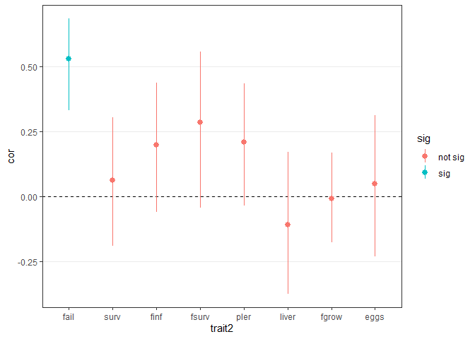
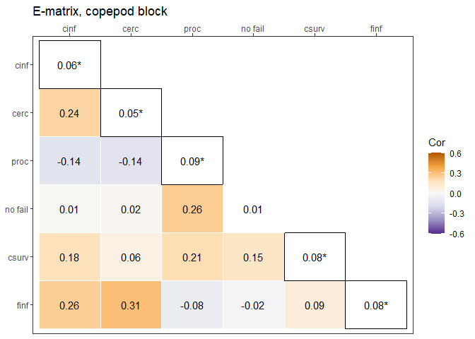

Multivariate models and quantitative genetics
================

-   [Copepod infection vs…](#copepod-infection-vs)
    -   [Cercomere presence](#cercomere-presence)
    -   [Procercoid size](#procercoid-size)
    -   [Failed development](#failed-development)
    -   [Copepod survival](#copepod-survival)
    -   [Fish infection rate](#fish-infection-rate)
    -   [Fish survival](#fish-survival)
    -   [Plerocercoid mass](#plerocercoid-mass)
    -   [Liver mass](#liver-mass)
    -   [Fish growth](#fish-growth)
    -   [Fecundity](#fecundity)
-   [Cercomere presence vs…](#cercomere-presence-vs)
    -   [Procercoid size](#procercoid-size-1)
    -   [Failed development](#failed-development-1)
    -   [Copepod survival](#copepod-survival-1)
    -   [Fish infection rate](#fish-infection-rate-1)
    -   [Fish survival](#fish-survival-1)
    -   [Plerocercoid mass](#plerocercoid-mass-1)
    -   [Liver mass](#liver-mass-1)
    -   [Fish growth](#fish-growth-1)
    -   [Fecundity](#fecundity-1)
-   [Procercoid size vs…](#procercoid-size-vs)
    -   [Failed development](#failed-development-2)
    -   [Copepod survival](#copepod-survival-2)
    -   [Fish infection rate](#fish-infection-rate-2)
    -   [Fish survival](#fish-survival-2)
    -   [Plerocercoid mass](#plerocercoid-mass-2)
    -   [Liver mass](#liver-mass-2)
    -   [Fish growth](#fish-growth-2)
    -   [Fecundity](#fecundity-2)
-   [Failed development vs…](#failed-development-vs)
    -   [Copepod survival](#copepod-survival-3)
    -   [Fish infection rate](#fish-infection-rate-3)
    -   [Fish survival](#fish-survival-3)
    -   [Plerocercoid mass](#plerocercoid-mass-3)
    -   [Liver mass](#liver-mass-3)
    -   [Fish growth](#fish-growth-3)
    -   [Fecundity](#fecundity-3)
-   [Copepod survival vs…](#copepod-survival-vs)
    -   [Fish infection rate](#fish-infection-rate-4)
    -   [Fish survival](#fish-survival-4)
    -   [Plerocercoid mass](#plerocercoid-mass-4)
    -   [Liver mass](#liver-mass-4)
    -   [Fish growth](#fish-growth-4)
    -   [Fecundity](#fecundity-4)
-   [Fish infection rate vs…](#fish-infection-rate-vs)
    -   [Fish survival](#fish-survival-5)
    -   [Plerocercoid mass](#plerocercoid-mass-5)
    -   [Liver mass](#liver-mass-5)
    -   [Fish growth](#fish-growth-5)
    -   [Fecundity](#fecundity-5)
-   [Fish survival vs…](#fish-survival-vs)
    -   [Plerocercoid mass](#plerocercoid-mass-6)
    -   [Liver mass](#liver-mass-6)
    -   [Fish growth](#fish-growth-6)
    -   [Fecundity](#fecundity-6)
-   [Plerocercoid mass vs…](#plerocercoid-mass-vs)
    -   [Liver mass](#liver-mass-7)
    -   [Fish growth](#fish-growth-7)
    -   [Fecundity](#fecundity-7)
-   [Liver mass vs…](#liver-mass-vs)
    -   [Fish growth](#fish-growth-8)
    -   [Fecundity](#fecundity-8)
-   [Fish growth vs…](#fish-growth-vs)
    -   [Fecundity](#fecundity-9)
-   [E-, G-, M-, and R-matrices](#e--g--m--and-r-matrices)

I experimentally selected tapeworms (*S. solidus*) for faster and slower
development in their first intermediate host, copepods.
[Elsewhere](02testing_selection_response.md) I tested whether there was
a response to selection and whether there were correlated responses in
other traits. Correlated responses are the consequence of genetic
correlations. Another way to explore correlated responses is by fitting
multivariate models and examining covariance between traits. We are
particularly interested in genetic covariance between traits suggestive
of pleiotropy.

We measured 11 response variables: 1. copepod infection rate 2.
cercomere presence 9 days post infection (dpi) 3. copepod survival 13
dpi 4. successful/failed development 13 dpi 5. procercoid size 13 dpi 6.
fish infection rate 7. fish liver weight 8. fish growth 9. fish survival
until dissection 10. plerocercoid mass 11. fecundity

Some of these are actually characteristics of hosts that might be
affected by parasites. Since we are focused on parasite genetics, we
only use the infected hosts in our multivariate models. For example, we
removed the data points for e.g. host survival corresponding to
uninfected hosts. We also log transformed several variables (liver
weight, plerocercoid mass, and fecundity) and scaled continuous
variables to unit variance to aid model fitting.

We examined trait correlations pairwise, i.e. we fit bivariate instead
of larger multivariate models. The reason for this was that potentially
interesting (and estimable) covariances differed among traits. For
example, we could estimate residual covariance between cercomere
presence and fish infection because worms with and without cercomeres
did and did not infect fish. By contrast, the residual covariance is
unidentified between cercomere presence and copepod infection rate
because all cercomeres were observed in infected copepods. For the
models, continuous traits, like parasite size, were assumed to have a
gaussian error distribution, whereas binary traits, like infection, were
modelled as binomial traits with a probit link function.

In the model for each trait, we tried to account for (i) starting
conditions like copepod stage or fish sex, (ii) shared environmental
factors (copepods from the same block or fish from the same tank), and
(iii) parasite genetics. The starting conditions were the models’ fixed
effects and they were explored
[elsewhere](02testing_selection_response.md);essentially they attempt to
control for “nuisance” variation that could not be standardized (like
fish size). Shared environments, like tank, were included as random
effects. We also included trait covariance between shared environments,
e.g. a tank with fish having high condition might also have bigger
worms.

Before fitting bivariate models, we can crudely explore trait covariance
attributable to shared environments. We took the residuals from
[univariate models](04quant_gen_univariate.md) that controlled for
starting conditions and parasite full-sib family. Thne, we averaged them
by copepod block and tank. Some of the correlations are positive
suggesting that certain blocks were characterized by better conditions
for parasites (e.g. higher infection rates and faster development).

<!-- -->

Here is the same plot but across tanks for traits from fish. Tanks with
large worms also tended to have fish in better condition that grew more.

<!-- -->

Our main interest, though, is genetic covariance, e.g. whether faster
larval development is traded off against other traits through
pleiotropy. Again, we can look at residuals that account for everything
but parasite family (i.e. shared environments and starting conditions).
Then, we can average those residuals at the family level and look for
correlations.

Here are the family-level correlations for traits from copepods. There
are some significant relationships.

<!-- -->

Here is the plot for traits from sticklebacks.

<!-- -->

Now, let’s move on to fitting the bivariate models. With 11 traits,
there are 55 unique pairs. We start with copepod infection rate.

# Copepod infection vs…

Parasite traits could only be measured in individuals that infected
copepods. Thus, residual covariance between copepod infection and other
traits cannot be estimated. The variance for infection rate was fixed at
1. Copepod infection was one of the only traits that exhibited some
variation between parental worms within clutches. Thus, “dam” variance
was included for copepod infection rate in the bivariate models.

## Cercomere presence

Cercomere presence also exhibited dam-level variation, so we can examine
whether dams with high infection rates were more likely to have
cercomeres 9 dpi.

    ## 
    ##  Iterations = 1001:50981
    ##  Thinning interval  = 20
    ##  Sample size  = 2500 
    ## 
    ##  DIC: 
    ## 
    ##  G-structure:  ~us(trait):cop_block
    ## 
    ##                                     post.mean l-95% CI u-95% CI eff.samp
    ## traitcop_inf:traitcop_inf.cop_block   0.19810  0.09124   0.3372     2500
    ## traitcerc_bi:traitcop_inf.cop_block   0.04779 -0.04102   0.1547     2500
    ## traitcop_inf:traitcerc_bi.cop_block   0.04779 -0.04102   0.1547     2500
    ## traitcerc_bi:traitcerc_bi.cop_block   0.21042  0.09662   0.3594     2208
    ## 
    ##                ~us(trait):worm_full_sib_fam_id
    ## 
    ##                                                post.mean l-95% CI u-95% CI
    ## traitcop_inf:traitcop_inf.worm_full_sib_fam_id   0.16799  0.11572   0.2228
    ## traitcerc_bi:traitcop_inf.worm_full_sib_fam_id   0.07147  0.02485   0.1243
    ## traitcop_inf:traitcerc_bi.worm_full_sib_fam_id   0.07147  0.02485   0.1243
    ## traitcerc_bi:traitcerc_bi.worm_full_sib_fam_id   0.20949  0.14145   0.2914
    ##                                                eff.samp
    ## traitcop_inf:traitcop_inf.worm_full_sib_fam_id     2500
    ## traitcerc_bi:traitcop_inf.worm_full_sib_fam_id     2153
    ## traitcop_inf:traitcerc_bi.worm_full_sib_fam_id     2153
    ## traitcerc_bi:traitcerc_bi.worm_full_sib_fam_id     2653
    ## 
    ##                ~us(trait):dam
    ## 
    ##                               post.mean  l-95% CI u-95% CI eff.samp
    ## traitcop_inf:traitcop_inf.dam   0.08470  0.056404  0.11525     2544
    ## traitcerc_bi:traitcop_inf.dam   0.02096 -0.005212  0.04662     2207
    ## traitcop_inf:traitcerc_bi.dam   0.02096 -0.005212  0.04662     2207
    ## traitcerc_bi:traitcerc_bi.dam   0.11394  0.074874  0.15932     2204
    ## 
    ##  R-structure:  ~idh(trait):units
    ## 
    ##                    post.mean l-95% CI u-95% CI eff.samp
    ## traitcop_inf.units         1        1        1        0
    ## traitcerc_bi.units         1        1        1        0
    ## 
    ##  Location effects: cbind(cop_inf, cerc_bi) ~ trait - 1 + trait:ib + trait:cop_stage_checking 
    ## 
    ##                                   post.mean l-95% CI u-95% CI eff.samp  pMCMC
    ## traitcop_inf                        0.69578  0.48105  0.88462     2248 <4e-04
    ## traitcerc_bi                        0.09337 -0.12675  0.29468     2500 0.4096
    ## traitcop_inf:ib                    -0.78731 -1.82868  0.29837     2500 0.1512
    ## traitcerc_bi:ib                    -2.19441 -3.54456 -0.86870     2303 0.0008
    ## traitcop_inf:cop_stage_checkingC1   0.14107  0.04305  0.23449     2741 0.0048
    ## traitcerc_bi:cop_stage_checkingC1   0.61117  0.48112  0.74756     2500 <4e-04
    ## traitcop_inf:cop_stage_checkingC3  -0.18647 -0.26927 -0.10306     2500 <4e-04
    ## traitcerc_bi:cop_stage_checkingC3  -0.97166 -1.08297 -0.84210     2500 <4e-04
    ## traitcop_inf:cop_stage_checkingC4  -0.37837 -0.61533 -0.09389     2711 0.0024
    ## traitcerc_bi:cop_stage_checkingC4  -1.07618 -1.74646 -0.38048     1480 0.0008
    ##                                      
    ## traitcop_inf                      ***
    ## traitcerc_bi                         
    ## traitcop_inf:ib                      
    ## traitcerc_bi:ib                   ***
    ## traitcop_inf:cop_stage_checkingC1 ** 
    ## traitcerc_bi:cop_stage_checkingC1 ***
    ## traitcop_inf:cop_stage_checkingC3 ***
    ## traitcerc_bi:cop_stage_checkingC3 ***
    ## traitcop_inf:cop_stage_checkingC4 ** 
    ## traitcerc_bi:cop_stage_checkingC4 ***
    ## ---
    ## Signif. codes:  0 '***' 0.001 '**' 0.01 '*' 0.05 '.' 0.1 ' ' 1

<!-- -->

    ## [1] "control"

    ##       2.5%        50%      97.5% 
    ## -0.4616431  0.1723508  0.8469601

    ## [1] "fast"

    ##       2.5%        50%      97.5% 
    ## -1.3552008 -0.7709178 -0.1721040

    ## [1] "slow"

    ##       2.5%        50%      97.5% 
    ## -1.2171600 -0.3724904  0.3270107

<!-- -->

    ## [1] "control"

    ##        2.5%         50%       97.5% 
    ## -0.70391203 -0.07510371  0.52553649

    ## [1] "fast"

    ##       2.5%        50%      97.5% 
    ## -0.9168758 -0.2718776  0.3215109

    ## [1] "slow"

    ##        2.5%         50%       97.5% 
    ## -0.70573284 -0.05911105  0.53364460

<!-- -->

|    cerc_bi |      pred | pred_untrans |
|-----------:|----------:|-------------:|
| -0.7474097 | 0.4403553 |    0.2274082 |
| -0.7185493 | 0.4502182 |    0.2362093 |
| -0.6896890 | 0.4600811 |    0.2451949 |
| -0.6608286 | 0.4699440 |    0.2543611 |
| -0.6319682 | 0.4798069 |    0.2637038 |
| -0.6031079 | 0.4896698 |    0.2732185 |
| -0.5742475 | 0.4995326 |    0.2829002 |
| -0.5453872 | 0.5093955 |    0.2927436 |
| -0.5165268 | 0.5192584 |    0.3027433 |
| -0.4876664 | 0.5291213 |    0.3128931 |
| -0.4588061 | 0.5389842 |    0.3231867 |
| -0.4299457 | 0.5488471 |    0.3336176 |
| -0.4010854 | 0.5587100 |    0.3441786 |
| -0.3722250 | 0.5685728 |    0.3548627 |
| -0.3433646 | 0.5784357 |    0.3656621 |
| -0.3145043 | 0.5882986 |    0.3765690 |
| -0.2856439 | 0.5981615 |    0.3875754 |
| -0.2567836 | 0.6080244 |    0.3986729 |
| -0.2279232 | 0.6178873 |    0.4098530 |
| -0.1990628 | 0.6277502 |    0.4211068 |
| -0.1702025 | 0.6376130 |    0.4324254 |
| -0.1413421 | 0.6474759 |    0.4437998 |
| -0.1124818 | 0.6573388 |    0.4552207 |
| -0.0836214 | 0.6672017 |    0.4666787 |
| -0.0547610 | 0.6770646 |    0.4781644 |
| -0.0259007 | 0.6869275 |    0.4896683 |
|  0.0029597 | 0.6967904 |    0.5011807 |
|  0.0318200 | 0.7066532 |    0.5126922 |
|  0.0606804 | 0.7165161 |    0.5241931 |
|  0.0895407 | 0.7263790 |    0.5356739 |
|  0.1184011 | 0.7362419 |    0.5471251 |
|  0.1472615 | 0.7461048 |    0.5585372 |
|  0.1761218 | 0.7559677 |    0.5699009 |
|  0.2049822 | 0.7658306 |    0.5812070 |
|  0.2338425 | 0.7756934 |    0.5924464 |
|  0.2627029 | 0.7855563 |    0.6036102 |
|  0.2915633 | 0.7954192 |    0.6146897 |
|  0.3204236 | 0.8052821 |    0.6256764 |
|  0.3492840 | 0.8151450 |    0.6365619 |
|  0.3781443 | 0.8250079 |    0.6473383 |
|  0.4070047 | 0.8348708 |    0.6579977 |
|  0.4358651 | 0.8447336 |    0.6685327 |
|  0.4647254 | 0.8545965 |    0.6789359 |
|  0.4935858 | 0.8644594 |    0.6892006 |
|  0.5224461 | 0.8743223 |    0.6993201 |
|  0.5513065 | 0.8841852 |    0.7092882 |
|  0.5801669 | 0.8940481 |    0.7190990 |
|  0.6090272 | 0.9039110 |    0.7287468 |
|  0.6378876 | 0.9137738 |    0.7382266 |
|  0.6667479 | 0.9236367 |    0.7475334 |

<!-- -->

<!-- -->

<!-- -->

Here is the correlation across copepod blocks:

    ## 
    ## Iterations = 1001:50981
    ## Thinning interval = 20 
    ## Number of chains = 1 
    ## Sample size per chain = 2500 
    ## 
    ## 1. Empirical mean and standard deviation for each variable,
    ##    plus standard error of the mean:
    ## 
    ##           Mean             SD       Naive SE Time-series SE 
    ##       0.226198       0.205565       0.004111       0.004111 
    ## 
    ## 2. Quantiles for each variable:
    ## 
    ##     2.5%      25%      50%      75%    97.5% 
    ## -0.20155  0.08174  0.23589  0.37627  0.60095

Here is the genetic correlation - families with high infection rates
also had faster larval development.

    ## 
    ## Iterations = 1001:50981
    ## Thinning interval = 20 
    ## Number of chains = 1 
    ## Sample size per chain = 2500 
    ## 
    ## 1. Empirical mean and standard deviation for each variable,
    ##    plus standard error of the mean:
    ## 
    ##           Mean             SD       Naive SE Time-series SE 
    ##       0.378820       0.111467       0.002229       0.002453 
    ## 
    ## 2. Quantiles for each variable:
    ## 
    ##   2.5%    25%    50%    75%  97.5% 
    ## 0.1486 0.3053 0.3837 0.4562 0.5763

Here is the dam correlation - it is positive but not quite significant.

    ## 
    ## Iterations = 1001:50981
    ## Thinning interval = 20 
    ## Number of chains = 1 
    ## Sample size per chain = 2500 
    ## 
    ## 1. Empirical mean and standard deviation for each variable,
    ##    plus standard error of the mean:
    ## 
    ##           Mean             SD       Naive SE Time-series SE 
    ##       0.211010       0.125540       0.002511       0.002673 
    ## 
    ## 2. Quantiles for each variable:
    ## 
    ##     2.5%      25%      50%      75%    97.5% 
    ## -0.04314  0.12652  0.21384  0.29911  0.43972

## Procercoid size

Procercoid size was measured 13 dpi. We also fit a ‘dam’ covariance
here, even though procercoid size varied less among dams than cercomere
presence.

    ## 
    ##  Iterations = 1001:50981
    ##  Thinning interval  = 20
    ##  Sample size  = 2500 
    ## 
    ##  DIC: 16409.87 
    ## 
    ##  G-structure:  ~us(trait):cop_block
    ## 
    ##                                       post.mean l-95% CI u-95% CI eff.samp
    ## traitproc_scl:traitproc_scl.cop_block   0.20345  0.09630  0.34992     2500
    ## traitcop_inf:traitproc_scl.cop_block   -0.02717 -0.12746  0.06871     2500
    ## traitproc_scl:traitcop_inf.cop_block   -0.02717 -0.12746  0.06871     2500
    ## traitcop_inf:traitcop_inf.cop_block     0.20219  0.09677  0.34899     2689
    ## 
    ##                ~us(trait):worm_full_sib_fam_id
    ## 
    ##                                                  post.mean l-95% CI u-95% CI
    ## traitproc_scl:traitproc_scl.worm_full_sib_fam_id   0.11625 0.079424   0.1526
    ## traitcop_inf:traitproc_scl.worm_full_sib_fam_id    0.04059 0.006513   0.0745
    ## traitproc_scl:traitcop_inf.worm_full_sib_fam_id    0.04059 0.006513   0.0745
    ## traitcop_inf:traitcop_inf.worm_full_sib_fam_id     0.16477 0.107574   0.2174
    ##                                                  eff.samp
    ## traitproc_scl:traitproc_scl.worm_full_sib_fam_id     2500
    ## traitcop_inf:traitproc_scl.worm_full_sib_fam_id      2500
    ## traitproc_scl:traitcop_inf.worm_full_sib_fam_id      2500
    ## traitcop_inf:traitcop_inf.worm_full_sib_fam_id       2500
    ## 
    ##                ~us(trait):dam
    ## 
    ##                                 post.mean l-95% CI u-95% CI eff.samp
    ## traitproc_scl:traitproc_scl.dam  0.063274  0.04308  0.08363     2301
    ## traitcop_inf:traitproc_scl.dam   0.004296 -0.01270  0.02310     2329
    ## traitproc_scl:traitcop_inf.dam   0.004296 -0.01270  0.02310     2329
    ## traitcop_inf:traitcop_inf.dam    0.083296  0.05564  0.11232     2103
    ## 
    ##  R-structure:  ~idh(trait):units
    ## 
    ##                     post.mean l-95% CI u-95% CI eff.samp
    ## traitproc_scl.units    0.6328   0.6014   0.6696     2255
    ## traitcop_inf.units     1.0000   1.0000   1.0000        0
    ## 
    ##  Location effects: cbind(proc_scl, cop_inf) ~ trait - 1 + trait:ib + trait:cop_stage_checking 
    ## 
    ##                                    post.mean l-95% CI u-95% CI eff.samp  pMCMC
    ## traitproc_scl                       -0.06447 -0.28644  0.12291     2500 0.5136
    ## traitcop_inf                         0.69149  0.50104  0.90863     2500 <4e-04
    ## traitproc_scl:ib                    -0.33389 -1.27671  0.68033     2500 0.4872
    ## traitcop_inf:ib                     -0.78213 -1.90931  0.23940     2776 0.1456
    ## traitproc_scl:cop_stage_checkingC1  -0.97002 -1.09656 -0.84011     2341 <4e-04
    ## traitcop_inf:cop_stage_checkingC1    0.14003  0.03654  0.23269     2500 0.0072
    ## traitproc_scl:cop_stage_checkingC3   0.75610  0.64223  0.86023     2224 <4e-04
    ## traitcop_inf:cop_stage_checkingC3   -0.18852 -0.26631 -0.10267     2500 <4e-04
    ## traitproc_scl:cop_stage_checkingC4   1.10977  0.55473  1.72951     1258 <4e-04
    ## traitcop_inf:cop_stage_checkingC4   -0.38959 -0.62862 -0.14565     2326 <4e-04
    ##                                       
    ## traitproc_scl                         
    ## traitcop_inf                       ***
    ## traitproc_scl:ib                      
    ## traitcop_inf:ib                       
    ## traitproc_scl:cop_stage_checkingC1 ***
    ## traitcop_inf:cop_stage_checkingC1  ** 
    ## traitproc_scl:cop_stage_checkingC3 ***
    ## traitcop_inf:cop_stage_checkingC3  ***
    ## traitproc_scl:cop_stage_checkingC4 ***
    ## traitcop_inf:cop_stage_checkingC4  ***
    ## ---
    ## Signif. codes:  0 '***' 0.001 '**' 0.01 '*' 0.05 '.' 0.1 ' ' 1

Here is the correlation across copepod blocks:

    ## 
    ## Iterations = 1001:50981
    ## Thinning interval = 20 
    ## Number of chains = 1 
    ## Sample size per chain = 2500 
    ## 
    ## 1. Empirical mean and standard deviation for each variable,
    ##    plus standard error of the mean:
    ## 
    ##           Mean             SD       Naive SE Time-series SE 
    ##      -0.130597       0.212682       0.004254       0.004113 
    ## 
    ## 2. Quantiles for each variable:
    ## 
    ##     2.5%      25%      50%      75%    97.5% 
    ## -0.52302 -0.28151 -0.14097  0.01066  0.30906

Here is the genetic correlation - families with higher infection rates
also had larger procercoids.

    ## 
    ## Iterations = 1001:50981
    ## Thinning interval = 20 
    ## Number of chains = 1 
    ## Sample size per chain = 2500 
    ## 
    ## 1. Empirical mean and standard deviation for each variable,
    ##    plus standard error of the mean:
    ## 
    ##           Mean             SD       Naive SE Time-series SE 
    ##       0.292447       0.114718       0.002294       0.002294 
    ## 
    ## 2. Quantiles for each variable:
    ## 
    ##    2.5%     25%     50%     75%   97.5% 
    ## 0.06194 0.21451 0.29819 0.37519 0.49908

Here is the dam correlation:

    ## 
    ## Iterations = 1001:50981
    ## Thinning interval = 20 
    ## Number of chains = 1 
    ## Sample size per chain = 2500 
    ## 
    ## 1. Empirical mean and standard deviation for each variable,
    ##    plus standard error of the mean:
    ## 
    ##           Mean             SD       Naive SE Time-series SE 
    ##       0.057559       0.123650       0.002473       0.002562 
    ## 
    ## 2. Quantiles for each variable:
    ## 
    ##     2.5%      25%      50%      75%    97.5% 
    ## -0.18673 -0.02606  0.06226  0.14275  0.29410

## Failed development

A small portion of parasites were not fully developed after 13 days in
copepods, e.g. they had not grown or lacked a cercomere. They were
scored as “failed”. Because the vast majority of parasites did not
“fail”, most ‘maternal’ parasites did not have any offspring that
‘failed’ development. In other words, it is hard to estimate a variance
component for dams. Thus, we did not include ‘dam’ variance for this
trait.

    ## 
    ##  Iterations = 1001:125951
    ##  Thinning interval  = 50
    ##  Sample size  = 2500 
    ## 
    ##  DIC: 
    ## 
    ##  G-structure:  ~us(trait):cop_block
    ## 
    ##                                                       post.mean l-95% CI
    ## traitcop_inf:traitcop_inf.cop_block                    0.199579  0.09778
    ## traitnofailed_devo_bi:traitcop_inf.cop_block           0.003676 -0.08587
    ## traitcop_inf:traitnofailed_devo_bi.cop_block           0.003676 -0.08587
    ## traitnofailed_devo_bi:traitnofailed_devo_bi.cop_block  0.199454  0.08469
    ##                                                       u-95% CI eff.samp
    ## traitcop_inf:traitcop_inf.cop_block                     0.3462     2180
    ## traitnofailed_devo_bi:traitcop_inf.cop_block            0.1128     2500
    ## traitcop_inf:traitnofailed_devo_bi.cop_block            0.1128     2500
    ## traitnofailed_devo_bi:traitnofailed_devo_bi.cop_block   0.3477     2500
    ## 
    ##                ~us(trait):worm_full_sib_fam_id
    ## 
    ##                                                                  post.mean
    ## traitcop_inf:traitcop_inf.worm_full_sib_fam_id                      0.1776
    ## traitnofailed_devo_bi:traitcop_inf.worm_full_sib_fam_id             0.1484
    ## traitcop_inf:traitnofailed_devo_bi.worm_full_sib_fam_id             0.1484
    ## traitnofailed_devo_bi:traitnofailed_devo_bi.worm_full_sib_fam_id    0.4996
    ##                                                                  l-95% CI
    ## traitcop_inf:traitcop_inf.worm_full_sib_fam_id                    0.12791
    ## traitnofailed_devo_bi:traitcop_inf.worm_full_sib_fam_id           0.07293
    ## traitcop_inf:traitnofailed_devo_bi.worm_full_sib_fam_id           0.07293
    ## traitnofailed_devo_bi:traitnofailed_devo_bi.worm_full_sib_fam_id  0.29896
    ##                                                                  u-95% CI
    ## traitcop_inf:traitcop_inf.worm_full_sib_fam_id                     0.2358
    ## traitnofailed_devo_bi:traitcop_inf.worm_full_sib_fam_id            0.2307
    ## traitcop_inf:traitnofailed_devo_bi.worm_full_sib_fam_id            0.2307
    ## traitnofailed_devo_bi:traitnofailed_devo_bi.worm_full_sib_fam_id   0.7139
    ##                                                                  eff.samp
    ## traitcop_inf:traitcop_inf.worm_full_sib_fam_id                       2500
    ## traitnofailed_devo_bi:traitcop_inf.worm_full_sib_fam_id              2085
    ## traitcop_inf:traitnofailed_devo_bi.worm_full_sib_fam_id              2085
    ## traitnofailed_devo_bi:traitnofailed_devo_bi.worm_full_sib_fam_id     1080
    ## 
    ##                ~us(at.level(trait, 1)):dam
    ## 
    ##                                           post.mean l-95% CI u-95% CI eff.samp
    ## at.level(trait, 1):at.level(trait, 1).dam   0.06366  0.03973  0.08928     2500
    ## 
    ##  R-structure:  ~idh(trait):units
    ## 
    ##                             post.mean l-95% CI u-95% CI eff.samp
    ## traitcop_inf.units                  1        1        1        0
    ## traitnofailed_devo_bi.units         1        1        1        0
    ## 
    ##  Location effects: cbind(cop_inf, nofailed_devo_bi) ~ trait - 1 + trait:ib + trait:cop_stage_checking 
    ## 
    ##                                            post.mean l-95% CI u-95% CI eff.samp
    ## traitcop_inf                                 0.68930  0.48987  0.89822     2500
    ## traitnofailed_devo_bi                        2.06672  1.78673  2.32911     1723
    ## traitcop_inf:ib                             -0.77018 -1.82141  0.30385     2689
    ## traitnofailed_devo_bi:ib                    -2.32958 -4.30208 -0.53390     2293
    ## traitcop_inf:cop_stage_checkingC1            0.14010  0.04279  0.22916     2361
    ## traitnofailed_devo_bi:cop_stage_checkingC1   0.09368 -0.31287  0.48469     1437
    ## traitcop_inf:cop_stage_checkingC3           -0.18778 -0.26781 -0.10360     2500
    ## traitnofailed_devo_bi:cop_stage_checkingC3  -0.48233 -0.73301 -0.20888     1966
    ## traitcop_inf:cop_stage_checkingC4           -0.38846 -0.61626 -0.14306     3178
    ## traitnofailed_devo_bi:cop_stage_checkingC4  -0.88027 -2.09180  0.56481     1226
    ##                                             pMCMC    
    ## traitcop_inf                               <4e-04 ***
    ## traitnofailed_devo_bi                      <4e-04 ***
    ## traitcop_inf:ib                            0.1520    
    ## traitnofailed_devo_bi:ib                   0.0200 *  
    ## traitcop_inf:cop_stage_checkingC1          0.0016 ** 
    ## traitnofailed_devo_bi:cop_stage_checkingC1 0.6584    
    ## traitcop_inf:cop_stage_checkingC3          <4e-04 ***
    ## traitnofailed_devo_bi:cop_stage_checkingC3 <4e-04 ***
    ## traitcop_inf:cop_stage_checkingC4          <4e-04 ***
    ## traitnofailed_devo_bi:cop_stage_checkingC4 0.1928    
    ## ---
    ## Signif. codes:  0 '***' 0.001 '**' 0.01 '*' 0.05 '.' 0.1 ' ' 1

Here is the correlation across copepod blocks:

    ## 
    ## Iterations = 1001:125951
    ## Thinning interval = 50 
    ## Number of chains = 1 
    ## Sample size per chain = 2500 
    ## 
    ## 1. Empirical mean and standard deviation for each variable,
    ##    plus standard error of the mean:
    ## 
    ##           Mean             SD       Naive SE Time-series SE 
    ##       0.016085       0.227465       0.004549       0.004549 
    ## 
    ## 2. Quantiles for each variable:
    ## 
    ##     2.5%      25%      50%      75%    97.5% 
    ## -0.41896 -0.14376  0.01242  0.17308  0.45232

Here is the genetic correlation - families with higher infection rates
were more likely to succesfully complete development.

    ## 
    ## Iterations = 1001:125951
    ## Thinning interval = 50 
    ## Number of chains = 1 
    ## Sample size per chain = 2500 
    ## 
    ## 1. Empirical mean and standard deviation for each variable,
    ##    plus standard error of the mean:
    ## 
    ##           Mean             SD       Naive SE Time-series SE 
    ##       0.499021       0.101530       0.002031       0.002179 
    ## 
    ## 2. Quantiles for each variable:
    ## 
    ##   2.5%    25%    50%    75%  97.5% 
    ## 0.2832 0.4324 0.5063 0.5733 0.6724

## Copepod survival

We recorded whether copepods were still alive 13 dpi. We estimated
environmental, genetic, and parental covariances between infection rate
and copepod survival. We limited observations on survival to only
infected copepods.

    ## 
    ##  Iterations = 1001:50981
    ##  Thinning interval  = 20
    ##  Sample size  = 2500 
    ## 
    ##  DIC: 
    ## 
    ##  G-structure:  ~us(trait):cop_block
    ## 
    ##                                                   post.mean l-95% CI u-95% CI
    ## traitcop_inf:traitcop_inf.cop_block                 0.19929  0.09503   0.3346
    ## traitcop_surv_13dpe:traitcop_inf.cop_block          0.03578 -0.06180   0.1269
    ## traitcop_inf:traitcop_surv_13dpe.cop_block          0.03578 -0.06180   0.1269
    ## traitcop_surv_13dpe:traitcop_surv_13dpe.cop_block   0.20391  0.09693   0.3402
    ##                                                   eff.samp
    ## traitcop_inf:traitcop_inf.cop_block                   2500
    ## traitcop_surv_13dpe:traitcop_inf.cop_block            2705
    ## traitcop_inf:traitcop_surv_13dpe.cop_block            2705
    ## traitcop_surv_13dpe:traitcop_surv_13dpe.cop_block     2915
    ## 
    ##                ~us(trait):worm_full_sib_fam_id
    ## 
    ##                                                              post.mean l-95% CI
    ## traitcop_inf:traitcop_inf.worm_full_sib_fam_id                0.164349  0.11665
    ## traitcop_surv_13dpe:traitcop_inf.worm_full_sib_fam_id         0.007354 -0.02303
    ## traitcop_inf:traitcop_surv_13dpe.worm_full_sib_fam_id         0.007354 -0.02303
    ## traitcop_surv_13dpe:traitcop_surv_13dpe.worm_full_sib_fam_id  0.073124  0.04854
    ##                                                              u-95% CI eff.samp
    ## traitcop_inf:traitcop_inf.worm_full_sib_fam_id                0.22323     2500
    ## traitcop_surv_13dpe:traitcop_inf.worm_full_sib_fam_id         0.03765     2227
    ## traitcop_inf:traitcop_surv_13dpe.worm_full_sib_fam_id         0.03765     2227
    ## traitcop_surv_13dpe:traitcop_surv_13dpe.worm_full_sib_fam_id  0.09943     2500
    ## 
    ##                ~us(trait):dam
    ## 
    ##                                             post.mean l-95% CI u-95% CI
    ## traitcop_inf:traitcop_inf.dam                0.084013  0.05690  0.11336
    ## traitcop_surv_13dpe:traitcop_inf.dam        -0.001103 -0.01843  0.01635
    ## traitcop_inf:traitcop_surv_13dpe.dam        -0.001103 -0.01843  0.01635
    ## traitcop_surv_13dpe:traitcop_surv_13dpe.dam  0.060082  0.04199  0.08058
    ##                                             eff.samp
    ## traitcop_inf:traitcop_inf.dam                   2296
    ## traitcop_surv_13dpe:traitcop_inf.dam            2500
    ## traitcop_inf:traitcop_surv_13dpe.dam            2500
    ## traitcop_surv_13dpe:traitcop_surv_13dpe.dam     2343
    ## 
    ##  R-structure:  ~idh(trait):units
    ## 
    ##                           post.mean l-95% CI u-95% CI eff.samp
    ## traitcop_inf.units                1        1        1        0
    ## traitcop_surv_13dpe.units         1        1        1        0
    ## 
    ##  Location effects: cbind(cop_inf, cop_surv_13dpe) ~ trait - 1 + trait:ib + trait:cop_stage_checking 
    ## 
    ##                                          post.mean l-95% CI u-95% CI eff.samp
    ## traitcop_inf                               0.69474  0.48663  0.89025     2500
    ## traitcop_surv_13dpe                        0.83468  0.63379  1.03384     2500
    ## traitcop_inf:ib                           -0.78514 -1.90567  0.23993     2604
    ## traitcop_surv_13dpe:ib                     0.11153 -0.86972  0.95943     2977
    ## traitcop_inf:cop_stage_checkingC1          0.14119  0.04911  0.23900     2671
    ## traitcop_surv_13dpe:cop_stage_checkingC1  -0.78314 -0.87937 -0.67621     2462
    ## traitcop_inf:cop_stage_checkingC3         -0.18644 -0.26936 -0.10193     2500
    ## traitcop_surv_13dpe:cop_stage_checkingC3   0.26715  0.15288  0.37473     2500
    ## traitcop_inf:cop_stage_checkingC4         -0.38487 -0.62289 -0.12679     2673
    ## traitcop_surv_13dpe:cop_stage_checkingC4   0.63778  0.20915  1.08727     2195
    ##                                           pMCMC    
    ## traitcop_inf                             <4e-04 ***
    ## traitcop_surv_13dpe                      <4e-04 ***
    ## traitcop_inf:ib                          0.1480    
    ## traitcop_surv_13dpe:ib                   0.7936    
    ## traitcop_inf:cop_stage_checkingC1        0.0032 ** 
    ## traitcop_surv_13dpe:cop_stage_checkingC1 <4e-04 ***
    ## traitcop_inf:cop_stage_checkingC3        <4e-04 ***
    ## traitcop_surv_13dpe:cop_stage_checkingC3 <4e-04 ***
    ## traitcop_inf:cop_stage_checkingC4        0.0032 ** 
    ## traitcop_surv_13dpe:cop_stage_checkingC4 0.0032 ** 
    ## ---
    ## Signif. codes:  0 '***' 0.001 '**' 0.01 '*' 0.05 '.' 0.1 ' ' 1

Here is the correlation across copepod blocks:

    ## 
    ## Iterations = 1001:50981
    ## Thinning interval = 20 
    ## Number of chains = 1 
    ## Sample size per chain = 2500 
    ## 
    ## 1. Empirical mean and standard deviation for each variable,
    ##    plus standard error of the mean:
    ## 
    ##           Mean             SD       Naive SE Time-series SE 
    ##       0.175969       0.210765       0.004215       0.004049 
    ## 
    ## 2. Quantiles for each variable:
    ## 
    ##     2.5%      25%      50%      75%    97.5% 
    ## -0.26335  0.03428  0.18495  0.33457  0.55351

Here is the genetic correlation:

    ## 
    ## Iterations = 1001:50981
    ## Thinning interval = 20 
    ## Number of chains = 1 
    ## Sample size per chain = 2500 
    ## 
    ## 1. Empirical mean and standard deviation for each variable,
    ##    plus standard error of the mean:
    ## 
    ##           Mean             SD       Naive SE Time-series SE 
    ##       0.067055       0.140277       0.002806       0.002987 
    ## 
    ## 2. Quantiles for each variable:
    ## 
    ##     2.5%      25%      50%      75%    97.5% 
    ## -0.20479 -0.03014  0.06930  0.16448  0.33992

Here is the dam correlation:

    ## 
    ## Iterations = 1001:50981
    ## Thinning interval = 20 
    ## Number of chains = 1 
    ## Sample size per chain = 2500 
    ## 
    ## 1. Empirical mean and standard deviation for each variable,
    ##    plus standard error of the mean:
    ## 
    ##           Mean             SD       Naive SE Time-series SE 
    ##      -0.015109       0.122302       0.002446       0.002446 
    ## 
    ## 2. Quantiles for each variable:
    ## 
    ##     2.5%      25%      50%      75%    97.5% 
    ## -0.24897 -0.09792 -0.01319  0.06591  0.22542

## Fish infection rate

For fish infection rates, we look at environmental (copepod block) and
genetic (families) covariances. We did not consider dam variance,
because there were relatively few worms per dam within clutches.
Further, there was little variance among dams in the univariate model
for fish infection. In fact, for all fish-level traits, dam variance was
low, so we did not include it for any traits from fish.

    ## 
    ##  Iterations = 1001:100961
    ##  Thinning interval  = 40
    ##  Sample size  = 2500 
    ## 
    ##  DIC: 
    ## 
    ##  G-structure:  ~us(trait):cop_block
    ## 
    ##                                             post.mean l-95% CI u-95% CI
    ## traitcop_inf:traitcop_inf.cop_block            0.2071  0.09292   0.3552
    ## traitschisto_inf:traitcop_inf.cop_block        0.0561 -0.04419   0.1745
    ## traitcop_inf:traitschisto_inf.cop_block        0.0561 -0.04419   0.1745
    ## traitschisto_inf:traitschisto_inf.cop_block    0.2292  0.10495   0.3888
    ##                                             eff.samp
    ## traitcop_inf:traitcop_inf.cop_block             2500
    ## traitschisto_inf:traitcop_inf.cop_block         2500
    ## traitcop_inf:traitschisto_inf.cop_block         2500
    ## traitschisto_inf:traitschisto_inf.cop_block     2500
    ## 
    ##                ~us(trait):worm_full_sib_fam_id
    ## 
    ##                                                        post.mean l-95% CI
    ## traitcop_inf:traitcop_inf.worm_full_sib_fam_id           0.16968  0.11963
    ## traitschisto_inf:traitcop_inf.worm_full_sib_fam_id       0.01934 -0.02144
    ## traitcop_inf:traitschisto_inf.worm_full_sib_fam_id       0.01934 -0.02144
    ## traitschisto_inf:traitschisto_inf.worm_full_sib_fam_id   0.11788  0.07364
    ##                                                        u-95% CI eff.samp
    ## traitcop_inf:traitcop_inf.worm_full_sib_fam_id          0.22740     3046
    ## traitschisto_inf:traitcop_inf.worm_full_sib_fam_id      0.05547     2500
    ## traitcop_inf:traitschisto_inf.worm_full_sib_fam_id      0.05547     2500
    ## traitschisto_inf:traitschisto_inf.worm_full_sib_fam_id  0.16527     2500
    ## 
    ##                ~idh(at.level(trait, 1)):dam
    ## 
    ##                        post.mean l-95% CI u-95% CI eff.samp
    ## at.level(trait, 1).dam   0.06589  0.04164  0.09323     2683
    ## 
    ##  R-structure:  ~idh(trait):units
    ## 
    ##                        post.mean l-95% CI u-95% CI eff.samp
    ## traitcop_inf.units             1        1        1        0
    ## traitschisto_inf.units         1        1        1        0
    ## 
    ##  Location effects: cbind(cop_inf, schisto_inf) ~ trait - 1 + trait:ib + at.level(trait, 1):cop_stage_checking + at.level(trait, 2):fish_initial_bm_cen + at.level(trait, 2):fish_sex_cen + at.level(trait, 2):fish_exp_on_cop_dpe_fct 
    ## 
    ##                                              post.mean l-95% CI u-95% CI
    ## traitcop_inf                                   0.30734 -0.01762  0.62654
    ## traitschisto_inf                              -0.23745 -0.47767 -0.01243
    ## traitcop_inf:ib                               -0.79353 -1.95552  0.24957
    ## traitschisto_inf:ib                           -1.44326 -2.63021 -0.19222
    ## at.level(trait, 1):cop_stage_checkingC2        0.38493  0.14379  0.63985
    ## at.level(trait, 1):cop_stage_checkingC1        0.52391  0.27140  0.80849
    ## at.level(trait, 1):cop_stage_checkingC3        0.19958 -0.05579  0.44796
    ## at.level(trait, 2):fish_initial_bm_cen         0.08001 -0.48684  0.57682
    ## at.level(trait, 2):fish_sex_cen               -0.26209 -0.37024 -0.14663
    ## at.level(trait, 2):fish_exp_on_cop_dpe_fct12  -0.97649 -1.32153 -0.63775
    ## at.level(trait, 2):fish_exp_on_cop_dpe_fct16   0.01894 -0.23385  0.29675
    ##                                              eff.samp  pMCMC    
    ## traitcop_inf                                     2500 0.0680 .  
    ## traitschisto_inf                                 2296 0.0488 *  
    ## traitcop_inf:ib                                  2500 0.1512    
    ## traitschisto_inf:ib                              2084 0.0240 *  
    ## at.level(trait, 1):cop_stage_checkingC2          2327 0.0040 ** 
    ## at.level(trait, 1):cop_stage_checkingC1          2294 <4e-04 ***
    ## at.level(trait, 1):cop_stage_checkingC3          2361 0.1168    
    ## at.level(trait, 2):fish_initial_bm_cen           2500 0.7664    
    ## at.level(trait, 2):fish_sex_cen                  2500 <4e-04 ***
    ## at.level(trait, 2):fish_exp_on_cop_dpe_fct12     2177 <4e-04 ***
    ## at.level(trait, 2):fish_exp_on_cop_dpe_fct16     1683 0.8960    
    ## ---
    ## Signif. codes:  0 '***' 0.001 '**' 0.01 '*' 0.05 '.' 0.1 ' ' 1

Here is the correlation across copepod blocks. Some blocks had higher
infection rates in both hosts, but the CI was wide.

    ## 
    ## Iterations = 1001:100961
    ## Thinning interval = 40 
    ## Number of chains = 1 
    ## Sample size per chain = 2500 
    ## 
    ## 1. Empirical mean and standard deviation for each variable,
    ##    plus standard error of the mean:
    ## 
    ##           Mean             SD       Naive SE Time-series SE 
    ##       0.248058       0.209155       0.004183       0.004470 
    ## 
    ## 2. Quantiles for each variable:
    ## 
    ##    2.5%     25%     50%     75%   97.5% 
    ## -0.1861  0.1091  0.2572  0.4002  0.6241

Here is the genetic correlation

    ## 
    ## Iterations = 1001:100961
    ## Thinning interval = 40 
    ## Number of chains = 1 
    ## Sample size per chain = 2500 
    ## 
    ## 1. Empirical mean and standard deviation for each variable,
    ##    plus standard error of the mean:
    ## 
    ##           Mean             SD       Naive SE Time-series SE 
    ##       0.136568       0.136411       0.002728       0.002728 
    ## 
    ## 2. Quantiles for each variable:
    ## 
    ##     2.5%      25%      50%      75%    97.5% 
    ## -0.13964  0.04534  0.14030  0.23037  0.39149

## Fish survival

Fish survival was recorded haphazardly; we did not record exactly when
the fish died. This is just a measure of whether fish survived until
dissection.

    ## 
    ##  Iterations = 1001:250901
    ##  Thinning interval  = 100
    ##  Sample size  = 2500 
    ## 
    ##  DIC: 
    ## 
    ##  G-structure:  ~us(at.level(trait, 1)):cop_block
    ## 
    ##                                                 post.mean l-95% CI u-95% CI
    ## at.level(trait, 1):at.level(trait, 1).cop_block    0.1459  0.06761   0.2576
    ##                                                 eff.samp
    ## at.level(trait, 1):at.level(trait, 1).cop_block     2681
    ## 
    ##                ~us(at.level(trait, 2)):tank_id
    ## 
    ##                                               post.mean l-95% CI u-95% CI
    ## at.level(trait, 2):at.level(trait, 2).tank_id    0.7618   0.3624     1.21
    ##                                               eff.samp
    ## at.level(trait, 2):at.level(trait, 2).tank_id     1405
    ## 
    ##                ~us(trait):worm_full_sib_fam_id
    ## 
    ##                                                        post.mean l-95% CI
    ## traitcop_inf:traitcop_inf.worm_full_sib_fam_id           0.17182   0.1227
    ## traitfish_surv75:traitcop_inf.worm_full_sib_fam_id       0.02578  -0.0497
    ## traitcop_inf:traitfish_surv75.worm_full_sib_fam_id       0.02578  -0.0497
    ## traitfish_surv75:traitfish_surv75.worm_full_sib_fam_id   0.29208   0.1228
    ##                                                        u-95% CI eff.samp
    ## traitcop_inf:traitcop_inf.worm_full_sib_fam_id           0.2286     2500
    ## traitfish_surv75:traitcop_inf.worm_full_sib_fam_id       0.1228     2008
    ## traitcop_inf:traitfish_surv75.worm_full_sib_fam_id       0.1228     2008
    ## traitfish_surv75:traitfish_surv75.worm_full_sib_fam_id   0.5010     1166
    ## 
    ##                ~idh(at.level(trait, 1)):dam
    ## 
    ##                        post.mean l-95% CI u-95% CI eff.samp
    ## at.level(trait, 1).dam   0.06564  0.04049  0.09234     2500
    ## 
    ##  R-structure:  ~idh(trait):units
    ## 
    ##                        post.mean l-95% CI u-95% CI eff.samp
    ## traitcop_inf.units             1        1        1        0
    ## traitfish_surv75.units         1        1        1        0
    ## 
    ##  Location effects: cbind(cop_inf, fish_surv75) ~ trait - 1 + trait:ib + at.level(trait, 1):cop_stage_checking + at.level(trait, 2):fish_initial_bm_cen + at.level(trait, 2):fish_sex_cen 
    ## 
    ##                                         post.mean l-95% CI u-95% CI eff.samp
    ## traitcop_inf                              0.29597  0.01358  0.60650     2500
    ## traitfish_surv75                          1.28041  1.02289  1.53738     1157
    ## traitcop_inf:ib                          -0.74714 -1.86712  0.25819     2500
    ## traitfish_surv75:ib                      -0.99307 -3.50334  1.69638     1746
    ## at.level(trait, 1):cop_stage_checkingC2   0.39057  0.15234  0.64485     2500
    ## at.level(trait, 1):cop_stage_checkingC1   0.53127  0.25921  0.78474     2500
    ## at.level(trait, 1):cop_stage_checkingC3   0.20319 -0.05531  0.44427     2500
    ## at.level(trait, 2):fish_initial_bm_cen    4.87032  3.58185  6.03782     2023
    ## at.level(trait, 2):fish_sex_cen           0.02818 -0.21844  0.31181     2500
    ##                                          pMCMC    
    ## traitcop_inf                            0.0448 *  
    ## traitfish_surv75                        <4e-04 ***
    ## traitcop_inf:ib                         0.1792    
    ## traitfish_surv75:ib                     0.4632    
    ## at.level(trait, 1):cop_stage_checkingC2 0.0024 ** 
    ## at.level(trait, 1):cop_stage_checkingC1 <4e-04 ***
    ## at.level(trait, 1):cop_stage_checkingC3 0.1200    
    ## at.level(trait, 2):fish_initial_bm_cen  <4e-04 ***
    ## at.level(trait, 2):fish_sex_cen         0.8496    
    ## ---
    ## Signif. codes:  0 '***' 0.001 '**' 0.01 '*' 0.05 '.' 0.1 ' ' 1

Here is the genetic correlation:

    ## 
    ## Iterations = 1001:250901
    ## Thinning interval = 100 
    ## Number of chains = 1 
    ## Sample size per chain = 2500 
    ## 
    ## 1. Empirical mean and standard deviation for each variable,
    ##    plus standard error of the mean:
    ## 
    ##           Mean             SD       Naive SE Time-series SE 
    ##       0.114930       0.186201       0.003724       0.004106 
    ## 
    ## 2. Quantiles for each variable:
    ## 
    ##     2.5%      25%      50%      75%    97.5% 
    ## -0.25921 -0.00654  0.12144  0.24259  0.46046

## Plerocercoid mass

Worms recovered from dissected fish were weighed.

    ## 
    ##  Iterations = 1001:100961
    ##  Thinning interval  = 40
    ##  Sample size  = 2500 
    ## 
    ##  DIC: 10413.54 
    ## 
    ##  G-structure:  ~us(at.level(trait, 2)):cop_block
    ## 
    ##                                                 post.mean l-95% CI u-95% CI
    ## at.level(trait, 2):at.level(trait, 2).cop_block    0.1436  0.05751   0.2411
    ##                                                 eff.samp
    ## at.level(trait, 2):at.level(trait, 2).cop_block     2546
    ## 
    ##                ~us(at.level(trait, 1)):tank_id
    ## 
    ##                                               post.mean l-95% CI u-95% CI
    ## at.level(trait, 1):at.level(trait, 1).tank_id   0.07574  0.04852   0.1071
    ##                                               eff.samp
    ## at.level(trait, 1):at.level(trait, 1).tank_id     1879
    ## 
    ##                ~us(trait):worm_full_sib_fam_id
    ## 
    ##                                                      post.mean l-95% CI
    ## traitlog_ww_scl:traitlog_ww_scl.worm_full_sib_fam_id  0.081450  0.05731
    ## traitcop_inf:traitlog_ww_scl.worm_full_sib_fam_id    -0.003358 -0.03525
    ## traitlog_ww_scl:traitcop_inf.worm_full_sib_fam_id    -0.003358 -0.03525
    ## traitcop_inf:traitcop_inf.worm_full_sib_fam_id        0.171485  0.12402
    ##                                                      u-95% CI eff.samp
    ## traitlog_ww_scl:traitlog_ww_scl.worm_full_sib_fam_id  0.11093     1948
    ## traitcop_inf:traitlog_ww_scl.worm_full_sib_fam_id     0.02639     1872
    ## traitlog_ww_scl:traitcop_inf.worm_full_sib_fam_id     0.02639     1872
    ## traitcop_inf:traitcop_inf.worm_full_sib_fam_id        0.23154     2713
    ## 
    ##                ~idh(at.level(trait, 2)):dam
    ## 
    ##                        post.mean l-95% CI u-95% CI eff.samp
    ## at.level(trait, 2).dam   0.06637  0.04147  0.09314     2685
    ## 
    ##  R-structure:  ~idh(trait):units
    ## 
    ##                       post.mean l-95% CI u-95% CI eff.samp
    ## traitlog_ww_scl.units    0.1876   0.1651   0.2107     1723
    ## traitcop_inf.units       1.0000   1.0000   1.0000        0
    ## 
    ##  Location effects: cbind(log_ww_scl, cop_inf) ~ trait - 1 + trait:ib + at.level(trait, 2):cop_stage_checking + at.level(trait, "log_ww_scl"):fish_initial_bm_cen + at.level(trait, "log_ww_scl"):fish_sex_cen + at.level(trait, "log_ww_scl"):age_diss_cen 
    ## 
    ##                                                   post.mean  l-95% CI  u-95% CI
    ## traitlog_ww_scl                                    0.355340  0.275635  0.433112
    ## traitcop_inf                                       0.305253  0.020691  0.604284
    ## traitlog_ww_scl:ib                                -0.840402 -1.740811  0.003056
    ## traitcop_inf:ib                                   -0.758521 -1.846409  0.303752
    ## at.level(trait, 2):cop_stage_checkingC2            0.381890  0.148481  0.636222
    ## at.level(trait, 2):cop_stage_checkingC1            0.522928  0.264739  0.776294
    ## at.level(trait, 2):cop_stage_checkingC3            0.194146 -0.052892  0.440140
    ## at.level(trait, "log_ww_scl"):fish_initial_bm_cen  1.797833  1.501948  2.090640
    ## at.level(trait, "log_ww_scl"):fish_sex_cen         0.086093  0.018939  0.154377
    ## at.level(trait, "log_ww_scl"):age_diss_cen         0.056367  0.052473  0.059979
    ##                                                   eff.samp  pMCMC    
    ## traitlog_ww_scl                                       1439 <4e-04 ***
    ## traitcop_inf                                          2500 0.0408 *  
    ## traitlog_ww_scl:ib                                    1730 0.0576 .  
    ## traitcop_inf:ib                                       2500 0.1632    
    ## at.level(trait, 2):cop_stage_checkingC2               2709 0.0008 ***
    ## at.level(trait, 2):cop_stage_checkingC1               2580 <4e-04 ***
    ## at.level(trait, 2):cop_stage_checkingC3               2500 0.1168    
    ## at.level(trait, "log_ww_scl"):fish_initial_bm_cen     2290 <4e-04 ***
    ## at.level(trait, "log_ww_scl"):fish_sex_cen            2500 0.0144 *  
    ## at.level(trait, "log_ww_scl"):age_diss_cen            2026 <4e-04 ***
    ## ---
    ## Signif. codes:  0 '***' 0.001 '**' 0.01 '*' 0.05 '.' 0.1 ' ' 1

Here is the genetic correlation:

    ## 
    ## Iterations = 1001:100961
    ## Thinning interval = 40 
    ## Number of chains = 1 
    ## Sample size per chain = 2500 
    ## 
    ## 1. Empirical mean and standard deviation for each variable,
    ##    plus standard error of the mean:
    ## 
    ##           Mean             SD       Naive SE Time-series SE 
    ##      -0.028743       0.131313       0.002626       0.003032 
    ## 
    ## 2. Quantiles for each variable:
    ## 
    ##     2.5%      25%      50%      75%    97.5% 
    ## -0.28218 -0.11835 -0.02847  0.05836  0.23524

## Liver mass

For fish that survived until dissection, we recorded liver weight as a
proxy for condition.

    ## 
    ##  Iterations = 1001:100961
    ##  Thinning interval  = 40
    ##  Sample size  = 2500 
    ## 
    ##  DIC: 10454.84 
    ## 
    ##  G-structure:  ~us(at.level(trait, 2)):cop_block
    ## 
    ##                                                 post.mean l-95% CI u-95% CI
    ## at.level(trait, 2):at.level(trait, 2).cop_block    0.1428  0.06421   0.2465
    ##                                                 eff.samp
    ## at.level(trait, 2):at.level(trait, 2).cop_block     2500
    ## 
    ##                ~us(at.level(trait, 1)):tank_id
    ## 
    ##                                               post.mean l-95% CI u-95% CI
    ## at.level(trait, 1):at.level(trait, 1).tank_id    0.1893   0.1181   0.2583
    ##                                               eff.samp
    ## at.level(trait, 1):at.level(trait, 1).tank_id     1993
    ## 
    ##                ~us(trait):worm_full_sib_fam_id
    ## 
    ##                                                            post.mean l-95% CI
    ## traitlog_liver_scl:traitlog_liver_scl.worm_full_sib_fam_id   0.09546  0.05939
    ## traitcop_inf:traitlog_liver_scl.worm_full_sib_fam_id        -0.01817 -0.05850
    ## traitlog_liver_scl:traitcop_inf.worm_full_sib_fam_id        -0.01817 -0.05850
    ## traitcop_inf:traitcop_inf.worm_full_sib_fam_id               0.17219  0.11740
    ##                                                            u-95% CI eff.samp
    ## traitlog_liver_scl:traitlog_liver_scl.worm_full_sib_fam_id  0.13602     1640
    ## traitcop_inf:traitlog_liver_scl.worm_full_sib_fam_id        0.01907     1642
    ## traitlog_liver_scl:traitcop_inf.worm_full_sib_fam_id        0.01907     1642
    ## traitcop_inf:traitcop_inf.worm_full_sib_fam_id              0.22579     2500
    ## 
    ##                ~idh(at.level(trait, 2)):dam
    ## 
    ##                        post.mean l-95% CI u-95% CI eff.samp
    ## at.level(trait, 2).dam   0.06542  0.04009  0.09196     2500
    ## 
    ##  R-structure:  ~idh(trait):units
    ## 
    ##                          post.mean l-95% CI u-95% CI eff.samp
    ## traitlog_liver_scl.units    0.2844   0.2461   0.3244     1652
    ## traitcop_inf.units          1.0000   1.0000   1.0000        0
    ## 
    ##  Location effects: cbind(log_liver_scl, cop_inf) ~ trait - 1 + trait:ib + at.level(trait, 2):cop_stage_checking + at.level(trait, "log_liver_scl"):log_fish_initial_bm_cen + at.level(trait, "log_liver_scl"):fish_sex_cen + at.level(trait, "log_liver_scl"):age_diss_cen 
    ## 
    ##                                                          post.mean  l-95% CI
    ## traitlog_liver_scl                                       -0.069584 -0.172209
    ## traitcop_inf                                              0.303423  0.006682
    ## traitlog_liver_scl:ib                                     1.289197  0.251603
    ## traitcop_inf:ib                                          -0.783985 -1.802006
    ## at.level(trait, 2):cop_stage_checkingC2                   0.384060  0.136274
    ## at.level(trait, 2):cop_stage_checkingC1                   0.526657  0.253652
    ## at.level(trait, 2):cop_stage_checkingC3                   0.196923 -0.066972
    ## at.level(trait, "log_liver_scl"):log_fish_initial_bm_cen  1.729555  1.554677
    ## at.level(trait, "log_liver_scl"):fish_sex_cen             0.255252  0.153355
    ## at.level(trait, "log_liver_scl"):age_diss_cen            -0.020493 -0.036154
    ##                                                           u-95% CI eff.samp
    ## traitlog_liver_scl                                        0.034984   1025.1
    ## traitcop_inf                                              0.609414   2325.4
    ## traitlog_liver_scl:ib                                     2.334808   1788.8
    ## traitcop_inf:ib                                           0.344355   2500.0
    ## at.level(trait, 2):cop_stage_checkingC2                   0.622391   2500.0
    ## at.level(trait, 2):cop_stage_checkingC1                   0.774078   2500.0
    ## at.level(trait, 2):cop_stage_checkingC3                   0.432781   2500.0
    ## at.level(trait, "log_liver_scl"):log_fish_initial_bm_cen  1.905989   1582.1
    ## at.level(trait, "log_liver_scl"):fish_sex_cen             0.347679   2500.0
    ## at.level(trait, "log_liver_scl"):age_diss_cen            -0.005622    759.1
    ##                                                           pMCMC    
    ## traitlog_liver_scl                                       0.2040    
    ## traitcop_inf                                             0.0512 .  
    ## traitlog_liver_scl:ib                                    0.0176 *  
    ## traitcop_inf:ib                                          0.1600    
    ## at.level(trait, 2):cop_stage_checkingC2                  0.0008 ***
    ## at.level(trait, 2):cop_stage_checkingC1                  <4e-04 ***
    ## at.level(trait, 2):cop_stage_checkingC3                  0.1248    
    ## at.level(trait, "log_liver_scl"):log_fish_initial_bm_cen <4e-04 ***
    ## at.level(trait, "log_liver_scl"):fish_sex_cen            <4e-04 ***
    ## at.level(trait, "log_liver_scl"):age_diss_cen            0.0096 ** 
    ## ---
    ## Signif. codes:  0 '***' 0.001 '**' 0.01 '*' 0.05 '.' 0.1 ' ' 1

Here is the genetic correlation:

    ## 
    ## Iterations = 1001:100961
    ## Thinning interval = 40 
    ## Number of chains = 1 
    ## Sample size per chain = 2500 
    ## 
    ## 1. Empirical mean and standard deviation for each variable,
    ##    plus standard error of the mean:
    ## 
    ##           Mean             SD       Naive SE Time-series SE 
    ##      -0.139885       0.147237       0.002945       0.003613 
    ## 
    ## 2. Quantiles for each variable:
    ## 
    ##     2.5%      25%      50%      75%    97.5% 
    ## -0.41335 -0.23953 -0.14874 -0.04283  0.15198

## Fish growth

Fish size before exposure and at dissection was recorded.

    ## 
    ##  Iterations = 1001:100961
    ##  Thinning interval  = 40
    ##  Sample size  = 2500 
    ## 
    ##  DIC: 7853.67 
    ## 
    ##  G-structure:  ~us(at.level(trait, 2)):cop_block
    ## 
    ##                                                 post.mean l-95% CI u-95% CI
    ## at.level(trait, 2):at.level(trait, 2).cop_block    0.1455  0.06325   0.2538
    ##                                                 eff.samp
    ## at.level(trait, 2):at.level(trait, 2).cop_block     2500
    ## 
    ##                ~us(at.level(trait, 1)):tank_id
    ## 
    ##                                               post.mean l-95% CI u-95% CI
    ## at.level(trait, 1):at.level(trait, 1).tank_id   0.01037 0.008076  0.01275
    ##                                               eff.samp
    ## at.level(trait, 1):at.level(trait, 1).tank_id     2037
    ## 
    ##                ~us(trait):worm_full_sib_fam_id
    ## 
    ##                                                                              post.mean
    ## traitfish_final_bm_just_inf:traitfish_final_bm_just_inf.worm_full_sib_fam_id  0.016320
    ## traitcop_inf:traitfish_final_bm_just_inf.worm_full_sib_fam_id                -0.001681
    ## traitfish_final_bm_just_inf:traitcop_inf.worm_full_sib_fam_id                -0.001681
    ## traitcop_inf:traitcop_inf.worm_full_sib_fam_id                                0.172188
    ##                                                                              l-95% CI
    ## traitfish_final_bm_just_inf:traitfish_final_bm_just_inf.worm_full_sib_fam_id  0.01279
    ## traitcop_inf:traitfish_final_bm_just_inf.worm_full_sib_fam_id                -0.01139
    ## traitfish_final_bm_just_inf:traitcop_inf.worm_full_sib_fam_id                -0.01139
    ## traitcop_inf:traitcop_inf.worm_full_sib_fam_id                                0.12033
    ##                                                                              u-95% CI
    ## traitfish_final_bm_just_inf:traitfish_final_bm_just_inf.worm_full_sib_fam_id 0.019819
    ## traitcop_inf:traitfish_final_bm_just_inf.worm_full_sib_fam_id                0.007499
    ## traitfish_final_bm_just_inf:traitcop_inf.worm_full_sib_fam_id                0.007499
    ## traitcop_inf:traitcop_inf.worm_full_sib_fam_id                               0.227370
    ##                                                                              eff.samp
    ## traitfish_final_bm_just_inf:traitfish_final_bm_just_inf.worm_full_sib_fam_id     2322
    ## traitcop_inf:traitfish_final_bm_just_inf.worm_full_sib_fam_id                    1549
    ## traitfish_final_bm_just_inf:traitcop_inf.worm_full_sib_fam_id                    1549
    ## traitcop_inf:traitcop_inf.worm_full_sib_fam_id                                   2500
    ## 
    ##                ~idh(at.level(trait, 2)):dam
    ## 
    ##                        post.mean l-95% CI u-95% CI eff.samp
    ## at.level(trait, 2).dam   0.06576  0.04135  0.09403     2500
    ## 
    ##  R-structure:  ~idh(trait):units
    ## 
    ##                                   post.mean l-95% CI u-95% CI eff.samp
    ## traitfish_final_bm_just_inf.units  0.008757 0.007694 0.009725     2148
    ## traitcop_inf.units                 1.000000 1.000000 1.000000        0
    ## 
    ##  Location effects: cbind(fish_final_bm_just_inf, cop_inf) ~ trait - 1 + trait:ib + at.level(trait, 2):cop_stage_checking + at.level(trait, "fish_final_bm_just_inf"):fish_initial_bm_cen + at.level(trait, "fish_final_bm_just_inf"):fish_sex_cen + at.level(trait, "fish_final_bm_just_inf"):age_diss_cen 
    ## 
    ##                                                               post.mean
    ## traitfish_final_bm_just_inf                                    0.470919
    ## traitcop_inf                                                   0.307824
    ## traitfish_final_bm_just_inf:ib                                 0.125804
    ## traitcop_inf:ib                                               -0.791090
    ## at.level(trait, 2):cop_stage_checkingC2                        0.382776
    ## at.level(trait, 2):cop_stage_checkingC1                        0.525534
    ## at.level(trait, 2):cop_stage_checkingC3                        0.196544
    ## at.level(trait, "fish_final_bm_just_inf"):fish_initial_bm_cen  1.092578
    ## at.level(trait, "fish_final_bm_just_inf"):fish_sex_cen         0.028336
    ## at.level(trait, "fish_final_bm_just_inf"):age_diss_cen         0.002268
    ##                                                                l-95% CI
    ## traitfish_final_bm_just_inf                                    0.443174
    ## traitcop_inf                                                   0.009761
    ## traitfish_final_bm_just_inf:ib                                -0.186081
    ## traitcop_inf:ib                                               -1.803722
    ## at.level(trait, 2):cop_stage_checkingC2                        0.138094
    ## at.level(trait, 2):cop_stage_checkingC1                        0.267086
    ## at.level(trait, 2):cop_stage_checkingC3                       -0.050347
    ## at.level(trait, "fish_final_bm_just_inf"):fish_initial_bm_cen  1.013328
    ## at.level(trait, "fish_final_bm_just_inf"):fish_sex_cen         0.011415
    ## at.level(trait, "fish_final_bm_just_inf"):age_diss_cen         0.001347
    ##                                                                u-95% CI
    ## traitfish_final_bm_just_inf                                    0.498682
    ## traitcop_inf                                                   0.604705
    ## traitfish_final_bm_just_inf:ib                                 0.421950
    ## traitcop_inf:ib                                                0.297052
    ## at.level(trait, 2):cop_stage_checkingC2                        0.635439
    ## at.level(trait, 2):cop_stage_checkingC1                        0.799970
    ## at.level(trait, 2):cop_stage_checkingC3                        0.453437
    ## at.level(trait, "fish_final_bm_just_inf"):fish_initial_bm_cen  1.161949
    ## at.level(trait, "fish_final_bm_just_inf"):fish_sex_cen         0.044141
    ## at.level(trait, "fish_final_bm_just_inf"):age_diss_cen         0.003197
    ##                                                               eff.samp  pMCMC
    ## traitfish_final_bm_just_inf                                       1212 <4e-04
    ## traitcop_inf                                                      2500 0.0344
    ## traitfish_final_bm_just_inf:ib                                    1808 0.4112
    ## traitcop_inf:ib                                                   2500 0.1616
    ## at.level(trait, 2):cop_stage_checkingC2                           2500 0.0080
    ## at.level(trait, 2):cop_stage_checkingC1                           2500 0.0008
    ## at.level(trait, 2):cop_stage_checkingC3                           2500 0.1280
    ## at.level(trait, "fish_final_bm_just_inf"):fish_initial_bm_cen     2130 <4e-04
    ## at.level(trait, "fish_final_bm_just_inf"):fish_sex_cen            2500 <4e-04
    ## at.level(trait, "fish_final_bm_just_inf"):age_diss_cen            1998 <4e-04
    ##                                                                  
    ## traitfish_final_bm_just_inf                                   ***
    ## traitcop_inf                                                  *  
    ## traitfish_final_bm_just_inf:ib                                   
    ## traitcop_inf:ib                                                  
    ## at.level(trait, 2):cop_stage_checkingC2                       ** 
    ## at.level(trait, 2):cop_stage_checkingC1                       ***
    ## at.level(trait, 2):cop_stage_checkingC3                          
    ## at.level(trait, "fish_final_bm_just_inf"):fish_initial_bm_cen ***
    ## at.level(trait, "fish_final_bm_just_inf"):fish_sex_cen        ***
    ## at.level(trait, "fish_final_bm_just_inf"):age_diss_cen        ***
    ## ---
    ## Signif. codes:  0 '***' 0.001 '**' 0.01 '*' 0.05 '.' 0.1 ' ' 1

Here is the genetic correlation:

    ## 
    ## Iterations = 1001:100961
    ## Thinning interval = 40 
    ## Number of chains = 1 
    ## Sample size per chain = 2500 
    ## 
    ## 1. Empirical mean and standard deviation for each variable,
    ##    plus standard error of the mean:
    ## 
    ##           Mean             SD       Naive SE Time-series SE 
    ##      -0.031287       0.092157       0.001843       0.002212 
    ## 
    ## 2. Quantiles for each variable:
    ## 
    ##     2.5%      25%      50%      75%    97.5% 
    ## -0.20240 -0.09551 -0.02980  0.03107  0.14593

## Fecundity

Egg production was measured. Plerocercoids were placed in pairs into
breeding medium. After \~48 hrs, they were separated so that the eggs
could be collected from identifiable parents (the worms are simultaenous
hermaphrodites so the eggs in pairs cannot be assigned to a maternal
worm). Thus, fecundity represents the total egg production by an
individual from 2 to 7 day post incubation.

    ## 
    ##  Iterations = 1001:250901
    ##  Thinning interval  = 100
    ##  Sample size  = 2500 
    ## 
    ##  DIC: 10077.34 
    ## 
    ##  G-structure:  ~us(at.level(trait, 2)):cop_block
    ## 
    ##                                                 post.mean l-95% CI u-95% CI
    ## at.level(trait, 2):at.level(trait, 2).cop_block    0.1421  0.06521   0.2453
    ##                                                 eff.samp
    ## at.level(trait, 2):at.level(trait, 2).cop_block     2500
    ## 
    ##                ~us(at.level(trait, 1)):breeding_block
    ## 
    ##                                                      post.mean l-95% CI
    ## at.level(trait, 1):at.level(trait, 1).breeding_block    0.2458  0.05664
    ##                                                      u-95% CI eff.samp
    ## at.level(trait, 1):at.level(trait, 1).breeding_block   0.5569     1616
    ## 
    ##                ~us(trait):worm_full_sib_fam_id
    ## 
    ##                                                  post.mean l-95% CI u-95% CI
    ## traiteggs_scl:traiteggs_scl.worm_full_sib_fam_id   0.24512  0.13308  0.37215
    ## traitcop_inf:traiteggs_scl.worm_full_sib_fam_id    0.01992 -0.04551  0.07993
    ## traiteggs_scl:traitcop_inf.worm_full_sib_fam_id    0.01992 -0.04551  0.07993
    ## traitcop_inf:traitcop_inf.worm_full_sib_fam_id     0.17153  0.11892  0.22504
    ##                                                  eff.samp
    ## traiteggs_scl:traiteggs_scl.worm_full_sib_fam_id     1312
    ## traitcop_inf:traiteggs_scl.worm_full_sib_fam_id      2133
    ## traiteggs_scl:traitcop_inf.worm_full_sib_fam_id      2133
    ## traitcop_inf:traitcop_inf.worm_full_sib_fam_id       2500
    ## 
    ##                ~idh(at.level(trait, 2)):dam
    ## 
    ##                        post.mean l-95% CI u-95% CI eff.samp
    ## at.level(trait, 2).dam   0.06613  0.04054  0.09451     2500
    ## 
    ##  R-structure:  ~idh(trait):units
    ## 
    ##                     post.mean l-95% CI u-95% CI eff.samp
    ## traiteggs_scl.units    0.5563   0.4448   0.6634     1660
    ## traitcop_inf.units     1.0000   1.0000   1.0000        0
    ## 
    ##  Location effects: cbind(eggs_scl, cop_inf) ~ trait - 1 + trait:ib + at.level(trait, 2):cop_stage_checking + at.level(trait, "eggs_scl"):log_fish_initial_bm_cen + at.level(trait, "eggs_scl"):fish_sex_cen + at.level(trait, "eggs_scl"):age_diss_cen 
    ## 
    ##                                                     post.mean  l-95% CI
    ## traiteggs_scl                                        0.062883 -0.323043
    ## traitcop_inf                                         0.301719 -0.002539
    ## traiteggs_scl:ib                                    -1.574239 -4.180567
    ## traitcop_inf:ib                                     -0.751680 -1.844301
    ## at.level(trait, 2):cop_stage_checkingC2              0.387634  0.137661
    ## at.level(trait, 2):cop_stage_checkingC1              0.528987  0.282582
    ## at.level(trait, 2):cop_stage_checkingC3              0.199057 -0.023078
    ## at.level(trait, "eggs_scl"):log_fish_initial_bm_cen  0.947451  0.588281
    ## at.level(trait, "eggs_scl"):fish_sex_cen             0.147824 -0.039736
    ## at.level(trait, "eggs_scl"):age_diss_cen             0.020273 -0.017524
    ##                                                      u-95% CI eff.samp  pMCMC
    ## traiteggs_scl                                        0.406912    284.7 0.6928
    ## traitcop_inf                                         0.586187   2676.2 0.0544
    ## traiteggs_scl:ib                                     0.625536   1102.4 0.1824
    ## traitcop_inf:ib                                      0.317130   2500.0 0.1688
    ## at.level(trait, 2):cop_stage_checkingC2              0.616370   2500.0 <4e-04
    ## at.level(trait, 2):cop_stage_checkingC1              0.785777   2500.0 <4e-04
    ## at.level(trait, 2):cop_stage_checkingC3              0.462910   2500.0 0.0992
    ## at.level(trait, "eggs_scl"):log_fish_initial_bm_cen  1.304943   1576.6 <4e-04
    ## at.level(trait, "eggs_scl"):fish_sex_cen             0.331059   2500.0 0.1208
    ## at.level(trait, "eggs_scl"):age_diss_cen             0.057160    487.2 0.2920
    ##                                                        
    ## traiteggs_scl                                          
    ## traitcop_inf                                        .  
    ## traiteggs_scl:ib                                       
    ## traitcop_inf:ib                                        
    ## at.level(trait, 2):cop_stage_checkingC2             ***
    ## at.level(trait, 2):cop_stage_checkingC1             ***
    ## at.level(trait, 2):cop_stage_checkingC3             .  
    ## at.level(trait, "eggs_scl"):log_fish_initial_bm_cen ***
    ## at.level(trait, "eggs_scl"):fish_sex_cen               
    ## at.level(trait, "eggs_scl"):age_diss_cen               
    ## ---
    ## Signif. codes:  0 '***' 0.001 '**' 0.01 '*' 0.05 '.' 0.1 ' ' 1

Here is the genetic correlation:

    ## 
    ## Iterations = 1001:250901
    ## Thinning interval = 100 
    ## Number of chains = 1 
    ## Sample size per chain = 2500 
    ## 
    ## 1. Empirical mean and standard deviation for each variable,
    ##    plus standard error of the mean:
    ## 
    ##           Mean             SD       Naive SE Time-series SE 
    ##       0.096277       0.152148       0.003043       0.003275 
    ## 
    ## 2. Quantiles for each variable:
    ## 
    ##      2.5%       25%       50%       75%     97.5% 
    ## -0.215153 -0.007629  0.098080  0.202762  0.385092

Here are the genetic correlations between copepod infection rate and the
other traits. The positive correlations suggest that families likely to
infect copepods are also likely to grow and develop well in them. Note
that “fail” is the probability of successful development.

<!-- -->

Here are the environmental and maternal covariances. None are clearly
significant.

<!-- -->

Moving on to the second trait and the one we selected upon, larval
development.

# Cercomere presence vs…

For all models with cercomere presence, we include ‘parental’ effects,
since cercomere development could differ among ‘dams’.

## Procercoid size

    ## 
    ##  Iterations = 1001:50981
    ##  Thinning interval  = 20
    ##  Sample size  = 2500 
    ## 
    ##  DIC: 12868.61 
    ## 
    ##  G-structure:  ~us(trait):cop_block
    ## 
    ##                                       post.mean l-95% CI u-95% CI eff.samp
    ## traitproc_scl:traitproc_scl.cop_block   0.20234  0.10231   0.3457     2500
    ## traitcerc_bi:traitproc_scl.cop_block   -0.02744 -0.12783   0.0704     2500
    ## traitproc_scl:traitcerc_bi.cop_block   -0.02744 -0.12783   0.0704     2500
    ## traitcerc_bi:traitcerc_bi.cop_block     0.21031  0.09507   0.3572     2822
    ## 
    ##                ~us(trait):worm_full_sib_fam_id
    ## 
    ##                                                  post.mean l-95% CI u-95% CI
    ## traitproc_scl:traitproc_scl.worm_full_sib_fam_id  0.113081  0.07830  0.15133
    ## traitcerc_bi:traitproc_scl.worm_full_sib_fam_id   0.003902 -0.02794  0.04527
    ## traitproc_scl:traitcerc_bi.worm_full_sib_fam_id   0.003902 -0.02794  0.04527
    ## traitcerc_bi:traitcerc_bi.worm_full_sib_fam_id    0.194527  0.13005  0.27103
    ##                                                  eff.samp
    ## traitproc_scl:traitproc_scl.worm_full_sib_fam_id     2315
    ## traitcerc_bi:traitproc_scl.worm_full_sib_fam_id      2191
    ## traitproc_scl:traitcerc_bi.worm_full_sib_fam_id      2191
    ## traitcerc_bi:traitcerc_bi.worm_full_sib_fam_id       2209
    ## 
    ##                ~us(trait):dam
    ## 
    ##                                 post.mean  l-95% CI u-95% CI eff.samp
    ## traitproc_scl:traitproc_scl.dam   0.06389  0.042435  0.08452     2254
    ## traitcerc_bi:traitproc_scl.dam    0.01211 -0.008575  0.03319     2097
    ## traitproc_scl:traitcerc_bi.dam    0.01211 -0.008575  0.03319     2097
    ## traitcerc_bi:traitcerc_bi.dam     0.11270  0.069755  0.15398     2015
    ## 
    ##  R-structure:  ~us(trait):units
    ## 
    ##                                   post.mean l-95% CI u-95% CI eff.samp
    ## traitproc_scl:traitproc_scl.units    0.6340  0.59861   0.6688     2282
    ## traitcerc_bi:traitproc_scl.units     0.1031  0.05952   0.1406     2067
    ## traitproc_scl:traitcerc_bi.units     0.1031  0.05952   0.1406     2067
    ## traitcerc_bi:traitcerc_bi.units      1.0000  1.00000   1.0000        0
    ## 
    ##  Location effects: cbind(proc_scl, cerc_bi) ~ trait - 1 + trait:ib + trait:cop_stage_checking 
    ## 
    ##                                    post.mean l-95% CI u-95% CI eff.samp  pMCMC
    ## traitproc_scl                       -0.05350 -0.26304  0.14083     2500  0.584
    ## traitcerc_bi                         0.11887 -0.08377  0.33845     2500  0.288
    ## traitproc_scl:ib                    -0.34496 -1.29930  0.58442     2500  0.476
    ## traitcerc_bi:ib                     -2.24876 -3.53485 -1.05571     2304 <4e-04
    ## traitproc_scl:cop_stage_checkingC1  -0.96497 -1.09910 -0.84138     1659 <4e-04
    ## traitcerc_bi:cop_stage_checkingC1    0.61129  0.47828  0.74185     2500 <4e-04
    ## traitproc_scl:cop_stage_checkingC3   0.74176  0.63142  0.85062     1595 <4e-04
    ## traitcerc_bi:cop_stage_checkingC3   -0.96964 -1.09143 -0.84755     2500 <4e-04
    ## traitproc_scl:cop_stage_checkingC4   1.11234  0.48233  1.66628     1052 <4e-04
    ## traitcerc_bi:cop_stage_checkingC4   -1.07039 -1.79755 -0.39661     1455 <4e-04
    ##                                       
    ## traitproc_scl                         
    ## traitcerc_bi                          
    ## traitproc_scl:ib                      
    ## traitcerc_bi:ib                    ***
    ## traitproc_scl:cop_stage_checkingC1 ***
    ## traitcerc_bi:cop_stage_checkingC1  ***
    ## traitproc_scl:cop_stage_checkingC3 ***
    ## traitcerc_bi:cop_stage_checkingC3  ***
    ## traitproc_scl:cop_stage_checkingC4 ***
    ## traitcerc_bi:cop_stage_checkingC4  ***
    ## ---
    ## Signif. codes:  0 '***' 0.001 '**' 0.01 '*' 0.05 '.' 0.1 ' ' 1

Here is the correlation across copepod blocks:

    ## 
    ## Iterations = 1001:50981
    ## Thinning interval = 20 
    ## Number of chains = 1 
    ## Sample size per chain = 2500 
    ## 
    ## 1. Empirical mean and standard deviation for each variable,
    ##    plus standard error of the mean:
    ## 
    ##           Mean             SD       Naive SE Time-series SE 
    ##      -0.130581       0.210907       0.004218       0.004218 
    ## 
    ## 2. Quantiles for each variable:
    ## 
    ##     2.5%      25%      50%      75%    97.5% 
    ## -0.51480 -0.28141 -0.13558  0.01006  0.29829

Here is the genetic correlation:

    ## 
    ## Iterations = 1001:50981
    ## Thinning interval = 20 
    ## Number of chains = 1 
    ## Sample size per chain = 2500 
    ## 
    ## 1. Empirical mean and standard deviation for each variable,
    ##    plus standard error of the mean:
    ## 
    ##           Mean             SD       Naive SE Time-series SE 
    ##       0.024911       0.122264       0.002445       0.002603 
    ## 
    ## 2. Quantiles for each variable:
    ## 
    ##     2.5%      25%      50%      75%    97.5% 
    ## -0.20598 -0.05924  0.02516  0.10784  0.26237

Here is the dam correlation:

    ## 
    ## Iterations = 1001:50981
    ## Thinning interval = 20 
    ## Number of chains = 1 
    ## Sample size per chain = 2500 
    ## 
    ## 1. Empirical mean and standard deviation for each variable,
    ##    plus standard error of the mean:
    ## 
    ##           Mean             SD       Naive SE Time-series SE 
    ##       0.140626       0.119913       0.002398       0.002695 
    ## 
    ## 2. Quantiles for each variable:
    ## 
    ##     2.5%      25%      50%      75%    97.5% 
    ## -0.09016  0.05752  0.14113  0.22196  0.37423

Here is the residual correlation - all else equal, worms that develop
faster than expected also grow larger.

    ## 
    ## Iterations = 1001:50981
    ## Thinning interval = 20 
    ## Number of chains = 1 
    ## Sample size per chain = 2500 
    ## 
    ## 1. Empirical mean and standard deviation for each variable,
    ##    plus standard error of the mean:
    ## 
    ##           Mean             SD       Naive SE Time-series SE 
    ##      0.1294616      0.0258189      0.0005164      0.0005722 
    ## 
    ## 2. Quantiles for each variable:
    ## 
    ##   2.5%    25%    50%    75%  97.5% 
    ## 0.0790 0.1122 0.1286 0.1468 0.1819

## Failed development

    ## 
    ##  Iterations = 1001:125951
    ##  Thinning interval  = 50
    ##  Sample size  = 2500 
    ## 
    ##  DIC: 
    ## 
    ##  G-structure:  ~us(trait):cop_block
    ## 
    ##                                                       post.mean l-95% CI
    ## traitcerc_bi:traitcerc_bi.cop_block                    0.208348  0.09134
    ## traitnofailed_devo_bi:traitcerc_bi.cop_block           0.003569 -0.09996
    ## traitcerc_bi:traitnofailed_devo_bi.cop_block           0.003569 -0.09996
    ## traitnofailed_devo_bi:traitnofailed_devo_bi.cop_block  0.199513  0.08054
    ##                                                       u-95% CI eff.samp
    ## traitcerc_bi:traitcerc_bi.cop_block                     0.3520     2500
    ## traitnofailed_devo_bi:traitcerc_bi.cop_block            0.1019     2500
    ## traitcerc_bi:traitnofailed_devo_bi.cop_block            0.1019     2500
    ## traitnofailed_devo_bi:traitnofailed_devo_bi.cop_block   0.3404     2531
    ## 
    ##                ~us(trait):worm_full_sib_fam_id
    ## 
    ##                                                                  post.mean
    ## traitcerc_bi:traitcerc_bi.worm_full_sib_fam_id                      0.2166
    ## traitnofailed_devo_bi:traitcerc_bi.worm_full_sib_fam_id             0.1699
    ## traitcerc_bi:traitnofailed_devo_bi.worm_full_sib_fam_id             0.1699
    ## traitnofailed_devo_bi:traitnofailed_devo_bi.worm_full_sib_fam_id    0.4983
    ##                                                                  l-95% CI
    ## traitcerc_bi:traitcerc_bi.worm_full_sib_fam_id                    0.14780
    ## traitnofailed_devo_bi:traitcerc_bi.worm_full_sib_fam_id           0.08348
    ## traitcerc_bi:traitnofailed_devo_bi.worm_full_sib_fam_id           0.08348
    ## traitnofailed_devo_bi:traitnofailed_devo_bi.worm_full_sib_fam_id  0.28226
    ##                                                                  u-95% CI
    ## traitcerc_bi:traitcerc_bi.worm_full_sib_fam_id                     0.2937
    ## traitnofailed_devo_bi:traitcerc_bi.worm_full_sib_fam_id            0.2638
    ## traitcerc_bi:traitnofailed_devo_bi.worm_full_sib_fam_id            0.2638
    ## traitnofailed_devo_bi:traitnofailed_devo_bi.worm_full_sib_fam_id   0.7269
    ##                                                                  eff.samp
    ## traitcerc_bi:traitcerc_bi.worm_full_sib_fam_id                     2740.0
    ## traitnofailed_devo_bi:traitcerc_bi.worm_full_sib_fam_id            2116.6
    ## traitcerc_bi:traitnofailed_devo_bi.worm_full_sib_fam_id            2116.6
    ## traitnofailed_devo_bi:traitnofailed_devo_bi.worm_full_sib_fam_id    956.3
    ## 
    ##                ~us(at.level(trait, 1)):dam
    ## 
    ##                                           post.mean l-95% CI u-95% CI eff.samp
    ## at.level(trait, 1):at.level(trait, 1).dam   0.08872   0.0533    0.129     2262
    ## 
    ##  R-structure:  ~idh(trait):units
    ## 
    ##                             post.mean l-95% CI u-95% CI eff.samp
    ## traitcerc_bi.units                  1        1        1        0
    ## traitnofailed_devo_bi.units         1        1        1        0
    ## 
    ##  Location effects: cbind(cerc_bi, nofailed_devo_bi) ~ trait - 1 + trait:ib + trait:cop_stage_checking 
    ## 
    ##                                            post.mean l-95% CI u-95% CI eff.samp
    ## traitcerc_bi                                 0.10819 -0.09699  0.33188     2500
    ## traitnofailed_devo_bi                        2.10449  1.84865  2.36237     1716
    ## traitcerc_bi:ib                             -2.16218 -3.40791 -0.83293     2500
    ## traitnofailed_devo_bi:ib                    -2.20735 -4.15702 -0.35425     2500
    ## traitcerc_bi:cop_stage_checkingC1            0.61039  0.48005  0.75053     2375
    ## traitnofailed_devo_bi:cop_stage_checkingC1   0.09600 -0.30551  0.48773     1364
    ## traitcerc_bi:cop_stage_checkingC3           -0.96386 -1.08374 -0.84291     2500
    ## traitnofailed_devo_bi:cop_stage_checkingC3  -0.51095 -0.78195 -0.24966     1934
    ## traitcerc_bi:cop_stage_checkingC4           -1.08696 -1.77256 -0.38121     2197
    ## traitnofailed_devo_bi:cop_stage_checkingC4  -0.96189 -2.23575  0.34922     1096
    ##                                             pMCMC    
    ## traitcerc_bi                               0.3192    
    ## traitnofailed_devo_bi                      <4e-04 ***
    ## traitcerc_bi:ib                            0.0008 ***
    ## traitnofailed_devo_bi:ib                   0.0200 *  
    ## traitcerc_bi:cop_stage_checkingC1          <4e-04 ***
    ## traitnofailed_devo_bi:cop_stage_checkingC1 0.6496    
    ## traitcerc_bi:cop_stage_checkingC3          <4e-04 ***
    ## traitnofailed_devo_bi:cop_stage_checkingC3 <4e-04 ***
    ## traitcerc_bi:cop_stage_checkingC4          0.0016 ** 
    ## traitnofailed_devo_bi:cop_stage_checkingC4 0.1632    
    ## ---
    ## Signif. codes:  0 '***' 0.001 '**' 0.01 '*' 0.05 '.' 0.1 ' ' 1

Here is the correlation across copepod blocks:

    ## 
    ## Iterations = 1001:125951
    ## Thinning interval = 50 
    ## Number of chains = 1 
    ## Sample size per chain = 2500 
    ## 
    ## 1. Empirical mean and standard deviation for each variable,
    ##    plus standard error of the mean:
    ## 
    ##           Mean             SD       Naive SE Time-series SE 
    ##       0.016000       0.225138       0.004503       0.004503 
    ## 
    ## 2. Quantiles for each variable:
    ## 
    ##     2.5%      25%      50%      75%    97.5% 
    ## -0.41955 -0.14178  0.01878  0.17013  0.44981

Here is the genetic correlation - as expected failure occurs more in
families less likely to have a cercomer 9 dpi.

    ## 
    ## Iterations = 1001:125951
    ## Thinning interval = 50 
    ## Number of chains = 1 
    ## Sample size per chain = 2500 
    ## 
    ## 1. Empirical mean and standard deviation for each variable,
    ##    plus standard error of the mean:
    ## 
    ##           Mean             SD       Naive SE Time-series SE 
    ##       0.519022       0.098105       0.001962       0.002103 
    ## 
    ## 2. Quantiles for each variable:
    ## 
    ##   2.5%    25%    50%    75%  97.5% 
    ## 0.3092 0.4541 0.5259 0.5908 0.6887

## Copepod survival

    ## 
    ##  Iterations = 1001:100961
    ##  Thinning interval  = 40
    ##  Sample size  = 2500 
    ## 
    ##  DIC: 
    ## 
    ##  G-structure:  ~us(trait):cop_block
    ## 
    ##                                                   post.mean l-95% CI u-95% CI
    ## traitcerc_bi:traitcerc_bi.cop_block                 0.20639  0.08635   0.3425
    ## traitcop_surv_13dpe:traitcerc_bi.cop_block          0.01304 -0.07746   0.1172
    ## traitcerc_bi:traitcop_surv_13dpe.cop_block          0.01304 -0.07746   0.1172
    ## traitcop_surv_13dpe:traitcop_surv_13dpe.cop_block   0.20678  0.09368   0.3513
    ##                                                   eff.samp
    ## traitcerc_bi:traitcerc_bi.cop_block                   2500
    ## traitcop_surv_13dpe:traitcerc_bi.cop_block            2500
    ## traitcerc_bi:traitcop_surv_13dpe.cop_block            2500
    ## traitcop_surv_13dpe:traitcop_surv_13dpe.cop_block     2668
    ## 
    ##                ~us(trait):worm_full_sib_fam_id
    ## 
    ##                                                              post.mean l-95% CI
    ## traitcerc_bi:traitcerc_bi.worm_full_sib_fam_id                0.192280  0.12067
    ## traitcop_surv_13dpe:traitcerc_bi.worm_full_sib_fam_id        -0.006922 -0.03805
    ## traitcerc_bi:traitcop_surv_13dpe.worm_full_sib_fam_id        -0.006922 -0.03805
    ## traitcop_surv_13dpe:traitcop_surv_13dpe.worm_full_sib_fam_id  0.073198  0.04800
    ##                                                              u-95% CI eff.samp
    ## traitcerc_bi:traitcerc_bi.worm_full_sib_fam_id                0.26138     2500
    ## traitcop_surv_13dpe:traitcerc_bi.worm_full_sib_fam_id         0.02534     2500
    ## traitcerc_bi:traitcop_surv_13dpe.worm_full_sib_fam_id         0.02534     2500
    ## traitcop_surv_13dpe:traitcop_surv_13dpe.worm_full_sib_fam_id  0.09910     3007
    ## 
    ##                ~us(trait):dam
    ## 
    ##                                             post.mean l-95% CI u-95% CI
    ## traitcerc_bi:traitcerc_bi.dam                0.112240  0.07027  0.15522
    ## traitcop_surv_13dpe:traitcerc_bi.dam        -0.007989 -0.02851  0.01369
    ## traitcerc_bi:traitcop_surv_13dpe.dam        -0.007989 -0.02851  0.01369
    ## traitcop_surv_13dpe:traitcop_surv_13dpe.dam  0.060976  0.04230  0.08223
    ##                                             eff.samp
    ## traitcerc_bi:traitcerc_bi.dam                   2500
    ## traitcop_surv_13dpe:traitcerc_bi.dam            2663
    ## traitcerc_bi:traitcop_surv_13dpe.dam            2663
    ## traitcop_surv_13dpe:traitcop_surv_13dpe.dam     2500
    ## 
    ##  R-structure:  ~corg(trait):units
    ## 
    ##                                               post.mean l-95% CI u-95% CI
    ## traitcerc_bi:traitcerc_bi.units                  1.0000  1.00000   1.0000
    ## traitcop_surv_13dpe:traitcerc_bi.units           0.1322  0.03562   0.2116
    ## traitcerc_bi:traitcop_surv_13dpe.units           0.1322  0.03562   0.2116
    ## traitcop_surv_13dpe:traitcop_surv_13dpe.units    1.0000  1.00000   1.0000
    ##                                               eff.samp
    ## traitcerc_bi:traitcerc_bi.units                      0
    ## traitcop_surv_13dpe:traitcerc_bi.units            1389
    ## traitcerc_bi:traitcop_surv_13dpe.units            1389
    ## traitcop_surv_13dpe:traitcop_surv_13dpe.units        0
    ## 
    ##  Location effects: cbind(cerc_bi, cop_surv_13dpe) ~ trait - 1 + trait:ib + trait:cop_stage_checking 
    ## 
    ##                                          post.mean l-95% CI u-95% CI eff.samp
    ## traitcerc_bi                               0.08103 -0.13483  0.28963     2500
    ## traitcop_surv_13dpe                        0.83460  0.63659  1.04511     2500
    ## traitcerc_bi:ib                           -2.19238 -3.46887 -0.94755     2297
    ## traitcop_surv_13dpe:ib                     0.10774 -0.81707  1.00469     2500
    ## traitcerc_bi:cop_stage_checkingC1          0.59172  0.46425  0.72077     2500
    ## traitcop_surv_13dpe:cop_stage_checkingC1  -0.78328 -0.88056 -0.68042     2500
    ## traitcerc_bi:cop_stage_checkingC3         -0.95674 -1.08118 -0.83946     2500
    ## traitcop_surv_13dpe:cop_stage_checkingC3   0.26478  0.14897  0.37533     2655
    ## traitcerc_bi:cop_stage_checkingC4         -1.04079 -1.70044 -0.33622     1549
    ## traitcop_surv_13dpe:cop_stage_checkingC4   0.64281  0.21091  1.05867     2500
    ##                                           pMCMC    
    ## traitcerc_bi                             0.4528    
    ## traitcop_surv_13dpe                      <4e-04 ***
    ## traitcerc_bi:ib                          <4e-04 ***
    ## traitcop_surv_13dpe:ib                   0.8128    
    ## traitcerc_bi:cop_stage_checkingC1        <4e-04 ***
    ## traitcop_surv_13dpe:cop_stage_checkingC1 <4e-04 ***
    ## traitcerc_bi:cop_stage_checkingC3        <4e-04 ***
    ## traitcop_surv_13dpe:cop_stage_checkingC3 <4e-04 ***
    ## traitcerc_bi:cop_stage_checkingC4        0.0016 ** 
    ## traitcop_surv_13dpe:cop_stage_checkingC4 0.0016 ** 
    ## ---
    ## Signif. codes:  0 '***' 0.001 '**' 0.01 '*' 0.05 '.' 0.1 ' ' 1

Here is the correlation across copepod blocks:

    ## 
    ## Iterations = 1001:100961
    ## Thinning interval = 40 
    ## Number of chains = 1 
    ## Sample size per chain = 2500 
    ## 
    ## 1. Empirical mean and standard deviation for each variable,
    ##    plus standard error of the mean:
    ## 
    ##           Mean             SD       Naive SE Time-series SE 
    ##       0.057347       0.215399       0.004308       0.004308 
    ## 
    ## 2. Quantiles for each variable:
    ## 
    ##     2.5%      25%      50%      75%    97.5% 
    ## -0.37369 -0.09237  0.06149  0.20694  0.46179

Here is the genetic correlation:

    ## 
    ## Iterations = 1001:100961
    ## Thinning interval = 40 
    ## Number of chains = 1 
    ## Sample size per chain = 2500 
    ## 
    ## 1. Empirical mean and standard deviation for each variable,
    ##    plus standard error of the mean:
    ## 
    ##           Mean             SD       Naive SE Time-series SE 
    ##      -0.057320       0.132054       0.002641       0.002641 
    ## 
    ## 2. Quantiles for each variable:
    ## 
    ##     2.5%      25%      50%      75%    97.5% 
    ## -0.30931 -0.14659 -0.05868  0.03173  0.20364

Here is the dam correlation:

    ## 
    ## Iterations = 1001:100961
    ## Thinning interval = 40 
    ## Number of chains = 1 
    ## Sample size per chain = 2500 
    ## 
    ## 1. Empirical mean and standard deviation for each variable,
    ##    plus standard error of the mean:
    ## 
    ##           Mean             SD       Naive SE Time-series SE 
    ##       -0.09587        0.12552        0.00251        0.00242 
    ## 
    ## 2. Quantiles for each variable:
    ## 
    ##     2.5%      25%      50%      75%    97.5% 
    ## -0.34236 -0.17841 -0.09592 -0.01453  0.15674

Here is the residual correlation - we could fit a residual correlation
because worms with and without cercomeres did and did not die before 13
dpi. The positive correlation implies that copepods with worms with
cercomeres were more likely to survive.

    ## 
    ## Iterations = 1001:100961
    ## Thinning interval = 40 
    ## Number of chains = 1 
    ## Sample size per chain = 2500 
    ## 
    ## 1. Empirical mean and standard deviation for each variable,
    ##    plus standard error of the mean:
    ## 
    ##           Mean             SD       Naive SE Time-series SE 
    ##      0.1322300      0.0450555      0.0009011      0.0012090 
    ## 
    ## 2. Quantiles for each variable:
    ## 
    ##    2.5%     25%     50%     75%   97.5% 
    ## 0.04204 0.10234 0.13396 0.16226 0.22160

A simple proportion table shows that survival rates were slightly higher
for copepods with worms that had cercomeres 9 dpi.

    ##        cop_surv_13dpe
    ## cerc_bi          0          1
    ##       0 0.08433237 0.91566763
    ##       1 0.07754580 0.92245420

## Fish infection rate

    ## 
    ##  Iterations = 1001:100961
    ##  Thinning interval  = 40
    ##  Sample size  = 2500 
    ## 
    ##  DIC: 
    ## 
    ##  G-structure:  ~us(trait):cop_block
    ## 
    ##                                             post.mean l-95% CI u-95% CI
    ## traitcerc_bi:traitcerc_bi.cop_block           0.21245  0.09397   0.3629
    ## traitschisto_inf:traitcerc_bi.cop_block       0.06933 -0.04151   0.1844
    ## traitcerc_bi:traitschisto_inf.cop_block       0.06933 -0.04151   0.1844
    ## traitschisto_inf:traitschisto_inf.cop_block   0.23610  0.10616   0.4008
    ##                                             eff.samp
    ## traitcerc_bi:traitcerc_bi.cop_block             2500
    ## traitschisto_inf:traitcerc_bi.cop_block         2372
    ## traitcerc_bi:traitschisto_inf.cop_block         2372
    ## traitschisto_inf:traitschisto_inf.cop_block     1970
    ## 
    ##                ~us(trait):worm_full_sib_fam_id
    ## 
    ##                                                        post.mean  l-95% CI
    ## traitcerc_bi:traitcerc_bi.worm_full_sib_fam_id           0.20139  0.129484
    ## traitschisto_inf:traitcerc_bi.worm_full_sib_fam_id       0.03887 -0.002849
    ## traitcerc_bi:traitschisto_inf.worm_full_sib_fam_id       0.03887 -0.002849
    ## traitschisto_inf:traitschisto_inf.worm_full_sib_fam_id   0.11630  0.073895
    ##                                                        u-95% CI eff.samp
    ## traitcerc_bi:traitcerc_bi.worm_full_sib_fam_id          0.27105     2500
    ## traitschisto_inf:traitcerc_bi.worm_full_sib_fam_id      0.07954     2362
    ## traitcerc_bi:traitschisto_inf.worm_full_sib_fam_id      0.07954     2362
    ## traitschisto_inf:traitschisto_inf.worm_full_sib_fam_id  0.16395     2099
    ## 
    ##                ~idh(at.level(trait, 1)):dam
    ## 
    ##                        post.mean l-95% CI u-95% CI eff.samp
    ## at.level(trait, 1).dam   0.08757  0.05352   0.1265     2289
    ## 
    ##  R-structure:  ~corg(trait):units
    ## 
    ##                                         post.mean l-95% CI u-95% CI eff.samp
    ## traitcerc_bi:traitcerc_bi.units            1.0000    1.000   1.0000        0
    ## traitschisto_inf:traitcerc_bi.units        0.2267    0.152   0.3027     1970
    ## traitcerc_bi:traitschisto_inf.units        0.2267    0.152   0.3027     1970
    ## traitschisto_inf:traitschisto_inf.units    1.0000    1.000   1.0000        0
    ## 
    ##  Location effects: cbind(cerc_bi, schisto_inf) ~ trait - 1 + trait:ib + at.level(trait, 1):cop_stage_checking + at.level(trait, 2):fish_initial_bm_cen + at.level(trait, 2):fish_sex_cen + at.level(trait, 2):fish_exp_on_cop_dpe_fct 
    ## 
    ##                                              post.mean  l-95% CI  u-95% CI
    ## traitcerc_bi                                 -0.950424 -1.713530 -0.253864
    ## traitschisto_inf                             -0.233643 -0.467142 -0.016637
    ## traitcerc_bi:ib                              -2.223585 -3.450954 -0.973017
    ## traitschisto_inf:ib                          -1.455970 -2.626548 -0.213583
    ## at.level(trait, 1):cop_stage_checkingC2       1.060956  0.356021  1.766521
    ## at.level(trait, 1):cop_stage_checkingC1       1.677632  0.962887  2.386833
    ## at.level(trait, 1):cop_stage_checkingC3       0.102062 -0.574235  0.827075
    ## at.level(trait, 2):fish_initial_bm_cen        0.020729 -0.496734  0.556505
    ## at.level(trait, 2):fish_sex_cen              -0.243285 -0.347233 -0.122678
    ## at.level(trait, 2):fish_exp_on_cop_dpe_fct12 -0.985659 -1.359469 -0.659236
    ## at.level(trait, 2):fish_exp_on_cop_dpe_fct16  0.008733 -0.249031  0.285913
    ##                                              eff.samp  pMCMC    
    ## traitcerc_bi                                   2227.5 0.0072 ** 
    ## traitschisto_inf                               2260.8 0.0384 *  
    ## traitcerc_bi:ib                                2500.0 0.0008 ***
    ## traitschisto_inf:ib                            2108.3 0.0232 *  
    ## at.level(trait, 1):cop_stage_checkingC2        2215.9 0.0016 ** 
    ## at.level(trait, 1):cop_stage_checkingC1        2214.1 <4e-04 ***
    ## at.level(trait, 1):cop_stage_checkingC3        2211.6 0.7928    
    ## at.level(trait, 2):fish_initial_bm_cen         1994.9 0.9216    
    ## at.level(trait, 2):fish_sex_cen                2500.0 <4e-04 ***
    ## at.level(trait, 2):fish_exp_on_cop_dpe_fct12   2294.5 <4e-04 ***
    ## at.level(trait, 2):fish_exp_on_cop_dpe_fct16    849.6 0.9552    
    ## ---
    ## Signif. codes:  0 '***' 0.001 '**' 0.01 '*' 0.05 '.' 0.1 ' ' 1

Here is the correlation across copepod blocks:

    ## 
    ## Iterations = 1001:100961
    ## Thinning interval = 40 
    ## Number of chains = 1 
    ## Sample size per chain = 2500 
    ## 
    ## 1. Empirical mean and standard deviation for each variable,
    ##    plus standard error of the mean:
    ## 
    ##           Mean             SD       Naive SE Time-series SE 
    ##       0.300326       0.201842       0.004037       0.004193 
    ## 
    ## 2. Quantiles for each variable:
    ## 
    ##    2.5%     25%     50%     75%   97.5% 
    ## -0.1196  0.1660  0.3122  0.4455  0.6674

Here is the genetic correlation - fast-developing families were more
likely to infect fish:

    ## 
    ## Iterations = 1001:100961
    ## Thinning interval = 40 
    ## Number of chains = 1 
    ## Sample size per chain = 2500 
    ## 
    ## 1. Empirical mean and standard deviation for each variable,
    ##    plus standard error of the mean:
    ## 
    ##           Mean             SD       Naive SE Time-series SE 
    ##       0.252705       0.123678       0.002474       0.002551 
    ## 
    ## 2. Quantiles for each variable:
    ## 
    ##       2.5%        25%        50%        75%      97.5% 
    ## -1.213e-05  1.716e-01  2.580e-01  3.390e-01  4.806e-01

Here is the residual correlation; all else equal, worms with cercomeres
were more likely to infect fish.

    ## 
    ## Iterations = 1001:100961
    ## Thinning interval = 40 
    ## Number of chains = 1 
    ## Sample size per chain = 2500 
    ## 
    ## 1. Empirical mean and standard deviation for each variable,
    ##    plus standard error of the mean:
    ## 
    ##           Mean             SD       Naive SE Time-series SE 
    ##      0.2267267      0.0387517      0.0007750      0.0008731 
    ## 
    ## 2. Quantiles for each variable:
    ## 
    ##   2.5%    25%    50%    75%  97.5% 
    ## 0.1493 0.1996 0.2271 0.2538 0.3012

## Fish survival

    ## 
    ##  Iterations = 1001:250901
    ##  Thinning interval  = 100
    ##  Sample size  = 2500 
    ## 
    ##  DIC: 
    ## 
    ##  G-structure:  ~us(at.level(trait, 1)):cop_block
    ## 
    ##                                                 post.mean l-95% CI u-95% CI
    ## at.level(trait, 1):at.level(trait, 1).cop_block    0.1442  0.06009   0.2505
    ##                                                 eff.samp
    ## at.level(trait, 1):at.level(trait, 1).cop_block     2500
    ## 
    ##                ~us(at.level(trait, 2)):tank_id
    ## 
    ##                                               post.mean l-95% CI u-95% CI
    ## at.level(trait, 2):at.level(trait, 2).tank_id    0.7508   0.3296    1.239
    ##                                               eff.samp
    ## at.level(trait, 2):at.level(trait, 2).tank_id    617.5
    ## 
    ##                ~us(trait):worm_full_sib_fam_id
    ## 
    ##                                                        post.mean l-95% CI
    ## traitcerc_bi:traitcerc_bi.worm_full_sib_fam_id           0.20743   0.1363
    ## traitfish_surv75:traitcerc_bi.worm_full_sib_fam_id      -0.07397  -0.1687
    ## traitcerc_bi:traitfish_surv75.worm_full_sib_fam_id      -0.07397  -0.1687
    ## traitfish_surv75:traitfish_surv75.worm_full_sib_fam_id   0.32268   0.1251
    ##                                                        u-95% CI eff.samp
    ## traitcerc_bi:traitcerc_bi.worm_full_sib_fam_id          0.27902   2500.0
    ## traitfish_surv75:traitcerc_bi.worm_full_sib_fam_id      0.02124   1039.7
    ## traitcerc_bi:traitfish_surv75.worm_full_sib_fam_id      0.02124   1039.7
    ## traitfish_surv75:traitfish_surv75.worm_full_sib_fam_id  0.55858    528.3
    ## 
    ##                ~idh(at.level(trait, 1)):dam
    ## 
    ##                        post.mean l-95% CI u-95% CI eff.samp
    ## at.level(trait, 1).dam   0.09056  0.05319   0.1278     2500
    ## 
    ##  R-structure:  ~corg(trait):units
    ## 
    ##                                         post.mean l-95% CI u-95% CI eff.samp
    ## traitcerc_bi:traitcerc_bi.units          1.000000   1.0000   1.0000      0.0
    ## traitfish_surv75:traitcerc_bi.units     -0.005611  -0.2237   0.2211    702.8
    ## traitcerc_bi:traitfish_surv75.units     -0.005611  -0.2237   0.2211    702.8
    ## traitfish_surv75:traitfish_surv75.units  1.000000   1.0000   1.0000      0.0
    ## 
    ##  Location effects: cbind(cerc_bi, fish_surv75) ~ trait - 1 + trait:ib + at.level(trait, 1):cop_stage_checking + at.level(trait, 2):fish_initial_bm_cen + at.level(trait, 2):fish_sex_cen 
    ## 
    ##                                         post.mean l-95% CI u-95% CI eff.samp
    ## traitcerc_bi                              -0.9538  -1.6742  -0.2049     2500
    ## traitfish_surv75                           1.3182   1.0150   1.6018      431
    ## traitcerc_bi:ib                           -2.1441  -3.4321  -0.9126     2500
    ## traitfish_surv75:ib                       -1.1322  -3.9388   1.4619     1097
    ## at.level(trait, 1):cop_stage_checkingC2    1.0690   0.3581   1.7757     2500
    ## at.level(trait, 1):cop_stage_checkingC1    1.6810   0.9736   2.3954     2500
    ## at.level(trait, 1):cop_stage_checkingC3    0.1027  -0.6575   0.7685     2500
    ## at.level(trait, 2):fish_initial_bm_cen     4.9074   3.6579   6.1489     1013
    ## at.level(trait, 2):fish_sex_cen            0.0190  -0.2361   0.3113     2181
    ##                                          pMCMC    
    ## traitcerc_bi                            0.0056 ** 
    ## traitfish_surv75                        <4e-04 ***
    ## traitcerc_bi:ib                         0.0024 ** 
    ## traitfish_surv75:ib                     0.4248    
    ## at.level(trait, 1):cop_stage_checkingC2 0.0016 ** 
    ## at.level(trait, 1):cop_stage_checkingC1 <4e-04 ***
    ## at.level(trait, 1):cop_stage_checkingC3 0.7832    
    ## at.level(trait, 2):fish_initial_bm_cen  <4e-04 ***
    ## at.level(trait, 2):fish_sex_cen         0.8984    
    ## ---
    ## Signif. codes:  0 '***' 0.001 '**' 0.01 '*' 0.05 '.' 0.1 ' ' 1

Here is the genetic correlation. Fast-developing families were more
likely to kill fish:

    ## 
    ## Iterations = 1001:250901
    ## Thinning interval = 100 
    ## Number of chains = 1 
    ## Sample size per chain = 2500 
    ## 
    ## 1. Empirical mean and standard deviation for each variable,
    ##    plus standard error of the mean:
    ## 
    ##           Mean             SD       Naive SE Time-series SE 
    ##      -0.283233       0.168346       0.003367       0.004602 
    ## 
    ## 2. Quantiles for each variable:
    ## 
    ##     2.5%      25%      50%      75%    97.5% 
    ## -0.58526 -0.40189 -0.29924 -0.17585  0.06143

Here is the residual correlation.

    ## 
    ## Iterations = 1001:250901
    ## Thinning interval = 100 
    ## Number of chains = 1 
    ## Sample size per chain = 2500 
    ## 
    ## 1. Empirical mean and standard deviation for each variable,
    ##    plus standard error of the mean:
    ## 
    ##           Mean             SD       Naive SE Time-series SE 
    ##      -0.005611       0.116797       0.002336       0.004406 
    ## 
    ## 2. Quantiles for each variable:
    ## 
    ##      2.5%       25%       50%       75%     97.5% 
    ## -0.232026 -0.085848 -0.004288  0.074094  0.214773

## Plerocercoid mass

    ## 
    ##  Iterations = 1001:125951
    ##  Thinning interval  = 50
    ##  Sample size  = 2500 
    ## 
    ##  DIC: 6878.317 
    ## 
    ##  G-structure:  ~us(at.level(trait, 2)):cop_block
    ## 
    ##                                                 post.mean l-95% CI u-95% CI
    ## at.level(trait, 2):at.level(trait, 2).cop_block    0.1548  0.07017   0.2651
    ##                                                 eff.samp
    ## at.level(trait, 2):at.level(trait, 2).cop_block     2500
    ## 
    ##                ~us(at.level(trait, 1)):tank_id
    ## 
    ##                                               post.mean l-95% CI u-95% CI
    ## at.level(trait, 1):at.level(trait, 1).tank_id   0.07555  0.04764    0.106
    ##                                               eff.samp
    ## at.level(trait, 1):at.level(trait, 1).tank_id     1726
    ## 
    ##                ~us(trait):worm_full_sib_fam_id
    ## 
    ##                                                      post.mean l-95% CI
    ## traitlog_ww_scl:traitlog_ww_scl.worm_full_sib_fam_id   0.08155  0.05540
    ## traitcerc_bi:traitlog_ww_scl.worm_full_sib_fam_id      0.02156 -0.01048
    ## traitlog_ww_scl:traitcerc_bi.worm_full_sib_fam_id      0.02156 -0.01048
    ## traitcerc_bi:traitcerc_bi.worm_full_sib_fam_id         0.20129  0.12985
    ##                                                      u-95% CI eff.samp
    ## traitlog_ww_scl:traitlog_ww_scl.worm_full_sib_fam_id  0.10904     1554
    ## traitcerc_bi:traitlog_ww_scl.worm_full_sib_fam_id     0.05624     1832
    ## traitlog_ww_scl:traitcerc_bi.worm_full_sib_fam_id     0.05624     1832
    ## traitcerc_bi:traitcerc_bi.worm_full_sib_fam_id        0.26918     2500
    ## 
    ##                ~idh(at.level(trait, 2)):dam
    ## 
    ##                        post.mean l-95% CI u-95% CI eff.samp
    ## at.level(trait, 2).dam   0.09149  0.05345    0.133     2500
    ## 
    ##  R-structure:  ~us(trait):units
    ## 
    ##                                       post.mean l-95% CI u-95% CI eff.samp
    ## traitlog_ww_scl:traitlog_ww_scl.units   0.18818  0.16465  0.21114   1247.1
    ## traitcerc_bi:traitlog_ww_scl.units     -0.00152 -0.05498  0.05166    983.2
    ## traitlog_ww_scl:traitcerc_bi.units     -0.00152 -0.05498  0.05166    983.2
    ## traitcerc_bi:traitcerc_bi.units         1.00000  1.00000  1.00000      0.0
    ## 
    ##  Location effects: cbind(log_ww_scl, cerc_bi) ~ trait - 1 + trait:ib + at.level(trait, 2):cop_stage_checking + at.level(trait, "log_ww_scl"):fish_initial_bm_cen + at.level(trait, "log_ww_scl"):fish_sex_cen + at.level(trait, "log_ww_scl"):age_diss_cen 
    ## 
    ##                                                   post.mean  l-95% CI  u-95% CI
    ## traitlog_ww_scl                                    0.352994  0.266096  0.425720
    ## traitcerc_bi                                      -0.956176 -1.670892 -0.233346
    ## traitlog_ww_scl:ib                                -0.827776 -1.743009  0.003825
    ## traitcerc_bi:ib                                   -2.177086 -3.480155 -0.927407
    ## at.level(trait, 2):cop_stage_checkingC2            1.071397  0.374913  1.756963
    ## at.level(trait, 2):cop_stage_checkingC1            1.681411  1.046736  2.465398
    ## at.level(trait, 2):cop_stage_checkingC3            0.104218 -0.562508  0.836797
    ## at.level(trait, "log_ww_scl"):fish_initial_bm_cen  1.790554  1.481430  2.076523
    ## at.level(trait, "log_ww_scl"):fish_sex_cen         0.087462  0.018121  0.158455
    ## at.level(trait, "log_ww_scl"):age_diss_cen         0.056516  0.052805  0.060232
    ##                                                   eff.samp  pMCMC    
    ## traitlog_ww_scl                                       1195 <4e-04 ***
    ## traitcerc_bi                                          2343 0.0080 ** 
    ## traitlog_ww_scl:ib                                    1589 0.0568 .  
    ## traitcerc_bi:ib                                       2500 0.0024 ** 
    ## at.level(trait, 2):cop_stage_checkingC2               2310 0.0008 ***
    ## at.level(trait, 2):cop_stage_checkingC1               2337 <4e-04 ***
    ## at.level(trait, 2):cop_stage_checkingC3               2343 0.7816    
    ## at.level(trait, "log_ww_scl"):fish_initial_bm_cen     2216 <4e-04 ***
    ## at.level(trait, "log_ww_scl"):fish_sex_cen            2500 0.0120 *  
    ## at.level(trait, "log_ww_scl"):age_diss_cen            1741 <4e-04 ***
    ## ---
    ## Signif. codes:  0 '***' 0.001 '**' 0.01 '*' 0.05 '.' 0.1 ' ' 1

Here is the genetic correlation:

    ## 
    ## Iterations = 1001:125951
    ## Thinning interval = 50 
    ## Number of chains = 1 
    ## Sample size per chain = 2500 
    ## 
    ## 1. Empirical mean and standard deviation for each variable,
    ##    plus standard error of the mean:
    ## 
    ##           Mean             SD       Naive SE Time-series SE 
    ##       0.167794       0.125277       0.002506       0.002941 
    ## 
    ## 2. Quantiles for each variable:
    ## 
    ##     2.5%      25%      50%      75%    97.5% 
    ## -0.09403  0.08710  0.17139  0.25341  0.39961

Here is the residual correlation:

    ## 
    ## Iterations = 1001:125951
    ## Thinning interval = 50 
    ## Number of chains = 1 
    ## Sample size per chain = 2500 
    ## 
    ## 1. Empirical mean and standard deviation for each variable,
    ##    plus standard error of the mean:
    ## 
    ##           Mean             SD       Naive SE Time-series SE 
    ##      -0.003488       0.062700       0.001254       0.001998 
    ## 
    ## 2. Quantiles for each variable:
    ## 
    ##     2.5%      25%      50%      75%    97.5% 
    ## -0.12733 -0.04715 -0.00265  0.03809  0.11670

## Liver mass

    ## 
    ##  Iterations = 1001:125951
    ##  Thinning interval  = 50
    ##  Sample size  = 2500 
    ## 
    ##  DIC: 6908.524 
    ## 
    ##  G-structure:  ~us(at.level(trait, 2)):cop_block
    ## 
    ##                                                 post.mean l-95% CI u-95% CI
    ## at.level(trait, 2):at.level(trait, 2).cop_block    0.1524  0.06313   0.2595
    ##                                                 eff.samp
    ## at.level(trait, 2):at.level(trait, 2).cop_block     2500
    ## 
    ##                ~us(at.level(trait, 1)):tank_id
    ## 
    ##                                               post.mean l-95% CI u-95% CI
    ## at.level(trait, 1):at.level(trait, 1).tank_id    0.1935   0.1224    0.266
    ##                                               eff.samp
    ## at.level(trait, 1):at.level(trait, 1).tank_id     1651
    ## 
    ##                ~us(trait):worm_full_sib_fam_id
    ## 
    ##                                                            post.mean l-95% CI
    ## traitlog_liver_scl:traitlog_liver_scl.worm_full_sib_fam_id  0.092494  0.05807
    ## traitcerc_bi:traitlog_liver_scl.worm_full_sib_fam_id       -0.008235 -0.04631
    ## traitlog_liver_scl:traitcerc_bi.worm_full_sib_fam_id       -0.008235 -0.04631
    ## traitcerc_bi:traitcerc_bi.worm_full_sib_fam_id              0.199649  0.13465
    ##                                                            u-95% CI eff.samp
    ## traitlog_liver_scl:traitlog_liver_scl.worm_full_sib_fam_id  0.13322     1288
    ## traitcerc_bi:traitlog_liver_scl.worm_full_sib_fam_id        0.03259     1537
    ## traitlog_liver_scl:traitcerc_bi.worm_full_sib_fam_id        0.03259     1537
    ## traitcerc_bi:traitcerc_bi.worm_full_sib_fam_id              0.26907     2500
    ## 
    ##                ~idh(at.level(trait, 2)):dam
    ## 
    ##                        post.mean l-95% CI u-95% CI eff.samp
    ## at.level(trait, 2).dam   0.09145  0.05479   0.1317     2500
    ## 
    ##  R-structure:  ~us(trait):units
    ## 
    ##                                             post.mean l-95% CI u-95% CI
    ## traitlog_liver_scl:traitlog_liver_scl.units   0.28599   0.2457 0.327909
    ## traitcerc_bi:traitlog_liver_scl.units        -0.06674  -0.1414 0.008197
    ## traitlog_liver_scl:traitcerc_bi.units        -0.06674  -0.1414 0.008197
    ## traitcerc_bi:traitcerc_bi.units               1.00000   1.0000 1.000000
    ##                                             eff.samp
    ## traitlog_liver_scl:traitlog_liver_scl.units   1113.2
    ## traitcerc_bi:traitlog_liver_scl.units          922.9
    ## traitlog_liver_scl:traitcerc_bi.units          922.9
    ## traitcerc_bi:traitcerc_bi.units                  0.0
    ## 
    ##  Location effects: cbind(log_liver_scl, cerc_bi) ~ trait - 1 + trait:ib + at.level(trait, 2):cop_stage_checking + at.level(trait, "log_liver_scl"):log_fish_initial_bm_cen + at.level(trait, "log_liver_scl"):fish_sex_cen + at.level(trait, "log_liver_scl"):age_diss_cen 
    ## 
    ##                                                          post.mean  l-95% CI
    ## traitlog_liver_scl                                       -0.066099 -0.166540
    ## traitcerc_bi                                             -0.961818 -1.673238
    ## traitlog_liver_scl:ib                                     1.325280  0.322516
    ## traitcerc_bi:ib                                          -2.189002 -3.439623
    ## at.level(trait, 2):cop_stage_checkingC2                   1.076488  0.422630
    ## at.level(trait, 2):cop_stage_checkingC1                   1.684290  0.993201
    ## at.level(trait, 2):cop_stage_checkingC3                   0.109735 -0.533348
    ## at.level(trait, "log_liver_scl"):log_fish_initial_bm_cen  1.723177  1.543130
    ## at.level(trait, "log_liver_scl"):fish_sex_cen             0.251301  0.150393
    ## at.level(trait, "log_liver_scl"):age_diss_cen            -0.020313 -0.035210
    ##                                                           u-95% CI eff.samp
    ## traitlog_liver_scl                                        0.036625     1018
    ## traitcerc_bi                                             -0.260329     2968
    ## traitlog_liver_scl:ib                                     2.439768     1241
    ## traitcerc_bi:ib                                          -0.978518     2500
    ## at.level(trait, 2):cop_stage_checkingC2                   1.798911     2814
    ## at.level(trait, 2):cop_stage_checkingC1                   2.384593     2968
    ## at.level(trait, 2):cop_stage_checkingC3                   0.865662     2500
    ## at.level(trait, "log_liver_scl"):log_fish_initial_bm_cen  1.895917     1222
    ## at.level(trait, "log_liver_scl"):fish_sex_cen             0.350388     2171
    ## at.level(trait, "log_liver_scl"):age_diss_cen            -0.003622      271
    ##                                                           pMCMC    
    ## traitlog_liver_scl                                       0.1864    
    ## traitcerc_bi                                             0.0048 ** 
    ## traitlog_liver_scl:ib                                    0.0120 *  
    ## traitcerc_bi:ib                                          <4e-04 ***
    ## at.level(trait, 2):cop_stage_checkingC2                  <4e-04 ***
    ## at.level(trait, 2):cop_stage_checkingC1                  <4e-04 ***
    ## at.level(trait, 2):cop_stage_checkingC3                  0.7624    
    ## at.level(trait, "log_liver_scl"):log_fish_initial_bm_cen <4e-04 ***
    ## at.level(trait, "log_liver_scl"):fish_sex_cen            <4e-04 ***
    ## at.level(trait, "log_liver_scl"):age_diss_cen            0.0144 *  
    ## ---
    ## Signif. codes:  0 '***' 0.001 '**' 0.01 '*' 0.05 '.' 0.1 ' ' 1

Here is the genetic correlation:

    ## 
    ## Iterations = 1001:125951
    ## Thinning interval = 50 
    ## Number of chains = 1 
    ## Sample size per chain = 2500 
    ## 
    ## 1. Empirical mean and standard deviation for each variable,
    ##    plus standard error of the mean:
    ## 
    ##           Mean             SD       Naive SE Time-series SE 
    ##      -0.059432       0.145953       0.002919       0.003662 
    ## 
    ## 2. Quantiles for each variable:
    ## 
    ##     2.5%      25%      50%      75%    97.5% 
    ## -0.33241 -0.15927 -0.06212  0.03913  0.23294

Here is the residual correlation:

    ## 
    ## Iterations = 1001:125951
    ## Thinning interval = 50 
    ## Number of chains = 1 
    ## Sample size per chain = 2500 
    ## 
    ## 1. Empirical mean and standard deviation for each variable,
    ##    plus standard error of the mean:
    ## 
    ##           Mean             SD       Naive SE Time-series SE 
    ##      -0.124669       0.071321       0.001426       0.002349 
    ## 
    ## 2. Quantiles for each variable:
    ## 
    ##     2.5%      25%      50%      75%    97.5% 
    ## -0.26338 -0.17333 -0.12548 -0.07572  0.01495

## Fish growth

    ## 
    ##  Iterations = 1001:125951
    ##  Thinning interval  = 50
    ##  Sample size  = 2500 
    ## 
    ##  DIC: 4320.314 
    ## 
    ##  G-structure:  ~us(at.level(trait, 2)):cop_block
    ## 
    ##                                                 post.mean l-95% CI u-95% CI
    ## at.level(trait, 2):at.level(trait, 2).cop_block    0.1526  0.07217   0.2689
    ##                                                 eff.samp
    ## at.level(trait, 2):at.level(trait, 2).cop_block     2885
    ## 
    ##                ~us(at.level(trait, 1)):tank_id
    ## 
    ##                                               post.mean l-95% CI u-95% CI
    ## at.level(trait, 1):at.level(trait, 1).tank_id   0.01036  0.00818   0.0128
    ##                                               eff.samp
    ## at.level(trait, 1):at.level(trait, 1).tank_id     2220
    ## 
    ##                ~us(trait):worm_full_sib_fam_id
    ## 
    ##                                                                              post.mean
    ## traitfish_final_bm_just_inf:traitfish_final_bm_just_inf.worm_full_sib_fam_id  0.016355
    ## traitcerc_bi:traitfish_final_bm_just_inf.worm_full_sib_fam_id                -0.001528
    ## traitfish_final_bm_just_inf:traitcerc_bi.worm_full_sib_fam_id                -0.001528
    ## traitcerc_bi:traitcerc_bi.worm_full_sib_fam_id                                0.200312
    ##                                                                              l-95% CI
    ## traitfish_final_bm_just_inf:traitfish_final_bm_just_inf.worm_full_sib_fam_id  0.01303
    ## traitcerc_bi:traitfish_final_bm_just_inf.worm_full_sib_fam_id                -0.01228
    ## traitfish_final_bm_just_inf:traitcerc_bi.worm_full_sib_fam_id                -0.01228
    ## traitcerc_bi:traitcerc_bi.worm_full_sib_fam_id                                0.13026
    ##                                                                              u-95% CI
    ## traitfish_final_bm_just_inf:traitfish_final_bm_just_inf.worm_full_sib_fam_id 0.020000
    ## traitcerc_bi:traitfish_final_bm_just_inf.worm_full_sib_fam_id                0.008137
    ## traitfish_final_bm_just_inf:traitcerc_bi.worm_full_sib_fam_id                0.008137
    ## traitcerc_bi:traitcerc_bi.worm_full_sib_fam_id                               0.271002
    ##                                                                              eff.samp
    ## traitfish_final_bm_just_inf:traitfish_final_bm_just_inf.worm_full_sib_fam_id     1863
    ## traitcerc_bi:traitfish_final_bm_just_inf.worm_full_sib_fam_id                    2008
    ## traitfish_final_bm_just_inf:traitcerc_bi.worm_full_sib_fam_id                    2008
    ## traitcerc_bi:traitcerc_bi.worm_full_sib_fam_id                                   2500
    ## 
    ##                ~idh(at.level(trait, 2)):dam
    ## 
    ##                        post.mean l-95% CI u-95% CI eff.samp
    ## at.level(trait, 2).dam   0.09151  0.05345   0.1321     2500
    ## 
    ##  R-structure:  ~us(trait):units
    ## 
    ##                                                                post.mean
    ## traitfish_final_bm_just_inf:traitfish_final_bm_just_inf.units  0.0087514
    ## traitcerc_bi:traitfish_final_bm_just_inf.units                -0.0002645
    ## traitfish_final_bm_just_inf:traitcerc_bi.units                -0.0002645
    ## traitcerc_bi:traitcerc_bi.units                                1.0000000
    ##                                                                l-95% CI
    ## traitfish_final_bm_just_inf:traitfish_final_bm_just_inf.units  0.007739
    ## traitcerc_bi:traitfish_final_bm_just_inf.units                -0.010185
    ## traitfish_final_bm_just_inf:traitcerc_bi.units                -0.010185
    ## traitcerc_bi:traitcerc_bi.units                                1.000000
    ##                                                               u-95% CI eff.samp
    ## traitfish_final_bm_just_inf:traitfish_final_bm_just_inf.units 0.009822     1551
    ## traitcerc_bi:traitfish_final_bm_just_inf.units                0.011058     1038
    ## traitfish_final_bm_just_inf:traitcerc_bi.units                0.011058     1038
    ## traitcerc_bi:traitcerc_bi.units                               1.000000        0
    ## 
    ##  Location effects: cbind(fish_final_bm_just_inf, cerc_bi) ~ trait - 1 + trait:ib + at.level(trait, 2):cop_stage_checking + at.level(trait, "fish_final_bm_just_inf"):fish_initial_bm_cen + at.level(trait, "fish_final_bm_just_inf"):fish_sex_cen + at.level(trait, "fish_final_bm_just_inf"):age_diss_cen 
    ## 
    ##                                                               post.mean
    ## traitfish_final_bm_just_inf                                    0.470232
    ## traitcerc_bi                                                  -0.958225
    ## traitfish_final_bm_just_inf:ib                                 0.133123
    ## traitcerc_bi:ib                                               -2.167543
    ## at.level(trait, 2):cop_stage_checkingC2                        1.074485
    ## at.level(trait, 2):cop_stage_checkingC1                        1.683052
    ## at.level(trait, 2):cop_stage_checkingC3                        0.110275
    ## at.level(trait, "fish_final_bm_just_inf"):fish_initial_bm_cen  1.094184
    ## at.level(trait, "fish_final_bm_just_inf"):fish_sex_cen         0.028042
    ## at.level(trait, "fish_final_bm_just_inf"):age_diss_cen         0.002237
    ##                                                                l-95% CI
    ## traitfish_final_bm_just_inf                                    0.441570
    ## traitcerc_bi                                                  -1.667151
    ## traitfish_final_bm_just_inf:ib                                -0.182597
    ## traitcerc_bi:ib                                               -3.337571
    ## at.level(trait, 2):cop_stage_checkingC2                        0.434496
    ## at.level(trait, 2):cop_stage_checkingC1                        1.037421
    ## at.level(trait, 2):cop_stage_checkingC3                       -0.571221
    ## at.level(trait, "fish_final_bm_just_inf"):fish_initial_bm_cen  1.020912
    ## at.level(trait, "fish_final_bm_just_inf"):fish_sex_cen         0.012162
    ## at.level(trait, "fish_final_bm_just_inf"):age_diss_cen         0.001412
    ##                                                                u-95% CI
    ## traitfish_final_bm_just_inf                                    0.498928
    ## traitcerc_bi                                                  -0.258843
    ## traitfish_final_bm_just_inf:ib                                 0.424605
    ## traitcerc_bi:ib                                               -0.915260
    ## at.level(trait, 2):cop_stage_checkingC2                        1.772323
    ## at.level(trait, 2):cop_stage_checkingC1                        2.418418
    ## at.level(trait, 2):cop_stage_checkingC3                        0.783207
    ## at.level(trait, "fish_final_bm_just_inf"):fish_initial_bm_cen  1.166680
    ## at.level(trait, "fish_final_bm_just_inf"):fish_sex_cen         0.044638
    ## at.level(trait, "fish_final_bm_just_inf"):age_diss_cen         0.003217
    ##                                                               eff.samp  pMCMC
    ## traitfish_final_bm_just_inf                                       1065 <4e-04
    ## traitcerc_bi                                                      2342 0.0040
    ## traitfish_final_bm_just_inf:ib                                    1319 0.3856
    ## traitcerc_bi:ib                                                   2500 <4e-04
    ## at.level(trait, 2):cop_stage_checkingC2                           2251 <4e-04
    ## at.level(trait, 2):cop_stage_checkingC1                           2247 <4e-04
    ## at.level(trait, 2):cop_stage_checkingC3                           2265 0.7632
    ## at.level(trait, "fish_final_bm_just_inf"):fish_initial_bm_cen     2022 <4e-04
    ## at.level(trait, "fish_final_bm_just_inf"):fish_sex_cen            2109 0.0016
    ## at.level(trait, "fish_final_bm_just_inf"):age_diss_cen            1292 <4e-04
    ##                                                                  
    ## traitfish_final_bm_just_inf                                   ***
    ## traitcerc_bi                                                  ** 
    ## traitfish_final_bm_just_inf:ib                                   
    ## traitcerc_bi:ib                                               ***
    ## at.level(trait, 2):cop_stage_checkingC2                       ***
    ## at.level(trait, 2):cop_stage_checkingC1                       ***
    ## at.level(trait, 2):cop_stage_checkingC3                          
    ## at.level(trait, "fish_final_bm_just_inf"):fish_initial_bm_cen ***
    ## at.level(trait, "fish_final_bm_just_inf"):fish_sex_cen        ** 
    ## at.level(trait, "fish_final_bm_just_inf"):age_diss_cen        ***
    ## ---
    ## Signif. codes:  0 '***' 0.001 '**' 0.01 '*' 0.05 '.' 0.1 ' ' 1

Here is the genetic correlation:

    ## 
    ## Iterations = 1001:125951
    ## Thinning interval = 50 
    ## Number of chains = 1 
    ## Sample size per chain = 2500 
    ## 
    ## 1. Empirical mean and standard deviation for each variable,
    ##    plus standard error of the mean:
    ## 
    ##           Mean             SD       Naive SE Time-series SE 
    ##      -0.026515       0.088511       0.001770       0.001991 
    ## 
    ## 2. Quantiles for each variable:
    ## 
    ##     2.5%      25%      50%      75%    97.5% 
    ## -0.20178 -0.08440 -0.02538  0.03443  0.14506

Here is the residual correlation:

    ## 
    ## Iterations = 1001:125951
    ## Thinning interval = 50 
    ## Number of chains = 1 
    ## Sample size per chain = 2500 
    ## 
    ## 1. Empirical mean and standard deviation for each variable,
    ##    plus standard error of the mean:
    ## 
    ##           Mean             SD       Naive SE Time-series SE 
    ##      -0.002877       0.058455       0.001169       0.001811 
    ## 
    ## 2. Quantiles for each variable:
    ## 
    ##      2.5%       25%       50%       75%     97.5% 
    ## -0.114505 -0.042300 -0.001589  0.035560  0.111515

## Fecundity

    ## 
    ##  Iterations = 1001:250901
    ##  Thinning interval  = 100
    ##  Sample size  = 2500 
    ## 
    ##  DIC: 6504.748 
    ## 
    ##  G-structure:  ~us(at.level(trait, 2)):cop_block
    ## 
    ##                                                 post.mean l-95% CI u-95% CI
    ## at.level(trait, 2):at.level(trait, 2).cop_block    0.1492  0.06211   0.2618
    ##                                                 eff.samp
    ## at.level(trait, 2):at.level(trait, 2).cop_block     2534
    ## 
    ##                ~us(at.level(trait, 1)):breeding_block
    ## 
    ##                                                      post.mean l-95% CI
    ## at.level(trait, 1):at.level(trait, 1).breeding_block    0.2841  0.05238
    ##                                                      u-95% CI eff.samp
    ## at.level(trait, 1):at.level(trait, 1).breeding_block   0.6599    136.2
    ## 
    ##                ~us(trait):worm_full_sib_fam_id
    ## 
    ##                                                  post.mean l-95% CI u-95% CI
    ## traiteggs_scl:traiteggs_scl.worm_full_sib_fam_id   0.24562 0.122456   0.3727
    ## traitcerc_bi:traiteggs_scl.worm_full_sib_fam_id    0.07206 0.004784   0.1424
    ## traiteggs_scl:traitcerc_bi.worm_full_sib_fam_id    0.07206 0.004784   0.1424
    ## traitcerc_bi:traitcerc_bi.worm_full_sib_fam_id     0.20730 0.137863   0.2772
    ##                                                  eff.samp
    ## traiteggs_scl:traiteggs_scl.worm_full_sib_fam_id    691.7
    ## traitcerc_bi:traiteggs_scl.worm_full_sib_fam_id    1335.6
    ## traiteggs_scl:traitcerc_bi.worm_full_sib_fam_id    1335.6
    ## traitcerc_bi:traitcerc_bi.worm_full_sib_fam_id     2500.0
    ## 
    ##                ~idh(at.level(trait, 2)):dam
    ## 
    ##                        post.mean l-95% CI u-95% CI eff.samp
    ## at.level(trait, 2).dam   0.09024   0.0543   0.1302     2500
    ## 
    ##  R-structure:  ~us(trait):units
    ## 
    ##                                   post.mean l-95% CI u-95% CI eff.samp
    ## traiteggs_scl:traiteggs_scl.units    0.5618   0.4574  0.67325    844.9
    ## traitcerc_bi:traiteggs_scl.units    -0.1619  -0.2849 -0.04086    931.7
    ## traiteggs_scl:traitcerc_bi.units    -0.1619  -0.2849 -0.04086    931.7
    ## traitcerc_bi:traitcerc_bi.units      1.0000   1.0000  1.00000      0.0
    ## 
    ##  Location effects: cbind(eggs_scl, cerc_bi) ~ trait - 1 + trait:ib + at.level(trait, 2):cop_stage_checking + at.level(trait, "eggs_scl"):log_fish_initial_bm_cen + at.level(trait, "eggs_scl"):fish_sex_cen + at.level(trait, "eggs_scl"):age_diss_cen 
    ## 
    ##                                                     post.mean l-95% CI u-95% CI
    ## traiteggs_scl                                         0.10571 -0.38447  0.54049
    ## traitcerc_bi                                         -0.96266 -1.64581 -0.28470
    ## traiteggs_scl:ib                                     -1.34297 -3.72382  1.02574
    ## traitcerc_bi:ib                                      -2.14430 -3.31435 -0.83649
    ## at.level(trait, 2):cop_stage_checkingC2               1.07903  0.39742  1.73982
    ## at.level(trait, 2):cop_stage_checkingC1               1.68922  0.96935  2.33980
    ## at.level(trait, 2):cop_stage_checkingC3               0.11210 -0.56671  0.80159
    ## at.level(trait, "eggs_scl"):log_fish_initial_bm_cen   0.95967  0.62379  1.32178
    ## at.level(trait, "eggs_scl"):fish_sex_cen              0.12720 -0.05389  0.32109
    ## at.level(trait, "eggs_scl"):age_diss_cen              0.02215 -0.01229  0.06051
    ##                                                     eff.samp  pMCMC    
    ## traiteggs_scl                                          43.11 0.6240    
    ## traitcerc_bi                                         2759.00 0.0048 ** 
    ## traiteggs_scl:ib                                      565.25 0.2688    
    ## traitcerc_bi:ib                                      2500.00 0.0008 ***
    ## at.level(trait, 2):cop_stage_checkingC2              2683.08 0.0008 ***
    ## at.level(trait, 2):cop_stage_checkingC1              2500.00 <4e-04 ***
    ## at.level(trait, 2):cop_stage_checkingC3              2637.01 0.7600    
    ## at.level(trait, "eggs_scl"):log_fish_initial_bm_cen   810.62 <4e-04 ***
    ## at.level(trait, "eggs_scl"):fish_sex_cen             1986.22 0.1784    
    ## at.level(trait, "eggs_scl"):age_diss_cen              173.33 0.2256    
    ## ---
    ## Signif. codes:  0 '***' 0.001 '**' 0.01 '*' 0.05 '.' 0.1 ' ' 1

Here is the genetic correlation - families with faster development
produced more eggs.

    ## 
    ## Iterations = 1001:250901
    ## Thinning interval = 100 
    ## Number of chains = 1 
    ## Sample size per chain = 2500 
    ## 
    ## 1. Empirical mean and standard deviation for each variable,
    ##    plus standard error of the mean:
    ## 
    ##           Mean             SD       Naive SE Time-series SE 
    ##       0.319037       0.135785       0.002716       0.003566 
    ## 
    ## 2. Quantiles for each variable:
    ## 
    ##    2.5%     25%     50%     75%   97.5% 
    ## 0.03407 0.23129 0.32498 0.41670 0.56533

The residual correlation goes in the opposite direction.

    ## 
    ## Iterations = 1001:250901
    ## Thinning interval = 100 
    ## Number of chains = 1 
    ## Sample size per chain = 2500 
    ## 
    ## 1. Empirical mean and standard deviation for each variable,
    ##    plus standard error of the mean:
    ## 
    ##           Mean             SD       Naive SE Time-series SE 
    ##      -0.215671       0.083257       0.001665       0.002714 
    ## 
    ## 2. Quantiles for each variable:
    ## 
    ##     2.5%      25%      50%      75%    97.5% 
    ## -0.37537 -0.26969 -0.21531 -0.16001 -0.05452

Here are the estimated genetic correlations between cercomere presence
and the other traits.

<!-- -->

Here are the other covariances with cercomere presence. Residual
covariances were often significant, perhaps suggesting a role for
individual copepod “quality”.

<!-- -->

# Procercoid size vs…

## Failed development

    ## 
    ##  Iterations = 1001:125951
    ##  Thinning interval  = 50
    ##  Sample size  = 2500 
    ## 
    ##  DIC: 8158.955 
    ## 
    ##  G-structure:  ~us(trait):cop_block
    ## 
    ##                                                       post.mean l-95% CI
    ## traitproc_scl:traitproc_scl.cop_block                   0.20220  0.09839
    ## traitnofailed_devo_bi:traitproc_scl.cop_block           0.05213 -0.04719
    ## traitproc_scl:traitnofailed_devo_bi.cop_block           0.05213 -0.04719
    ## traitnofailed_devo_bi:traitnofailed_devo_bi.cop_block   0.20538  0.08331
    ##                                                       u-95% CI eff.samp
    ## traitproc_scl:traitproc_scl.cop_block                   0.3434     2732
    ## traitnofailed_devo_bi:traitproc_scl.cop_block           0.1557     2801
    ## traitproc_scl:traitnofailed_devo_bi.cop_block           0.1557     2801
    ## traitnofailed_devo_bi:traitnofailed_devo_bi.cop_block   0.3495     2346
    ## 
    ##                ~us(trait):worm_full_sib_fam_id
    ## 
    ##                                                                  post.mean
    ## traitproc_scl:traitproc_scl.worm_full_sib_fam_id                    0.1303
    ## traitnofailed_devo_bi:traitproc_scl.worm_full_sib_fam_id            0.1346
    ## traitproc_scl:traitnofailed_devo_bi.worm_full_sib_fam_id            0.1346
    ## traitnofailed_devo_bi:traitnofailed_devo_bi.worm_full_sib_fam_id    0.5060
    ##                                                                  l-95% CI
    ## traitproc_scl:traitproc_scl.worm_full_sib_fam_id                  0.09216
    ## traitnofailed_devo_bi:traitproc_scl.worm_full_sib_fam_id          0.07156
    ## traitproc_scl:traitnofailed_devo_bi.worm_full_sib_fam_id          0.07156
    ## traitnofailed_devo_bi:traitnofailed_devo_bi.worm_full_sib_fam_id  0.28615
    ##                                                                  u-95% CI
    ## traitproc_scl:traitproc_scl.worm_full_sib_fam_id                   0.1713
    ## traitnofailed_devo_bi:traitproc_scl.worm_full_sib_fam_id           0.2023
    ## traitproc_scl:traitnofailed_devo_bi.worm_full_sib_fam_id           0.2023
    ## traitnofailed_devo_bi:traitnofailed_devo_bi.worm_full_sib_fam_id   0.7510
    ##                                                                  eff.samp
    ## traitproc_scl:traitproc_scl.worm_full_sib_fam_id                   2500.0
    ## traitnofailed_devo_bi:traitproc_scl.worm_full_sib_fam_id           1842.9
    ## traitproc_scl:traitnofailed_devo_bi.worm_full_sib_fam_id           1842.9
    ## traitnofailed_devo_bi:traitnofailed_devo_bi.worm_full_sib_fam_id    821.4
    ## 
    ##                ~us(at.level(trait, 1)):dam
    ## 
    ##                                           post.mean l-95% CI u-95% CI eff.samp
    ## at.level(trait, 1):at.level(trait, 1).dam   0.04487  0.02816  0.06138     2500
    ## 
    ##  R-structure:  ~idh(trait):units
    ## 
    ##                             post.mean l-95% CI u-95% CI eff.samp
    ## traitproc_scl.units            0.6325   0.5963    0.666     2458
    ## traitnofailed_devo_bi.units    1.0000   1.0000    1.000        0
    ## 
    ##  Location effects: cbind(proc_scl, nofailed_devo_bi) ~ trait - 1 + trait:ib + trait:cop_stage_checking 
    ## 
    ##                                            post.mean l-95% CI u-95% CI eff.samp
    ## traitproc_scl                               -0.05621 -0.26124  0.13055     2643
    ## traitnofailed_devo_bi                        2.11369  1.86990  2.40646     1279
    ## traitproc_scl:ib                            -0.34169 -1.25904  0.60310     2500
    ## traitnofailed_devo_bi:ib                    -2.38438 -4.40221 -0.49594     2519
    ## traitproc_scl:cop_stage_checkingC1          -0.97105 -1.11174 -0.85064     2500
    ## traitnofailed_devo_bi:cop_stage_checkingC1   0.08279 -0.30452  0.49638     1331
    ## traitproc_scl:cop_stage_checkingC3           0.75196  0.65001  0.86891     2500
    ## traitnofailed_devo_bi:cop_stage_checkingC3  -0.49707 -0.76460 -0.21420     1933
    ## traitproc_scl:cop_stage_checkingC4           1.12443  0.54955  1.71335     2581
    ## traitnofailed_devo_bi:cop_stage_checkingC4  -0.96014 -2.35288  0.29740     1061
    ##                                             pMCMC    
    ## traitproc_scl                               0.572    
    ## traitnofailed_devo_bi                      <4e-04 ***
    ## traitproc_scl:ib                            0.468    
    ## traitnofailed_devo_bi:ib                    0.024 *  
    ## traitproc_scl:cop_stage_checkingC1         <4e-04 ***
    ## traitnofailed_devo_bi:cop_stage_checkingC1  0.691    
    ## traitproc_scl:cop_stage_checkingC3         <4e-04 ***
    ## traitnofailed_devo_bi:cop_stage_checkingC3 <4e-04 ***
    ## traitproc_scl:cop_stage_checkingC4         <4e-04 ***
    ## traitnofailed_devo_bi:cop_stage_checkingC4  0.161    
    ## ---
    ## Signif. codes:  0 '***' 0.001 '**' 0.01 '*' 0.05 '.' 0.1 ' ' 1

Here is the correlation across copepod blocks:

    ## 
    ## Iterations = 1001:125951
    ## Thinning interval = 50 
    ## Number of chains = 1 
    ## Sample size per chain = 2500 
    ## 
    ## 1. Empirical mean and standard deviation for each variable,
    ##    plus standard error of the mean:
    ## 
    ##           Mean             SD       Naive SE Time-series SE 
    ##       0.249361       0.210551       0.004211       0.004211 
    ## 
    ## 2. Quantiles for each variable:
    ## 
    ##    2.5%     25%     50%     75%   97.5% 
    ## -0.1843  0.1112  0.2636  0.4011  0.6231

Here is the genetic correlation:

    ## 
    ## Iterations = 1001:125951
    ## Thinning interval = 50 
    ## Number of chains = 1 
    ## Sample size per chain = 2500 
    ## 
    ## 1. Empirical mean and standard deviation for each variable,
    ##    plus standard error of the mean:
    ## 
    ##           Mean             SD       Naive SE Time-series SE 
    ##       0.525799       0.089682       0.001794       0.001909 
    ## 
    ## 2. Quantiles for each variable:
    ## 
    ##   2.5%    25%    50%    75%  97.5% 
    ## 0.3324 0.4666 0.5305 0.5909 0.6834

## Copepod survival

    ## 
    ##  Iterations = 1001:50981
    ##  Thinning interval  = 20
    ##  Sample size  = 2500 
    ## 
    ##  DIC: 13274.54 
    ## 
    ##  G-structure:  ~us(trait):cop_block
    ## 
    ##                                                   post.mean l-95% CI u-95% CI
    ## traitproc_scl:traitproc_scl.cop_block               0.20062  0.09409   0.3314
    ## traitcop_surv_13dpe:traitproc_scl.cop_block         0.03949 -0.04610   0.1449
    ## traitproc_scl:traitcop_surv_13dpe.cop_block         0.03949 -0.04610   0.1449
    ## traitcop_surv_13dpe:traitcop_surv_13dpe.cop_block   0.20387  0.09556   0.3407
    ##                                                   eff.samp
    ## traitproc_scl:traitproc_scl.cop_block                 2431
    ## traitcop_surv_13dpe:traitproc_scl.cop_block           2513
    ## traitproc_scl:traitcop_surv_13dpe.cop_block           2513
    ## traitcop_surv_13dpe:traitcop_surv_13dpe.cop_block     2500
    ## 
    ##                ~us(trait):worm_full_sib_fam_id
    ## 
    ##                                                              post.mean l-95% CI
    ## traitproc_scl:traitproc_scl.worm_full_sib_fam_id              0.114503  0.07845
    ## traitcop_surv_13dpe:traitproc_scl.worm_full_sib_fam_id        0.005486 -0.01644
    ## traitproc_scl:traitcop_surv_13dpe.worm_full_sib_fam_id        0.005486 -0.01644
    ## traitcop_surv_13dpe:traitcop_surv_13dpe.worm_full_sib_fam_id  0.073054  0.04916
    ##                                                              u-95% CI eff.samp
    ## traitproc_scl:traitproc_scl.worm_full_sib_fam_id              0.15104     2500
    ## traitcop_surv_13dpe:traitproc_scl.worm_full_sib_fam_id        0.03068     2560
    ## traitproc_scl:traitcop_surv_13dpe.worm_full_sib_fam_id        0.03068     2560
    ## traitcop_surv_13dpe:traitcop_surv_13dpe.worm_full_sib_fam_id  0.10064     2500
    ## 
    ##                ~us(trait):dam
    ## 
    ##                                             post.mean l-95% CI u-95% CI
    ## traitproc_scl:traitproc_scl.dam              0.063836  0.04542  0.08607
    ## traitcop_surv_13dpe:traitproc_scl.dam       -0.004118 -0.01840  0.01039
    ## traitproc_scl:traitcop_surv_13dpe.dam       -0.004118 -0.01840  0.01039
    ## traitcop_surv_13dpe:traitcop_surv_13dpe.dam  0.060467  0.04232  0.08169
    ##                                             eff.samp
    ## traitproc_scl:traitproc_scl.dam                 1996
    ## traitcop_surv_13dpe:traitproc_scl.dam           2313
    ## traitproc_scl:traitcop_surv_13dpe.dam           2313
    ## traitcop_surv_13dpe:traitcop_surv_13dpe.dam     2361
    ## 
    ##  R-structure:  ~idh(trait):units
    ## 
    ##                           post.mean l-95% CI u-95% CI eff.samp
    ## traitproc_scl.units          0.6333   0.6009   0.6698     2741
    ## traitcop_surv_13dpe.units    1.0000   1.0000   1.0000        0
    ## 
    ##  Location effects: cbind(proc_scl, cop_surv_13dpe) ~ trait - 1 + trait:ib + trait:cop_stage_checking 
    ## 
    ##                                          post.mean l-95% CI u-95% CI eff.samp
    ## traitproc_scl                             -0.05329 -0.25008  0.15800     2500
    ## traitcop_surv_13dpe                        0.83974  0.65231  1.06126     2480
    ## traitproc_scl:ib                          -0.35676 -1.39129  0.56721     2500
    ## traitcop_surv_13dpe:ib                     0.11176 -0.73996  1.04590     2309
    ## traitproc_scl:cop_stage_checkingC1        -0.97045 -1.09217 -0.84600     2129
    ## traitcop_surv_13dpe:cop_stage_checkingC1  -0.78615 -0.88571 -0.68659     2500
    ## traitproc_scl:cop_stage_checkingC3         0.75221  0.64707  0.86106     2108
    ## traitcop_surv_13dpe:cop_stage_checkingC3   0.26745  0.16239  0.38757     2663
    ## traitproc_scl:cop_stage_checkingC4         1.13084  0.53864  1.74584     1742
    ## traitcop_surv_13dpe:cop_stage_checkingC4   0.62699  0.18367  1.07182     2156
    ##                                           pMCMC    
    ## traitproc_scl                            0.5848    
    ## traitcop_surv_13dpe                      <4e-04 ***
    ## traitproc_scl:ib                         0.4656    
    ## traitcop_surv_13dpe:ib                   0.8040    
    ## traitproc_scl:cop_stage_checkingC1       <4e-04 ***
    ## traitcop_surv_13dpe:cop_stage_checkingC1 <4e-04 ***
    ## traitproc_scl:cop_stage_checkingC3       <4e-04 ***
    ## traitcop_surv_13dpe:cop_stage_checkingC3 <4e-04 ***
    ## traitproc_scl:cop_stage_checkingC4       <4e-04 ***
    ## traitcop_surv_13dpe:cop_stage_checkingC4 0.0032 ** 
    ## ---
    ## Signif. codes:  0 '***' 0.001 '**' 0.01 '*' 0.05 '.' 0.1 ' ' 1

Here is the correlation across copepod blocks:

    ## 
    ## Iterations = 1001:50981
    ## Thinning interval = 20 
    ## Number of chains = 1 
    ## Sample size per chain = 2500 
    ## 
    ## 1. Empirical mean and standard deviation for each variable,
    ##    plus standard error of the mean:
    ## 
    ##           Mean             SD       Naive SE Time-series SE 
    ##       0.191870       0.204717       0.004094       0.004167 
    ## 
    ## 2. Quantiles for each variable:
    ## 
    ##     2.5%      25%      50%      75%    97.5% 
    ## -0.24100  0.05888  0.20634  0.33590  0.55808

Here is the genetic correlation:

    ## 
    ## Iterations = 1001:50981
    ## Thinning interval = 20 
    ## Number of chains = 1 
    ## Sample size per chain = 2500 
    ## 
    ## 1. Empirical mean and standard deviation for each variable,
    ##    plus standard error of the mean:
    ## 
    ##           Mean             SD       Naive SE Time-series SE 
    ##       0.059607       0.128105       0.002562       0.002553 
    ## 
    ## 2. Quantiles for each variable:
    ## 
    ##     2.5%      25%      50%      75%    97.5% 
    ## -0.18909 -0.03089  0.06214  0.14898  0.30557

Here is the dam correlation:

    ## 
    ## Iterations = 1001:50981
    ## Thinning interval = 20 
    ## Number of chains = 1 
    ## Sample size per chain = 2500 
    ## 
    ## 1. Empirical mean and standard deviation for each variable,
    ##    plus standard error of the mean:
    ## 
    ##           Mean             SD       Naive SE Time-series SE 
    ##      -0.065310       0.115652       0.002313       0.002385 
    ## 
    ## 2. Quantiles for each variable:
    ## 
    ##     2.5%      25%      50%      75%    97.5% 
    ## -0.29560 -0.14070 -0.06345  0.01265  0.16199

## Fish infection rate

    ## 
    ##  Iterations = 1001:100961
    ##  Thinning interval  = 40
    ##  Sample size  = 2500 
    ## 
    ##  DIC: 9876.986 
    ## 
    ##  G-structure:  ~us(trait):cop_block
    ## 
    ##                                             post.mean l-95% CI u-95% CI
    ## traitproc_scl:traitproc_scl.cop_block         0.20300  0.09961  0.34779
    ## traitschisto_inf:traitproc_scl.cop_block     -0.01489 -0.12825  0.08958
    ## traitproc_scl:traitschisto_inf.cop_block     -0.01489 -0.12825  0.08958
    ## traitschisto_inf:traitschisto_inf.cop_block   0.22854  0.09586  0.39897
    ##                                             eff.samp
    ## traitproc_scl:traitproc_scl.cop_block           2649
    ## traitschisto_inf:traitproc_scl.cop_block        2500
    ## traitproc_scl:traitschisto_inf.cop_block        2500
    ## traitschisto_inf:traitschisto_inf.cop_block     2500
    ## 
    ##                ~us(trait):worm_full_sib_fam_id
    ## 
    ##                                                        post.mean  l-95% CI
    ## traitproc_scl:traitproc_scl.worm_full_sib_fam_id         0.11958  0.082280
    ## traitschisto_inf:traitproc_scl.worm_full_sib_fam_id      0.02377 -0.008104
    ## traitproc_scl:traitschisto_inf.worm_full_sib_fam_id      0.02377 -0.008104
    ## traitschisto_inf:traitschisto_inf.worm_full_sib_fam_id   0.11654  0.073152
    ##                                                        u-95% CI eff.samp
    ## traitproc_scl:traitproc_scl.worm_full_sib_fam_id        0.15845     2500
    ## traitschisto_inf:traitproc_scl.worm_full_sib_fam_id     0.05431     2500
    ## traitproc_scl:traitschisto_inf.worm_full_sib_fam_id     0.05431     2500
    ## traitschisto_inf:traitschisto_inf.worm_full_sib_fam_id  0.16580     2112
    ## 
    ##                ~us(at.level(trait, 1)):dam
    ## 
    ##                                           post.mean l-95% CI u-95% CI eff.samp
    ## at.level(trait, 1):at.level(trait, 1).dam   0.04563  0.02859  0.06279     2500
    ## 
    ##  R-structure:  ~us(trait):units
    ## 
    ##                                         post.mean l-95% CI u-95% CI eff.samp
    ## traitproc_scl:traitproc_scl.units          0.6351   0.6014   0.6712     2287
    ## traitschisto_inf:traitproc_scl.units       0.1423   0.0915   0.1940     2402
    ## traitproc_scl:traitschisto_inf.units       0.1423   0.0915   0.1940     2402
    ## traitschisto_inf:traitschisto_inf.units    1.0000   1.0000   1.0000        0
    ## 
    ##  Location effects: cbind(proc_scl, schisto_inf) ~ trait - 1 + trait:ib + at.level(trait, "proc_scl"):cop_stage_checking + at.level(trait, 2):fish_initial_bm_cen + at.level(trait, 2):fish_sex_cen + at.level(trait, 2):fish_exp_on_cop_dpe_fct 
    ## 
    ##                                                  post.mean  l-95% CI  u-95% CI
    ## traitproc_scl                                     1.068679  0.438624  1.680417
    ## traitschisto_inf                                 -0.231467 -0.452309  0.006961
    ## traitproc_scl:ib                                 -0.322245 -1.300231  0.648171
    ## traitschisto_inf:ib                              -1.424484 -2.604092 -0.219406
    ## at.level(trait, "proc_scl"):cop_stage_checkingC2 -1.127232 -1.712302 -0.544330
    ## at.level(trait, "proc_scl"):cop_stage_checkingC1 -2.086373 -2.663391 -1.470039
    ## at.level(trait, "proc_scl"):cop_stage_checkingC3 -0.374839 -0.988781  0.193776
    ## at.level(trait, 2):fish_initial_bm_cen            0.035970 -0.490327  0.550065
    ## at.level(trait, 2):fish_sex_cen                  -0.247789 -0.368111 -0.138863
    ## at.level(trait, 2):fish_exp_on_cop_dpe_fct12     -0.987791 -1.363909 -0.668835
    ## at.level(trait, 2):fish_exp_on_cop_dpe_fct16      0.003048 -0.264725  0.264101
    ##                                                  eff.samp  pMCMC    
    ## traitproc_scl                                        1949 0.0008 ***
    ## traitschisto_inf                                     2092 0.0536 .  
    ## traitproc_scl:ib                                     2500 0.5032    
    ## traitschisto_inf:ib                                  2347 0.0184 *  
    ## at.level(trait, "proc_scl"):cop_stage_checkingC2     1925 <4e-04 ***
    ## at.level(trait, "proc_scl"):cop_stage_checkingC1     1946 <4e-04 ***
    ## at.level(trait, "proc_scl"):cop_stage_checkingC3     1958 0.2192    
    ## at.level(trait, 2):fish_initial_bm_cen               2341 0.8896    
    ## at.level(trait, 2):fish_sex_cen                      2500 <4e-04 ***
    ## at.level(trait, 2):fish_exp_on_cop_dpe_fct12         2261 <4e-04 ***
    ## at.level(trait, 2):fish_exp_on_cop_dpe_fct16         1480 0.9608    
    ## ---
    ## Signif. codes:  0 '***' 0.001 '**' 0.01 '*' 0.05 '.' 0.1 ' ' 1

Here is the correlation across copepod blocks:

    ## 
    ## Iterations = 1001:100961
    ## Thinning interval = 40 
    ## Number of chains = 1 
    ## Sample size per chain = 2500 
    ## 
    ## 1. Empirical mean and standard deviation for each variable,
    ##    plus standard error of the mean:
    ## 
    ##           Mean             SD       Naive SE Time-series SE 
    ##      -0.070938       0.224145       0.004483       0.004483 
    ## 
    ## 2. Quantiles for each variable:
    ## 
    ##     2.5%      25%      50%      75%    97.5% 
    ## -0.48386 -0.22858 -0.07786  0.07799  0.38899

Here is the genetic correlation:

    ## 
    ## Iterations = 1001:100961
    ## Thinning interval = 40 
    ## Number of chains = 1 
    ## Sample size per chain = 2500 
    ## 
    ## 1. Empirical mean and standard deviation for each variable,
    ##    plus standard error of the mean:
    ## 
    ##           Mean             SD       Naive SE Time-series SE 
    ##       0.198988       0.125703       0.002514       0.002514 
    ## 
    ## 2. Quantiles for each variable:
    ## 
    ##     2.5%      25%      50%      75%    97.5% 
    ## -0.05789  0.11838  0.19951  0.28383  0.43785

Here is the residual correlation:

    ## 
    ## Iterations = 1001:100961
    ## Thinning interval = 40 
    ## Number of chains = 1 
    ## Sample size per chain = 2500 
    ## 
    ## 1. Empirical mean and standard deviation for each variable,
    ##    plus standard error of the mean:
    ## 
    ##           Mean             SD       Naive SE Time-series SE 
    ##      0.1784737      0.0323229      0.0006465      0.0006592 
    ## 
    ## 2. Quantiles for each variable:
    ## 
    ##   2.5%    25%    50%    75%  97.5% 
    ## 0.1136 0.1575 0.1788 0.2004 0.2404

## Fish survival

    ## 
    ##  Iterations = 1001:250901
    ##  Thinning interval  = 100
    ##  Sample size  = 2500 
    ## 
    ##  DIC: 7748.856 
    ## 
    ##  G-structure:  ~us(at.level(trait, 1)):cop_block
    ## 
    ##                                                 post.mean l-95% CI u-95% CI
    ## at.level(trait, 1):at.level(trait, 1).cop_block    0.1462  0.06457   0.2447
    ##                                                 eff.samp
    ## at.level(trait, 1):at.level(trait, 1).cop_block     2500
    ## 
    ##                ~us(at.level(trait, 2)):tank_id
    ## 
    ##                                               post.mean l-95% CI u-95% CI
    ## at.level(trait, 2):at.level(trait, 2).tank_id    0.7797   0.3904    1.243
    ##                                               eff.samp
    ## at.level(trait, 2):at.level(trait, 2).tank_id    956.8
    ## 
    ##                ~us(trait):worm_full_sib_fam_id
    ## 
    ##                                                        post.mean l-95% CI
    ## traitproc_scl:traitproc_scl.worm_full_sib_fam_id         0.12207  0.08465
    ## traitfish_surv75:traitproc_scl.worm_full_sib_fam_id      0.05438 -0.01129
    ## traitproc_scl:traitfish_surv75.worm_full_sib_fam_id      0.05438 -0.01129
    ## traitfish_surv75:traitfish_surv75.worm_full_sib_fam_id   0.32016  0.14266
    ##                                                        u-95% CI eff.samp
    ## traitproc_scl:traitproc_scl.worm_full_sib_fam_id         0.1624   2500.0
    ## traitfish_surv75:traitproc_scl.worm_full_sib_fam_id      0.1236   1732.3
    ## traitproc_scl:traitfish_surv75.worm_full_sib_fam_id      0.1236   1732.3
    ## traitfish_surv75:traitfish_surv75.worm_full_sib_fam_id   0.5411    953.7
    ## 
    ##                ~us(at.level(trait, 1)):dam
    ## 
    ##                                           post.mean l-95% CI u-95% CI eff.samp
    ## at.level(trait, 1):at.level(trait, 1).dam    0.0469  0.02915  0.06516     2500
    ## 
    ##  R-structure:  ~us(trait):units
    ## 
    ##                                         post.mean l-95% CI u-95% CI eff.samp
    ## traitproc_scl:traitproc_scl.units         0.63451   0.6022   0.6699     2500
    ## traitfish_surv75:traitproc_scl.units      0.01323  -0.1171   0.1471     1121
    ## traitproc_scl:traitfish_surv75.units      0.01323  -0.1171   0.1471     1121
    ## traitfish_surv75:traitfish_surv75.units   1.00000   1.0000   1.0000        0
    ## 
    ##  Location effects: cbind(proc_scl, fish_surv75) ~ trait - 1 + trait:ib + at.level(trait, "proc_scl"):cop_stage_checking + at.level(trait, 2):fish_initial_bm_cen + at.level(trait, 2):fish_sex_cen 
    ## 
    ##                                                  post.mean l-95% CI u-95% CI
    ## traitproc_scl                                      1.08909  0.48487  1.73502
    ## traitfish_surv75                                   1.29364  1.03450  1.56526
    ## traitproc_scl:ib                                  -0.39087 -1.36673  0.54583
    ## traitfish_surv75:ib                               -1.04453 -3.67850  1.62397
    ## at.level(trait, "proc_scl"):cop_stage_checkingC2  -1.14137 -1.72550 -0.52073
    ## at.level(trait, "proc_scl"):cop_stage_checkingC1  -2.11185 -2.68946 -1.46403
    ## at.level(trait, "proc_scl"):cop_stage_checkingC3  -0.38901 -0.99995  0.21230
    ## at.level(trait, 2):fish_initial_bm_cen             4.90636  3.78968  6.27685
    ## at.level(trait, 2):fish_sex_cen                    0.03024 -0.23162  0.31289
    ##                                                  eff.samp  pMCMC    
    ## traitproc_scl                                      2500.0 0.0008 ***
    ## traitfish_surv75                                    725.9 <4e-04 ***
    ## traitproc_scl:ib                                   2326.6 0.4352    
    ## traitfish_surv75:ib                                1312.9 0.4336    
    ## at.level(trait, "proc_scl"):cop_stage_checkingC2   2500.0 <4e-04 ***
    ## at.level(trait, "proc_scl"):cop_stage_checkingC1   2500.0 <4e-04 ***
    ## at.level(trait, "proc_scl"):cop_stage_checkingC3   2500.0 0.2008    
    ## at.level(trait, 2):fish_initial_bm_cen             1671.4 <4e-04 ***
    ## at.level(trait, 2):fish_sex_cen                    2500.0 0.8288    
    ## ---
    ## Signif. codes:  0 '***' 0.001 '**' 0.01 '*' 0.05 '.' 0.1 ' ' 1

Here is the genetic correlation:

    ## 
    ## Iterations = 1001:250901
    ## Thinning interval = 100 
    ## Number of chains = 1 
    ## Sample size per chain = 2500 
    ## 
    ## 1. Empirical mean and standard deviation for each variable,
    ##    plus standard error of the mean:
    ## 
    ##           Mean             SD       Naive SE Time-series SE 
    ##       0.272296       0.150486       0.003010       0.003466 
    ## 
    ## 2. Quantiles for each variable:
    ## 
    ##     2.5%      25%      50%      75%    97.5% 
    ## -0.04185  0.17653  0.28434  0.37176  0.55635

Here is the residual correlation:

    ## 
    ## Iterations = 1001:250901
    ## Thinning interval = 100 
    ## Number of chains = 1 
    ## Sample size per chain = 2500 
    ## 
    ## 1. Empirical mean and standard deviation for each variable,
    ##    plus standard error of the mean:
    ## 
    ##           Mean             SD       Naive SE Time-series SE 
    ##       0.016580       0.086402       0.001728       0.002583 
    ## 
    ## 2. Quantiles for each variable:
    ## 
    ##     2.5%      25%      50%      75%    97.5% 
    ## -0.14647 -0.04249  0.01552  0.07370  0.18797

## Plerocercoid mass

    ## 
    ##  Iterations = 1001:100961
    ##  Thinning interval  = 40
    ##  Sample size  = 2500 
    ## 
    ##  DIC: 8206.014 
    ## 
    ##  G-structure:  ~us(at.level(trait, 1)):cop_block
    ## 
    ##                                                 post.mean l-95% CI u-95% CI
    ## at.level(trait, 1):at.level(trait, 1).cop_block    0.1512   0.0723   0.2489
    ##                                                 eff.samp
    ## at.level(trait, 1):at.level(trait, 1).cop_block     2500
    ## 
    ##                ~us(at.level(trait, 2)):tank_id
    ## 
    ##                                               post.mean l-95% CI u-95% CI
    ## at.level(trait, 2):at.level(trait, 2).tank_id    0.0739  0.04847   0.1064
    ##                                               eff.samp
    ## at.level(trait, 2):at.level(trait, 2).tank_id     2098
    ## 
    ##                ~us(trait):worm_full_sib_fam_id
    ## 
    ##                                                      post.mean  l-95% CI
    ## traitproc_scl:traitproc_scl.worm_full_sib_fam_id       0.12075  0.085240
    ## traitlog_ww_scl:traitproc_scl.worm_full_sib_fam_id     0.02119 -0.003641
    ## traitproc_scl:traitlog_ww_scl.worm_full_sib_fam_id     0.02119 -0.003641
    ## traitlog_ww_scl:traitlog_ww_scl.worm_full_sib_fam_id   0.08417  0.057120
    ##                                                      u-95% CI eff.samp
    ## traitproc_scl:traitproc_scl.worm_full_sib_fam_id       0.1625     2229
    ## traitlog_ww_scl:traitproc_scl.worm_full_sib_fam_id     0.0467     1859
    ## traitproc_scl:traitlog_ww_scl.worm_full_sib_fam_id     0.0467     1859
    ## traitlog_ww_scl:traitlog_ww_scl.worm_full_sib_fam_id   0.1115     1616
    ## 
    ##                ~us(at.level(trait, 1)):dam
    ## 
    ##                                           post.mean l-95% CI u-95% CI eff.samp
    ## at.level(trait, 1):at.level(trait, 1).dam   0.04677  0.02882  0.06437     2140
    ## 
    ##  R-structure:  ~us(trait):units
    ## 
    ##                                       post.mean  l-95% CI u-95% CI eff.samp
    ## traitproc_scl:traitproc_scl.units       0.63493  0.601213  0.66892     2500
    ## traitlog_ww_scl:traitproc_scl.units     0.03237 -0.003148  0.06703     1045
    ## traitproc_scl:traitlog_ww_scl.units     0.03237 -0.003148  0.06703     1045
    ## traitlog_ww_scl:traitlog_ww_scl.units   0.18876  0.164359  0.21051     1434
    ## 
    ##  Location effects: cbind(proc_scl, log_ww_scl) ~ trait - 1 + trait:ib + at.level(trait, "proc_scl"):cop_stage_checking + at.level(trait, "log_ww_scl"):fish_initial_bm_cen + at.level(trait, "log_ww_scl"):fish_sex_cen + at.level(trait, "log_ww_scl"):age_diss_cen 
    ## 
    ##                                                   post.mean l-95% CI u-95% CI
    ## traitproc_scl                                       1.07481  0.44733  1.63384
    ## traitlog_ww_scl                                     0.34062  0.26264  0.41567
    ## traitproc_scl:ib                                   -0.39105 -1.33098  0.51328
    ## traitlog_ww_scl:ib                                 -0.80241 -1.67236  0.03037
    ## at.level(trait, "proc_scl"):cop_stage_checkingC2   -1.12939 -1.69293 -0.54279
    ## at.level(trait, "proc_scl"):cop_stage_checkingC1   -2.10192 -2.66940 -1.51036
    ## at.level(trait, "proc_scl"):cop_stage_checkingC3   -0.37294 -0.97976  0.18051
    ## at.level(trait, "log_ww_scl"):fish_initial_bm_cen   1.81540  1.52496  2.12873
    ## at.level(trait, "log_ww_scl"):fish_sex_cen          0.08768  0.01431  0.15892
    ## at.level(trait, "log_ww_scl"):age_diss_cen          0.05597  0.05229  0.05981
    ##                                                   eff.samp  pMCMC    
    ## traitproc_scl                                         2174 0.0016 ** 
    ## traitlog_ww_scl                                       1528 <4e-04 ***
    ## traitproc_scl:ib                                      2613 0.3856    
    ## traitlog_ww_scl:ib                                    1550 0.0600 .  
    ## at.level(trait, "proc_scl"):cop_stage_checkingC2      2114 <4e-04 ***
    ## at.level(trait, "proc_scl"):cop_stage_checkingC1      2138 <4e-04 ***
    ## at.level(trait, "proc_scl"):cop_stage_checkingC3      2115 0.2256    
    ## at.level(trait, "log_ww_scl"):fish_initial_bm_cen     2200 <4e-04 ***
    ## at.level(trait, "log_ww_scl"):fish_sex_cen            2163 0.0208 *  
    ## at.level(trait, "log_ww_scl"):age_diss_cen            1523 <4e-04 ***
    ## ---
    ## Signif. codes:  0 '***' 0.001 '**' 0.01 '*' 0.05 '.' 0.1 ' ' 1

Here is the genetic correlation:

    ## 
    ## Iterations = 1001:100961
    ## Thinning interval = 40 
    ## Number of chains = 1 
    ## Sample size per chain = 2500 
    ## 
    ## 1. Empirical mean and standard deviation for each variable,
    ##    plus standard error of the mean:
    ## 
    ##           Mean             SD       Naive SE Time-series SE 
    ##       0.208869       0.118416       0.002368       0.002824 
    ## 
    ## 2. Quantiles for each variable:
    ## 
    ##     2.5%      25%      50%      75%    97.5% 
    ## -0.03547  0.13150  0.20986  0.29151  0.43406

Here is the residual correlation:

    ## 
    ## Iterations = 1001:100961
    ## Thinning interval = 40 
    ## Number of chains = 1 
    ## Sample size per chain = 2500 
    ## 
    ## 1. Empirical mean and standard deviation for each variable,
    ##    plus standard error of the mean:
    ## 
    ##           Mean             SD       Naive SE Time-series SE 
    ##       0.093456       0.052266       0.001045       0.001600 
    ## 
    ## 2. Quantiles for each variable:
    ## 
    ##      2.5%       25%       50%       75%     97.5% 
    ## -0.008315  0.058305  0.093552  0.129098  0.192768

## Liver mass

    ## 
    ##  Iterations = 1001:100961
    ##  Thinning interval  = 40
    ##  Sample size  = 2500 
    ## 
    ##  DIC: 8254.386 
    ## 
    ##  G-structure:  ~us(at.level(trait, 1)):cop_block
    ## 
    ##                                                 post.mean l-95% CI u-95% CI
    ## at.level(trait, 1):at.level(trait, 1).cop_block    0.1449  0.07161   0.2481
    ##                                                 eff.samp
    ## at.level(trait, 1):at.level(trait, 1).cop_block     2461
    ## 
    ##                ~us(at.level(trait, 2)):tank_id
    ## 
    ##                                               post.mean l-95% CI u-95% CI
    ## at.level(trait, 2):at.level(trait, 2).tank_id    0.1885   0.1191   0.2593
    ##                                               eff.samp
    ## at.level(trait, 2):at.level(trait, 2).tank_id     1279
    ## 
    ##                ~us(trait):worm_full_sib_fam_id
    ## 
    ##                                                            post.mean l-95% CI
    ## traitproc_scl:traitproc_scl.worm_full_sib_fam_id             0.12014  0.08387
    ## traitlog_liver_scl:traitproc_scl.worm_full_sib_fam_id       -0.01143 -0.04169
    ## traitproc_scl:traitlog_liver_scl.worm_full_sib_fam_id       -0.01143 -0.04169
    ## traitlog_liver_scl:traitlog_liver_scl.worm_full_sib_fam_id   0.09542  0.05580
    ##                                                            u-95% CI eff.samp
    ## traitproc_scl:traitproc_scl.worm_full_sib_fam_id            0.16004     2316
    ## traitlog_liver_scl:traitproc_scl.worm_full_sib_fam_id       0.01766     1527
    ## traitproc_scl:traitlog_liver_scl.worm_full_sib_fam_id       0.01766     1527
    ## traitlog_liver_scl:traitlog_liver_scl.worm_full_sib_fam_id  0.13418     1168
    ## 
    ##                ~us(at.level(trait, 1)):dam
    ## 
    ##                                           post.mean l-95% CI u-95% CI eff.samp
    ## at.level(trait, 1):at.level(trait, 1).dam   0.04715  0.03092    0.066     2500
    ## 
    ##  R-structure:  ~us(trait):units
    ## 
    ##                                             post.mean l-95% CI u-95% CI
    ## traitproc_scl:traitproc_scl.units            0.634874  0.60429   0.6729
    ## traitlog_liver_scl:traitproc_scl.units       0.006805 -0.04556   0.0518
    ## traitproc_scl:traitlog_liver_scl.units       0.006805 -0.04556   0.0518
    ## traitlog_liver_scl:traitlog_liver_scl.units  0.286299  0.24486   0.3285
    ##                                             eff.samp
    ## traitproc_scl:traitproc_scl.units             2626.9
    ## traitlog_liver_scl:traitproc_scl.units         928.3
    ## traitproc_scl:traitlog_liver_scl.units         928.3
    ## traitlog_liver_scl:traitlog_liver_scl.units   1006.6
    ## 
    ##  Location effects: cbind(proc_scl, log_liver_scl) ~ trait - 1 + trait:ib + at.level(trait, "proc_scl"):cop_stage_checking + at.level(trait, "log_liver_scl"):log_fish_initial_bm_cen + at.level(trait, "log_liver_scl"):fish_sex_cen + at.level(trait, "log_liver_scl"):age_diss_cen 
    ## 
    ##                                                          post.mean  l-95% CI
    ## traitproc_scl                                             1.077831  0.494492
    ## traitlog_liver_scl                                       -0.069797 -0.176004
    ## traitproc_scl:ib                                         -0.398284 -1.281791
    ## traitlog_liver_scl:ib                                     1.304283  0.174170
    ## at.level(trait, "proc_scl"):cop_stage_checkingC2         -1.127938 -1.699518
    ## at.level(trait, "proc_scl"):cop_stage_checkingC1         -2.099844 -2.705955
    ## at.level(trait, "proc_scl"):cop_stage_checkingC3         -0.372965 -0.971443
    ## at.level(trait, "log_liver_scl"):log_fish_initial_bm_cen  1.725761  1.547162
    ## at.level(trait, "log_liver_scl"):fish_sex_cen             0.258139  0.157320
    ## at.level(trait, "log_liver_scl"):age_diss_cen            -0.020269 -0.034607
    ##                                                           u-95% CI eff.samp
    ## traitproc_scl                                             1.719671   2208.2
    ## traitlog_liver_scl                                        0.028076    951.6
    ## traitproc_scl:ib                                          0.563797   2500.0
    ## traitlog_liver_scl:ib                                     2.337737    820.8
    ## at.level(trait, "proc_scl"):cop_stage_checkingC2         -0.516412   2155.3
    ## at.level(trait, "proc_scl"):cop_stage_checkingC1         -1.506975   2216.9
    ## at.level(trait, "proc_scl"):cop_stage_checkingC3          0.199296   2209.4
    ## at.level(trait, "log_liver_scl"):log_fish_initial_bm_cen  1.901401   1000.8
    ## at.level(trait, "log_liver_scl"):fish_sex_cen             0.356430   2180.4
    ## at.level(trait, "log_liver_scl"):age_diss_cen            -0.004075    296.3
    ##                                                           pMCMC    
    ## traitproc_scl                                            0.0008 ***
    ## traitlog_liver_scl                                       0.1848    
    ## traitproc_scl:ib                                         0.4016    
    ## traitlog_liver_scl:ib                                    0.0184 *  
    ## at.level(trait, "proc_scl"):cop_stage_checkingC2         <4e-04 ***
    ## at.level(trait, "proc_scl"):cop_stage_checkingC1         <4e-04 ***
    ## at.level(trait, "proc_scl"):cop_stage_checkingC3         0.2160    
    ## at.level(trait, "log_liver_scl"):log_fish_initial_bm_cen <4e-04 ***
    ## at.level(trait, "log_liver_scl"):fish_sex_cen            <4e-04 ***
    ## at.level(trait, "log_liver_scl"):age_diss_cen            0.0064 ** 
    ## ---
    ## Signif. codes:  0 '***' 0.001 '**' 0.01 '*' 0.05 '.' 0.1 ' ' 1

Here is the genetic correlation:

    ## 
    ## Iterations = 1001:100961
    ## Thinning interval = 40 
    ## Number of chains = 1 
    ## Sample size per chain = 2500 
    ## 
    ## 1. Empirical mean and standard deviation for each variable,
    ##    plus standard error of the mean:
    ## 
    ##           Mean             SD       Naive SE Time-series SE 
    ##      -0.105386       0.141360       0.002827       0.003762 
    ## 
    ## 2. Quantiles for each variable:
    ## 
    ##      2.5%       25%       50%       75%     97.5% 
    ## -0.372149 -0.206531 -0.106933 -0.008837  0.171842

Here is the residual correlation:

    ## 
    ## Iterations = 1001:100961
    ## Thinning interval = 40 
    ## Number of chains = 1 
    ## Sample size per chain = 2500 
    ## 
    ## 1. Empirical mean and standard deviation for each variable,
    ##    plus standard error of the mean:
    ## 
    ##           Mean             SD       Naive SE Time-series SE 
    ##       0.015936       0.058312       0.001166       0.001916 
    ## 
    ## 2. Quantiles for each variable:
    ## 
    ##     2.5%      25%      50%      75%    97.5% 
    ## -0.10190 -0.02229  0.01552  0.05592  0.12707

## Fish growth

    ## 
    ##  Iterations = 1001:100961
    ##  Thinning interval  = 40
    ##  Sample size  = 2500 
    ## 
    ##  DIC: 5657.665 
    ## 
    ##  G-structure:  ~us(at.level(trait, 1)):cop_block
    ## 
    ##                                                 post.mean l-95% CI u-95% CI
    ## at.level(trait, 1):at.level(trait, 1).cop_block    0.1479  0.06377   0.2516
    ##                                                 eff.samp
    ## at.level(trait, 1):at.level(trait, 1).cop_block     2568
    ## 
    ##                ~us(at.level(trait, 2)):tank_id
    ## 
    ##                                               post.mean l-95% CI u-95% CI
    ## at.level(trait, 2):at.level(trait, 2).tank_id    0.0104 0.008129  0.01289
    ##                                               eff.samp
    ## at.level(trait, 2):at.level(trait, 2).tank_id     2500
    ## 
    ##                ~us(trait):worm_full_sib_fam_id
    ## 
    ##                                                                               post.mean
    ## traitproc_scl:traitproc_scl.worm_full_sib_fam_id                              0.1191560
    ## traitfish_final_bm_just_inf:traitproc_scl.worm_full_sib_fam_id               -0.0002676
    ## traitproc_scl:traitfish_final_bm_just_inf.worm_full_sib_fam_id               -0.0002676
    ## traitfish_final_bm_just_inf:traitfish_final_bm_just_inf.worm_full_sib_fam_id  0.0163642
    ##                                                                               l-95% CI
    ## traitproc_scl:traitproc_scl.worm_full_sib_fam_id                              0.083376
    ## traitfish_final_bm_just_inf:traitproc_scl.worm_full_sib_fam_id               -0.007794
    ## traitproc_scl:traitfish_final_bm_just_inf.worm_full_sib_fam_id               -0.007794
    ## traitfish_final_bm_just_inf:traitfish_final_bm_just_inf.worm_full_sib_fam_id  0.013055
    ##                                                                              u-95% CI
    ## traitproc_scl:traitproc_scl.worm_full_sib_fam_id                             0.161476
    ## traitfish_final_bm_just_inf:traitproc_scl.worm_full_sib_fam_id               0.007936
    ## traitproc_scl:traitfish_final_bm_just_inf.worm_full_sib_fam_id               0.007936
    ## traitfish_final_bm_just_inf:traitfish_final_bm_just_inf.worm_full_sib_fam_id 0.020171
    ##                                                                              eff.samp
    ## traitproc_scl:traitproc_scl.worm_full_sib_fam_id                                 2500
    ## traitfish_final_bm_just_inf:traitproc_scl.worm_full_sib_fam_id                   1624
    ## traitproc_scl:traitfish_final_bm_just_inf.worm_full_sib_fam_id                   1624
    ## traitfish_final_bm_just_inf:traitfish_final_bm_just_inf.worm_full_sib_fam_id     2500
    ## 
    ##                ~us(at.level(trait, 1)):dam
    ## 
    ##                                           post.mean l-95% CI u-95% CI eff.samp
    ## at.level(trait, 1):at.level(trait, 1).dam   0.04732  0.02973  0.06707     2429
    ## 
    ##  R-structure:  ~us(trait):units
    ## 
    ##                                                               post.mean
    ## traitproc_scl:traitproc_scl.units                             0.6349628
    ## traitfish_final_bm_just_inf:traitproc_scl.units               0.0007892
    ## traitproc_scl:traitfish_final_bm_just_inf.units               0.0007892
    ## traitfish_final_bm_just_inf:traitfish_final_bm_just_inf.units 0.0088030
    ##                                                                l-95% CI
    ## traitproc_scl:traitproc_scl.units                              0.602835
    ## traitfish_final_bm_just_inf:traitproc_scl.units               -0.007346
    ## traitproc_scl:traitfish_final_bm_just_inf.units               -0.007346
    ## traitfish_final_bm_just_inf:traitfish_final_bm_just_inf.units  0.007760
    ##                                                               u-95% CI eff.samp
    ## traitproc_scl:traitproc_scl.units                             0.671382     2500
    ## traitfish_final_bm_just_inf:traitproc_scl.units               0.008463     1103
    ## traitproc_scl:traitfish_final_bm_just_inf.units               0.008463     1103
    ## traitfish_final_bm_just_inf:traitfish_final_bm_just_inf.units 0.009860     1634
    ## 
    ##  Location effects: cbind(proc_scl, fish_final_bm_just_inf) ~ trait - 1 + trait:ib + at.level(trait, "proc_scl"):cop_stage_checking + at.level(trait, "fish_final_bm_just_inf"):fish_initial_bm_cen + at.level(trait, "fish_final_bm_just_inf"):fish_sex_cen + at.level(trait, "fish_final_bm_just_inf"):age_diss_cen 
    ## 
    ##                                                               post.mean
    ## traitproc_scl                                                  1.076616
    ## traitfish_final_bm_just_inf                                    0.470744
    ## traitproc_scl:ib                                              -0.381538
    ## traitfish_final_bm_just_inf:ib                                 0.127033
    ## at.level(trait, "proc_scl"):cop_stage_checkingC2              -1.129279
    ## at.level(trait, "proc_scl"):cop_stage_checkingC1              -2.102003
    ## at.level(trait, "proc_scl"):cop_stage_checkingC3              -0.376154
    ## at.level(trait, "fish_final_bm_just_inf"):fish_initial_bm_cen  1.094480
    ## at.level(trait, "fish_final_bm_just_inf"):fish_sex_cen         0.028379
    ## at.level(trait, "fish_final_bm_just_inf"):age_diss_cen         0.002258
    ##                                                                l-95% CI
    ## traitproc_scl                                                  0.455440
    ## traitfish_final_bm_just_inf                                    0.444465
    ## traitproc_scl:ib                                              -1.287936
    ## traitfish_final_bm_just_inf:ib                                -0.182195
    ## at.level(trait, "proc_scl"):cop_stage_checkingC2              -1.697493
    ## at.level(trait, "proc_scl"):cop_stage_checkingC1              -2.733593
    ## at.level(trait, "proc_scl"):cop_stage_checkingC3              -0.955609
    ## at.level(trait, "fish_final_bm_just_inf"):fish_initial_bm_cen  1.020902
    ## at.level(trait, "fish_final_bm_just_inf"):fish_sex_cen         0.011191
    ## at.level(trait, "fish_final_bm_just_inf"):age_diss_cen         0.001375
    ##                                                                u-95% CI
    ## traitproc_scl                                                  1.674730
    ## traitfish_final_bm_just_inf                                    0.500209
    ## traitproc_scl:ib                                               0.574313
    ## traitfish_final_bm_just_inf:ib                                 0.439725
    ## at.level(trait, "proc_scl"):cop_stage_checkingC2              -0.525325
    ## at.level(trait, "proc_scl"):cop_stage_checkingC1              -1.520521
    ## at.level(trait, "proc_scl"):cop_stage_checkingC3               0.217017
    ## at.level(trait, "fish_final_bm_just_inf"):fish_initial_bm_cen  1.173286
    ## at.level(trait, "fish_final_bm_just_inf"):fish_sex_cen         0.043877
    ## at.level(trait, "fish_final_bm_just_inf"):age_diss_cen         0.003159
    ##                                                               eff.samp  pMCMC
    ## traitproc_scl                                                   2005.8 <4e-04
    ## traitfish_final_bm_just_inf                                      957.1 <4e-04
    ## traitproc_scl:ib                                                2500.0 0.4328
    ## traitfish_final_bm_just_inf:ib                                  1406.6 0.4224
    ## at.level(trait, "proc_scl"):cop_stage_checkingC2                1772.0 <4e-04
    ## at.level(trait, "proc_scl"):cop_stage_checkingC1                1989.4 <4e-04
    ## at.level(trait, "proc_scl"):cop_stage_checkingC3                2010.8 0.2096
    ## at.level(trait, "fish_final_bm_just_inf"):fish_initial_bm_cen   1644.0 <4e-04
    ## at.level(trait, "fish_final_bm_just_inf"):fish_sex_cen          2168.5 0.0016
    ## at.level(trait, "fish_final_bm_just_inf"):age_diss_cen          1396.2 <4e-04
    ##                                                                  
    ## traitproc_scl                                                 ***
    ## traitfish_final_bm_just_inf                                   ***
    ## traitproc_scl:ib                                                 
    ## traitfish_final_bm_just_inf:ib                                   
    ## at.level(trait, "proc_scl"):cop_stage_checkingC2              ***
    ## at.level(trait, "proc_scl"):cop_stage_checkingC1              ***
    ## at.level(trait, "proc_scl"):cop_stage_checkingC3                 
    ## at.level(trait, "fish_final_bm_just_inf"):fish_initial_bm_cen ***
    ## at.level(trait, "fish_final_bm_just_inf"):fish_sex_cen        ** 
    ## at.level(trait, "fish_final_bm_just_inf"):age_diss_cen        ***
    ## ---
    ## Signif. codes:  0 '***' 0.001 '**' 0.01 '*' 0.05 '.' 0.1 ' ' 1

Here is the genetic correlation:

    ## 
    ## Iterations = 1001:100961
    ## Thinning interval = 40 
    ## Number of chains = 1 
    ## Sample size per chain = 2500 
    ## 
    ## 1. Empirical mean and standard deviation for each variable,
    ##    plus standard error of the mean:
    ## 
    ##           Mean             SD       Naive SE Time-series SE 
    ##      -0.006393       0.089730       0.001795       0.002227 
    ## 
    ## 2. Quantiles for each variable:
    ## 
    ##      2.5%       25%       50%       75%     97.5% 
    ## -0.176574 -0.068190 -0.006574  0.055938  0.169959

Here is the residual correlation:

    ## 
    ## Iterations = 1001:100961
    ## Thinning interval = 40 
    ## Number of chains = 1 
    ## Sample size per chain = 2500 
    ## 
    ## 1. Empirical mean and standard deviation for each variable,
    ##    plus standard error of the mean:
    ## 
    ##           Mean             SD       Naive SE Time-series SE 
    ##       0.010509       0.052617       0.001052       0.001586 
    ## 
    ## 2. Quantiles for each variable:
    ## 
    ##     2.5%      25%      50%      75%    97.5% 
    ## -0.09493 -0.02514  0.01166  0.04684  0.11642

## Fecundity

    ## 
    ##  Iterations = 1001:250901
    ##  Thinning interval  = 100
    ##  Sample size  = 2500 
    ## 
    ##  DIC: 7859.051 
    ## 
    ##  G-structure:  ~us(at.level(trait, 1)):cop_block
    ## 
    ##                                                 post.mean l-95% CI u-95% CI
    ## at.level(trait, 1):at.level(trait, 1).cop_block    0.1474  0.06725    0.246
    ##                                                 eff.samp
    ## at.level(trait, 1):at.level(trait, 1).cop_block     2669
    ## 
    ##                ~us(at.level(trait, 2)):breeding_block
    ## 
    ##                                                      post.mean l-95% CI
    ## at.level(trait, 2):at.level(trait, 2).breeding_block    0.2426  0.05182
    ##                                                      u-95% CI eff.samp
    ## at.level(trait, 2):at.level(trait, 2).breeding_block   0.5487    808.1
    ## 
    ##                ~us(trait):worm_full_sib_fam_id
    ## 
    ##                                                  post.mean l-95% CI u-95% CI
    ## traitproc_scl:traitproc_scl.worm_full_sib_fam_id  0.119033  0.08419   0.1600
    ## traiteggs_scl:traitproc_scl.worm_full_sib_fam_id  0.007461 -0.03802   0.0578
    ## traitproc_scl:traiteggs_scl.worm_full_sib_fam_id  0.007461 -0.03802   0.0578
    ## traiteggs_scl:traiteggs_scl.worm_full_sib_fam_id  0.243780  0.12539   0.3631
    ##                                                  eff.samp
    ## traitproc_scl:traitproc_scl.worm_full_sib_fam_id   2837.9
    ## traiteggs_scl:traitproc_scl.worm_full_sib_fam_id   1923.1
    ## traitproc_scl:traiteggs_scl.worm_full_sib_fam_id   1923.1
    ## traiteggs_scl:traiteggs_scl.worm_full_sib_fam_id    995.2
    ## 
    ##                ~us(at.level(trait, 1)):dam
    ## 
    ##                                           post.mean l-95% CI u-95% CI eff.samp
    ## at.level(trait, 1):at.level(trait, 1).dam   0.04736  0.02956  0.06618     2178
    ## 
    ##  R-structure:  ~us(trait):units
    ## 
    ##                                   post.mean l-95% CI u-95% CI eff.samp
    ## traitproc_scl:traitproc_scl.units   0.63524   0.6011  0.66941     2634
    ## traiteggs_scl:traitproc_scl.units  -0.06443  -0.1490  0.02232     1069
    ## traitproc_scl:traiteggs_scl.units  -0.06443  -0.1490  0.02232     1069
    ## traiteggs_scl:traiteggs_scl.units   0.56203   0.4467  0.67716     1218
    ## 
    ##  Location effects: cbind(proc_scl, eggs_scl) ~ trait - 1 + trait:ib + at.level(trait, "proc_scl"):cop_stage_checking + at.level(trait, "eggs_scl"):log_fish_initial_bm_cen + at.level(trait, "eggs_scl"):fish_sex_cen + at.level(trait, "eggs_scl"):age_diss_cen 
    ## 
    ##                                                     post.mean l-95% CI u-95% CI
    ## traitproc_scl                                         1.07546  0.44031  1.66791
    ## traiteggs_scl                                         0.08090 -0.27538  0.44483
    ## traitproc_scl:ib                                     -0.36795 -1.26963  0.62501
    ## traiteggs_scl:ib                                     -1.52742 -3.70425  0.71842
    ## at.level(trait, "proc_scl"):cop_stage_checkingC2     -1.12885 -1.73252 -0.56009
    ## at.level(trait, "proc_scl"):cop_stage_checkingC1     -2.10049 -2.67784 -1.49619
    ## at.level(trait, "proc_scl"):cop_stage_checkingC3     -0.37561 -0.95732  0.22437
    ## at.level(trait, "eggs_scl"):log_fish_initial_bm_cen   0.95668  0.57938  1.29471
    ## at.level(trait, "eggs_scl"):fish_sex_cen              0.14952 -0.02999  0.32264
    ## at.level(trait, "eggs_scl"):age_diss_cen              0.01831 -0.02111  0.05441
    ##                                                     eff.samp  pMCMC    
    ## traitproc_scl                                         2873.7 0.0008 ***
    ## traiteggs_scl                                          192.3 0.6504    
    ## traitproc_scl:ib                                      2500.0 0.4296    
    ## traiteggs_scl:ib                                      1018.8 0.1848    
    ## at.level(trait, "proc_scl"):cop_stage_checkingC2      2500.0 0.0008 ***
    ## at.level(trait, "proc_scl"):cop_stage_checkingC1      2500.0 <4e-04 ***
    ## at.level(trait, "proc_scl"):cop_stage_checkingC3      2657.1 0.2152    
    ## at.level(trait, "eggs_scl"):log_fish_initial_bm_cen    709.2 <4e-04 ***
    ## at.level(trait, "eggs_scl"):fish_sex_cen              2350.6 0.1120    
    ## at.level(trait, "eggs_scl"):age_diss_cen               211.9 0.3168    
    ## ---
    ## Signif. codes:  0 '***' 0.001 '**' 0.01 '*' 0.05 '.' 0.1 ' ' 1

Here is the genetic correlation:

    ## 
    ## Iterations = 1001:250901
    ## Thinning interval = 100 
    ## Number of chains = 1 
    ## Sample size per chain = 2500 
    ## 
    ## 1. Empirical mean and standard deviation for each variable,
    ##    plus standard error of the mean:
    ## 
    ##           Mean             SD       Naive SE Time-series SE 
    ##       0.043881       0.140514       0.002810       0.003214 
    ## 
    ## 2. Quantiles for each variable:
    ## 
    ##     2.5%      25%      50%      75%    97.5% 
    ## -0.23082 -0.04865  0.04886  0.13807  0.31296

Here is the residual correlation:

    ## 
    ## Iterations = 1001:250901
    ## Thinning interval = 100 
    ## Number of chains = 1 
    ## Sample size per chain = 2500 
    ## 
    ## 1. Empirical mean and standard deviation for each variable,
    ##    plus standard error of the mean:
    ## 
    ##           Mean             SD       Naive SE Time-series SE 
    ##      -0.107628       0.072403       0.001448       0.002227 
    ## 
    ## 2. Quantiles for each variable:
    ## 
    ##     2.5%      25%      50%      75%    97.5% 
    ## -0.25266 -0.15528 -0.10713 -0.05859  0.03306

Procercoid size was genetically correlated with the probability of
successfully completing development.

<!-- -->

All else equal, larger procercoids were more likely to infect fish and
to grow to large plerocercoids.

<!-- -->

# Failed development vs…

## Copepod survival

    ## 
    ##  Iterations = 1001:125951
    ##  Thinning interval  = 50
    ##  Sample size  = 2500 
    ## 
    ##  DIC: 
    ## 
    ##  G-structure:  ~us(trait):cop_block
    ## 
    ##                                                       post.mean l-95% CI
    ## traitnofailed_devo_bi:traitnofailed_devo_bi.cop_block   0.19963  0.08317
    ## traitcop_surv_13dpe:traitnofailed_devo_bi.cop_block     0.02858 -0.06667
    ## traitnofailed_devo_bi:traitcop_surv_13dpe.cop_block     0.02858 -0.06667
    ## traitcop_surv_13dpe:traitcop_surv_13dpe.cop_block       0.20591  0.08903
    ##                                                       u-95% CI eff.samp
    ## traitnofailed_devo_bi:traitnofailed_devo_bi.cop_block   0.3474     2500
    ## traitcop_surv_13dpe:traitnofailed_devo_bi.cop_block     0.1349     2389
    ## traitnofailed_devo_bi:traitcop_surv_13dpe.cop_block     0.1349     2389
    ## traitcop_surv_13dpe:traitcop_surv_13dpe.cop_block       0.3463     2500
    ## 
    ##                ~us(trait):worm_full_sib_fam_id
    ## 
    ##                                                                  post.mean
    ## traitnofailed_devo_bi:traitnofailed_devo_bi.worm_full_sib_fam_id  0.467422
    ## traitcop_surv_13dpe:traitnofailed_devo_bi.worm_full_sib_fam_id    0.003569
    ## traitnofailed_devo_bi:traitcop_surv_13dpe.worm_full_sib_fam_id    0.003569
    ## traitcop_surv_13dpe:traitcop_surv_13dpe.worm_full_sib_fam_id      0.073398
    ##                                                                  l-95% CI
    ## traitnofailed_devo_bi:traitnofailed_devo_bi.worm_full_sib_fam_id  0.27011
    ## traitcop_surv_13dpe:traitnofailed_devo_bi.worm_full_sib_fam_id   -0.05037
    ## traitnofailed_devo_bi:traitcop_surv_13dpe.worm_full_sib_fam_id   -0.05037
    ## traitcop_surv_13dpe:traitcop_surv_13dpe.worm_full_sib_fam_id      0.04832
    ##                                                                  u-95% CI
    ## traitnofailed_devo_bi:traitnofailed_devo_bi.worm_full_sib_fam_id  0.70922
    ## traitcop_surv_13dpe:traitnofailed_devo_bi.worm_full_sib_fam_id    0.05477
    ## traitnofailed_devo_bi:traitcop_surv_13dpe.worm_full_sib_fam_id    0.05477
    ## traitcop_surv_13dpe:traitcop_surv_13dpe.worm_full_sib_fam_id      0.09944
    ##                                                                  eff.samp
    ## traitnofailed_devo_bi:traitnofailed_devo_bi.worm_full_sib_fam_id      745
    ## traitcop_surv_13dpe:traitnofailed_devo_bi.worm_full_sib_fam_id       2185
    ## traitnofailed_devo_bi:traitcop_surv_13dpe.worm_full_sib_fam_id       2185
    ## traitcop_surv_13dpe:traitcop_surv_13dpe.worm_full_sib_fam_id         2500
    ## 
    ##                ~us(at.level(trait, 2)):dam
    ## 
    ##                                           post.mean l-95% CI u-95% CI eff.samp
    ## at.level(trait, 2):at.level(trait, 2).dam   0.04305  0.02722  0.06112     2500
    ## 
    ##  R-structure:  ~idh(trait):units
    ## 
    ##                             post.mean l-95% CI u-95% CI eff.samp
    ## traitnofailed_devo_bi.units         1        1        1        0
    ## traitcop_surv_13dpe.units           1        1        1        0
    ## 
    ##  Location effects: cbind(nofailed_devo_bi, cop_surv_13dpe) ~ trait - 1 + trait:ib + trait:cop_stage_checking 
    ## 
    ##                                            post.mean l-95% CI u-95% CI eff.samp
    ## traitnofailed_devo_bi                         2.1019   1.8422   2.3959   1661.7
    ## traitcop_surv_13dpe                           0.8327   0.6295   1.0374   2500.0
    ## traitnofailed_devo_bi:ib                     -2.4355  -4.2713  -0.5322   2500.0
    ## traitcop_surv_13dpe:ib                        0.1094  -0.8290   0.9832   2064.4
    ## traitnofailed_devo_bi:cop_stage_checkingC1    0.0861  -0.2895   0.4779   1363.3
    ## traitcop_surv_13dpe:cop_stage_checkingC1     -0.7802  -0.8747  -0.6824   2500.0
    ## traitnofailed_devo_bi:cop_stage_checkingC3   -0.4949  -0.7711  -0.2308   1874.6
    ## traitcop_surv_13dpe:cop_stage_checkingC3      0.2647   0.1549   0.3745   2305.2
    ## traitnofailed_devo_bi:cop_stage_checkingC4   -0.9538  -2.2046   0.3980    998.6
    ## traitcop_surv_13dpe:cop_stage_checkingC4      0.6284   0.1734   1.0506   2500.0
    ##                                             pMCMC    
    ## traitnofailed_devo_bi                      <4e-04 ***
    ## traitcop_surv_13dpe                        <4e-04 ***
    ## traitnofailed_devo_bi:ib                   0.0128 *  
    ## traitcop_surv_13dpe:ib                     0.8048    
    ## traitnofailed_devo_bi:cop_stage_checkingC1 0.6872    
    ## traitcop_surv_13dpe:cop_stage_checkingC1   <4e-04 ***
    ## traitnofailed_devo_bi:cop_stage_checkingC3 0.0016 ** 
    ## traitcop_surv_13dpe:cop_stage_checkingC3   <4e-04 ***
    ## traitnofailed_devo_bi:cop_stage_checkingC4 0.1608    
    ## traitcop_surv_13dpe:cop_stage_checkingC4   0.0032 ** 
    ## ---
    ## Signif. codes:  0 '***' 0.001 '**' 0.01 '*' 0.05 '.' 0.1 ' ' 1

Here is the correlation across copepod blocks:

    ## 
    ## Iterations = 1001:125951
    ## Thinning interval = 50 
    ## Number of chains = 1 
    ## Sample size per chain = 2500 
    ## 
    ## 1. Empirical mean and standard deviation for each variable,
    ##    plus standard error of the mean:
    ## 
    ##           Mean             SD       Naive SE Time-series SE 
    ##       0.139073       0.222286       0.004446       0.004261 
    ## 
    ## 2. Quantiles for each variable:
    ## 
    ##      2.5%       25%       50%       75%     97.5% 
    ## -0.307430 -0.009384  0.152603  0.295005  0.543498

Here is the genetic correlation:

    ## 
    ## Iterations = 1001:125951
    ## Thinning interval = 50 
    ## Number of chains = 1 
    ## Sample size per chain = 2500 
    ## 
    ## 1. Empirical mean and standard deviation for each variable,
    ##    plus standard error of the mean:
    ## 
    ##           Mean             SD       Naive SE Time-series SE 
    ##       0.018677       0.140800       0.002816       0.003018 
    ## 
    ## 2. Quantiles for each variable:
    ## 
    ##     2.5%      25%      50%      75%    97.5% 
    ## -0.27003 -0.07609  0.02163  0.11062  0.29275

## Fish infection rate

    ## 
    ##  Iterations = 1001:125951
    ##  Thinning interval  = 50
    ##  Sample size  = 2500 
    ## 
    ##  DIC: 
    ## 
    ##  G-structure:  ~us(trait):cop_block
    ## 
    ##                                                       post.mean l-95% CI
    ## traitnofailed_devo_bi:traitnofailed_devo_bi.cop_block  0.201548  0.08677
    ## traitschisto_inf:traitnofailed_devo_bi.cop_block      -0.005299 -0.11001
    ## traitnofailed_devo_bi:traitschisto_inf.cop_block      -0.005299 -0.11001
    ## traitschisto_inf:traitschisto_inf.cop_block            0.230084  0.09361
    ##                                                       u-95% CI eff.samp
    ## traitnofailed_devo_bi:traitnofailed_devo_bi.cop_block   0.3530     2500
    ## traitschisto_inf:traitnofailed_devo_bi.cop_block        0.1068     2500
    ## traitnofailed_devo_bi:traitschisto_inf.cop_block        0.1068     2500
    ## traitschisto_inf:traitschisto_inf.cop_block             0.3858     2500
    ## 
    ##                ~us(trait):worm_full_sib_fam_id
    ## 
    ##                                                                  post.mean
    ## traitnofailed_devo_bi:traitnofailed_devo_bi.worm_full_sib_fam_id    0.5203
    ## traitschisto_inf:traitnofailed_devo_bi.worm_full_sib_fam_id         0.1406
    ## traitnofailed_devo_bi:traitschisto_inf.worm_full_sib_fam_id         0.1406
    ## traitschisto_inf:traitschisto_inf.worm_full_sib_fam_id              0.1373
    ##                                                                  l-95% CI
    ## traitnofailed_devo_bi:traitnofailed_devo_bi.worm_full_sib_fam_id  0.31541
    ## traitschisto_inf:traitnofailed_devo_bi.worm_full_sib_fam_id       0.06283
    ## traitnofailed_devo_bi:traitschisto_inf.worm_full_sib_fam_id       0.06283
    ## traitschisto_inf:traitschisto_inf.worm_full_sib_fam_id            0.08880
    ##                                                                  u-95% CI
    ## traitnofailed_devo_bi:traitnofailed_devo_bi.worm_full_sib_fam_id   0.7972
    ## traitschisto_inf:traitnofailed_devo_bi.worm_full_sib_fam_id        0.2265
    ## traitnofailed_devo_bi:traitschisto_inf.worm_full_sib_fam_id        0.2265
    ## traitschisto_inf:traitschisto_inf.worm_full_sib_fam_id             0.1929
    ##                                                                  eff.samp
    ## traitnofailed_devo_bi:traitnofailed_devo_bi.worm_full_sib_fam_id    803.6
    ## traitschisto_inf:traitnofailed_devo_bi.worm_full_sib_fam_id        1901.9
    ## traitnofailed_devo_bi:traitschisto_inf.worm_full_sib_fam_id        1901.9
    ## traitschisto_inf:traitschisto_inf.worm_full_sib_fam_id             2412.4
    ## 
    ##  R-structure:  ~idh(trait):units
    ## 
    ##                             post.mean l-95% CI u-95% CI eff.samp
    ## traitnofailed_devo_bi.units         1        1        1        0
    ## traitschisto_inf.units              1        1        1        0
    ## 
    ##  Location effects: cbind(nofailed_devo_bi, schisto_inf) ~ trait - 1 + trait:ib + at.level(trait, 1):cop_stage_checking + at.level(trait, 2):fish_initial_bm_cen + at.level(trait, 2):fish_sex_cen + at.level(trait, 2):fish_exp_on_cop_dpe_fct 
    ## 
    ##                                               post.mean   l-95% CI   u-95% CI
    ## traitnofailed_devo_bi                         1.1353149 -0.0621239  2.4842914
    ## traitschisto_inf                             -0.2354097 -0.4781513  0.0025817
    ## traitnofailed_devo_bi:ib                     -2.2901387 -4.2806887 -0.4169620
    ## traitschisto_inf:ib                          -1.4161976 -2.6930258 -0.2331286
    ## at.level(trait, 1):cop_stage_checkingC2       0.9943949 -0.3192979  2.2192263
    ## at.level(trait, 1):cop_stage_checkingC1       1.1030214 -0.2250174  2.3914919
    ## at.level(trait, 1):cop_stage_checkingC3       0.4948093 -0.8362857  1.6770522
    ## at.level(trait, 2):fish_initial_bm_cen        0.0869239 -0.4425021  0.6223439
    ## at.level(trait, 2):fish_sex_cen              -0.2646505 -0.3826896 -0.1548822
    ## at.level(trait, 2):fish_exp_on_cop_dpe_fct12 -0.9863439 -1.3229183 -0.6358169
    ## at.level(trait, 2):fish_exp_on_cop_dpe_fct16  0.0003538 -0.2695384  0.2674013
    ##                                              eff.samp  pMCMC    
    ## traitnofailed_devo_bi                            1260 0.0760 .  
    ## traitschisto_inf                                 2500 0.0656 .  
    ## traitnofailed_devo_bi:ib                         2500 0.0208 *  
    ## traitschisto_inf:ib                              2500 0.0240 *  
    ## at.level(trait, 1):cop_stage_checkingC2          1239 0.1464    
    ## at.level(trait, 1):cop_stage_checkingC1          1236 0.1216    
    ## at.level(trait, 1):cop_stage_checkingC3          1263 0.4336    
    ## at.level(trait, 2):fish_initial_bm_cen           2500 0.7400    
    ## at.level(trait, 2):fish_sex_cen                  2500 <4e-04 ***
    ## at.level(trait, 2):fish_exp_on_cop_dpe_fct12     1650 <4e-04 ***
    ## at.level(trait, 2):fish_exp_on_cop_dpe_fct16     1763 0.9848    
    ## ---
    ## Signif. codes:  0 '***' 0.001 '**' 0.01 '*' 0.05 '.' 0.1 ' ' 1

Here is the correlation across copepod blocks:

    ## 
    ## Iterations = 1001:125951
    ## Thinning interval = 50 
    ## Number of chains = 1 
    ## Sample size per chain = 2500 
    ## 
    ## 1. Empirical mean and standard deviation for each variable,
    ##    plus standard error of the mean:
    ## 
    ##           Mean             SD       Naive SE Time-series SE 
    ##      -0.023942       0.233275       0.004666       0.004810 
    ## 
    ## 2. Quantiles for each variable:
    ## 
    ##     2.5%      25%      50%      75%    97.5% 
    ## -0.46542 -0.18652 -0.02067  0.14012  0.43368

Here is the genetic correlation:

    ## 
    ## Iterations = 1001:125951
    ## Thinning interval = 50 
    ## Number of chains = 1 
    ## Sample size per chain = 2500 
    ## 
    ## 1. Empirical mean and standard deviation for each variable,
    ##    plus standard error of the mean:
    ## 
    ##           Mean             SD       Naive SE Time-series SE 
    ##       0.525880       0.102957       0.002059       0.002164 
    ## 
    ## 2. Quantiles for each variable:
    ## 
    ##   2.5%    25%    50%    75%  97.5% 
    ## 0.2969 0.4613 0.5342 0.6017 0.7013

## Fish survival

    ## 
    ##  Iterations = 1001:250901
    ##  Thinning interval  = 100
    ##  Sample size  = 2500 
    ## 
    ##  DIC: 
    ## 
    ##  G-structure:  ~us(at.level(trait, 1)):cop_block
    ## 
    ##                                                 post.mean l-95% CI u-95% CI
    ## at.level(trait, 1):at.level(trait, 1).cop_block    0.1338  0.04893    0.238
    ##                                                 eff.samp
    ## at.level(trait, 1):at.level(trait, 1).cop_block     2500
    ## 
    ##                ~us(at.level(trait, 2)):tank_id
    ## 
    ##                                               post.mean l-95% CI u-95% CI
    ## at.level(trait, 2):at.level(trait, 2).tank_id     0.766   0.3751    1.221
    ##                                               eff.samp
    ## at.level(trait, 2):at.level(trait, 2).tank_id     1403
    ## 
    ##                ~us(trait):worm_full_sib_fam_id
    ## 
    ##                                                                  post.mean
    ## traitnofailed_devo_bi:traitnofailed_devo_bi.worm_full_sib_fam_id   0.45920
    ## traitfish_surv75:traitnofailed_devo_bi.worm_full_sib_fam_id        0.04322
    ## traitnofailed_devo_bi:traitfish_surv75.worm_full_sib_fam_id        0.04322
    ## traitfish_surv75:traitfish_surv75.worm_full_sib_fam_id             0.29393
    ##                                                                  l-95% CI
    ## traitnofailed_devo_bi:traitnofailed_devo_bi.worm_full_sib_fam_id   0.2545
    ## traitfish_surv75:traitnofailed_devo_bi.worm_full_sib_fam_id       -0.1204
    ## traitnofailed_devo_bi:traitfish_surv75.worm_full_sib_fam_id       -0.1204
    ## traitfish_surv75:traitfish_surv75.worm_full_sib_fam_id             0.1244
    ##                                                                  u-95% CI
    ## traitnofailed_devo_bi:traitnofailed_devo_bi.worm_full_sib_fam_id   0.6887
    ## traitfish_surv75:traitnofailed_devo_bi.worm_full_sib_fam_id        0.2035
    ## traitnofailed_devo_bi:traitfish_surv75.worm_full_sib_fam_id        0.2035
    ## traitfish_surv75:traitfish_surv75.worm_full_sib_fam_id             0.5025
    ##                                                                  eff.samp
    ## traitnofailed_devo_bi:traitnofailed_devo_bi.worm_full_sib_fam_id     1372
    ## traitfish_surv75:traitnofailed_devo_bi.worm_full_sib_fam_id          1548
    ## traitnofailed_devo_bi:traitfish_surv75.worm_full_sib_fam_id          1548
    ## traitfish_surv75:traitfish_surv75.worm_full_sib_fam_id               1384
    ## 
    ##  R-structure:  ~idh(trait):units
    ## 
    ##                             post.mean l-95% CI u-95% CI eff.samp
    ## traitnofailed_devo_bi.units         1        1        1        0
    ## traitfish_surv75.units              1        1        1        0
    ## 
    ##  Location effects: cbind(nofailed_devo_bi, fish_surv75) ~ trait - 1 + trait:ib + at.level(trait, 1):cop_stage_checking + at.level(trait, 2):fish_initial_bm_cen + at.level(trait, 2):fish_sex_cen 
    ## 
    ##                                         post.mean l-95% CI u-95% CI eff.samp
    ## traitnofailed_devo_bi                     1.15908 -0.02327  2.51942     1892
    ## traitfish_surv75                          1.29334  1.04704  1.57157     1086
    ## traitnofailed_devo_bi:ib                 -2.42287 -4.31842 -0.65153     2500
    ## traitfish_surv75:ib                      -1.14687 -3.85913  1.66437     1750
    ## at.level(trait, 1):cop_stage_checkingC2   0.93371 -0.32729  2.18942     1912
    ## at.level(trait, 1):cop_stage_checkingC1   1.00599 -0.28071  2.27828     1960
    ## at.level(trait, 1):cop_stage_checkingC3   0.43659 -0.92223  1.63025     1907
    ## at.level(trait, 2):fish_initial_bm_cen    4.88377  3.66334  6.12023     1743
    ## at.level(trait, 2):fish_sex_cen           0.02652 -0.23350  0.29581     2500
    ##                                          pMCMC    
    ## traitnofailed_devo_bi                   0.0592 .  
    ## traitfish_surv75                        <4e-04 ***
    ## traitnofailed_devo_bi:ib                0.0120 *  
    ## traitfish_surv75:ib                     0.3896    
    ## at.level(trait, 1):cop_stage_checkingC2 0.1656    
    ## at.level(trait, 1):cop_stage_checkingC1 0.1472    
    ## at.level(trait, 1):cop_stage_checkingC3 0.4944    
    ## at.level(trait, 2):fish_initial_bm_cen  <4e-04 ***
    ## at.level(trait, 2):fish_sex_cen         0.8640    
    ## ---
    ## Signif. codes:  0 '***' 0.001 '**' 0.01 '*' 0.05 '.' 0.1 ' ' 1

Here is the genetic correlation:

    ## 
    ## Iterations = 1001:250901
    ## Thinning interval = 100 
    ## Number of chains = 1 
    ## Sample size per chain = 2500 
    ## 
    ## 1. Empirical mean and standard deviation for each variable,
    ##    plus standard error of the mean:
    ## 
    ##           Mean             SD       Naive SE Time-series SE 
    ##       0.117277       0.216114       0.004322       0.005533 
    ## 
    ## 2. Quantiles for each variable:
    ## 
    ##    2.5%     25%     50%     75%   97.5% 
    ## -0.3185 -0.0329  0.1250  0.2772  0.5260

## Plerocercoid mass

    ## 
    ##  Iterations = 1001:125951
    ##  Thinning interval  = 50
    ##  Sample size  = 2500 
    ## 
    ##  DIC: 2191.999 
    ## 
    ##  G-structure:  ~us(at.level(trait, 2)):cop_block
    ## 
    ##                                                 post.mean l-95% CI u-95% CI
    ## at.level(trait, 2):at.level(trait, 2).cop_block    0.1321  0.05126   0.2352
    ##                                                 eff.samp
    ## at.level(trait, 2):at.level(trait, 2).cop_block     2187
    ## 
    ##                ~us(at.level(trait, 1)):tank_id
    ## 
    ##                                               post.mean l-95% CI u-95% CI
    ## at.level(trait, 1):at.level(trait, 1).tank_id   0.07516  0.04874   0.1061
    ##                                               eff.samp
    ## at.level(trait, 1):at.level(trait, 1).tank_id     2342
    ## 
    ##                ~us(trait):worm_full_sib_fam_id
    ## 
    ##                                                                  post.mean
    ## traitlog_ww_scl:traitlog_ww_scl.worm_full_sib_fam_id               0.08256
    ## traitnofailed_devo_bi:traitlog_ww_scl.worm_full_sib_fam_id         0.03812
    ## traitlog_ww_scl:traitnofailed_devo_bi.worm_full_sib_fam_id         0.03812
    ## traitnofailed_devo_bi:traitnofailed_devo_bi.worm_full_sib_fam_id   0.47156
    ##                                                                  l-95% CI
    ## traitlog_ww_scl:traitlog_ww_scl.worm_full_sib_fam_id              0.05670
    ## traitnofailed_devo_bi:traitlog_ww_scl.worm_full_sib_fam_id       -0.01857
    ## traitlog_ww_scl:traitnofailed_devo_bi.worm_full_sib_fam_id       -0.01857
    ## traitnofailed_devo_bi:traitnofailed_devo_bi.worm_full_sib_fam_id  0.26356
    ##                                                                  u-95% CI
    ## traitlog_ww_scl:traitlog_ww_scl.worm_full_sib_fam_id              0.11273
    ## traitnofailed_devo_bi:traitlog_ww_scl.worm_full_sib_fam_id        0.09642
    ## traitlog_ww_scl:traitnofailed_devo_bi.worm_full_sib_fam_id        0.09642
    ## traitnofailed_devo_bi:traitnofailed_devo_bi.worm_full_sib_fam_id  0.71136
    ##                                                                  eff.samp
    ## traitlog_ww_scl:traitlog_ww_scl.worm_full_sib_fam_id               2109.4
    ## traitnofailed_devo_bi:traitlog_ww_scl.worm_full_sib_fam_id         1945.3
    ## traitlog_ww_scl:traitnofailed_devo_bi.worm_full_sib_fam_id         1945.3
    ## traitnofailed_devo_bi:traitnofailed_devo_bi.worm_full_sib_fam_id    833.2
    ## 
    ##  R-structure:  ~idh(trait):units
    ## 
    ##                             post.mean l-95% CI u-95% CI eff.samp
    ## traitlog_ww_scl.units          0.1878   0.1644   0.2116     1913
    ## traitnofailed_devo_bi.units    1.0000   1.0000   1.0000        0
    ## 
    ##  Location effects: cbind(log_ww_scl, nofailed_devo_bi) ~ trait - 1 + trait:ib + at.level(trait, 2):cop_stage_checking + at.level(trait, "log_ww_scl"):fish_initial_bm_cen + at.level(trait, "log_ww_scl"):fish_sex_cen + at.level(trait, "log_ww_scl"):age_diss_cen 
    ## 
    ##                                                   post.mean l-95% CI u-95% CI
    ## traitlog_ww_scl                                     0.35329  0.27681  0.43303
    ## traitnofailed_devo_bi                               1.16805 -0.13678  2.45330
    ## traitlog_ww_scl:ib                                 -0.85308 -1.64666  0.12565
    ## traitnofailed_devo_bi:ib                           -2.43404 -4.25220 -0.54357
    ## at.level(trait, 2):cop_stage_checkingC2             0.93156 -0.37619  2.21299
    ## at.level(trait, 2):cop_stage_checkingC1             1.01294 -0.37491  2.32908
    ## at.level(trait, 2):cop_stage_checkingC3             0.42371 -0.84522  1.74326
    ## at.level(trait, "log_ww_scl"):fish_initial_bm_cen   1.80346  1.49865  2.10742
    ## at.level(trait, "log_ww_scl"):fish_sex_cen          0.08626  0.01800  0.15945
    ## at.level(trait, "log_ww_scl"):age_diss_cen          0.05637  0.05262  0.06012
    ##                                                   eff.samp  pMCMC    
    ## traitlog_ww_scl                                       1567 <4e-04 ***
    ## traitnofailed_devo_bi                                 1078 0.0680 .  
    ## traitlog_ww_scl:ib                                    2150 0.0696 .  
    ## traitnofailed_devo_bi:ib                              2247 0.0152 *  
    ## at.level(trait, 2):cop_stage_checkingC2               1054 0.1720    
    ## at.level(trait, 2):cop_stage_checkingC1               1052 0.1488    
    ## at.level(trait, 2):cop_stage_checkingC3               1108 0.5064    
    ## at.level(trait, "log_ww_scl"):fish_initial_bm_cen     2500 <4e-04 ***
    ## at.level(trait, "log_ww_scl"):fish_sex_cen            2500 0.0152 *  
    ## at.level(trait, "log_ww_scl"):age_diss_cen            1963 <4e-04 ***
    ## ---
    ## Signif. codes:  0 '***' 0.001 '**' 0.01 '*' 0.05 '.' 0.1 ' ' 1

Here is the genetic correlation:

    ## 
    ## Iterations = 1001:125951
    ## Thinning interval = 50 
    ## Number of chains = 1 
    ## Sample size per chain = 2500 
    ## 
    ## 1. Empirical mean and standard deviation for each variable,
    ##    plus standard error of the mean:
    ## 
    ##           Mean             SD       Naive SE Time-series SE 
    ##       0.192001       0.139776       0.002796       0.003105 
    ## 
    ## 2. Quantiles for each variable:
    ## 
    ##     2.5%      25%      50%      75%    97.5% 
    ## -0.08942  0.09512  0.19682  0.28726  0.45502

## Liver mass

    ## 
    ##  Iterations = 1001:125951
    ##  Thinning interval  = 50
    ##  Sample size  = 2500 
    ## 
    ##  DIC: 2235.678 
    ## 
    ##  G-structure:  ~us(at.level(trait, 2)):cop_block
    ## 
    ##                                                 post.mean l-95% CI u-95% CI
    ## at.level(trait, 2):at.level(trait, 2).cop_block    0.1312  0.05324   0.2326
    ##                                                 eff.samp
    ## at.level(trait, 2):at.level(trait, 2).cop_block     2288
    ## 
    ##                ~us(at.level(trait, 1)):tank_id
    ## 
    ##                                               post.mean l-95% CI u-95% CI
    ## at.level(trait, 1):at.level(trait, 1).tank_id    0.1888   0.1224   0.2612
    ##                                               eff.samp
    ## at.level(trait, 1):at.level(trait, 1).tank_id     2274
    ## 
    ##                ~us(trait):worm_full_sib_fam_id
    ## 
    ##                                                                  post.mean
    ## traitlog_liver_scl:traitlog_liver_scl.worm_full_sib_fam_id         0.09566
    ## traitnofailed_devo_bi:traitlog_liver_scl.worm_full_sib_fam_id     -0.02546
    ## traitlog_liver_scl:traitnofailed_devo_bi.worm_full_sib_fam_id     -0.02546
    ## traitnofailed_devo_bi:traitnofailed_devo_bi.worm_full_sib_fam_id   0.46373
    ##                                                                  l-95% CI
    ## traitlog_liver_scl:traitlog_liver_scl.worm_full_sib_fam_id        0.05928
    ## traitnofailed_devo_bi:traitlog_liver_scl.worm_full_sib_fam_id    -0.10131
    ## traitlog_liver_scl:traitnofailed_devo_bi.worm_full_sib_fam_id    -0.10131
    ## traitnofailed_devo_bi:traitnofailed_devo_bi.worm_full_sib_fam_id  0.27125
    ##                                                                  u-95% CI
    ## traitlog_liver_scl:traitlog_liver_scl.worm_full_sib_fam_id        0.13481
    ## traitnofailed_devo_bi:traitlog_liver_scl.worm_full_sib_fam_id     0.03324
    ## traitlog_liver_scl:traitnofailed_devo_bi.worm_full_sib_fam_id     0.03324
    ## traitnofailed_devo_bi:traitnofailed_devo_bi.worm_full_sib_fam_id  0.69912
    ##                                                                  eff.samp
    ## traitlog_liver_scl:traitlog_liver_scl.worm_full_sib_fam_id         1744.7
    ## traitnofailed_devo_bi:traitlog_liver_scl.worm_full_sib_fam_id      1666.9
    ## traitlog_liver_scl:traitnofailed_devo_bi.worm_full_sib_fam_id      1666.9
    ## traitnofailed_devo_bi:traitnofailed_devo_bi.worm_full_sib_fam_id    868.8
    ## 
    ##  R-structure:  ~idh(trait):units
    ## 
    ##                             post.mean l-95% CI u-95% CI eff.samp
    ## traitlog_liver_scl.units       0.2847   0.2453   0.3269     1848
    ## traitnofailed_devo_bi.units    1.0000   1.0000   1.0000        0
    ## 
    ##  Location effects: cbind(log_liver_scl, nofailed_devo_bi) ~ trait - 1 + trait:ib + at.level(trait, 2):cop_stage_checking + at.level(trait, "log_liver_scl"):log_fish_initial_bm_cen + at.level(trait, "log_liver_scl"):fish_sex_cen + at.level(trait, "log_liver_scl"):age_diss_cen 
    ## 
    ##                                                          post.mean  l-95% CI
    ## traitlog_liver_scl                                       -0.070672 -0.167003
    ## traitnofailed_devo_bi                                     1.164038 -0.072542
    ## traitlog_liver_scl:ib                                     1.334191  0.297789
    ## traitnofailed_devo_bi:ib                                 -2.418164 -4.454375
    ## at.level(trait, 2):cop_stage_checkingC2                   0.929810 -0.386461
    ## at.level(trait, 2):cop_stage_checkingC1                   1.014578 -0.364418
    ## at.level(trait, 2):cop_stage_checkingC3                   0.431632 -0.837815
    ## at.level(trait, "log_liver_scl"):log_fish_initial_bm_cen  1.724177  1.547827
    ## at.level(trait, "log_liver_scl"):fish_sex_cen             0.258221  0.149201
    ## at.level(trait, "log_liver_scl"):age_diss_cen            -0.020307 -0.035093
    ##                                                           u-95% CI eff.samp
    ## traitlog_liver_scl                                        0.034090   1526.8
    ## traitnofailed_devo_bi                                     2.443759   1224.9
    ## traitlog_liver_scl:ib                                     2.435611   1722.1
    ## traitnofailed_devo_bi:ib                                 -0.594295   2500.0
    ## at.level(trait, 2):cop_stage_checkingC2                   2.109132   1186.3
    ## at.level(trait, 2):cop_stage_checkingC1                   2.284398   1192.8
    ## at.level(trait, 2):cop_stage_checkingC3                   1.626551   1186.4
    ## at.level(trait, "log_liver_scl"):log_fish_initial_bm_cen  1.904602   2171.2
    ## at.level(trait, "log_liver_scl"):fish_sex_cen             0.348681   2500.0
    ## at.level(trait, "log_liver_scl"):age_diss_cen            -0.004005    915.1
    ##                                                           pMCMC    
    ## traitlog_liver_scl                                       0.1600    
    ## traitnofailed_devo_bi                                    0.0592 .  
    ## traitlog_liver_scl:ib                                    0.0136 *  
    ## traitnofailed_devo_bi:ib                                 0.0080 ** 
    ## at.level(trait, 2):cop_stage_checkingC2                  0.1560    
    ## at.level(trait, 2):cop_stage_checkingC1                  0.1424    
    ## at.level(trait, 2):cop_stage_checkingC3                  0.4976    
    ## at.level(trait, "log_liver_scl"):log_fish_initial_bm_cen <4e-04 ***
    ## at.level(trait, "log_liver_scl"):fish_sex_cen            <4e-04 ***
    ## at.level(trait, "log_liver_scl"):age_diss_cen            0.0120 *  
    ## ---
    ## Signif. codes:  0 '***' 0.001 '**' 0.01 '*' 0.05 '.' 0.1 ' ' 1

Here is the genetic correlation:

    ## 
    ## Iterations = 1001:125951
    ## Thinning interval = 50 
    ## Number of chains = 1 
    ## Sample size per chain = 2500 
    ## 
    ## 1. Empirical mean and standard deviation for each variable,
    ##    plus standard error of the mean:
    ## 
    ##           Mean             SD       Naive SE Time-series SE 
    ##      -0.120666       0.156721       0.003134       0.003802 
    ## 
    ## 2. Quantiles for each variable:
    ## 
    ##    2.5%     25%     50%     75%   97.5% 
    ## -0.4261 -0.2273 -0.1214 -0.0165  0.1867

## Fish growth

    ## 
    ##  Iterations = 1001:125951
    ##  Thinning interval  = 50
    ##  Sample size  = 2500 
    ## 
    ##  DIC: -365.5315 
    ## 
    ##  G-structure:  ~us(at.level(trait, 2)):cop_block
    ## 
    ##                                                 post.mean l-95% CI u-95% CI
    ## at.level(trait, 2):at.level(trait, 2).cop_block    0.1317  0.04849   0.2297
    ##                                                 eff.samp
    ## at.level(trait, 2):at.level(trait, 2).cop_block     2065
    ## 
    ##                ~us(at.level(trait, 1)):tank_id
    ## 
    ##                                               post.mean l-95% CI u-95% CI
    ## at.level(trait, 1):at.level(trait, 1).tank_id   0.01034 0.008058  0.01279
    ##                                               eff.samp
    ## at.level(trait, 1):at.level(trait, 1).tank_id     2500
    ## 
    ##                ~us(trait):worm_full_sib_fam_id
    ## 
    ##                                                                               post.mean
    ## traitfish_final_bm_just_inf:traitfish_final_bm_just_inf.worm_full_sib_fam_id  0.0163366
    ## traitnofailed_devo_bi:traitfish_final_bm_just_inf.worm_full_sib_fam_id       -0.0004226
    ## traitfish_final_bm_just_inf:traitnofailed_devo_bi.worm_full_sib_fam_id       -0.0004226
    ## traitnofailed_devo_bi:traitnofailed_devo_bi.worm_full_sib_fam_id              0.4601637
    ##                                                                              l-95% CI
    ## traitfish_final_bm_just_inf:traitfish_final_bm_just_inf.worm_full_sib_fam_id  0.01265
    ## traitnofailed_devo_bi:traitfish_final_bm_just_inf.worm_full_sib_fam_id       -0.01607
    ## traitfish_final_bm_just_inf:traitnofailed_devo_bi.worm_full_sib_fam_id       -0.01607
    ## traitnofailed_devo_bi:traitnofailed_devo_bi.worm_full_sib_fam_id              0.23041
    ##                                                                              u-95% CI
    ## traitfish_final_bm_just_inf:traitfish_final_bm_just_inf.worm_full_sib_fam_id  0.01981
    ## traitnofailed_devo_bi:traitfish_final_bm_just_inf.worm_full_sib_fam_id        0.01387
    ## traitfish_final_bm_just_inf:traitnofailed_devo_bi.worm_full_sib_fam_id        0.01387
    ## traitnofailed_devo_bi:traitnofailed_devo_bi.worm_full_sib_fam_id              0.66715
    ##                                                                              eff.samp
    ## traitfish_final_bm_just_inf:traitfish_final_bm_just_inf.worm_full_sib_fam_id   2500.0
    ## traitnofailed_devo_bi:traitfish_final_bm_just_inf.worm_full_sib_fam_id         2500.0
    ## traitfish_final_bm_just_inf:traitnofailed_devo_bi.worm_full_sib_fam_id         2500.0
    ## traitnofailed_devo_bi:traitnofailed_devo_bi.worm_full_sib_fam_id                935.8
    ## 
    ##  R-structure:  ~idh(trait):units
    ## 
    ##                                   post.mean l-95% CI u-95% CI eff.samp
    ## traitfish_final_bm_just_inf.units  0.008748 0.007669 0.009772     2031
    ## traitnofailed_devo_bi.units        1.000000 1.000000 1.000000        0
    ## 
    ##  Location effects: cbind(fish_final_bm_just_inf, nofailed_devo_bi) ~ trait - 1 + trait:ib + at.level(trait, 2):cop_stage_checking + at.level(trait, "fish_final_bm_just_inf"):fish_initial_bm_cen + at.level(trait, "fish_final_bm_just_inf"):fish_sex_cen + at.level(trait, "fish_final_bm_just_inf"):age_diss_cen 
    ## 
    ##                                                               post.mean
    ## traitfish_final_bm_just_inf                                    0.470397
    ## traitnofailed_devo_bi                                          1.191501
    ## traitfish_final_bm_just_inf:ib                                 0.131123
    ## traitnofailed_devo_bi:ib                                      -2.408140
    ## at.level(trait, 2):cop_stage_checkingC2                        0.900963
    ## at.level(trait, 2):cop_stage_checkingC1                        0.983552
    ## at.level(trait, 2):cop_stage_checkingC3                        0.407740
    ## at.level(trait, "fish_final_bm_just_inf"):fish_initial_bm_cen  1.092482
    ## at.level(trait, "fish_final_bm_just_inf"):fish_sex_cen         0.028307
    ## at.level(trait, "fish_final_bm_just_inf"):age_diss_cen         0.002256
    ##                                                                l-95% CI
    ## traitfish_final_bm_just_inf                                    0.443483
    ## traitnofailed_devo_bi                                         -0.088500
    ## traitfish_final_bm_just_inf:ib                                -0.205027
    ## traitnofailed_devo_bi:ib                                      -4.274493
    ## at.level(trait, 2):cop_stage_checkingC2                       -0.366645
    ## at.level(trait, 2):cop_stage_checkingC1                       -0.368706
    ## at.level(trait, 2):cop_stage_checkingC3                       -0.939475
    ## at.level(trait, "fish_final_bm_just_inf"):fish_initial_bm_cen  1.014761
    ## at.level(trait, "fish_final_bm_just_inf"):fish_sex_cen         0.012722
    ## at.level(trait, "fish_final_bm_just_inf"):age_diss_cen         0.001327
    ##                                                                u-95% CI
    ## traitfish_final_bm_just_inf                                    0.498596
    ## traitnofailed_devo_bi                                          2.471955
    ## traitfish_final_bm_just_inf:ib                                 0.423709
    ## traitnofailed_devo_bi:ib                                      -0.609142
    ## at.level(trait, 2):cop_stage_checkingC2                        2.167444
    ## at.level(trait, 2):cop_stage_checkingC1                        2.340173
    ## at.level(trait, 2):cop_stage_checkingC3                        1.644774
    ## at.level(trait, "fish_final_bm_just_inf"):fish_initial_bm_cen  1.162733
    ## at.level(trait, "fish_final_bm_just_inf"):fish_sex_cen         0.045303
    ## at.level(trait, "fish_final_bm_just_inf"):age_diss_cen         0.003173
    ##                                                               eff.samp  pMCMC
    ## traitfish_final_bm_just_inf                                       1389 <4e-04
    ## traitnofailed_devo_bi                                             1116 0.0496
    ## traitfish_final_bm_just_inf:ib                                    1829 0.4072
    ## traitnofailed_devo_bi:ib                                          2500 0.0096
    ## at.level(trait, 2):cop_stage_checkingC2                           1097 0.1824
    ## at.level(trait, 2):cop_stage_checkingC1                           1013 0.1712
    ## at.level(trait, 2):cop_stage_checkingC3                           1107 0.5032
    ## at.level(trait, "fish_final_bm_just_inf"):fish_initial_bm_cen     2500 <4e-04
    ## at.level(trait, "fish_final_bm_just_inf"):fish_sex_cen            2500 0.0008
    ## at.level(trait, "fish_final_bm_just_inf"):age_diss_cen            1615 <4e-04
    ##                                                                  
    ## traitfish_final_bm_just_inf                                   ***
    ## traitnofailed_devo_bi                                         *  
    ## traitfish_final_bm_just_inf:ib                                   
    ## traitnofailed_devo_bi:ib                                      ** 
    ## at.level(trait, 2):cop_stage_checkingC2                          
    ## at.level(trait, 2):cop_stage_checkingC1                          
    ## at.level(trait, 2):cop_stage_checkingC3                          
    ## at.level(trait, "fish_final_bm_just_inf"):fish_initial_bm_cen ***
    ## at.level(trait, "fish_final_bm_just_inf"):fish_sex_cen        ***
    ## at.level(trait, "fish_final_bm_just_inf"):age_diss_cen        ***
    ## ---
    ## Signif. codes:  0 '***' 0.001 '**' 0.01 '*' 0.05 '.' 0.1 ' ' 1

Here is the genetic correlation:

    ## 
    ## Iterations = 1001:125951
    ## Thinning interval = 50 
    ## Number of chains = 1 
    ## Sample size per chain = 2500 
    ## 
    ## 1. Empirical mean and standard deviation for each variable,
    ##    plus standard error of the mean:
    ## 
    ##           Mean             SD       Naive SE Time-series SE 
    ##      -0.004456       0.086479       0.001730       0.001730 
    ## 
    ## 2. Quantiles for each variable:
    ## 
    ##      2.5%       25%       50%       75%     97.5% 
    ## -0.172451 -0.062608 -0.006713  0.052447  0.167665

## Fecundity

    ## 
    ##  Iterations = 1001:250901
    ##  Thinning interval  = 100
    ##  Sample size  = 2500 
    ## 
    ##  DIC: 1851.642 
    ## 
    ##  G-structure:  ~us(at.level(trait, 2)):cop_block
    ## 
    ##                                                 post.mean l-95% CI u-95% CI
    ## at.level(trait, 2):at.level(trait, 2).cop_block    0.1326  0.05088   0.2374
    ##                                                 eff.samp
    ## at.level(trait, 2):at.level(trait, 2).cop_block     2500
    ## 
    ##                ~us(at.level(trait, 1)):breeding_block
    ## 
    ##                                                      post.mean l-95% CI
    ## at.level(trait, 1):at.level(trait, 1).breeding_block    0.2485  0.05109
    ##                                                      u-95% CI eff.samp
    ## at.level(trait, 1):at.level(trait, 1).breeding_block   0.5701     1838
    ## 
    ##                ~us(trait):worm_full_sib_fam_id
    ## 
    ##                                                                  post.mean
    ## traiteggs_scl:traiteggs_scl.worm_full_sib_fam_id                    0.2553
    ## traitnofailed_devo_bi:traiteggs_scl.worm_full_sib_fam_id            0.1232
    ## traiteggs_scl:traitnofailed_devo_bi.worm_full_sib_fam_id            0.1232
    ## traitnofailed_devo_bi:traitnofailed_devo_bi.worm_full_sib_fam_id    0.4473
    ##                                                                  l-95% CI
    ## traiteggs_scl:traiteggs_scl.worm_full_sib_fam_id                  0.13468
    ## traitnofailed_devo_bi:traiteggs_scl.worm_full_sib_fam_id          0.02118
    ## traiteggs_scl:traitnofailed_devo_bi.worm_full_sib_fam_id          0.02118
    ## traitnofailed_devo_bi:traitnofailed_devo_bi.worm_full_sib_fam_id  0.25690
    ##                                                                  u-95% CI
    ## traiteggs_scl:traiteggs_scl.worm_full_sib_fam_id                   0.3848
    ## traitnofailed_devo_bi:traiteggs_scl.worm_full_sib_fam_id           0.2333
    ## traiteggs_scl:traitnofailed_devo_bi.worm_full_sib_fam_id           0.2333
    ## traitnofailed_devo_bi:traitnofailed_devo_bi.worm_full_sib_fam_id   0.6674
    ##                                                                  eff.samp
    ## traiteggs_scl:traiteggs_scl.worm_full_sib_fam_id                     1578
    ## traitnofailed_devo_bi:traiteggs_scl.worm_full_sib_fam_id             2047
    ## traiteggs_scl:traitnofailed_devo_bi.worm_full_sib_fam_id             2047
    ## traitnofailed_devo_bi:traitnofailed_devo_bi.worm_full_sib_fam_id     1373
    ## 
    ##  R-structure:  ~idh(trait):units
    ## 
    ##                             post.mean l-95% CI u-95% CI eff.samp
    ## traiteggs_scl.units            0.5494   0.4506    0.666     1818
    ## traitnofailed_devo_bi.units    1.0000   1.0000    1.000        0
    ## 
    ##  Location effects: cbind(eggs_scl, nofailed_devo_bi) ~ trait - 1 + trait:ib + at.level(trait, 2):cop_stage_checking + at.level(trait, "eggs_scl"):log_fish_initial_bm_cen + at.level(trait, "eggs_scl"):fish_sex_cen + at.level(trait, "eggs_scl"):age_diss_cen 
    ## 
    ##                                                     post.mean l-95% CI u-95% CI
    ## traiteggs_scl                                         0.06056 -0.30436  0.41950
    ## traitnofailed_devo_bi                                 1.16208 -0.15950  2.37499
    ## traiteggs_scl:ib                                     -1.69201 -3.93890  0.58917
    ## traitnofailed_devo_bi:ib                             -2.45176 -4.44065 -0.71920
    ## at.level(trait, 2):cop_stage_checkingC2               0.93016 -0.41754  2.12469
    ## at.level(trait, 2):cop_stage_checkingC1               1.00572 -0.30122  2.31379
    ## at.level(trait, 2):cop_stage_checkingC3               0.43650 -0.87787  1.65591
    ## at.level(trait, "eggs_scl"):log_fish_initial_bm_cen   0.98582  0.62811  1.35947
    ## at.level(trait, "eggs_scl"):fish_sex_cen              0.13610 -0.04448  0.31865
    ## at.level(trait, "eggs_scl"):age_diss_cen              0.01893 -0.01682  0.05446
    ##                                                     eff.samp  pMCMC    
    ## traiteggs_scl                                          293.7 0.7360    
    ## traitnofailed_devo_bi                                 1813.5 0.0680 .  
    ## traiteggs_scl:ib                                      1244.4 0.1464    
    ## traitnofailed_devo_bi:ib                              2500.0 0.0104 *  
    ## at.level(trait, 2):cop_stage_checkingC2               1792.7 0.1736    
    ## at.level(trait, 2):cop_stage_checkingC1               1821.0 0.1512    
    ## at.level(trait, 2):cop_stage_checkingC3               1797.7 0.5048    
    ## at.level(trait, "eggs_scl"):log_fish_initial_bm_cen   1776.6 <4e-04 ***
    ## at.level(trait, "eggs_scl"):fish_sex_cen              2676.5 0.1296    
    ## at.level(trait, "eggs_scl"):age_diss_cen               558.2 0.3064    
    ## ---
    ## Signif. codes:  0 '***' 0.001 '**' 0.01 '*' 0.05 '.' 0.1 ' ' 1

Here is the genetic correlation:

    ## 
    ## Iterations = 1001:250901
    ## Thinning interval = 100 
    ## Number of chains = 1 
    ## Sample size per chain = 2500 
    ## 
    ## 1. Empirical mean and standard deviation for each variable,
    ##    plus standard error of the mean:
    ## 
    ##           Mean             SD       Naive SE Time-series SE 
    ##       0.367575       0.140859       0.002817       0.003184 
    ## 
    ## 2. Quantiles for each variable:
    ## 
    ##   2.5%    25%    50%    75%  97.5% 
    ## 0.0773 0.2783 0.3743 0.4681 0.6250

Succesful development was associated with higher infection rates in fish
and more eggs across families.

<!-- -->

Blocks with higher/lower failure rates were not associated with higher
infection rates in fish or copepod survival.

<!-- -->

# Copepod survival vs…

## Fish infection rate

    ## 
    ##  Iterations = 1001:50981
    ##  Thinning interval  = 20
    ##  Sample size  = 2500 
    ## 
    ##  DIC: 
    ## 
    ##  G-structure:  ~us(trait):cop_block
    ## 
    ##                                                   post.mean l-95% CI u-95% CI
    ## traitcop_surv_13dpe:traitcop_surv_13dpe.cop_block   0.20502  0.10155   0.3450
    ## traitschisto_inf:traitcop_surv_13dpe.cop_block      0.01993 -0.07991   0.1282
    ## traitcop_surv_13dpe:traitschisto_inf.cop_block      0.01993 -0.07991   0.1282
    ## traitschisto_inf:traitschisto_inf.cop_block         0.22732  0.10465   0.4007
    ##                                                   eff.samp
    ## traitcop_surv_13dpe:traitcop_surv_13dpe.cop_block     2500
    ## traitschisto_inf:traitcop_surv_13dpe.cop_block        2243
    ## traitcop_surv_13dpe:traitschisto_inf.cop_block        2243
    ## traitschisto_inf:traitschisto_inf.cop_block           2313
    ## 
    ##                ~us(trait):worm_full_sib_fam_id
    ## 
    ##                                                              post.mean l-95% CI
    ## traitcop_surv_13dpe:traitcop_surv_13dpe.worm_full_sib_fam_id  0.073557  0.04815
    ## traitschisto_inf:traitcop_surv_13dpe.worm_full_sib_fam_id     0.003294 -0.02144
    ## traitcop_surv_13dpe:traitschisto_inf.worm_full_sib_fam_id     0.003294 -0.02144
    ## traitschisto_inf:traitschisto_inf.worm_full_sib_fam_id        0.117667  0.07562
    ##                                                              u-95% CI eff.samp
    ## traitcop_surv_13dpe:traitcop_surv_13dpe.worm_full_sib_fam_id  0.09840     2500
    ## traitschisto_inf:traitcop_surv_13dpe.worm_full_sib_fam_id     0.02656     2224
    ## traitcop_surv_13dpe:traitschisto_inf.worm_full_sib_fam_id     0.02656     2224
    ## traitschisto_inf:traitschisto_inf.worm_full_sib_fam_id        0.16710     2052
    ## 
    ##                ~us(at.level(trait, 1)):dam
    ## 
    ##                                           post.mean l-95% CI u-95% CI eff.samp
    ## at.level(trait, 1):at.level(trait, 1).dam   0.04344  0.02822  0.06223     2134
    ## 
    ##  R-structure:  ~idh(trait):units
    ## 
    ##                           post.mean l-95% CI u-95% CI eff.samp
    ## traitcop_surv_13dpe.units         1        1        1        0
    ## traitschisto_inf.units            1        1        1        0
    ## 
    ##  Location effects: cbind(cop_surv_13dpe, schisto_inf) ~ trait - 1 + trait:ib + at.level(trait, 1):cop_stage_checking + at.level(trait, 2):fish_initial_bm_cen + at.level(trait, 2):fish_sex_cen + at.level(trait, 2):fish_exp_on_cop_dpe_fct 
    ## 
    ##                                              post.mean l-95% CI u-95% CI
    ## traitcop_surv_13dpe                            1.45471  0.98377  1.96008
    ## traitschisto_inf                              -0.23039 -0.44848  0.00122
    ## traitcop_surv_13dpe:ib                         0.10859 -0.77401  0.95354
    ## traitschisto_inf:ib                           -1.42870 -2.61868 -0.21631
    ## at.level(trait, 1):cop_stage_checkingC2       -0.62441 -1.10139 -0.21695
    ## at.level(trait, 1):cop_stage_checkingC1       -1.40334 -1.88352 -0.98126
    ## at.level(trait, 1):cop_stage_checkingC3       -0.35768 -0.82522  0.05340
    ## at.level(trait, 2):fish_initial_bm_cen         0.06818 -0.42922  0.60878
    ## at.level(trait, 2):fish_sex_cen               -0.25813 -0.37064 -0.14243
    ## at.level(trait, 2):fish_exp_on_cop_dpe_fct12  -0.98271 -1.32786 -0.62592
    ## at.level(trait, 2):fish_exp_on_cop_dpe_fct16   0.01037 -0.26818  0.28094
    ##                                              eff.samp  pMCMC    
    ## traitcop_surv_13dpe                              2500 <4e-04 ***
    ## traitschisto_inf                                 1806 0.0408 *  
    ## traitcop_surv_13dpe:ib                           2069 0.8200    
    ## traitschisto_inf:ib                              2091 0.0216 *  
    ## at.level(trait, 1):cop_stage_checkingC2          2358 0.0032 ** 
    ## at.level(trait, 1):cop_stage_checkingC1          2324 <4e-04 ***
    ## at.level(trait, 1):cop_stage_checkingC3          2341 0.1080    
    ## at.level(trait, 2):fish_initial_bm_cen           2168 0.8136    
    ## at.level(trait, 2):fish_sex_cen                  2500 <4e-04 ***
    ## at.level(trait, 2):fish_exp_on_cop_dpe_fct12     1813 <4e-04 ***
    ## at.level(trait, 2):fish_exp_on_cop_dpe_fct16     1010 0.9536    
    ## ---
    ## Signif. codes:  0 '***' 0.001 '**' 0.01 '*' 0.05 '.' 0.1 ' ' 1

Here is the correlation across copepod blocks:

    ## 
    ## Iterations = 1001:50981
    ## Thinning interval = 20 
    ## Number of chains = 1 
    ## Sample size per chain = 2500 
    ## 
    ## 1. Empirical mean and standard deviation for each variable,
    ##    plus standard error of the mean:
    ## 
    ##           Mean             SD       Naive SE Time-series SE 
    ##       0.088917       0.219731       0.004395       0.004628 
    ## 
    ## 2. Quantiles for each variable:
    ## 
    ##     2.5%      25%      50%      75%    97.5% 
    ## -0.33858 -0.06640  0.08864  0.25031  0.50242

Here is the genetic correlation:

    ## 
    ## Iterations = 1001:50981
    ## Thinning interval = 20 
    ## Number of chains = 1 
    ## Sample size per chain = 2500 
    ## 
    ## 1. Empirical mean and standard deviation for each variable,
    ##    plus standard error of the mean:
    ## 
    ##           Mean             SD       Naive SE Time-series SE 
    ##       0.035069       0.129816       0.002596       0.002749 
    ## 
    ## 2. Quantiles for each variable:
    ## 
    ##     2.5%      25%      50%      75%    97.5% 
    ## -0.22367 -0.05191  0.04001  0.12212  0.28777

## Fish survival

    ## 
    ##  Iterations = 1001:250901
    ##  Thinning interval  = 100
    ##  Sample size  = 2500 
    ## 
    ##  DIC: 
    ## 
    ##  G-structure:  ~us(at.level(trait, 1)):cop_block
    ## 
    ##                                                 post.mean l-95% CI u-95% CI
    ## at.level(trait, 1):at.level(trait, 1).cop_block    0.1496   0.0664    0.261
    ##                                                 eff.samp
    ## at.level(trait, 1):at.level(trait, 1).cop_block     2500
    ## 
    ##                ~us(at.level(trait, 2)):tank_id
    ## 
    ##                                               post.mean l-95% CI u-95% CI
    ## at.level(trait, 2):at.level(trait, 2).tank_id    0.7551   0.3514    1.208
    ##                                               eff.samp
    ## at.level(trait, 2):at.level(trait, 2).tank_id     1306
    ## 
    ##                ~us(trait):worm_full_sib_fam_id
    ## 
    ##                                                              post.mean l-95% CI
    ## traitcop_surv_13dpe:traitcop_surv_13dpe.worm_full_sib_fam_id   0.07387  0.05068
    ## traitfish_surv75:traitcop_surv_13dpe.worm_full_sib_fam_id      0.01080 -0.03096
    ## traitcop_surv_13dpe:traitfish_surv75.worm_full_sib_fam_id      0.01080 -0.03096
    ## traitfish_surv75:traitfish_surv75.worm_full_sib_fam_id         0.28784  0.10677
    ##                                                              u-95% CI eff.samp
    ## traitcop_surv_13dpe:traitcop_surv_13dpe.worm_full_sib_fam_id  0.10084     3408
    ## traitfish_surv75:traitcop_surv_13dpe.worm_full_sib_fam_id     0.05855     2500
    ## traitcop_surv_13dpe:traitfish_surv75.worm_full_sib_fam_id     0.05855     2500
    ## traitfish_surv75:traitfish_surv75.worm_full_sib_fam_id        0.48352     1364
    ## 
    ##                ~us(at.level(trait, 1)):dam
    ## 
    ##                                           post.mean l-95% CI u-95% CI eff.samp
    ## at.level(trait, 1):at.level(trait, 1).dam   0.04324  0.02663  0.05973     2598
    ## 
    ##  R-structure:  ~idh(trait):units
    ## 
    ##                           post.mean l-95% CI u-95% CI eff.samp
    ## traitcop_surv_13dpe.units         1        1        1        0
    ## traitfish_surv75.units            1        1        1        0
    ## 
    ##  Location effects: cbind(cop_surv_13dpe, fish_surv75) ~ trait - 1 + trait:ib + at.level(trait, 1):cop_stage_checking + at.level(trait, 2):fish_initial_bm_cen + at.level(trait, 2):fish_sex_cen 
    ## 
    ##                                         post.mean l-95% CI u-95% CI eff.samp
    ## traitcop_surv_13dpe                       1.46168  1.01536  1.93712     2500
    ## traitfish_surv75                          1.29010  1.03602  1.55216     1042
    ## traitcop_surv_13dpe:ib                    0.11257 -0.69615  1.09816     2500
    ## traitfish_surv75:ib                      -1.08518 -3.44731  1.71225     1559
    ## at.level(trait, 1):cop_stage_checkingC2  -0.63042 -1.05186 -0.20522     2500
    ## at.level(trait, 1):cop_stage_checkingC1  -1.41057 -1.83148 -0.95324     2500
    ## at.level(trait, 1):cop_stage_checkingC3  -0.36538 -0.81225  0.06263     2500
    ## at.level(trait, 2):fish_initial_bm_cen    4.84430  3.64412  6.04427     1874
    ## at.level(trait, 2):fish_sex_cen           0.02237 -0.23232  0.31987     2500
    ##                                          pMCMC    
    ## traitcop_surv_13dpe                     <4e-04 ***
    ## traitfish_surv75                        <4e-04 ***
    ## traitcop_surv_13dpe:ib                  0.8120    
    ## traitfish_surv75:ib                     0.4232    
    ## at.level(trait, 1):cop_stage_checkingC2 0.0056 ** 
    ## at.level(trait, 1):cop_stage_checkingC1 <4e-04 ***
    ## at.level(trait, 1):cop_stage_checkingC3 0.1016    
    ## at.level(trait, 2):fish_initial_bm_cen  <4e-04 ***
    ## at.level(trait, 2):fish_sex_cen         0.8984    
    ## ---
    ## Signif. codes:  0 '***' 0.001 '**' 0.01 '*' 0.05 '.' 0.1 ' ' 1

Here is the genetic correlation:

    ## 
    ## Iterations = 1001:250901
    ## Thinning interval = 100 
    ## Number of chains = 1 
    ## Sample size per chain = 2500 
    ## 
    ## 1. Empirical mean and standard deviation for each variable,
    ##    plus standard error of the mean:
    ## 
    ##           Mean             SD       Naive SE Time-series SE 
    ##       0.072703       0.151835       0.003037       0.003176 
    ## 
    ## 2. Quantiles for each variable:
    ## 
    ##     2.5%      25%      50%      75%    97.5% 
    ## -0.21657 -0.03114  0.07238  0.17889  0.36746

## Plerocercoid mass

    ## 
    ##  Iterations = 1001:100961
    ##  Thinning interval  = 40
    ##  Sample size  = 2500 
    ## 
    ##  DIC: 7268.565 
    ## 
    ##  G-structure:  ~us(at.level(trait, 2)):cop_block
    ## 
    ##                                                 post.mean l-95% CI u-95% CI
    ## at.level(trait, 2):at.level(trait, 2).cop_block    0.1514  0.06558   0.2624
    ##                                                 eff.samp
    ## at.level(trait, 2):at.level(trait, 2).cop_block     2500
    ## 
    ##                ~us(at.level(trait, 1)):tank_id
    ## 
    ##                                               post.mean l-95% CI u-95% CI
    ## at.level(trait, 1):at.level(trait, 1).tank_id   0.07587  0.04835   0.1064
    ##                                               eff.samp
    ## at.level(trait, 1):at.level(trait, 1).tank_id     2115
    ## 
    ##                ~us(trait):worm_full_sib_fam_id
    ## 
    ##                                                              post.mean l-95% CI
    ## traitlog_ww_scl:traitlog_ww_scl.worm_full_sib_fam_id          0.081444  0.05478
    ## traitcop_surv_13dpe:traitlog_ww_scl.worm_full_sib_fam_id     -0.006912 -0.02545
    ## traitlog_ww_scl:traitcop_surv_13dpe.worm_full_sib_fam_id     -0.006912 -0.02545
    ## traitcop_surv_13dpe:traitcop_surv_13dpe.worm_full_sib_fam_id  0.073987  0.05015
    ##                                                              u-95% CI eff.samp
    ## traitlog_ww_scl:traitlog_ww_scl.worm_full_sib_fam_id          0.10917     2241
    ## traitcop_surv_13dpe:traitlog_ww_scl.worm_full_sib_fam_id      0.01203     1990
    ## traitlog_ww_scl:traitcop_surv_13dpe.worm_full_sib_fam_id      0.01203     1990
    ## traitcop_surv_13dpe:traitcop_surv_13dpe.worm_full_sib_fam_id  0.10012     2261
    ## 
    ##                ~us(at.level(trait, 2)):dam
    ## 
    ##                                           post.mean l-95% CI u-95% CI eff.samp
    ## at.level(trait, 2):at.level(trait, 2).dam    0.0431   0.0273  0.06052     2500
    ## 
    ##  R-structure:  ~idh(trait):units
    ## 
    ##                           post.mean l-95% CI u-95% CI eff.samp
    ## traitlog_ww_scl.units        0.1878   0.1666   0.2114     1767
    ## traitcop_surv_13dpe.units    1.0000   1.0000   1.0000        0
    ## 
    ##  Location effects: cbind(log_ww_scl, cop_surv_13dpe) ~ trait - 1 + trait:ib + at.level(trait, 2):cop_stage_checking + at.level(trait, "log_ww_scl"):fish_initial_bm_cen + at.level(trait, "log_ww_scl"):fish_sex_cen + at.level(trait, "log_ww_scl"):age_diss_cen 
    ## 
    ##                                                   post.mean l-95% CI u-95% CI
    ## traitlog_ww_scl                                     0.35555  0.27810  0.43451
    ## traitcop_surv_13dpe                                 1.46539  1.03060  1.96546
    ## traitlog_ww_scl:ib                                 -0.80728 -1.67797  0.07750
    ## traitcop_surv_13dpe:ib                              0.09977 -0.77118  0.98078
    ## at.level(trait, 2):cop_stage_checkingC2            -0.63448 -1.09783 -0.22336
    ## at.level(trait, 2):cop_stage_checkingC1            -1.41780 -1.86549 -0.99363
    ## at.level(trait, 2):cop_stage_checkingC3            -0.36742 -0.84917  0.03311
    ## at.level(trait, "log_ww_scl"):fish_initial_bm_cen   1.80338  1.50974  2.10710
    ## at.level(trait, "log_ww_scl"):fish_sex_cen          0.08633  0.01600  0.15155
    ## at.level(trait, "log_ww_scl"):age_diss_cen          0.05641  0.05275  0.06042
    ##                                                   eff.samp  pMCMC    
    ## traitlog_ww_scl                                       1626 <4e-04 ***
    ## traitcop_surv_13dpe                                   2314 <4e-04 ***
    ## traitlog_ww_scl:ib                                    2092 0.0840 .  
    ## traitcop_surv_13dpe:ib                                2500 0.8240    
    ## at.level(trait, 2):cop_stage_checkingC2               1825 0.0032 ** 
    ## at.level(trait, 2):cop_stage_checkingC1               2356 <4e-04 ***
    ## at.level(trait, 2):cop_stage_checkingC3               1984 0.0808 .  
    ## at.level(trait, "log_ww_scl"):fish_initial_bm_cen     2500 <4e-04 ***
    ## at.level(trait, "log_ww_scl"):fish_sex_cen            2500 0.0120 *  
    ## at.level(trait, "log_ww_scl"):age_diss_cen            1947 <4e-04 ***
    ## ---
    ## Signif. codes:  0 '***' 0.001 '**' 0.01 '*' 0.05 '.' 0.1 ' ' 1

Here is the genetic correlation:

    ## 
    ## Iterations = 1001:100961
    ## Thinning interval = 40 
    ## Number of chains = 1 
    ## Sample size per chain = 2500 
    ## 
    ## 1. Empirical mean and standard deviation for each variable,
    ##    plus standard error of the mean:
    ## 
    ##           Mean             SD       Naive SE Time-series SE 
    ##      -0.087986       0.123519       0.002470       0.002638 
    ## 
    ## 2. Quantiles for each variable:
    ## 
    ##      2.5%       25%       50%       75%     97.5% 
    ## -0.318945 -0.173658 -0.090229 -0.005498  0.157677

## Liver mass

    ## 
    ##  Iterations = 1001:100961
    ##  Thinning interval  = 40
    ##  Sample size  = 2500 
    ## 
    ##  DIC: 7311.225 
    ## 
    ##  G-structure:  ~us(at.level(trait, 2)):cop_block
    ## 
    ##                                                 post.mean l-95% CI u-95% CI
    ## at.level(trait, 2):at.level(trait, 2).cop_block     0.153  0.06771   0.2634
    ##                                                 eff.samp
    ## at.level(trait, 2):at.level(trait, 2).cop_block     2651
    ## 
    ##                ~us(at.level(trait, 1)):tank_id
    ## 
    ##                                               post.mean l-95% CI u-95% CI
    ## at.level(trait, 1):at.level(trait, 1).tank_id    0.1896   0.1202   0.2625
    ##                                               eff.samp
    ## at.level(trait, 1):at.level(trait, 1).tank_id     2068
    ## 
    ##                ~us(trait):worm_full_sib_fam_id
    ## 
    ##                                                              post.mean l-95% CI
    ## traitlog_liver_scl:traitlog_liver_scl.worm_full_sib_fam_id    0.094432  0.05913
    ## traitcop_surv_13dpe:traitlog_liver_scl.worm_full_sib_fam_id   0.004041 -0.01773
    ## traitlog_liver_scl:traitcop_surv_13dpe.worm_full_sib_fam_id   0.004041 -0.01773
    ## traitcop_surv_13dpe:traitcop_surv_13dpe.worm_full_sib_fam_id  0.073348  0.04703
    ##                                                              u-95% CI eff.samp
    ## traitlog_liver_scl:traitlog_liver_scl.worm_full_sib_fam_id    0.13447     1442
    ## traitcop_surv_13dpe:traitlog_liver_scl.worm_full_sib_fam_id   0.02884     2411
    ## traitlog_liver_scl:traitcop_surv_13dpe.worm_full_sib_fam_id   0.02884     2411
    ## traitcop_surv_13dpe:traitcop_surv_13dpe.worm_full_sib_fam_id  0.09803     2500
    ## 
    ##                ~us(at.level(trait, 2)):dam
    ## 
    ##                                           post.mean l-95% CI u-95% CI eff.samp
    ## at.level(trait, 2):at.level(trait, 2).dam   0.04316  0.02685  0.06081     2314
    ## 
    ##  R-structure:  ~idh(trait):units
    ## 
    ##                           post.mean l-95% CI u-95% CI eff.samp
    ## traitlog_liver_scl.units     0.2852   0.2448   0.3256     1625
    ## traitcop_surv_13dpe.units    1.0000   1.0000   1.0000        0
    ## 
    ##  Location effects: cbind(log_liver_scl, cop_surv_13dpe) ~ trait - 1 + trait:ib + at.level(trait, 2):cop_stage_checking + at.level(trait, "log_liver_scl"):log_fish_initial_bm_cen + at.level(trait, "log_liver_scl"):fish_sex_cen + at.level(trait, "log_liver_scl"):age_diss_cen 
    ## 
    ##                                                          post.mean l-95% CI
    ## traitlog_liver_scl                                        -0.07018 -0.17642
    ## traitcop_surv_13dpe                                        1.46853  0.99814
    ## traitlog_liver_scl:ib                                      1.27892  0.16387
    ## traitcop_surv_13dpe:ib                                     0.11332 -0.82448
    ## at.level(trait, 2):cop_stage_checkingC2                   -0.63836 -1.09716
    ## at.level(trait, 2):cop_stage_checkingC1                   -1.41723 -1.86092
    ## at.level(trait, 2):cop_stage_checkingC3                   -0.37312 -0.79965
    ## at.level(trait, "log_liver_scl"):log_fish_initial_bm_cen   1.72883  1.53656
    ## at.level(trait, "log_liver_scl"):fish_sex_cen              0.25785  0.15835
    ## at.level(trait, "log_liver_scl"):age_diss_cen             -0.02050 -0.03609
    ##                                                          u-95% CI eff.samp
    ## traitlog_liver_scl                                        0.02465   1232.5
    ## traitcop_surv_13dpe                                       1.93592   2500.0
    ## traitlog_liver_scl:ib                                     2.33514   1705.1
    ## traitcop_surv_13dpe:ib                                    1.03625   2500.0
    ## at.level(trait, 2):cop_stage_checkingC2                  -0.23312   2500.0
    ## at.level(trait, 2):cop_stage_checkingC1                  -0.96763   2500.0
    ## at.level(trait, 2):cop_stage_checkingC3                   0.08007   2500.0
    ## at.level(trait, "log_liver_scl"):log_fish_initial_bm_cen  1.89058   1905.4
    ## at.level(trait, "log_liver_scl"):fish_sex_cen             0.35645   2500.0
    ## at.level(trait, "log_liver_scl"):age_diss_cen            -0.00376    838.9
    ##                                                           pMCMC    
    ## traitlog_liver_scl                                        0.176    
    ## traitcop_surv_13dpe                                      <4e-04 ***
    ## traitlog_liver_scl:ib                                     0.024 *  
    ## traitcop_surv_13dpe:ib                                    0.806    
    ## at.level(trait, 2):cop_stage_checkingC2                   0.004 ** 
    ## at.level(trait, 2):cop_stage_checkingC1                  <4e-04 ***
    ## at.level(trait, 2):cop_stage_checkingC3                   0.092 .  
    ## at.level(trait, "log_liver_scl"):log_fish_initial_bm_cen <4e-04 ***
    ## at.level(trait, "log_liver_scl"):fish_sex_cen            <4e-04 ***
    ## at.level(trait, "log_liver_scl"):age_diss_cen             0.016 *  
    ## ---
    ## Signif. codes:  0 '***' 0.001 '**' 0.01 '*' 0.05 '.' 0.1 ' ' 1

Here is the genetic correlation:

    ## 
    ## Iterations = 1001:100961
    ## Thinning interval = 40 
    ## Number of chains = 1 
    ## Sample size per chain = 2500 
    ## 
    ## 1. Empirical mean and standard deviation for each variable,
    ##    plus standard error of the mean:
    ## 
    ##           Mean             SD       Naive SE Time-series SE 
    ##       0.048153       0.135382       0.002708       0.002980 
    ## 
    ## 2. Quantiles for each variable:
    ## 
    ##     2.5%      25%      50%      75%    97.5% 
    ## -0.22202 -0.04159  0.05115  0.14224  0.31083

## Fish growth

    ## 
    ##  Iterations = 1001:100961
    ##  Thinning interval  = 40
    ##  Sample size  = 2500 
    ## 
    ##  DIC: 4709.617 
    ## 
    ##  G-structure:  ~us(at.level(trait, 2)):cop_block
    ## 
    ##                                                 post.mean l-95% CI u-95% CI
    ## at.level(trait, 2):at.level(trait, 2).cop_block    0.1494   0.0663   0.2561
    ##                                                 eff.samp
    ## at.level(trait, 2):at.level(trait, 2).cop_block     2500
    ## 
    ##                ~us(at.level(trait, 1)):tank_id
    ## 
    ##                                               post.mean l-95% CI u-95% CI
    ## at.level(trait, 1):at.level(trait, 1).tank_id   0.01037 0.008198  0.01291
    ##                                               eff.samp
    ## at.level(trait, 1):at.level(trait, 1).tank_id     2500
    ## 
    ##                ~us(trait):worm_full_sib_fam_id
    ## 
    ##                                                                              post.mean
    ## traitfish_final_bm_just_inf:traitfish_final_bm_just_inf.worm_full_sib_fam_id 0.0164013
    ## traitcop_surv_13dpe:traitfish_final_bm_just_inf.worm_full_sib_fam_id         0.0001328
    ## traitfish_final_bm_just_inf:traitcop_surv_13dpe.worm_full_sib_fam_id         0.0001328
    ## traitcop_surv_13dpe:traitcop_surv_13dpe.worm_full_sib_fam_id                 0.0735940
    ##                                                                               l-95% CI
    ## traitfish_final_bm_just_inf:traitfish_final_bm_just_inf.worm_full_sib_fam_id  0.013128
    ## traitcop_surv_13dpe:traitfish_final_bm_just_inf.worm_full_sib_fam_id         -0.005621
    ## traitfish_final_bm_just_inf:traitcop_surv_13dpe.worm_full_sib_fam_id         -0.005621
    ## traitcop_surv_13dpe:traitcop_surv_13dpe.worm_full_sib_fam_id                  0.047451
    ##                                                                              u-95% CI
    ## traitfish_final_bm_just_inf:traitfish_final_bm_just_inf.worm_full_sib_fam_id 0.020146
    ## traitcop_surv_13dpe:traitfish_final_bm_just_inf.worm_full_sib_fam_id         0.005784
    ## traitfish_final_bm_just_inf:traitcop_surv_13dpe.worm_full_sib_fam_id         0.005784
    ## traitcop_surv_13dpe:traitcop_surv_13dpe.worm_full_sib_fam_id                 0.098394
    ##                                                                              eff.samp
    ## traitfish_final_bm_just_inf:traitfish_final_bm_just_inf.worm_full_sib_fam_id     2843
    ## traitcop_surv_13dpe:traitfish_final_bm_just_inf.worm_full_sib_fam_id             2500
    ## traitfish_final_bm_just_inf:traitcop_surv_13dpe.worm_full_sib_fam_id             2500
    ## traitcop_surv_13dpe:traitcop_surv_13dpe.worm_full_sib_fam_id                     2500
    ## 
    ##                ~us(at.level(trait, 2)):dam
    ## 
    ##                                           post.mean l-95% CI u-95% CI eff.samp
    ## at.level(trait, 2):at.level(trait, 2).dam   0.04341  0.02818  0.06149     2500
    ## 
    ##  R-structure:  ~idh(trait):units
    ## 
    ##                                   post.mean l-95% CI u-95% CI eff.samp
    ## traitfish_final_bm_just_inf.units  0.008747  0.00779 0.009862     2172
    ## traitcop_surv_13dpe.units          1.000000  1.00000 1.000000        0
    ## 
    ##  Location effects: cbind(fish_final_bm_just_inf, cop_surv_13dpe) ~ trait - 1 + trait:ib + at.level(trait, 2):cop_stage_checking + at.level(trait, "fish_final_bm_just_inf"):fish_initial_bm_cen + at.level(trait, "fish_final_bm_just_inf"):fish_sex_cen + at.level(trait, "fish_final_bm_just_inf"):age_diss_cen 
    ## 
    ##                                                               post.mean
    ## traitfish_final_bm_just_inf                                    0.469891
    ## traitcop_surv_13dpe                                            1.461540
    ## traitfish_final_bm_just_inf:ib                                 0.137068
    ## traitcop_surv_13dpe:ib                                         0.100588
    ## at.level(trait, 2):cop_stage_checkingC2                       -0.630794
    ## at.level(trait, 2):cop_stage_checkingC1                       -1.411350
    ## at.level(trait, 2):cop_stage_checkingC3                       -0.363986
    ## at.level(trait, "fish_final_bm_just_inf"):fish_initial_bm_cen  1.092067
    ## at.level(trait, "fish_final_bm_just_inf"):fish_sex_cen         0.028630
    ## at.level(trait, "fish_final_bm_just_inf"):age_diss_cen         0.002259
    ##                                                                l-95% CI
    ## traitfish_final_bm_just_inf                                    0.441541
    ## traitcop_surv_13dpe                                            0.985574
    ## traitfish_final_bm_just_inf:ib                                -0.166992
    ## traitcop_surv_13dpe:ib                                        -0.778144
    ## at.level(trait, 2):cop_stage_checkingC2                       -1.063632
    ## at.level(trait, 2):cop_stage_checkingC1                       -1.839957
    ## at.level(trait, 2):cop_stage_checkingC3                       -0.802806
    ## at.level(trait, "fish_final_bm_just_inf"):fish_initial_bm_cen  1.013034
    ## at.level(trait, "fish_final_bm_just_inf"):fish_sex_cen         0.012442
    ## at.level(trait, "fish_final_bm_just_inf"):age_diss_cen         0.001361
    ##                                                                u-95% CI
    ## traitfish_final_bm_just_inf                                    0.496913
    ## traitcop_surv_13dpe                                            1.913216
    ## traitfish_final_bm_just_inf:ib                                 0.445341
    ## traitcop_surv_13dpe:ib                                         0.970093
    ## at.level(trait, 2):cop_stage_checkingC2                       -0.188726
    ## at.level(trait, 2):cop_stage_checkingC1                       -0.948293
    ## at.level(trait, 2):cop_stage_checkingC3                        0.094467
    ## at.level(trait, "fish_final_bm_just_inf"):fish_initial_bm_cen  1.163719
    ## at.level(trait, "fish_final_bm_just_inf"):fish_sex_cen         0.044677
    ## at.level(trait, "fish_final_bm_just_inf"):age_diss_cen         0.003217
    ##                                                               eff.samp  pMCMC
    ## traitfish_final_bm_just_inf                                       1141 <4e-04
    ## traitcop_surv_13dpe                                               2500 <4e-04
    ## traitfish_final_bm_just_inf:ib                                    1614 0.3760
    ## traitcop_surv_13dpe:ib                                            2500 0.8280
    ## at.level(trait, 2):cop_stage_checkingC2                           2559 0.0016
    ## at.level(trait, 2):cop_stage_checkingC1                           2778 <4e-04
    ## at.level(trait, 2):cop_stage_checkingC3                           2500 0.1096
    ## at.level(trait, "fish_final_bm_just_inf"):fish_initial_bm_cen     2031 <4e-04
    ## at.level(trait, "fish_final_bm_just_inf"):fish_sex_cen            2500 0.0008
    ## at.level(trait, "fish_final_bm_just_inf"):age_diss_cen            1793 <4e-04
    ##                                                                  
    ## traitfish_final_bm_just_inf                                   ***
    ## traitcop_surv_13dpe                                           ***
    ## traitfish_final_bm_just_inf:ib                                   
    ## traitcop_surv_13dpe:ib                                           
    ## at.level(trait, 2):cop_stage_checkingC2                       ** 
    ## at.level(trait, 2):cop_stage_checkingC1                       ***
    ## at.level(trait, 2):cop_stage_checkingC3                          
    ## at.level(trait, "fish_final_bm_just_inf"):fish_initial_bm_cen ***
    ## at.level(trait, "fish_final_bm_just_inf"):fish_sex_cen        ***
    ## at.level(trait, "fish_final_bm_just_inf"):age_diss_cen        ***
    ## ---
    ## Signif. codes:  0 '***' 0.001 '**' 0.01 '*' 0.05 '.' 0.1 ' ' 1

Here is the genetic correlation:

    ## 
    ## Iterations = 1001:100961
    ## Thinning interval = 40 
    ## Number of chains = 1 
    ## Sample size per chain = 2500 
    ## 
    ## 1. Empirical mean and standard deviation for each variable,
    ##    plus standard error of the mean:
    ## 
    ##           Mean             SD       Naive SE Time-series SE 
    ##       0.004196       0.081925       0.001638       0.001638 
    ## 
    ## 2. Quantiles for each variable:
    ## 
    ##      2.5%       25%       50%       75%     97.5% 
    ## -0.155818 -0.050026  0.004058  0.059545  0.161569

## Fecundity

    ## 
    ##  Iterations = 1001:250901
    ##  Thinning interval  = 100
    ##  Sample size  = 2500 
    ## 
    ##  DIC: 6932.57 
    ## 
    ##  G-structure:  ~us(at.level(trait, 2)):cop_block
    ## 
    ##                                                 post.mean l-95% CI u-95% CI
    ## at.level(trait, 2):at.level(trait, 2).cop_block    0.1485  0.06733   0.2466
    ##                                                 eff.samp
    ## at.level(trait, 2):at.level(trait, 2).cop_block     2500
    ## 
    ##                ~us(at.level(trait, 1)):breeding_block
    ## 
    ##                                                      post.mean l-95% CI
    ## at.level(trait, 1):at.level(trait, 1).breeding_block    0.2534  0.05361
    ##                                                      u-95% CI eff.samp
    ## at.level(trait, 1):at.level(trait, 1).breeding_block    0.592    924.2
    ## 
    ##                ~us(trait):worm_full_sib_fam_id
    ## 
    ##                                                              post.mean l-95% CI
    ## traiteggs_scl:traiteggs_scl.worm_full_sib_fam_id              0.242721  0.13339
    ## traitcop_surv_13dpe:traiteggs_scl.worm_full_sib_fam_id       -0.003915 -0.04130
    ## traiteggs_scl:traitcop_surv_13dpe.worm_full_sib_fam_id       -0.003915 -0.04130
    ## traitcop_surv_13dpe:traitcop_surv_13dpe.worm_full_sib_fam_id  0.073472  0.05081
    ##                                                              u-95% CI eff.samp
    ## traiteggs_scl:traiteggs_scl.worm_full_sib_fam_id              0.36455     1598
    ## traitcop_surv_13dpe:traiteggs_scl.worm_full_sib_fam_id        0.03504     2010
    ## traiteggs_scl:traitcop_surv_13dpe.worm_full_sib_fam_id        0.03504     2010
    ## traitcop_surv_13dpe:traitcop_surv_13dpe.worm_full_sib_fam_id  0.10190     2500
    ## 
    ##                ~us(at.level(trait, 2)):dam
    ## 
    ##                                           post.mean l-95% CI u-95% CI eff.samp
    ## at.level(trait, 2):at.level(trait, 2).dam   0.04361  0.02748  0.06213     2500
    ## 
    ##  R-structure:  ~idh(trait):units
    ## 
    ##                           post.mean l-95% CI u-95% CI eff.samp
    ## traiteggs_scl.units          0.5572   0.4571   0.6729     1584
    ## traitcop_surv_13dpe.units    1.0000   1.0000   1.0000        0
    ## 
    ##  Location effects: cbind(eggs_scl, cop_surv_13dpe) ~ trait - 1 + trait:ib + at.level(trait, 2):cop_stage_checking + at.level(trait, "eggs_scl"):log_fish_initial_bm_cen + at.level(trait, "eggs_scl"):fish_sex_cen + at.level(trait, "eggs_scl"):age_diss_cen 
    ## 
    ##                                                     post.mean l-95% CI u-95% CI
    ## traiteggs_scl                                         0.07884 -0.29466  0.49664
    ## traitcop_surv_13dpe                                   1.47043  1.02148  1.95780
    ## traiteggs_scl:ib                                     -1.57287 -3.87979  0.72740
    ## traitcop_surv_13dpe:ib                                0.10143 -0.77369  1.02425
    ## at.level(trait, 2):cop_stage_checkingC2              -0.63968 -1.07354 -0.18627
    ## at.level(trait, 2):cop_stage_checkingC1              -1.41888 -1.87782 -0.96237
    ## at.level(trait, 2):cop_stage_checkingC3              -0.37307 -0.81628  0.09318
    ## at.level(trait, "eggs_scl"):log_fish_initial_bm_cen   0.95365  0.60082  1.32189
    ## at.level(trait, "eggs_scl"):fish_sex_cen              0.14855 -0.03701  0.33892
    ## at.level(trait, "eggs_scl"):age_diss_cen              0.01842 -0.01825  0.05614
    ##                                                     eff.samp  pMCMC    
    ## traiteggs_scl                                          211.3 0.6840    
    ## traitcop_surv_13dpe                                   2500.0 <4e-04 ***
    ## traiteggs_scl:ib                                      1317.6 0.1832    
    ## traitcop_surv_13dpe:ib                                2500.0 0.8256    
    ## at.level(trait, 2):cop_stage_checkingC2               2500.0 0.0024 ** 
    ## at.level(trait, 2):cop_stage_checkingC1               2500.0 <4e-04 ***
    ## at.level(trait, 2):cop_stage_checkingC3               2500.0 0.0976 .  
    ## at.level(trait, "eggs_scl"):log_fish_initial_bm_cen   1455.0 <4e-04 ***
    ## at.level(trait, "eggs_scl"):fish_sex_cen              2646.5 0.1200    
    ## at.level(trait, "eggs_scl"):age_diss_cen               552.1 0.3448    
    ## ---
    ## Signif. codes:  0 '***' 0.001 '**' 0.01 '*' 0.05 '.' 0.1 ' ' 1

Here is the genetic correlation:

    ## 
    ## Iterations = 1001:250901
    ## Thinning interval = 100 
    ## Number of chains = 1 
    ## Sample size per chain = 2500 
    ## 
    ## 1. Empirical mean and standard deviation for each variable,
    ##    plus standard error of the mean:
    ## 
    ##           Mean             SD       Naive SE Time-series SE 
    ##      -0.028312       0.141423       0.002828       0.003113 
    ## 
    ## 2. Quantiles for each variable:
    ## 
    ##     2.5%      25%      50%      75%    97.5% 
    ## -0.30289 -0.12873 -0.02377  0.06865  0.25166

There was little genetic variation in infected copepod survival, so none
of the genetic correlations were significant.

<!-- -->

# Fish infection rate vs…

## Fish survival

    ## 
    ##  Iterations = 1001:250901
    ##  Thinning interval  = 100
    ##  Sample size  = 2500 
    ## 
    ##  DIC: 
    ## 
    ##  G-structure:  ~us(at.level(trait, 1)):cop_block
    ## 
    ##                                                 post.mean l-95% CI u-95% CI
    ## at.level(trait, 1):at.level(trait, 1).cop_block    0.1687  0.07191   0.2925
    ##                                                 eff.samp
    ## at.level(trait, 1):at.level(trait, 1).cop_block     3055
    ## 
    ##                ~us(at.level(trait, 2)):tank_id
    ## 
    ##                                               post.mean l-95% CI u-95% CI
    ## at.level(trait, 2):at.level(trait, 2).tank_id    0.7743   0.3492     1.26
    ##                                               eff.samp
    ## at.level(trait, 2):at.level(trait, 2).tank_id     1373
    ## 
    ##                ~us(trait):worm_full_sib_fam_id
    ## 
    ##                                                        post.mean l-95% CI
    ## traitschisto_inf:traitschisto_inf.worm_full_sib_fam_id   0.11759  0.07324
    ## traitfish_surv75:traitschisto_inf.worm_full_sib_fam_id   0.01091 -0.05287
    ## traitschisto_inf:traitfish_surv75.worm_full_sib_fam_id   0.01091 -0.05287
    ## traitfish_surv75:traitfish_surv75.worm_full_sib_fam_id   0.28657  0.11810
    ##                                                        u-95% CI eff.samp
    ## traitschisto_inf:traitschisto_inf.worm_full_sib_fam_id  0.16428     2500
    ## traitfish_surv75:traitschisto_inf.worm_full_sib_fam_id  0.08079     2206
    ## traitschisto_inf:traitfish_surv75.worm_full_sib_fam_id  0.08079     2206
    ## traitfish_surv75:traitfish_surv75.worm_full_sib_fam_id  0.49412     1465
    ## 
    ##  R-structure:  ~idh(trait):units
    ## 
    ##                        post.mean l-95% CI u-95% CI eff.samp
    ## traitschisto_inf.units         1        1        1        0
    ## traitfish_surv75.units         1        1        1        0
    ## 
    ##  Location effects: cbind(schisto_inf, fish_surv75) ~ trait - 1 + trait:ib + at.level(trait, 1):fish_initial_bm_cen + at.level(trait, 1):fish_sex_cen + at.level(trait, 1):fish_exp_on_cop_dpe_fct + at.level(trait, 2):fish_initial_bm_cen + at.level(trait, 2):fish_sex_cen 
    ## 
    ##                                              post.mean l-95% CI u-95% CI
    ## traitschisto_inf                              -0.22888 -0.43122 -0.02787
    ## traitfish_surv75                               1.29447  1.04271  1.58396
    ## traitschisto_inf:ib                           -1.41737 -2.57979 -0.23648
    ## traitfish_surv75:ib                           -1.08538 -3.64137  1.68799
    ## at.level(trait, 1):fish_initial_bm_cen         0.07758 -0.47660  0.57599
    ## at.level(trait, 1):fish_sex_cen               -0.26000 -0.37448 -0.15019
    ## at.level(trait, 1):fish_exp_on_cop_dpe_fct12  -0.97309 -1.31943 -0.62646
    ## at.level(trait, 1):fish_exp_on_cop_dpe_fct16   0.01347 -0.22707  0.29776
    ## fish_initial_bm_cen:at.level(trait, 2)         4.86585  3.71098  6.14410
    ## fish_sex_cen:at.level(trait, 2)                0.02238 -0.24378  0.29183
    ##                                              eff.samp  pMCMC    
    ## traitschisto_inf                               2500.0 0.0344 *  
    ## traitfish_surv75                                959.9 <4e-04 ***
    ## traitschisto_inf:ib                            2500.0 0.0184 *  
    ## traitfish_surv75:ib                            1711.2 0.4288    
    ## at.level(trait, 1):fish_initial_bm_cen         2500.0 0.7688    
    ## at.level(trait, 1):fish_sex_cen                2500.0 <4e-04 ***
    ## at.level(trait, 1):fish_exp_on_cop_dpe_fct12   2500.0 <4e-04 ***
    ## at.level(trait, 1):fish_exp_on_cop_dpe_fct16   2500.0 0.9248    
    ## fish_initial_bm_cen:at.level(trait, 2)         1637.5 <4e-04 ***
    ## fish_sex_cen:at.level(trait, 2)                2500.0 0.8680    
    ## ---
    ## Signif. codes:  0 '***' 0.001 '**' 0.01 '*' 0.05 '.' 0.1 ' ' 1

Here is the genetic correlation:

    ## 
    ## Iterations = 1001:250901
    ## Thinning interval = 100 
    ## Number of chains = 1 
    ## Sample size per chain = 2500 
    ## 
    ## 1. Empirical mean and standard deviation for each variable,
    ##    plus standard error of the mean:
    ## 
    ##           Mean             SD       Naive SE Time-series SE 
    ##       0.058636       0.175927       0.003519       0.003739 
    ## 
    ## 2. Quantiles for each variable:
    ## 
    ##     2.5%      25%      50%      75%    97.5% 
    ## -0.29572 -0.06139  0.06248  0.18452  0.38318

## Plerocercoid mass

    ## 
    ##  Iterations = 1001:100961
    ##  Thinning interval  = 40
    ##  Sample size  = 2500 
    ## 
    ##  DIC: 3926.157 
    ## 
    ##  G-structure:  ~us(at.level(trait, 2)):cop_block
    ## 
    ##                                                 post.mean l-95% CI u-95% CI
    ## at.level(trait, 2):at.level(trait, 2).cop_block    0.1717  0.07636   0.3056
    ##                                                 eff.samp
    ## at.level(trait, 2):at.level(trait, 2).cop_block     2500
    ## 
    ##                ~us(at.level(trait, 1)):tank_id
    ## 
    ##                                               post.mean l-95% CI u-95% CI
    ## at.level(trait, 1):at.level(trait, 1).tank_id   0.07574  0.04914   0.1046
    ##                                               eff.samp
    ## at.level(trait, 1):at.level(trait, 1).tank_id     2228
    ## 
    ##                ~us(trait):worm_full_sib_fam_id
    ## 
    ##                                                        post.mean l-95% CI
    ## traitlog_ww_scl:traitlog_ww_scl.worm_full_sib_fam_id    0.081021  0.05372
    ## traitschisto_inf:traitlog_ww_scl.worm_full_sib_fam_id   0.007009 -0.02074
    ## traitlog_ww_scl:traitschisto_inf.worm_full_sib_fam_id   0.007009 -0.02074
    ## traitschisto_inf:traitschisto_inf.worm_full_sib_fam_id  0.116462  0.06834
    ##                                                        u-95% CI eff.samp
    ## traitlog_ww_scl:traitlog_ww_scl.worm_full_sib_fam_id    0.10739     1839
    ## traitschisto_inf:traitlog_ww_scl.worm_full_sib_fam_id   0.03258     2132
    ## traitlog_ww_scl:traitschisto_inf.worm_full_sib_fam_id   0.03258     2132
    ## traitschisto_inf:traitschisto_inf.worm_full_sib_fam_id  0.16149     2500
    ## 
    ##  R-structure:  ~idh(trait):units
    ## 
    ##                        post.mean l-95% CI u-95% CI eff.samp
    ## traitlog_ww_scl.units     0.1878   0.1643   0.2105     1890
    ## traitschisto_inf.units    1.0000   1.0000   1.0000        0
    ## 
    ##  Location effects: cbind(log_ww_scl, schisto_inf) ~ trait - 1 + trait:ib + at.level(trait, 2):fish_initial_bm_cen + at.level(trait, 2):fish_sex_cen + at.level(trait, 2):fish_exp_on_cop_dpe_fct + at.level(trait, "log_ww_scl"):fish_initial_bm_cen + at.level(trait, "log_ww_scl"):fish_sex_cen + at.level(trait, "log_ww_scl"):age_diss_cen 
    ## 
    ##                                                   post.mean l-95% CI u-95% CI
    ## traitlog_ww_scl                                     0.35291  0.27096  0.43032
    ## traitschisto_inf                                   -0.22666 -0.44102 -0.02724
    ## traitlog_ww_scl:ib                                 -0.83786 -1.70465  0.02992
    ## traitschisto_inf:ib                                -1.39553 -2.53152 -0.13880
    ## at.level(trait, 2):fish_initial_bm_cen              0.08207 -0.48324  0.60391
    ## at.level(trait, 2):fish_sex_cen                    -0.26146 -0.37215 -0.14671
    ## at.level(trait, 2):fish_exp_on_cop_dpe_fct12       -0.97682 -1.34405 -0.65566
    ## at.level(trait, 2):fish_exp_on_cop_dpe_fct16        0.01256 -0.25489  0.26820
    ## fish_initial_bm_cen:at.level(trait, "log_ww_scl")   1.79932  1.48527  2.10202
    ## fish_sex_cen:at.level(trait, "log_ww_scl")          0.08542  0.01571  0.15934
    ## at.level(trait, "log_ww_scl"):age_diss_cen          0.05641  0.05247  0.06004
    ##                                                   eff.samp  pMCMC    
    ## traitlog_ww_scl                                       1572 <4e-04 ***
    ## traitschisto_inf                                      2324 0.0352 *  
    ## traitlog_ww_scl:ib                                    1821 0.0552 .  
    ## traitschisto_inf:ib                                   2500 0.0208 *  
    ## at.level(trait, 2):fish_initial_bm_cen                2331 0.7728    
    ## at.level(trait, 2):fish_sex_cen                       2500 <4e-04 ***
    ## at.level(trait, 2):fish_exp_on_cop_dpe_fct12          2285 <4e-04 ***
    ## at.level(trait, 2):fish_exp_on_cop_dpe_fct16          1848 0.9232    
    ## fish_initial_bm_cen:at.level(trait, "log_ww_scl")     2500 <4e-04 ***
    ## fish_sex_cen:at.level(trait, "log_ww_scl")            2250 0.0224 *  
    ## at.level(trait, "log_ww_scl"):age_diss_cen            2060 <4e-04 ***
    ## ---
    ## Signif. codes:  0 '***' 0.001 '**' 0.01 '*' 0.05 '.' 0.1 ' ' 1

Here is the genetic correlation:

    ## 
    ## Iterations = 1001:100961
    ## Thinning interval = 40 
    ## Number of chains = 1 
    ## Sample size per chain = 2500 
    ## 
    ## 1. Empirical mean and standard deviation for each variable,
    ##    plus standard error of the mean:
    ## 
    ##           Mean             SD       Naive SE Time-series SE 
    ##       0.073204       0.137753       0.002755       0.002990 
    ## 
    ## 2. Quantiles for each variable:
    ## 
    ##     2.5%      25%      50%      75%    97.5% 
    ## -0.19685 -0.02176  0.07805  0.16719  0.33839

## Liver mass

    ## 
    ##  Iterations = 1001:100961
    ##  Thinning interval  = 40
    ##  Sample size  = 2500 
    ## 
    ##  DIC: 3968.235 
    ## 
    ##  G-structure:  ~us(at.level(trait, 2)):cop_block
    ## 
    ##                                                 post.mean l-95% CI u-95% CI
    ## at.level(trait, 2):at.level(trait, 2).cop_block    0.1688   0.0699   0.2892
    ##                                                 eff.samp
    ## at.level(trait, 2):at.level(trait, 2).cop_block     2649
    ## 
    ##                ~us(at.level(trait, 1)):tank_id
    ## 
    ##                                               post.mean l-95% CI u-95% CI
    ## at.level(trait, 1):at.level(trait, 1).tank_id    0.1893   0.1207   0.2622
    ##                                               eff.samp
    ## at.level(trait, 1):at.level(trait, 1).tank_id     1948
    ## 
    ##                ~us(trait):worm_full_sib_fam_id
    ## 
    ##                                                            post.mean l-95% CI
    ## traitlog_liver_scl:traitlog_liver_scl.worm_full_sib_fam_id 0.0946725  0.05978
    ## traitschisto_inf:traitlog_liver_scl.worm_full_sib_fam_id   0.0007792 -0.02994
    ## traitlog_liver_scl:traitschisto_inf.worm_full_sib_fam_id   0.0007792 -0.02994
    ## traitschisto_inf:traitschisto_inf.worm_full_sib_fam_id     0.1173201  0.07643
    ##                                                            u-95% CI eff.samp
    ## traitlog_liver_scl:traitlog_liver_scl.worm_full_sib_fam_id  0.13423     1709
    ## traitschisto_inf:traitlog_liver_scl.worm_full_sib_fam_id    0.03315     1904
    ## traitlog_liver_scl:traitschisto_inf.worm_full_sib_fam_id    0.03315     1904
    ## traitschisto_inf:traitschisto_inf.worm_full_sib_fam_id      0.16783     2500
    ## 
    ##  R-structure:  ~idh(trait):units
    ## 
    ##                          post.mean l-95% CI u-95% CI eff.samp
    ## traitlog_liver_scl.units    0.2848   0.2488   0.3274     1774
    ## traitschisto_inf.units      1.0000   1.0000   1.0000        0
    ## 
    ##  Location effects: cbind(log_liver_scl, schisto_inf) ~ trait - 1 + trait:ib + at.level(trait, 2):fish_initial_bm_cen + at.level(trait, 2):fish_sex_cen + at.level(trait, 2):fish_exp_on_cop_dpe_fct + at.level(trait, "log_liver_scl"):log_fish_initial_bm_cen + at.level(trait, "log_liver_scl"):fish_sex_cen + at.level(trait, "log_liver_scl"):age_diss_cen 
    ## 
    ##                                                          post.mean  l-95% CI
    ## traitlog_liver_scl                                       -0.074501 -0.184383
    ## traitschisto_inf                                         -0.227326 -0.432740
    ## traitlog_liver_scl:ib                                     1.297606  0.243040
    ## traitschisto_inf:ib                                      -1.383283 -2.615334
    ## at.level(trait, 2):fish_initial_bm_cen                    0.086285 -0.451890
    ## at.level(trait, 2):fish_sex_cen                          -0.262147 -0.375490
    ## at.level(trait, 2):fish_exp_on_cop_dpe_fct12             -0.977357 -1.315115
    ## at.level(trait, 2):fish_exp_on_cop_dpe_fct16              0.011728 -0.240922
    ## at.level(trait, "log_liver_scl"):log_fish_initial_bm_cen  1.731010  1.561103
    ## fish_sex_cen:at.level(trait, "log_liver_scl")             0.257449  0.158506
    ## at.level(trait, "log_liver_scl"):age_diss_cen            -0.020580 -0.035241
    ##                                                           u-95% CI eff.samp
    ## traitlog_liver_scl                                        0.024490     1293
    ## traitschisto_inf                                         -0.025772     2208
    ## traitlog_liver_scl:ib                                     2.390073     1495
    ## traitschisto_inf:ib                                      -0.137106     2500
    ## at.level(trait, 2):fish_initial_bm_cen                    0.602513     2336
    ## at.level(trait, 2):fish_sex_cen                          -0.152286     2500
    ## at.level(trait, 2):fish_exp_on_cop_dpe_fct12             -0.633592     2312
    ## at.level(trait, 2):fish_exp_on_cop_dpe_fct16              0.278294     1841
    ## at.level(trait, "log_liver_scl"):log_fish_initial_bm_cen  1.911865     1768
    ## fish_sex_cen:at.level(trait, "log_liver_scl")             0.355145     2500
    ## at.level(trait, "log_liver_scl"):age_diss_cen            -0.002478      592
    ##                                                           pMCMC    
    ## traitlog_liver_scl                                       0.1528    
    ## traitschisto_inf                                         0.0264 *  
    ## traitlog_liver_scl:ib                                    0.0192 *  
    ## traitschisto_inf:ib                                      0.0272 *  
    ## at.level(trait, 2):fish_initial_bm_cen                   0.7392    
    ## at.level(trait, 2):fish_sex_cen                          <4e-04 ***
    ## at.level(trait, 2):fish_exp_on_cop_dpe_fct12             <4e-04 ***
    ## at.level(trait, 2):fish_exp_on_cop_dpe_fct16             0.9224    
    ## at.level(trait, "log_liver_scl"):log_fish_initial_bm_cen <4e-04 ***
    ## fish_sex_cen:at.level(trait, "log_liver_scl")            <4e-04 ***
    ## at.level(trait, "log_liver_scl"):age_diss_cen            0.0096 ** 
    ## ---
    ## Signif. codes:  0 '***' 0.001 '**' 0.01 '*' 0.05 '.' 0.1 ' ' 1

Here is the genetic correlation:

    ## 
    ## Iterations = 1001:100961
    ## Thinning interval = 40 
    ## Number of chains = 1 
    ## Sample size per chain = 2500 
    ## 
    ## 1. Empirical mean and standard deviation for each variable,
    ##    plus standard error of the mean:
    ## 
    ##           Mean             SD       Naive SE Time-series SE 
    ##       0.006517       0.147826       0.002957       0.003382 
    ## 
    ## 2. Quantiles for each variable:
    ## 
    ##      2.5%       25%       50%       75%     97.5% 
    ## -0.267933 -0.098302  0.003953  0.109372  0.295608

## Fish growth

    ## 
    ##  Iterations = 1001:100961
    ##  Thinning interval  = 40
    ##  Sample size  = 2500 
    ## 
    ##  DIC: 1364.628 
    ## 
    ##  G-structure:  ~us(at.level(trait, 2)):cop_block
    ## 
    ##                                                 post.mean l-95% CI u-95% CI
    ## at.level(trait, 2):at.level(trait, 2).cop_block    0.1684  0.07074   0.2907
    ##                                                 eff.samp
    ## at.level(trait, 2):at.level(trait, 2).cop_block     2500
    ## 
    ##                ~us(at.level(trait, 1)):tank_id
    ## 
    ##                                               post.mean l-95% CI u-95% CI
    ## at.level(trait, 1):at.level(trait, 1).tank_id   0.01037 0.008091  0.01298
    ##                                               eff.samp
    ## at.level(trait, 1):at.level(trait, 1).tank_id     2500
    ## 
    ##                ~us(trait):worm_full_sib_fam_id
    ## 
    ##                                                                              post.mean
    ## traitfish_final_bm_just_inf:traitfish_final_bm_just_inf.worm_full_sib_fam_id 0.0162691
    ## traitschisto_inf:traitfish_final_bm_just_inf.worm_full_sib_fam_id            0.0003075
    ## traitfish_final_bm_just_inf:traitschisto_inf.worm_full_sib_fam_id            0.0003075
    ## traitschisto_inf:traitschisto_inf.worm_full_sib_fam_id                       0.1159058
    ##                                                                               l-95% CI
    ## traitfish_final_bm_just_inf:traitfish_final_bm_just_inf.worm_full_sib_fam_id  0.012492
    ## traitschisto_inf:traitfish_final_bm_just_inf.worm_full_sib_fam_id            -0.007227
    ## traitfish_final_bm_just_inf:traitschisto_inf.worm_full_sib_fam_id            -0.007227
    ## traitschisto_inf:traitschisto_inf.worm_full_sib_fam_id                        0.073252
    ##                                                                              u-95% CI
    ## traitfish_final_bm_just_inf:traitfish_final_bm_just_inf.worm_full_sib_fam_id 0.019956
    ## traitschisto_inf:traitfish_final_bm_just_inf.worm_full_sib_fam_id            0.008172
    ## traitfish_final_bm_just_inf:traitschisto_inf.worm_full_sib_fam_id            0.008172
    ## traitschisto_inf:traitschisto_inf.worm_full_sib_fam_id                       0.162015
    ##                                                                              eff.samp
    ## traitfish_final_bm_just_inf:traitfish_final_bm_just_inf.worm_full_sib_fam_id     2500
    ## traitschisto_inf:traitfish_final_bm_just_inf.worm_full_sib_fam_id                2115
    ## traitfish_final_bm_just_inf:traitschisto_inf.worm_full_sib_fam_id                2115
    ## traitschisto_inf:traitschisto_inf.worm_full_sib_fam_id                           2500
    ## 
    ##  R-structure:  ~idh(trait):units
    ## 
    ##                                   post.mean l-95% CI u-95% CI eff.samp
    ## traitfish_final_bm_just_inf.units  0.008732 0.007721 0.009801     1994
    ## traitschisto_inf.units             1.000000 1.000000 1.000000        0
    ## 
    ##  Location effects: cbind(fish_final_bm_just_inf, schisto_inf) ~ trait - 1 + trait:ib + at.level(trait, 2):fish_initial_bm_cen + at.level(trait, 2):fish_sex_cen + at.level(trait, 2):fish_exp_on_cop_dpe_fct + at.level(trait, "fish_final_bm_just_inf"):fish_initial_bm_cen + at.level(trait, "fish_final_bm_just_inf"):fish_sex_cen + at.level(trait, "fish_final_bm_just_inf"):age_diss_cen 
    ## 
    ##                                                               post.mean
    ## traitfish_final_bm_just_inf                                    0.470690
    ## traitschisto_inf                                              -0.230416
    ## traitfish_final_bm_just_inf:ib                                 0.128211
    ## traitschisto_inf:ib                                           -1.405527
    ## at.level(trait, 2):fish_initial_bm_cen                         0.079023
    ## at.level(trait, 2):fish_sex_cen                               -0.258043
    ## at.level(trait, 2):fish_exp_on_cop_dpe_fct12                  -0.978319
    ## at.level(trait, 2):fish_exp_on_cop_dpe_fct16                   0.016795
    ## fish_initial_bm_cen:at.level(trait, "fish_final_bm_just_inf")  1.094525
    ## fish_sex_cen:at.level(trait, "fish_final_bm_just_inf")         0.028291
    ## at.level(trait, "fish_final_bm_just_inf"):age_diss_cen         0.002255
    ##                                                                l-95% CI
    ## traitfish_final_bm_just_inf                                    0.443853
    ## traitschisto_inf                                              -0.452344
    ## traitfish_final_bm_just_inf:ib                                -0.194381
    ## traitschisto_inf:ib                                           -2.597120
    ## at.level(trait, 2):fish_initial_bm_cen                        -0.462747
    ## at.level(trait, 2):fish_sex_cen                               -0.371053
    ## at.level(trait, 2):fish_exp_on_cop_dpe_fct12                  -1.319025
    ## at.level(trait, 2):fish_exp_on_cop_dpe_fct16                  -0.239962
    ## fish_initial_bm_cen:at.level(trait, "fish_final_bm_just_inf")  1.014996
    ## fish_sex_cen:at.level(trait, "fish_final_bm_just_inf")         0.011372
    ## at.level(trait, "fish_final_bm_just_inf"):age_diss_cen         0.001346
    ##                                                                u-95% CI
    ## traitfish_final_bm_just_inf                                    0.501441
    ## traitschisto_inf                                              -0.036559
    ## traitfish_final_bm_just_inf:ib                                 0.424013
    ## traitschisto_inf:ib                                           -0.243577
    ## at.level(trait, 2):fish_initial_bm_cen                         0.597999
    ## at.level(trait, 2):fish_sex_cen                               -0.140225
    ## at.level(trait, 2):fish_exp_on_cop_dpe_fct12                  -0.657467
    ## at.level(trait, 2):fish_exp_on_cop_dpe_fct16                   0.289557
    ## fish_initial_bm_cen:at.level(trait, "fish_final_bm_just_inf")  1.164607
    ## fish_sex_cen:at.level(trait, "fish_final_bm_just_inf")         0.043715
    ## at.level(trait, "fish_final_bm_just_inf"):age_diss_cen         0.003191
    ##                                                               eff.samp  pMCMC
    ## traitfish_final_bm_just_inf                                       1126 <4e-04
    ## traitschisto_inf                                                  2317 0.0320
    ## traitfish_final_bm_just_inf:ib                                    1638 0.4128
    ## traitschisto_inf:ib                                               2500 0.0224
    ## at.level(trait, 2):fish_initial_bm_cen                            2500 0.7712
    ## at.level(trait, 2):fish_sex_cen                                   2301 <4e-04
    ## at.level(trait, 2):fish_exp_on_cop_dpe_fct12                      2279 <4e-04
    ## at.level(trait, 2):fish_exp_on_cop_dpe_fct16                      1418 0.8848
    ## fish_initial_bm_cen:at.level(trait, "fish_final_bm_just_inf")     2106 <4e-04
    ## fish_sex_cen:at.level(trait, "fish_final_bm_just_inf")            3188 0.0016
    ## at.level(trait, "fish_final_bm_just_inf"):age_diss_cen            1415 <4e-04
    ##                                                                  
    ## traitfish_final_bm_just_inf                                   ***
    ## traitschisto_inf                                              *  
    ## traitfish_final_bm_just_inf:ib                                   
    ## traitschisto_inf:ib                                           *  
    ## at.level(trait, 2):fish_initial_bm_cen                           
    ## at.level(trait, 2):fish_sex_cen                               ***
    ## at.level(trait, 2):fish_exp_on_cop_dpe_fct12                  ***
    ## at.level(trait, 2):fish_exp_on_cop_dpe_fct16                     
    ## fish_initial_bm_cen:at.level(trait, "fish_final_bm_just_inf") ***
    ## fish_sex_cen:at.level(trait, "fish_final_bm_just_inf")        ** 
    ## at.level(trait, "fish_final_bm_just_inf"):age_diss_cen        ***
    ## ---
    ## Signif. codes:  0 '***' 0.001 '**' 0.01 '*' 0.05 '.' 0.1 ' ' 1

Here is the genetic correlation:

    ## 
    ## Iterations = 1001:100961
    ## Thinning interval = 40 
    ## Number of chains = 1 
    ## Sample size per chain = 2500 
    ## 
    ## 1. Empirical mean and standard deviation for each variable,
    ##    plus standard error of the mean:
    ## 
    ##           Mean             SD       Naive SE Time-series SE 
    ##       0.007193       0.087364       0.001747       0.001904 
    ## 
    ## 2. Quantiles for each variable:
    ## 
    ##      2.5%       25%       50%       75%     97.5% 
    ## -0.164519 -0.051561  0.007404  0.065224  0.179855

## Fecundity

    ## 
    ##  Iterations = 1001:250901
    ##  Thinning interval  = 100
    ##  Sample size  = 2500 
    ## 
    ##  DIC: 3586.494 
    ## 
    ##  G-structure:  ~us(at.level(trait, 2)):cop_block
    ## 
    ##                                                 post.mean l-95% CI u-95% CI
    ## at.level(trait, 2):at.level(trait, 2).cop_block     0.165  0.06381   0.2802
    ##                                                 eff.samp
    ## at.level(trait, 2):at.level(trait, 2).cop_block     2500
    ## 
    ##                ~us(at.level(trait, 1)):breeding_block
    ## 
    ##                                                      post.mean l-95% CI
    ## at.level(trait, 1):at.level(trait, 1).breeding_block    0.2466  0.06013
    ##                                                      u-95% CI eff.samp
    ## at.level(trait, 1):at.level(trait, 1).breeding_block    0.565     2168
    ## 
    ##                ~us(trait):worm_full_sib_fam_id
    ## 
    ##                                                        post.mean l-95% CI
    ## traiteggs_scl:traiteggs_scl.worm_full_sib_fam_id         0.24860  0.13126
    ## traitschisto_inf:traiteggs_scl.worm_full_sib_fam_id      0.03256 -0.02352
    ## traiteggs_scl:traitschisto_inf.worm_full_sib_fam_id      0.03256 -0.02352
    ## traitschisto_inf:traitschisto_inf.worm_full_sib_fam_id   0.11888  0.07540
    ##                                                        u-95% CI eff.samp
    ## traiteggs_scl:traiteggs_scl.worm_full_sib_fam_id        0.37694     1637
    ## traitschisto_inf:traiteggs_scl.worm_full_sib_fam_id     0.08356     2287
    ## traiteggs_scl:traitschisto_inf.worm_full_sib_fam_id     0.08356     2287
    ## traitschisto_inf:traitschisto_inf.worm_full_sib_fam_id  0.16885     2500
    ## 
    ##  R-structure:  ~idh(trait):units
    ## 
    ##                        post.mean l-95% CI u-95% CI eff.samp
    ## traiteggs_scl.units       0.5524   0.4482   0.6648     1364
    ## traitschisto_inf.units    1.0000   1.0000   1.0000        0
    ## 
    ##  Location effects: cbind(eggs_scl, schisto_inf) ~ trait - 1 + trait:ib + at.level(trait, 2):fish_initial_bm_cen + at.level(trait, 2):fish_sex_cen + at.level(trait, 2):fish_exp_on_cop_dpe_fct + at.level(trait, "eggs_scl"):log_fish_initial_bm_cen + at.level(trait, "eggs_scl"):fish_sex_cen + at.level(trait, "eggs_scl"):age_diss_cen 
    ## 
    ##                                                     post.mean l-95% CI u-95% CI
    ## traiteggs_scl                                         0.06864 -0.29944  0.46899
    ## traitschisto_inf                                     -0.22791 -0.41878 -0.02852
    ## traiteggs_scl:ib                                     -1.68516 -4.06533  0.71597
    ## traitschisto_inf:ib                                  -1.40554 -2.62478 -0.16814
    ## at.level(trait, 2):fish_initial_bm_cen                0.08619 -0.40985  0.63443
    ## at.level(trait, 2):fish_sex_cen                      -0.25912 -0.37558 -0.15057
    ## at.level(trait, 2):fish_exp_on_cop_dpe_fct12         -0.97485 -1.31117 -0.62118
    ## at.level(trait, 2):fish_exp_on_cop_dpe_fct16          0.01706 -0.24610  0.28118
    ## at.level(trait, "eggs_scl"):log_fish_initial_bm_cen   0.96277  0.61303  1.33826
    ## fish_sex_cen:at.level(trait, "eggs_scl")              0.14555 -0.03154  0.32981
    ## at.level(trait, "eggs_scl"):age_diss_cen              0.01813 -0.01432  0.05558
    ##                                                     eff.samp  pMCMC    
    ## traiteggs_scl                                          272.5 0.7160    
    ## traitschisto_inf                                      2500.0 0.0248 *  
    ## traiteggs_scl:ib                                      1243.3 0.1472    
    ## traitschisto_inf:ib                                   2500.0 0.0248 *  
    ## at.level(trait, 2):fish_initial_bm_cen                2500.0 0.7280    
    ## at.level(trait, 2):fish_sex_cen                       2711.4 <4e-04 ***
    ## at.level(trait, 2):fish_exp_on_cop_dpe_fct12          2701.5 <4e-04 ***
    ## at.level(trait, 2):fish_exp_on_cop_dpe_fct16          2500.0 0.8736    
    ## at.level(trait, "eggs_scl"):log_fish_initial_bm_cen   1965.2 <4e-04 ***
    ## fish_sex_cen:at.level(trait, "eggs_scl")              2500.0 0.1096    
    ## at.level(trait, "eggs_scl"):age_diss_cen               580.8 0.3152    
    ## ---
    ## Signif. codes:  0 '***' 0.001 '**' 0.01 '*' 0.05 '.' 0.1 ' ' 1

Here is the genetic correlation:

    ## 
    ## Iterations = 1001:250901
    ## Thinning interval = 100 
    ## Number of chains = 1 
    ## Sample size per chain = 2500 
    ## 
    ## 1. Empirical mean and standard deviation for each variable,
    ##    plus standard error of the mean:
    ## 
    ##           Mean             SD       Naive SE Time-series SE 
    ##       0.188590       0.148158       0.002963       0.003063 
    ## 
    ## 2. Quantiles for each variable:
    ## 
    ##     2.5%      25%      50%      75%    97.5% 
    ## -0.11540  0.08805  0.19228  0.29404  0.46212

Heritability of fish infection rate was low, so there were not clear
genetic correlations.

<!-- -->

# Fish survival vs…

## Plerocercoid mass

    ## 
    ##  Iterations = 1001:250901
    ##  Thinning interval  = 100
    ##  Sample size  = 2500 
    ## 
    ##  DIC: 1783.945 
    ## 
    ##  G-structure:  ~us(trait):tank_id
    ## 
    ##                                           post.mean l-95% CI u-95% CI eff.samp
    ## traitlog_ww_scl:traitlog_ww_scl.tank_id     0.09811  0.06747 0.135353     2500
    ## traitfish_surv75:traitlog_ww_scl.tank_id   -0.07809 -0.16350 0.001592     2078
    ## traitlog_ww_scl:traitfish_surv75.tank_id   -0.07809 -0.16350 0.001592     2078
    ## traitfish_surv75:traitfish_surv75.tank_id   0.80260  0.42657 1.285204     1351
    ## 
    ##                ~us(trait):worm_full_sib_fam_id
    ## 
    ##                                                        post.mean l-95% CI
    ## traitlog_ww_scl:traitlog_ww_scl.worm_full_sib_fam_id     0.08207  0.05504
    ## traitfish_surv75:traitlog_ww_scl.worm_full_sib_fam_id   -0.03173 -0.08215
    ## traitlog_ww_scl:traitfish_surv75.worm_full_sib_fam_id   -0.03173 -0.08215
    ## traitfish_surv75:traitfish_surv75.worm_full_sib_fam_id   0.30202  0.11979
    ##                                                        u-95% CI eff.samp
    ## traitlog_ww_scl:traitlog_ww_scl.worm_full_sib_fam_id    0.10944     2500
    ## traitfish_surv75:traitlog_ww_scl.worm_full_sib_fam_id   0.01741     2004
    ## traitlog_ww_scl:traitfish_surv75.worm_full_sib_fam_id   0.01741     2004
    ## traitfish_surv75:traitfish_surv75.worm_full_sib_fam_id  0.51732     1219
    ## 
    ##  R-structure:  ~idh(trait):units
    ## 
    ##                        post.mean l-95% CI u-95% CI eff.samp
    ## traitlog_ww_scl.units     0.1835   0.1619    0.205     2557
    ## traitfish_surv75.units    1.0000   1.0000    1.000        0
    ## 
    ##  Location effects: cbind(log_ww_scl, fish_surv75) ~ trait - 1 + trait:ib + at.level(trait, 2):fish_initial_bm_cen + at.level(trait, 2):fish_sex_cen + at.level(trait, "log_ww_scl"):fish_initial_bm_cen + at.level(trait, "log_ww_scl"):fish_sex_cen + at.level(trait, "log_ww_scl"):age_diss_cen 
    ## 
    ##                                                   post.mean l-95% CI u-95% CI
    ## traitlog_ww_scl                                     0.37719  0.29980  0.46355
    ## traitfish_surv75                                    1.31095  1.06490  1.61792
    ## traitlog_ww_scl:ib                                 -0.87504 -1.76300 -0.04615
    ## traitfish_surv75:ib                                -1.03613 -3.64572  1.58292
    ## at.level(trait, 2):fish_initial_bm_cen              4.65082  3.51692  5.96322
    ## at.level(trait, 2):fish_sex_cen                     0.04453 -0.22715  0.31060
    ## fish_initial_bm_cen:at.level(trait, "log_ww_scl")   1.80052  1.45894  2.08811
    ## fish_sex_cen:at.level(trait, "log_ww_scl")          0.08325  0.02090  0.15742
    ## at.level(trait, "log_ww_scl"):age_diss_cen          0.05868  0.05473  0.06291
    ##                                                   eff.samp  pMCMC    
    ## traitlog_ww_scl                                     2147.4 <4e-04 ***
    ## traitfish_surv75                                     864.3 <4e-04 ***
    ## traitlog_ww_scl:ib                                  2356.5 0.0528 .  
    ## traitfish_surv75:ib                                 1653.4 0.4600    
    ## at.level(trait, 2):fish_initial_bm_cen              1748.8 <4e-04 ***
    ## at.level(trait, 2):fish_sex_cen                     2333.0 0.7592    
    ## fish_initial_bm_cen:at.level(trait, "log_ww_scl")   2500.0 <4e-04 ***
    ## fish_sex_cen:at.level(trait, "log_ww_scl")          2500.0 0.0136 *  
    ## at.level(trait, "log_ww_scl"):age_diss_cen          2444.3 <4e-04 ***
    ## ---
    ## Signif. codes:  0 '***' 0.001 '**' 0.01 '*' 0.05 '.' 0.1 ' ' 1

Here is the tank correlation:

    ## 
    ## Iterations = 1001:250901
    ## Thinning interval = 100 
    ## Number of chains = 1 
    ## Sample size per chain = 2500 
    ## 
    ## 1. Empirical mean and standard deviation for each variable,
    ##    plus standard error of the mean:
    ## 
    ##           Mean             SD       Naive SE Time-series SE 
    ##      -0.277649       0.135852       0.002717       0.002936 
    ## 
    ## 2. Quantiles for each variable:
    ## 
    ##      2.5%       25%       50%       75%     97.5% 
    ## -0.526389 -0.373574 -0.282169 -0.185725 -0.005035

Here is the genetic correlation - large worms were associated with lower
host survival.

    ## 
    ## Iterations = 1001:250901
    ## Thinning interval = 100 
    ## Number of chains = 1 
    ## Sample size per chain = 2500 
    ## 
    ## 1. Empirical mean and standard deviation for each variable,
    ##    plus standard error of the mean:
    ## 
    ##           Mean             SD       Naive SE Time-series SE 
    ##      -0.198230       0.144608       0.002892       0.002901 
    ## 
    ## 2. Quantiles for each variable:
    ## 
    ##    2.5%     25%     50%     75%   97.5% 
    ## -0.4657 -0.2995 -0.2047 -0.1024  0.1004

## Liver mass

    ## 
    ##  Iterations = 1001:250901
    ##  Thinning interval  = 100
    ##  Sample size  = 2500 
    ## 
    ##  DIC: 1831.456 
    ## 
    ##  G-structure:  ~us(trait):tank_id
    ## 
    ##                                               post.mean l-95% CI u-95% CI
    ## traitlog_liver_scl:traitlog_liver_scl.tank_id    0.2167   0.1406  0.28933
    ## traitfish_surv75:traitlog_liver_scl.tank_id     -0.1607  -0.2920 -0.02387
    ## traitlog_liver_scl:traitfish_surv75.tank_id     -0.1607  -0.2920 -0.02387
    ## traitfish_surv75:traitfish_surv75.tank_id        0.7824   0.3833  1.20752
    ##                                               eff.samp
    ## traitlog_liver_scl:traitlog_liver_scl.tank_id     2336
    ## traitfish_surv75:traitlog_liver_scl.tank_id       2279
    ## traitlog_liver_scl:traitfish_surv75.tank_id       2279
    ## traitfish_surv75:traitfish_surv75.tank_id         1530
    ## 
    ##                ~us(trait):worm_full_sib_fam_id
    ## 
    ##                                                            post.mean l-95% CI
    ## traitlog_liver_scl:traitlog_liver_scl.worm_full_sib_fam_id  0.092283  0.06016
    ## traitfish_surv75:traitlog_liver_scl.worm_full_sib_fam_id    0.002199 -0.05442
    ## traitlog_liver_scl:traitfish_surv75.worm_full_sib_fam_id    0.002199 -0.05442
    ## traitfish_surv75:traitfish_surv75.worm_full_sib_fam_id      0.289043  0.11747
    ##                                                            u-95% CI eff.samp
    ## traitlog_liver_scl:traitlog_liver_scl.worm_full_sib_fam_id  0.13108     2500
    ## traitfish_surv75:traitlog_liver_scl.worm_full_sib_fam_id    0.05755     2163
    ## traitlog_liver_scl:traitfish_surv75.worm_full_sib_fam_id    0.05755     2163
    ## traitfish_surv75:traitfish_surv75.worm_full_sib_fam_id      0.47419     1181
    ## 
    ##  R-structure:  ~idh(trait):units
    ## 
    ##                          post.mean l-95% CI u-95% CI eff.samp
    ## traitlog_liver_scl.units    0.2816   0.2445   0.3218     2500
    ## traitfish_surv75.units      1.0000   1.0000   1.0000        0
    ## 
    ##  Location effects: cbind(log_liver_scl, fish_surv75) ~ trait - 1 + trait:ib + at.level(trait, 2):fish_initial_bm_cen + at.level(trait, 2):fish_sex_cen + at.level(trait, "log_liver_scl"):log_fish_initial_bm_cen + at.level(trait, "log_liver_scl"):fish_sex_cen + at.level(trait, "log_liver_scl"):age_diss_cen 
    ## 
    ##                                                          post.mean  l-95% CI
    ## traitlog_liver_scl                                       -0.039336 -0.155636
    ## traitfish_surv75                                          1.283022  1.020269
    ## traitlog_liver_scl:ib                                     1.192338  0.150929
    ## traitfish_surv75:ib                                      -0.688878 -3.443116
    ## at.level(trait, 2):fish_initial_bm_cen                    4.805620  3.617254
    ## at.level(trait, 2):fish_sex_cen                           0.041833 -0.225505
    ## at.level(trait, "log_liver_scl"):log_fish_initial_bm_cen  1.697876  1.516512
    ## fish_sex_cen:at.level(trait, "log_liver_scl")             0.258943  0.166117
    ## at.level(trait, "log_liver_scl"):age_diss_cen            -0.015495 -0.031868
    ##                                                           u-95% CI eff.samp
    ## traitlog_liver_scl                                        0.064394     1765
    ## traitfish_surv75                                          1.546084     1038
    ## traitlog_liver_scl:ib                                     2.316812     2500
    ## traitfish_surv75:ib                                       1.945207     1753
    ## at.level(trait, 2):fish_initial_bm_cen                    6.014161     1921
    ## at.level(trait, 2):fish_sex_cen                           0.307615     2500
    ## at.level(trait, "log_liver_scl"):log_fish_initial_bm_cen  1.878313     2315
    ## fish_sex_cen:at.level(trait, "log_liver_scl")             0.367690     2500
    ## at.level(trait, "log_liver_scl"):age_diss_cen             0.000651     1389
    ##                                                           pMCMC    
    ## traitlog_liver_scl                                       0.4872    
    ## traitfish_surv75                                         <4e-04 ***
    ## traitlog_liver_scl:ib                                    0.0336 *  
    ## traitfish_surv75:ib                                      0.6232    
    ## at.level(trait, 2):fish_initial_bm_cen                   <4e-04 ***
    ## at.level(trait, 2):fish_sex_cen                          0.7664    
    ## at.level(trait, "log_liver_scl"):log_fish_initial_bm_cen <4e-04 ***
    ## fish_sex_cen:at.level(trait, "log_liver_scl")            <4e-04 ***
    ## at.level(trait, "log_liver_scl"):age_diss_cen            0.0544 .  
    ## ---
    ## Signif. codes:  0 '***' 0.001 '**' 0.01 '*' 0.05 '.' 0.1 ' ' 1

Here is the tank correlation:

    ## 
    ## Iterations = 1001:250901
    ## Thinning interval = 100 
    ## Number of chains = 1 
    ## Sample size per chain = 2500 
    ## 
    ## 1. Empirical mean and standard deviation for each variable,
    ##    plus standard error of the mean:
    ## 
    ##           Mean             SD       Naive SE Time-series SE 
    ##      -0.392581       0.138839       0.002777       0.002895 
    ## 
    ## 2. Quantiles for each variable:
    ## 
    ##    2.5%     25%     50%     75%   97.5% 
    ## -0.6429 -0.4913 -0.4006 -0.3045 -0.0929

Here is the genetic correlation:

    ## 
    ## Iterations = 1001:250901
    ## Thinning interval = 100 
    ## Number of chains = 1 
    ## Sample size per chain = 2500 
    ## 
    ## 1. Empirical mean and standard deviation for each variable,
    ##    plus standard error of the mean:
    ## 
    ##           Mean             SD       Naive SE Time-series SE 
    ##        0.01388        0.17001        0.00340        0.00365 
    ## 
    ## 2. Quantiles for each variable:
    ## 
    ##     2.5%      25%      50%      75%    97.5% 
    ## -0.33022 -0.09890  0.01583  0.13352  0.34002

## Fish growth

    ## 
    ##  Iterations = 1001:250901
    ##  Thinning interval  = 100
    ##  Sample size  = 2500 
    ## 
    ##  DIC: -740.095 
    ## 
    ##  G-structure:  ~us(trait):tank_id
    ## 
    ##                                                                 post.mean
    ## traitfish_final_bm_just_inf:traitfish_final_bm_just_inf.tank_id  0.017065
    ## traitfish_surv75:traitfish_final_bm_just_inf.tank_id            -0.007479
    ## traitfish_final_bm_just_inf:traitfish_surv75.tank_id            -0.007479
    ## traitfish_surv75:traitfish_surv75.tank_id                        0.785780
    ##                                                                 l-95% CI
    ## traitfish_final_bm_just_inf:traitfish_final_bm_just_inf.tank_id  0.01366
    ## traitfish_surv75:traitfish_final_bm_just_inf.tank_id            -0.02922
    ## traitfish_final_bm_just_inf:traitfish_surv75.tank_id            -0.02922
    ## traitfish_surv75:traitfish_surv75.tank_id                        0.37746
    ##                                                                 u-95% CI
    ## traitfish_final_bm_just_inf:traitfish_final_bm_just_inf.tank_id  0.02109
    ## traitfish_surv75:traitfish_final_bm_just_inf.tank_id             0.01488
    ## traitfish_final_bm_just_inf:traitfish_surv75.tank_id             0.01488
    ## traitfish_surv75:traitfish_surv75.tank_id                        1.25119
    ##                                                                 eff.samp
    ## traitfish_final_bm_just_inf:traitfish_final_bm_just_inf.tank_id     2500
    ## traitfish_surv75:traitfish_final_bm_just_inf.tank_id                2901
    ## traitfish_final_bm_just_inf:traitfish_surv75.tank_id                2901
    ## traitfish_surv75:traitfish_surv75.tank_id                           1138
    ## 
    ##                ~us(trait):worm_full_sib_fam_id
    ## 
    ##                                                                              post.mean
    ## traitfish_final_bm_just_inf:traitfish_final_bm_just_inf.worm_full_sib_fam_id  0.016522
    ## traitfish_surv75:traitfish_final_bm_just_inf.worm_full_sib_fam_id             0.002077
    ## traitfish_final_bm_just_inf:traitfish_surv75.worm_full_sib_fam_id             0.002077
    ## traitfish_surv75:traitfish_surv75.worm_full_sib_fam_id                        0.292412
    ##                                                                              l-95% CI
    ## traitfish_final_bm_just_inf:traitfish_final_bm_just_inf.worm_full_sib_fam_id  0.01272
    ## traitfish_surv75:traitfish_final_bm_just_inf.worm_full_sib_fam_id            -0.01110
    ## traitfish_final_bm_just_inf:traitfish_surv75.worm_full_sib_fam_id            -0.01110
    ## traitfish_surv75:traitfish_surv75.worm_full_sib_fam_id                        0.12462
    ##                                                                              u-95% CI
    ## traitfish_final_bm_just_inf:traitfish_final_bm_just_inf.worm_full_sib_fam_id  0.02005
    ## traitfish_surv75:traitfish_final_bm_just_inf.worm_full_sib_fam_id             0.01371
    ## traitfish_final_bm_just_inf:traitfish_surv75.worm_full_sib_fam_id             0.01371
    ## traitfish_surv75:traitfish_surv75.worm_full_sib_fam_id                        0.50050
    ##                                                                              eff.samp
    ## traitfish_final_bm_just_inf:traitfish_final_bm_just_inf.worm_full_sib_fam_id   2500.0
    ## traitfish_surv75:traitfish_final_bm_just_inf.worm_full_sib_fam_id              3010.3
    ## traitfish_final_bm_just_inf:traitfish_surv75.worm_full_sib_fam_id              3010.3
    ## traitfish_surv75:traitfish_surv75.worm_full_sib_fam_id                          920.4
    ## 
    ##  R-structure:  ~idh(trait):units
    ## 
    ##                                   post.mean l-95% CI u-95% CI eff.samp
    ## traitfish_final_bm_just_inf.units  0.008835 0.007739 0.009914     2500
    ## traitfish_surv75.units             1.000000 1.000000 1.000000        0
    ## 
    ##  Location effects: cbind(fish_final_bm_just_inf, fish_surv75) ~ trait - 1 + trait:ib + at.level(trait, 2):fish_initial_bm_cen + at.level(trait, 2):fish_sex_cen + at.level(trait, "fish_final_bm_just_inf"):fish_initial_bm_cen + at.level(trait, "fish_final_bm_just_inf"):fish_sex_cen + at.level(trait, "fish_final_bm_just_inf"):age_diss_cen 
    ## 
    ##                                                               post.mean
    ## traitfish_final_bm_just_inf                                    0.472898
    ## traitfish_surv75                                               1.308356
    ## traitfish_final_bm_just_inf:ib                                 0.117066
    ## traitfish_surv75:ib                                           -1.074841
    ## at.level(trait, 2):fish_initial_bm_cen                         4.891003
    ## at.level(trait, 2):fish_sex_cen                                0.024520
    ## fish_initial_bm_cen:at.level(trait, "fish_final_bm_just_inf")  1.096880
    ## fish_sex_cen:at.level(trait, "fish_final_bm_just_inf")         0.028398
    ## at.level(trait, "fish_final_bm_just_inf"):age_diss_cen         0.002416
    ##                                                                l-95% CI
    ## traitfish_final_bm_just_inf                                    0.442018
    ## traitfish_surv75                                               1.052499
    ## traitfish_final_bm_just_inf:ib                                -0.183161
    ## traitfish_surv75:ib                                           -3.735648
    ## at.level(trait, 2):fish_initial_bm_cen                         3.793363
    ## at.level(trait, 2):fish_sex_cen                               -0.256299
    ## fish_initial_bm_cen:at.level(trait, "fish_final_bm_just_inf")  1.022623
    ## fish_sex_cen:at.level(trait, "fish_final_bm_just_inf")         0.011880
    ## at.level(trait, "fish_final_bm_just_inf"):age_diss_cen         0.001445
    ##                                                                u-95% CI
    ## traitfish_final_bm_just_inf                                    0.502925
    ## traitfish_surv75                                               1.582161
    ## traitfish_final_bm_just_inf:ib                                 0.452286
    ## traitfish_surv75:ib                                            1.560528
    ## at.level(trait, 2):fish_initial_bm_cen                         6.227860
    ## at.level(trait, 2):fish_sex_cen                                0.294713
    ## fish_initial_bm_cen:at.level(trait, "fish_final_bm_just_inf")  1.177562
    ## fish_sex_cen:at.level(trait, "fish_final_bm_just_inf")         0.044320
    ## at.level(trait, "fish_final_bm_just_inf"):age_diss_cen         0.003373
    ##                                                               eff.samp  pMCMC
    ## traitfish_final_bm_just_inf                                     1657.4 <4e-04
    ## traitfish_surv75                                                 732.1 <4e-04
    ## traitfish_final_bm_just_inf:ib                                  2135.5  0.454
    ## traitfish_surv75:ib                                             1813.4  0.413
    ## at.level(trait, 2):fish_initial_bm_cen                          1680.3 <4e-04
    ## at.level(trait, 2):fish_sex_cen                                 2500.0  0.868
    ## fish_initial_bm_cen:at.level(trait, "fish_final_bm_just_inf")   2304.6 <4e-04
    ## fish_sex_cen:at.level(trait, "fish_final_bm_just_inf")          2500.0 <4e-04
    ## at.level(trait, "fish_final_bm_just_inf"):age_diss_cen          2500.0 <4e-04
    ##                                                                  
    ## traitfish_final_bm_just_inf                                   ***
    ## traitfish_surv75                                              ***
    ## traitfish_final_bm_just_inf:ib                                   
    ## traitfish_surv75:ib                                              
    ## at.level(trait, 2):fish_initial_bm_cen                        ***
    ## at.level(trait, 2):fish_sex_cen                                  
    ## fish_initial_bm_cen:at.level(trait, "fish_final_bm_just_inf") ***
    ## fish_sex_cen:at.level(trait, "fish_final_bm_just_inf")        ***
    ## at.level(trait, "fish_final_bm_just_inf"):age_diss_cen        ***
    ## ---
    ## Signif. codes:  0 '***' 0.001 '**' 0.01 '*' 0.05 '.' 0.1 ' ' 1

Here is the tank correlation:

    ## 
    ## Iterations = 1001:250901
    ## Thinning interval = 100 
    ## Number of chains = 1 
    ## Sample size per chain = 2500 
    ## 
    ## 1. Empirical mean and standard deviation for each variable,
    ##    plus standard error of the mean:
    ## 
    ##           Mean             SD       Naive SE Time-series SE 
    ##      -0.064253       0.093726       0.001875       0.001875 
    ## 
    ## 2. Quantiles for each variable:
    ## 
    ##      2.5%       25%       50%       75%     97.5% 
    ## -0.243962 -0.128238 -0.067937 -0.001133  0.126490

Here is the genetic correlation:

    ## 
    ## Iterations = 1001:250901
    ## Thinning interval = 100 
    ## Number of chains = 1 
    ## Sample size per chain = 2500 
    ## 
    ## 1. Empirical mean and standard deviation for each variable,
    ##    plus standard error of the mean:
    ## 
    ##           Mean             SD       Naive SE Time-series SE 
    ##       0.029499       0.089617       0.001792       0.001863 
    ## 
    ## 2. Quantiles for each variable:
    ## 
    ##     2.5%      25%      50%      75%    97.5% 
    ## -0.15003 -0.02883  0.03075  0.08916  0.20533

## Fecundity

    ## 
    ##  Iterations = 1001:250901
    ##  Thinning interval  = 100
    ##  Sample size  = 2500 
    ## 
    ##  DIC: 1461.544 
    ## 
    ##  G-structure:  ~us(at.level(trait, 2)):tank_id
    ## 
    ##                                               post.mean l-95% CI u-95% CI
    ## at.level(trait, 2):at.level(trait, 2).tank_id    0.7578   0.3598    1.196
    ##                                               eff.samp
    ## at.level(trait, 2):at.level(trait, 2).tank_id     1452
    ## 
    ##                ~us(at.level(trait, 1)):breeding_block
    ## 
    ##                                                      post.mean l-95% CI
    ## at.level(trait, 1):at.level(trait, 1).breeding_block    0.2462  0.05878
    ##                                                      u-95% CI eff.samp
    ## at.level(trait, 1):at.level(trait, 1).breeding_block   0.5664     1988
    ## 
    ##                ~us(trait):worm_full_sib_fam_id
    ## 
    ##                                                        post.mean l-95% CI
    ## traiteggs_scl:traiteggs_scl.worm_full_sib_fam_id         0.24319   0.1297
    ## traitfish_surv75:traiteggs_scl.worm_full_sib_fam_id     -0.01427  -0.1265
    ## traiteggs_scl:traitfish_surv75.worm_full_sib_fam_id     -0.01427  -0.1265
    ## traitfish_surv75:traitfish_surv75.worm_full_sib_fam_id   0.28592   0.1202
    ##                                                        u-95% CI eff.samp
    ## traiteggs_scl:traiteggs_scl.worm_full_sib_fam_id         0.3719     1320
    ## traitfish_surv75:traiteggs_scl.worm_full_sib_fam_id      0.0957     1312
    ## traiteggs_scl:traitfish_surv75.worm_full_sib_fam_id      0.0957     1312
    ## traitfish_surv75:traitfish_surv75.worm_full_sib_fam_id   0.4892     1486
    ## 
    ##  R-structure:  ~idh(trait):units
    ## 
    ##                        post.mean l-95% CI u-95% CI eff.samp
    ## traiteggs_scl.units       0.5558    0.461   0.6806     1739
    ## traitfish_surv75.units    1.0000    1.000   1.0000        0
    ## 
    ##  Location effects: cbind(eggs_scl, fish_surv75) ~ trait - 1 + trait:ib + at.level(trait, 2):fish_initial_bm_cen + at.level(trait, 2):fish_sex_cen + at.level(trait, "eggs_scl"):log_fish_initial_bm_cen + at.level(trait, "eggs_scl"):fish_sex_cen + at.level(trait, "eggs_scl"):age_diss_cen 
    ## 
    ##                                                     post.mean l-95% CI u-95% CI
    ## traiteggs_scl                                         0.04838 -0.31901  0.42688
    ## traitfish_surv75                                      1.29722  1.03489  1.56445
    ## traiteggs_scl:ib                                     -1.61492 -3.79425  0.77054
    ## traitfish_surv75:ib                                  -1.10440 -3.72921  1.39209
    ## at.level(trait, 2):fish_initial_bm_cen                4.85079  3.54298  6.01452
    ## at.level(trait, 2):fish_sex_cen                       0.02734 -0.23305  0.30153
    ## at.level(trait, "eggs_scl"):log_fish_initial_bm_cen   0.94643  0.56895  1.31980
    ## fish_sex_cen:at.level(trait, "eggs_scl")              0.14898 -0.03021  0.32751
    ## at.level(trait, "eggs_scl"):age_diss_cen              0.01832 -0.01929  0.05386
    ##                                                     eff.samp  pMCMC    
    ## traiteggs_scl                                          312.2  0.796    
    ## traitfish_surv75                                      1121.2 <4e-04 ***
    ## traiteggs_scl:ib                                      1357.7  0.180    
    ## traitfish_surv75:ib                                   1833.1  0.408    
    ## at.level(trait, 2):fish_initial_bm_cen                1481.0 <4e-04 ***
    ## at.level(trait, 2):fish_sex_cen                       2500.0  0.849    
    ## at.level(trait, "eggs_scl"):log_fish_initial_bm_cen   1706.5 <4e-04 ***
    ## fish_sex_cen:at.level(trait, "eggs_scl")              2500.0  0.113    
    ## at.level(trait, "eggs_scl"):age_diss_cen               650.8  0.320    
    ## ---
    ## Signif. codes:  0 '***' 0.001 '**' 0.01 '*' 0.05 '.' 0.1 ' ' 1

Here is the genetic correlation:

    ## 
    ## Iterations = 1001:250901
    ## Thinning interval = 100 
    ## Number of chains = 1 
    ## Sample size per chain = 2500 
    ## 
    ## 1. Empirical mean and standard deviation for each variable,
    ##    plus standard error of the mean:
    ## 
    ##           Mean             SD       Naive SE Time-series SE 
    ##      -0.053042       0.203453       0.004069       0.005524 
    ## 
    ## 2. Quantiles for each variable:
    ## 
    ##     2.5%      25%      50%      75%    97.5% 
    ## -0.44507 -0.19949 -0.05592  0.09140  0.35305

Here are the genetic correlations:

<!-- -->

Here are the tank-level correlations. High survival was associated with
smaller worms, smaller livers, and less growth.

<!-- -->

# Plerocercoid mass vs…

## Liver mass

    ## 
    ##  Iterations = 1001:100961
    ##  Thinning interval  = 40
    ##  Sample size  = 2500 
    ## 
    ##  DIC: 2060.677 
    ## 
    ##  G-structure:  ~us(trait):tank_id
    ## 
    ##                                               post.mean l-95% CI u-95% CI
    ## traitlog_ww_scl:traitlog_ww_scl.tank_id         0.10015  0.06791   0.1345
    ## traitlog_liver_scl:traitlog_ww_scl.tank_id      0.09332  0.05114   0.1428
    ## traitlog_ww_scl:traitlog_liver_scl.tank_id      0.09332  0.05114   0.1428
    ## traitlog_liver_scl:traitlog_liver_scl.tank_id   0.23886  0.15412   0.3227
    ##                                               eff.samp
    ## traitlog_ww_scl:traitlog_ww_scl.tank_id           2078
    ## traitlog_liver_scl:traitlog_ww_scl.tank_id        1602
    ## traitlog_ww_scl:traitlog_liver_scl.tank_id        1602
    ## traitlog_liver_scl:traitlog_liver_scl.tank_id     1749
    ## 
    ##                ~us(trait):worm_full_sib_fam_id
    ## 
    ##                                                            post.mean l-95% CI
    ## traitlog_ww_scl:traitlog_ww_scl.worm_full_sib_fam_id        0.078843  0.05324
    ## traitlog_liver_scl:traitlog_ww_scl.worm_full_sib_fam_id     0.006632 -0.01492
    ## traitlog_ww_scl:traitlog_liver_scl.worm_full_sib_fam_id     0.006632 -0.01492
    ## traitlog_liver_scl:traitlog_liver_scl.worm_full_sib_fam_id  0.085807  0.05155
    ##                                                            u-95% CI eff.samp
    ## traitlog_ww_scl:traitlog_ww_scl.worm_full_sib_fam_id         0.1064     2131
    ## traitlog_liver_scl:traitlog_ww_scl.worm_full_sib_fam_id      0.0293     1863
    ## traitlog_ww_scl:traitlog_liver_scl.worm_full_sib_fam_id      0.0293     1863
    ## traitlog_liver_scl:traitlog_liver_scl.worm_full_sib_fam_id   0.1210     1924
    ## 
    ##  R-structure:  ~us(trait):units
    ## 
    ##                                             post.mean l-95% CI u-95% CI
    ## traitlog_ww_scl:traitlog_ww_scl.units          0.1833   0.1630   0.2059
    ## traitlog_liver_scl:traitlog_ww_scl.units       0.1267   0.1019   0.1545
    ## traitlog_ww_scl:traitlog_liver_scl.units       0.1267   0.1019   0.1545
    ## traitlog_liver_scl:traitlog_liver_scl.units    0.3081   0.2621   0.3525
    ##                                             eff.samp
    ## traitlog_ww_scl:traitlog_ww_scl.units           1848
    ## traitlog_liver_scl:traitlog_ww_scl.units        1510
    ## traitlog_ww_scl:traitlog_liver_scl.units        1510
    ## traitlog_liver_scl:traitlog_liver_scl.units     1316
    ## 
    ##  Location effects: cbind(log_ww_scl, log_liver_scl) ~ trait - 1 + trait:ib + at.level(trait, "log_ww_scl"):fish_initial_bm_cen + at.level(trait, "log_ww_scl"):fish_sex_cen + at.level(trait, "log_ww_scl"):age_diss_cen + at.level(trait, "log_liver_scl"):log_fish_initial_bm_cen + at.level(trait, "log_liver_scl"):fish_sex_cen + at.level(trait, "log_liver_scl"):age_diss_cen 
    ## 
    ##                                                          post.mean  l-95% CI
    ## traitlog_ww_scl                                           0.366029  0.284448
    ## traitlog_liver_scl                                       -0.038790 -0.141697
    ## traitlog_ww_scl:ib                                       -0.919052 -1.713748
    ## traitlog_liver_scl:ib                                     1.065356 -0.013283
    ## at.level(trait, "log_ww_scl"):fish_initial_bm_cen         1.741271  1.451748
    ## at.level(trait, "log_ww_scl"):fish_sex_cen                0.084975  0.015988
    ## at.level(trait, "log_ww_scl"):age_diss_cen                0.057488  0.053710
    ## at.level(trait, "log_liver_scl"):log_fish_initial_bm_cen  1.538023  1.350752
    ## fish_sex_cen:at.level(trait, "log_liver_scl")             0.286101  0.184427
    ## age_diss_cen:at.level(trait, "log_liver_scl")             0.008903 -0.006017
    ##                                                           u-95% CI eff.samp
    ## traitlog_ww_scl                                           0.445004   1420.7
    ## traitlog_liver_scl                                        0.067860   1079.0
    ## traitlog_ww_scl:ib                                       -0.022465   1811.4
    ## traitlog_liver_scl:ib                                     2.129209   1624.9
    ## at.level(trait, "log_ww_scl"):fish_initial_bm_cen         2.031871   2120.3
    ## at.level(trait, "log_ww_scl"):fish_sex_cen                0.153818   2500.0
    ## at.level(trait, "log_ww_scl"):age_diss_cen                0.061197   2032.9
    ## at.level(trait, "log_liver_scl"):log_fish_initial_bm_cen  1.718185   1441.9
    ## fish_sex_cen:at.level(trait, "log_liver_scl")             0.384768   2397.5
    ## age_diss_cen:at.level(trait, "log_liver_scl")             0.025325    339.7
    ##                                                           pMCMC    
    ## traitlog_ww_scl                                          <4e-04 ***
    ## traitlog_liver_scl                                       0.4776    
    ## traitlog_ww_scl:ib                                       0.0392 *  
    ## traitlog_liver_scl:ib                                    0.0536 .  
    ## at.level(trait, "log_ww_scl"):fish_initial_bm_cen        <4e-04 ***
    ## at.level(trait, "log_ww_scl"):fish_sex_cen               0.0120 *  
    ## at.level(trait, "log_ww_scl"):age_diss_cen               <4e-04 ***
    ## at.level(trait, "log_liver_scl"):log_fish_initial_bm_cen <4e-04 ***
    ## fish_sex_cen:at.level(trait, "log_liver_scl")            <4e-04 ***
    ## age_diss_cen:at.level(trait, "log_liver_scl")            0.2624    
    ## ---
    ## Signif. codes:  0 '***' 0.001 '**' 0.01 '*' 0.05 '.' 0.1 ' ' 1

Here is the tank correlation:

    ## 
    ## Iterations = 1001:100961
    ## Thinning interval = 40 
    ## Number of chains = 1 
    ## Sample size per chain = 2500 
    ## 
    ## 1. Empirical mean and standard deviation for each variable,
    ##    plus standard error of the mean:
    ## 
    ##           Mean             SD       Naive SE Time-series SE 
    ##       0.598766       0.082277       0.001646       0.002173 
    ## 
    ## 2. Quantiles for each variable:
    ## 
    ##   2.5%    25%    50%    75%  97.5% 
    ## 0.4255 0.5457 0.6050 0.6582 0.7357

Here is the genetic correlation:

    ## 
    ## Iterations = 1001:100961
    ## Thinning interval = 40 
    ## Number of chains = 1 
    ## Sample size per chain = 2500 
    ## 
    ## 1. Empirical mean and standard deviation for each variable,
    ##    plus standard error of the mean:
    ## 
    ##           Mean             SD       Naive SE Time-series SE 
    ##       0.076883       0.131623       0.002632       0.003069 
    ## 
    ## 2. Quantiles for each variable:
    ## 
    ##     2.5%      25%      50%      75%    97.5% 
    ## -0.17435 -0.01320  0.07768  0.17016  0.33171

Here is the residual correlation:

    ## 
    ## Iterations = 1001:100961
    ## Thinning interval = 40 
    ## Number of chains = 1 
    ## Sample size per chain = 2500 
    ## 
    ## 1. Empirical mean and standard deviation for each variable,
    ##    plus standard error of the mean:
    ## 
    ##           Mean             SD       Naive SE Time-series SE 
    ##       0.532753       0.038951       0.000779       0.001099 
    ## 
    ## 2. Quantiles for each variable:
    ## 
    ##   2.5%    25%    50%    75%  97.5% 
    ## 0.4527 0.5073 0.5336 0.5598 0.6041

## Fish growth

    ## 
    ##  Iterations = 1001:100961
    ##  Thinning interval  = 40
    ##  Sample size  = 2500 
    ## 
    ##  DIC: -379.4088 
    ## 
    ##  G-structure:  ~us(trait):tank_id
    ## 
    ##                                                                 post.mean
    ## traitlog_ww_scl:traitlog_ww_scl.tank_id                          0.093078
    ## traitfish_final_bm_just_inf:traitlog_ww_scl.tank_id              0.007041
    ## traitlog_ww_scl:traitfish_final_bm_just_inf.tank_id              0.007041
    ## traitfish_final_bm_just_inf:traitfish_final_bm_just_inf.tank_id  0.016729
    ##                                                                  l-95% CI
    ## traitlog_ww_scl:traitlog_ww_scl.tank_id                         0.0623694
    ## traitfish_final_bm_just_inf:traitlog_ww_scl.tank_id             0.0005128
    ## traitlog_ww_scl:traitfish_final_bm_just_inf.tank_id             0.0005128
    ## traitfish_final_bm_just_inf:traitfish_final_bm_just_inf.tank_id 0.0130347
    ##                                                                 u-95% CI
    ## traitlog_ww_scl:traitlog_ww_scl.tank_id                          0.12669
    ## traitfish_final_bm_just_inf:traitlog_ww_scl.tank_id              0.01514
    ## traitlog_ww_scl:traitfish_final_bm_just_inf.tank_id              0.01514
    ## traitfish_final_bm_just_inf:traitfish_final_bm_just_inf.tank_id  0.02042
    ##                                                                 eff.samp
    ## traitlog_ww_scl:traitlog_ww_scl.tank_id                             2112
    ## traitfish_final_bm_just_inf:traitlog_ww_scl.tank_id                 3129
    ## traitlog_ww_scl:traitfish_final_bm_just_inf.tank_id                 3129
    ## traitfish_final_bm_just_inf:traitfish_final_bm_just_inf.tank_id     2280
    ## 
    ##                ~us(trait):worm_full_sib_fam_id
    ## 
    ##                                                                              post.mean
    ## traitlog_ww_scl:traitlog_ww_scl.worm_full_sib_fam_id                          0.080195
    ## traitfish_final_bm_just_inf:traitlog_ww_scl.worm_full_sib_fam_id              0.001316
    ## traitlog_ww_scl:traitfish_final_bm_just_inf.worm_full_sib_fam_id              0.001316
    ## traitfish_final_bm_just_inf:traitfish_final_bm_just_inf.worm_full_sib_fam_id  0.016511
    ##                                                                               l-95% CI
    ## traitlog_ww_scl:traitlog_ww_scl.worm_full_sib_fam_id                          0.056099
    ## traitfish_final_bm_just_inf:traitlog_ww_scl.worm_full_sib_fam_id             -0.004745
    ## traitlog_ww_scl:traitfish_final_bm_just_inf.worm_full_sib_fam_id             -0.004745
    ## traitfish_final_bm_just_inf:traitfish_final_bm_just_inf.worm_full_sib_fam_id  0.013022
    ##                                                                              u-95% CI
    ## traitlog_ww_scl:traitlog_ww_scl.worm_full_sib_fam_id                         0.110096
    ## traitfish_final_bm_just_inf:traitlog_ww_scl.worm_full_sib_fam_id             0.007859
    ## traitlog_ww_scl:traitfish_final_bm_just_inf.worm_full_sib_fam_id             0.007859
    ## traitfish_final_bm_just_inf:traitfish_final_bm_just_inf.worm_full_sib_fam_id 0.020334
    ##                                                                              eff.samp
    ## traitlog_ww_scl:traitlog_ww_scl.worm_full_sib_fam_id                             1845
    ## traitfish_final_bm_just_inf:traitlog_ww_scl.worm_full_sib_fam_id                 2315
    ## traitlog_ww_scl:traitfish_final_bm_just_inf.worm_full_sib_fam_id                 2315
    ## traitfish_final_bm_just_inf:traitfish_final_bm_just_inf.worm_full_sib_fam_id     2295
    ## 
    ##  R-structure:  ~us(trait):units
    ## 
    ##                                                               post.mean
    ## traitlog_ww_scl:traitlog_ww_scl.units                          0.185701
    ## traitfish_final_bm_just_inf:traitlog_ww_scl.units              0.011583
    ## traitlog_ww_scl:traitfish_final_bm_just_inf.units              0.011583
    ## traitfish_final_bm_just_inf:traitfish_final_bm_just_inf.units  0.008921
    ##                                                               l-95% CI u-95% CI
    ## traitlog_ww_scl:traitlog_ww_scl.units                         0.164257  0.21023
    ## traitfish_final_bm_just_inf:traitlog_ww_scl.units             0.007742  0.01551
    ## traitlog_ww_scl:traitfish_final_bm_just_inf.units             0.007742  0.01551
    ## traitfish_final_bm_just_inf:traitfish_final_bm_just_inf.units 0.007910  0.01001
    ##                                                               eff.samp
    ## traitlog_ww_scl:traitlog_ww_scl.units                             2027
    ## traitfish_final_bm_just_inf:traitlog_ww_scl.units                 1662
    ## traitlog_ww_scl:traitfish_final_bm_just_inf.units                 1662
    ## traitfish_final_bm_just_inf:traitfish_final_bm_just_inf.units     2138
    ## 
    ##  Location effects: cbind(log_ww_scl, fish_final_bm_just_inf) ~ trait - 1 + trait:ib + at.level(trait, "log_ww_scl"):fish_initial_bm_cen + at.level(trait, "log_ww_scl"):fish_sex_cen + at.level(trait, "log_ww_scl"):age_diss_cen + at.level(trait, "fish_final_bm_just_inf"):fish_initial_bm_cen + at.level(trait, "fish_final_bm_just_inf"):fish_sex_cen + at.level(trait, "fish_final_bm_just_inf"):age_diss_cen 
    ## 
    ##                                                               post.mean
    ## traitlog_ww_scl                                                0.359254
    ## traitfish_final_bm_just_inf                                    0.469941
    ## traitlog_ww_scl:ib                                            -0.851779
    ## traitfish_final_bm_just_inf:ib                                 0.127487
    ## at.level(trait, "log_ww_scl"):fish_initial_bm_cen              1.822068
    ## at.level(trait, "log_ww_scl"):fish_sex_cen                     0.084309
    ## at.level(trait, "log_ww_scl"):age_diss_cen                     0.056861
    ## fish_initial_bm_cen:at.level(trait, "fish_final_bm_just_inf")  1.081099
    ## fish_sex_cen:at.level(trait, "fish_final_bm_just_inf")         0.029952
    ## age_diss_cen:at.level(trait, "fish_final_bm_just_inf")         0.002040
    ##                                                                l-95% CI
    ## traitlog_ww_scl                                                0.280595
    ## traitfish_final_bm_just_inf                                    0.439697
    ## traitlog_ww_scl:ib                                            -1.788505
    ## traitfish_final_bm_just_inf:ib                                -0.192868
    ## at.level(trait, "log_ww_scl"):fish_initial_bm_cen              1.531324
    ## at.level(trait, "log_ww_scl"):fish_sex_cen                     0.006713
    ## at.level(trait, "log_ww_scl"):age_diss_cen                     0.053309
    ## fish_initial_bm_cen:at.level(trait, "fish_final_bm_just_inf")  1.000277
    ## fish_sex_cen:at.level(trait, "fish_final_bm_just_inf")         0.013415
    ## age_diss_cen:at.level(trait, "fish_final_bm_just_inf")         0.001072
    ##                                                                u-95% CI
    ## traitlog_ww_scl                                                0.441200
    ## traitfish_final_bm_just_inf                                    0.500794
    ## traitlog_ww_scl:ib                                            -0.041520
    ## traitfish_final_bm_just_inf:ib                                 0.426126
    ## at.level(trait, "log_ww_scl"):fish_initial_bm_cen              2.145776
    ## at.level(trait, "log_ww_scl"):fish_sex_cen                     0.152478
    ## at.level(trait, "log_ww_scl"):age_diss_cen                     0.060888
    ## fish_initial_bm_cen:at.level(trait, "fish_final_bm_just_inf")  1.154777
    ## fish_sex_cen:at.level(trait, "fish_final_bm_just_inf")         0.045949
    ## age_diss_cen:at.level(trait, "fish_final_bm_just_inf")         0.002987
    ##                                                               eff.samp  pMCMC
    ## traitlog_ww_scl                                                 1254.3 <4e-04
    ## traitfish_final_bm_just_inf                                      895.9 <4e-04
    ## traitlog_ww_scl:ib                                              1737.8 0.0560
    ## traitfish_final_bm_just_inf:ib                                  1652.0 0.4360
    ## at.level(trait, "log_ww_scl"):fish_initial_bm_cen               2500.0 <4e-04
    ## at.level(trait, "log_ww_scl"):fish_sex_cen                      2692.4 0.0192
    ## at.level(trait, "log_ww_scl"):age_diss_cen                      2138.3 <4e-04
    ## fish_initial_bm_cen:at.level(trait, "fish_final_bm_just_inf")   2254.0 <4e-04
    ## fish_sex_cen:at.level(trait, "fish_final_bm_just_inf")          2500.0 0.0008
    ## age_diss_cen:at.level(trait, "fish_final_bm_just_inf")          1692.2 <4e-04
    ##                                                                  
    ## traitlog_ww_scl                                               ***
    ## traitfish_final_bm_just_inf                                   ***
    ## traitlog_ww_scl:ib                                            .  
    ## traitfish_final_bm_just_inf:ib                                   
    ## at.level(trait, "log_ww_scl"):fish_initial_bm_cen             ***
    ## at.level(trait, "log_ww_scl"):fish_sex_cen                    *  
    ## at.level(trait, "log_ww_scl"):age_diss_cen                    ***
    ## fish_initial_bm_cen:at.level(trait, "fish_final_bm_just_inf") ***
    ## fish_sex_cen:at.level(trait, "fish_final_bm_just_inf")        ***
    ## age_diss_cen:at.level(trait, "fish_final_bm_just_inf")        ***
    ## ---
    ## Signif. codes:  0 '***' 0.001 '**' 0.01 '*' 0.05 '.' 0.1 ' ' 1

Here is the tank correlation:

    ## 
    ## Iterations = 1001:100961
    ## Thinning interval = 40 
    ## Number of chains = 1 
    ## Sample size per chain = 2500 
    ## 
    ## 1. Empirical mean and standard deviation for each variable,
    ##    plus standard error of the mean:
    ## 
    ##           Mean             SD       Naive SE Time-series SE 
    ##       0.177138       0.083984       0.001680       0.001463 
    ## 
    ## 2. Quantiles for each variable:
    ## 
    ##     2.5%      25%      50%      75%    97.5% 
    ## 0.006926 0.120620 0.176679 0.235393 0.338867

Here is the genetic correlation:

    ## 
    ## Iterations = 1001:100961
    ## Thinning interval = 40 
    ## Number of chains = 1 
    ## Sample size per chain = 2500 
    ## 
    ## 1. Empirical mean and standard deviation for each variable,
    ##    plus standard error of the mean:
    ## 
    ##           Mean             SD       Naive SE Time-series SE 
    ##       0.035991       0.086662       0.001733       0.001802 
    ## 
    ## 2. Quantiles for each variable:
    ## 
    ##     2.5%      25%      50%      75%    97.5% 
    ## -0.13529 -0.02307  0.03547  0.09593  0.20202

Here is the residual correlation:

    ## 
    ## Iterations = 1001:100961
    ## Thinning interval = 40 
    ## Number of chains = 1 
    ## Sample size per chain = 2500 
    ## 
    ## 1. Empirical mean and standard deviation for each variable,
    ##    plus standard error of the mean:
    ## 
    ##           Mean             SD       Naive SE Time-series SE 
    ##      0.2842499      0.0434229      0.0008685      0.0010719 
    ## 
    ## 2. Quantiles for each variable:
    ## 
    ##   2.5%    25%    50%    75%  97.5% 
    ## 0.1990 0.2550 0.2844 0.3137 0.3682

## Fecundity

    ## 
    ##  Iterations = 1001:250901
    ##  Thinning interval  = 100
    ##  Sample size  = 2500 
    ## 
    ##  DIC: 1731.796 
    ## 
    ##  G-structure:  ~us(at.level(trait, 1)):tank_id
    ## 
    ##                                               post.mean l-95% CI u-95% CI
    ## at.level(trait, 1):at.level(trait, 1).tank_id    0.0655  0.04171  0.09295
    ##                                               eff.samp
    ## at.level(trait, 1):at.level(trait, 1).tank_id     2500
    ## 
    ##                ~us(at.level(trait, 2)):breeding_block
    ## 
    ##                                                      post.mean l-95% CI
    ## at.level(trait, 2):at.level(trait, 2).breeding_block    0.2649  0.05206
    ##                                                      u-95% CI eff.samp
    ## at.level(trait, 2):at.level(trait, 2).breeding_block   0.6054     1687
    ## 
    ##                ~us(trait):worm_full_sib_fam_id
    ## 
    ##                                                      post.mean l-95% CI
    ## traitlog_ww_scl:traitlog_ww_scl.worm_full_sib_fam_id   0.07973  0.05386
    ## traiteggs_scl:traitlog_ww_scl.worm_full_sib_fam_id     0.02119 -0.02161
    ## traitlog_ww_scl:traiteggs_scl.worm_full_sib_fam_id     0.02119 -0.02161
    ## traiteggs_scl:traiteggs_scl.worm_full_sib_fam_id       0.21651  0.11366
    ##                                                      u-95% CI eff.samp
    ## traitlog_ww_scl:traitlog_ww_scl.worm_full_sib_fam_id  0.10666     2500
    ## traiteggs_scl:traitlog_ww_scl.worm_full_sib_fam_id    0.05961     1839
    ## traitlog_ww_scl:traiteggs_scl.worm_full_sib_fam_id    0.05961     1839
    ## traiteggs_scl:traiteggs_scl.worm_full_sib_fam_id      0.32955     1394
    ## 
    ##  R-structure:  ~us(trait):units
    ## 
    ##                                       post.mean l-95% CI u-95% CI eff.samp
    ## traitlog_ww_scl:traitlog_ww_scl.units    0.1941   0.1722   0.2191     2500
    ## traiteggs_scl:traitlog_ww_scl.units      0.2036   0.1450   0.2583     1321
    ## traitlog_ww_scl:traiteggs_scl.units      0.2036   0.1450   0.2583     1321
    ## traiteggs_scl:traiteggs_scl.units        0.6434   0.5048   0.7689     1341
    ## 
    ##  Location effects: cbind(log_ww_scl, eggs_scl) ~ trait - 1 + trait:ib + at.level(trait, "log_ww_scl"):fish_initial_bm_cen + at.level(trait, "log_ww_scl"):fish_sex_cen + at.level(trait, "log_ww_scl"):age_diss_cen + at.level(trait, "eggs_scl"):log_fish_initial_bm_cen + at.level(trait, "eggs_scl"):fish_sex_cen + at.level(trait, "eggs_scl"):age_diss_cen 
    ## 
    ##                                                     post.mean  l-95% CI
    ## traitlog_ww_scl                                      0.356344  0.279413
    ## traiteggs_scl                                        0.057669 -0.322107
    ## traitlog_ww_scl:ib                                  -0.842773 -1.660139
    ## traiteggs_scl:ib                                    -1.562707 -3.830664
    ## at.level(trait, "log_ww_scl"):fish_initial_bm_cen    1.747915  1.441879
    ## at.level(trait, "log_ww_scl"):fish_sex_cen           0.090370  0.025111
    ## at.level(trait, "log_ww_scl"):age_diss_cen           0.056133  0.052753
    ## at.level(trait, "eggs_scl"):log_fish_initial_bm_cen  0.901558  0.536604
    ## fish_sex_cen:at.level(trait, "eggs_scl")             0.143027 -0.037684
    ## age_diss_cen:at.level(trait, "eggs_scl")             0.039878  0.004938
    ##                                                      u-95% CI eff.samp  pMCMC
    ## traitlog_ww_scl                                      0.433477   2500.0 <4e-04
    ## traiteggs_scl                                        0.410618    211.2 0.7280
    ## traitlog_ww_scl:ib                                   0.040672   2500.0 0.0592
    ## traiteggs_scl:ib                                     0.567215   1233.4 0.1640
    ## at.level(trait, "log_ww_scl"):fish_initial_bm_cen    2.040586   2500.0 <4e-04
    ## at.level(trait, "log_ww_scl"):fish_sex_cen           0.161711   2264.8 0.0096
    ## at.level(trait, "log_ww_scl"):age_diss_cen           0.060184   2314.6 <4e-04
    ## at.level(trait, "eggs_scl"):log_fish_initial_bm_cen  1.244022   1467.8 <4e-04
    ## fish_sex_cen:at.level(trait, "eggs_scl")             0.306672   2500.0 0.1032
    ## age_diss_cen:at.level(trait, "eggs_scl")             0.078359    263.9 0.0160
    ##                                                        
    ## traitlog_ww_scl                                     ***
    ## traiteggs_scl                                          
    ## traitlog_ww_scl:ib                                  .  
    ## traiteggs_scl:ib                                       
    ## at.level(trait, "log_ww_scl"):fish_initial_bm_cen   ***
    ## at.level(trait, "log_ww_scl"):fish_sex_cen          ** 
    ## at.level(trait, "log_ww_scl"):age_diss_cen          ***
    ## at.level(trait, "eggs_scl"):log_fish_initial_bm_cen ***
    ## fish_sex_cen:at.level(trait, "eggs_scl")               
    ## age_diss_cen:at.level(trait, "eggs_scl")            *  
    ## ---
    ## Signif. codes:  0 '***' 0.001 '**' 0.01 '*' 0.05 '.' 0.1 ' ' 1

Here is the genetic correlation:

    ## 
    ## Iterations = 1001:250901
    ## Thinning interval = 100 
    ## Number of chains = 1 
    ## Sample size per chain = 2500 
    ## 
    ## 1. Empirical mean and standard deviation for each variable,
    ##    plus standard error of the mean:
    ## 
    ##           Mean             SD       Naive SE Time-series SE 
    ##       0.157898       0.145240       0.002905       0.003448 
    ## 
    ## 2. Quantiles for each variable:
    ## 
    ##     2.5%      25%      50%      75%    97.5% 
    ## -0.14430  0.06098  0.16321  0.26163  0.42138

Here is the residual correlation:

    ## 
    ## Iterations = 1001:250901
    ## Thinning interval = 100 
    ## Number of chains = 1 
    ## Sample size per chain = 2500 
    ## 
    ## 1. Empirical mean and standard deviation for each variable,
    ##    plus standard error of the mean:
    ## 
    ##           Mean             SD       Naive SE Time-series SE 
    ##       0.574982       0.056252       0.001125       0.001653 
    ## 
    ## 2. Quantiles for each variable:
    ## 
    ##   2.5%    25%    50%    75%  97.5% 
    ## 0.4556 0.5404 0.5786 0.6136 0.6751

There are clear tank-level and residual correlations, but these are not
genetically determined.

<!-- -->

# Liver mass vs…

## Fish growth

    ## 
    ##  Iterations = 1001:100961
    ##  Thinning interval  = 40
    ##  Sample size  = 2500 
    ## 
    ##  DIC: -542.5203 
    ## 
    ##  G-structure:  ~us(trait):tank_id
    ## 
    ##                                                                 post.mean
    ## traitlog_liver_scl:traitlog_liver_scl.tank_id                     0.19228
    ## traitfish_final_bm_just_inf:traitlog_liver_scl.tank_id            0.01444
    ## traitlog_liver_scl:traitfish_final_bm_just_inf.tank_id            0.01444
    ## traitfish_final_bm_just_inf:traitfish_final_bm_just_inf.tank_id   0.01635
    ##                                                                 l-95% CI
    ## traitlog_liver_scl:traitlog_liver_scl.tank_id                   0.127307
    ## traitfish_final_bm_just_inf:traitlog_liver_scl.tank_id          0.004848
    ## traitlog_liver_scl:traitfish_final_bm_just_inf.tank_id          0.004848
    ## traitfish_final_bm_just_inf:traitfish_final_bm_just_inf.tank_id 0.012962
    ##                                                                 u-95% CI
    ## traitlog_liver_scl:traitlog_liver_scl.tank_id                    0.25818
    ## traitfish_final_bm_just_inf:traitlog_liver_scl.tank_id           0.02563
    ## traitlog_liver_scl:traitfish_final_bm_just_inf.tank_id           0.02563
    ## traitfish_final_bm_just_inf:traitfish_final_bm_just_inf.tank_id  0.02015
    ##                                                                 eff.samp
    ## traitlog_liver_scl:traitlog_liver_scl.tank_id                       2155
    ## traitfish_final_bm_just_inf:traitlog_liver_scl.tank_id              2301
    ## traitlog_liver_scl:traitfish_final_bm_just_inf.tank_id              2301
    ## traitfish_final_bm_just_inf:traitfish_final_bm_just_inf.tank_id     2500
    ## 
    ##                ~us(trait):worm_full_sib_fam_id
    ## 
    ##                                                                              post.mean
    ## traitlog_liver_scl:traitlog_liver_scl.worm_full_sib_fam_id                    0.086343
    ## traitfish_final_bm_just_inf:traitlog_liver_scl.worm_full_sib_fam_id           0.005897
    ## traitlog_liver_scl:traitfish_final_bm_just_inf.worm_full_sib_fam_id           0.005897
    ## traitfish_final_bm_just_inf:traitfish_final_bm_just_inf.worm_full_sib_fam_id  0.015570
    ##                                                                                l-95% CI
    ## traitlog_liver_scl:traitlog_liver_scl.worm_full_sib_fam_id                    0.0533116
    ## traitfish_final_bm_just_inf:traitlog_liver_scl.worm_full_sib_fam_id          -0.0005591
    ## traitlog_liver_scl:traitfish_final_bm_just_inf.worm_full_sib_fam_id          -0.0005591
    ## traitfish_final_bm_just_inf:traitfish_final_bm_just_inf.worm_full_sib_fam_id  0.0123053
    ##                                                                              u-95% CI
    ## traitlog_liver_scl:traitlog_liver_scl.worm_full_sib_fam_id                    0.12031
    ## traitfish_final_bm_just_inf:traitlog_liver_scl.worm_full_sib_fam_id           0.01275
    ## traitlog_liver_scl:traitfish_final_bm_just_inf.worm_full_sib_fam_id           0.01275
    ## traitfish_final_bm_just_inf:traitfish_final_bm_just_inf.worm_full_sib_fam_id  0.01926
    ##                                                                              eff.samp
    ## traitlog_liver_scl:traitlog_liver_scl.worm_full_sib_fam_id                       1845
    ## traitfish_final_bm_just_inf:traitlog_liver_scl.worm_full_sib_fam_id              2126
    ## traitlog_liver_scl:traitfish_final_bm_just_inf.worm_full_sib_fam_id              2126
    ## traitfish_final_bm_just_inf:traitfish_final_bm_just_inf.worm_full_sib_fam_id     2500
    ## 
    ##  R-structure:  ~us(trait):units
    ## 
    ##                                                               post.mean
    ## traitlog_liver_scl:traitlog_liver_scl.units                    0.278402
    ## traitfish_final_bm_just_inf:traitlog_liver_scl.units           0.026467
    ## traitlog_liver_scl:traitfish_final_bm_just_inf.units           0.026467
    ## traitfish_final_bm_just_inf:traitfish_final_bm_just_inf.units  0.009043
    ##                                                               l-95% CI u-95% CI
    ## traitlog_liver_scl:traitlog_liver_scl.units                   0.241997  0.31616
    ## traitfish_final_bm_just_inf:traitlog_liver_scl.units          0.021836  0.03174
    ## traitlog_liver_scl:traitfish_final_bm_just_inf.units          0.021836  0.03174
    ## traitfish_final_bm_just_inf:traitfish_final_bm_just_inf.units 0.007933  0.01018
    ##                                                               eff.samp
    ## traitlog_liver_scl:traitlog_liver_scl.units                       1682
    ## traitfish_final_bm_just_inf:traitlog_liver_scl.units              1993
    ## traitlog_liver_scl:traitfish_final_bm_just_inf.units              1993
    ## traitfish_final_bm_just_inf:traitfish_final_bm_just_inf.units     1877
    ## 
    ##  Location effects: cbind(log_liver_scl, fish_final_bm_just_inf) ~ trait - 1 + trait:ib + at.level(trait, "log_liver_scl"):log_fish_initial_bm_cen + at.level(trait, "log_liver_scl"):fish_sex_cen + at.level(trait, "log_liver_scl"):age_diss_cen + at.level(trait, "fish_final_bm_just_inf"):fish_initial_bm_cen + at.level(trait, "fish_final_bm_just_inf"):fish_sex_cen + at.level(trait, "fish_final_bm_just_inf"):age_diss_cen 
    ## 
    ##                                                               post.mean
    ## traitlog_liver_scl                                            -0.073444
    ## traitfish_final_bm_just_inf                                    0.470007
    ## traitlog_liver_scl:ib                                          1.184138
    ## traitfish_final_bm_just_inf:ib                                 0.130697
    ## at.level(trait, "log_liver_scl"):log_fish_initial_bm_cen       1.690568
    ## at.level(trait, "log_liver_scl"):fish_sex_cen                  0.259274
    ## at.level(trait, "log_liver_scl"):age_diss_cen                 -0.018538
    ## at.level(trait, "fish_final_bm_just_inf"):fish_initial_bm_cen  1.084265
    ## fish_sex_cen:at.level(trait, "fish_final_bm_just_inf")         0.028903
    ## age_diss_cen:at.level(trait, "fish_final_bm_just_inf")         0.002210
    ##                                                                l-95% CI
    ## traitlog_liver_scl                                            -0.175618
    ## traitfish_final_bm_just_inf                                    0.439046
    ## traitlog_liver_scl:ib                                          0.200549
    ## traitfish_final_bm_just_inf:ib                                -0.176009
    ## at.level(trait, "log_liver_scl"):log_fish_initial_bm_cen       1.520219
    ## at.level(trait, "log_liver_scl"):fish_sex_cen                  0.158810
    ## at.level(trait, "log_liver_scl"):age_diss_cen                 -0.034256
    ## at.level(trait, "fish_final_bm_just_inf"):fish_initial_bm_cen  1.012161
    ## fish_sex_cen:at.level(trait, "fish_final_bm_just_inf")         0.010883
    ## age_diss_cen:at.level(trait, "fish_final_bm_just_inf")         0.001287
    ##                                                                u-95% CI
    ## traitlog_liver_scl                                             0.025794
    ## traitfish_final_bm_just_inf                                    0.498902
    ## traitlog_liver_scl:ib                                          2.287145
    ## traitfish_final_bm_just_inf:ib                                 0.422021
    ## at.level(trait, "log_liver_scl"):log_fish_initial_bm_cen       1.857361
    ## at.level(trait, "log_liver_scl"):fish_sex_cen                  0.346228
    ## at.level(trait, "log_liver_scl"):age_diss_cen                 -0.003724
    ## at.level(trait, "fish_final_bm_just_inf"):fish_initial_bm_cen  1.163694
    ## fish_sex_cen:at.level(trait, "fish_final_bm_just_inf")         0.045735
    ## age_diss_cen:at.level(trait, "fish_final_bm_just_inf")         0.003111
    ##                                                               eff.samp  pMCMC
    ## traitlog_liver_scl                                              1266.3 0.1552
    ## traitfish_final_bm_just_inf                                      805.7 <4e-04
    ## traitlog_liver_scl:ib                                           1516.5 0.0272
    ## traitfish_final_bm_just_inf:ib                                  1805.1 0.3840
    ## at.level(trait, "log_liver_scl"):log_fish_initial_bm_cen        1410.1 <4e-04
    ## at.level(trait, "log_liver_scl"):fish_sex_cen                   2500.0 <4e-04
    ## at.level(trait, "log_liver_scl"):age_diss_cen                    364.2 0.0248
    ## at.level(trait, "fish_final_bm_just_inf"):fish_initial_bm_cen   2053.9 <4e-04
    ## fish_sex_cen:at.level(trait, "fish_final_bm_just_inf")          2409.6 <4e-04
    ## age_diss_cen:at.level(trait, "fish_final_bm_just_inf")          1599.5 <4e-04
    ##                                                                  
    ## traitlog_liver_scl                                               
    ## traitfish_final_bm_just_inf                                   ***
    ## traitlog_liver_scl:ib                                         *  
    ## traitfish_final_bm_just_inf:ib                                   
    ## at.level(trait, "log_liver_scl"):log_fish_initial_bm_cen      ***
    ## at.level(trait, "log_liver_scl"):fish_sex_cen                 ***
    ## at.level(trait, "log_liver_scl"):age_diss_cen                 *  
    ## at.level(trait, "fish_final_bm_just_inf"):fish_initial_bm_cen ***
    ## fish_sex_cen:at.level(trait, "fish_final_bm_just_inf")        ***
    ## age_diss_cen:at.level(trait, "fish_final_bm_just_inf")        ***
    ## ---
    ## Signif. codes:  0 '***' 0.001 '**' 0.01 '*' 0.05 '.' 0.1 ' ' 1

Here is the tank correlation:

    ## 
    ## Iterations = 1001:100961
    ## Thinning interval = 40 
    ## Number of chains = 1 
    ## Sample size per chain = 2500 
    ## 
    ## 1. Empirical mean and standard deviation for each variable,
    ##    plus standard error of the mean:
    ## 
    ##           Mean             SD       Naive SE Time-series SE 
    ##       0.255857       0.081193       0.001624       0.001699 
    ## 
    ## 2. Quantiles for each variable:
    ## 
    ##    2.5%     25%     50%     75%   97.5% 
    ## 0.09265 0.20029 0.25683 0.31015 0.41032

Here is the genetic correlation:

    ## 
    ## Iterations = 1001:100961
    ## Thinning interval = 40 
    ## Number of chains = 1 
    ## Sample size per chain = 2500 
    ## 
    ## 1. Empirical mean and standard deviation for each variable,
    ##    plus standard error of the mean:
    ## 
    ##           Mean             SD       Naive SE Time-series SE 
    ##       0.158752       0.085471       0.001709       0.001853 
    ## 
    ## 2. Quantiles for each variable:
    ## 
    ##     2.5%      25%      50%      75%    97.5% 
    ## -0.01189  0.10049  0.16020  0.21826  0.32455

Here is the residual correlation:

    ## 
    ## Iterations = 1001:100961
    ## Thinning interval = 40 
    ## Number of chains = 1 
    ## Sample size per chain = 2500 
    ## 
    ## 1. Empirical mean and standard deviation for each variable,
    ##    plus standard error of the mean:
    ## 
    ##           Mean             SD       Naive SE Time-series SE 
    ##      0.5272729      0.0335670      0.0006713      0.0007993 
    ## 
    ## 2. Quantiles for each variable:
    ## 
    ##   2.5%    25%    50%    75%  97.5% 
    ## 0.4574 0.5051 0.5281 0.5496 0.5905

## Fecundity

    ## 
    ##  Iterations = 1001:250901
    ##  Thinning interval  = 100
    ##  Sample size  = 2500 
    ## 
    ##  DIC: 1925.547 
    ## 
    ##  G-structure:  ~us(at.level(trait, 1)):tank_id
    ## 
    ##                                               post.mean l-95% CI u-95% CI
    ## at.level(trait, 1):at.level(trait, 1).tank_id    0.1817   0.1087   0.2516
    ##                                               eff.samp
    ## at.level(trait, 1):at.level(trait, 1).tank_id     2500
    ## 
    ##                ~us(at.level(trait, 2)):breeding_block
    ## 
    ##                                                      post.mean l-95% CI
    ## at.level(trait, 2):at.level(trait, 2).breeding_block    0.2549  0.05137
    ##                                                      u-95% CI eff.samp
    ## at.level(trait, 2):at.level(trait, 2).breeding_block   0.5812     1016
    ## 
    ##                ~us(trait):worm_full_sib_fam_id
    ## 
    ##                                                            post.mean l-95% CI
    ## traitlog_liver_scl:traitlog_liver_scl.worm_full_sib_fam_id   0.09756  0.06031
    ## traiteggs_scl:traitlog_liver_scl.worm_full_sib_fam_id       -0.02007 -0.07292
    ## traitlog_liver_scl:traiteggs_scl.worm_full_sib_fam_id       -0.02007 -0.07292
    ## traiteggs_scl:traiteggs_scl.worm_full_sib_fam_id             0.25766  0.14152
    ##                                                            u-95% CI eff.samp
    ## traitlog_liver_scl:traitlog_liver_scl.worm_full_sib_fam_id  0.13975     2195
    ## traiteggs_scl:traitlog_liver_scl.worm_full_sib_fam_id       0.03868     1390
    ## traitlog_liver_scl:traiteggs_scl.worm_full_sib_fam_id       0.03868     1390
    ## traiteggs_scl:traiteggs_scl.worm_full_sib_fam_id            0.39293     1390
    ## 
    ##  R-structure:  ~us(trait):units
    ## 
    ##                                             post.mean l-95% CI u-95% CI
    ## traitlog_liver_scl:traitlog_liver_scl.units   0.28808  0.24972   0.3286
    ## traiteggs_scl:traitlog_liver_scl.units        0.08041  0.01978   0.1385
    ## traitlog_liver_scl:traiteggs_scl.units        0.08041  0.01978   0.1385
    ## traiteggs_scl:traiteggs_scl.units             0.55261  0.44436   0.6653
    ##                                             eff.samp
    ## traitlog_liver_scl:traitlog_liver_scl.units     2369
    ## traiteggs_scl:traitlog_liver_scl.units          1794
    ## traitlog_liver_scl:traiteggs_scl.units          1794
    ## traiteggs_scl:traiteggs_scl.units               1534
    ## 
    ##  Location effects: cbind(log_liver_scl, eggs_scl) ~ trait - 1 + trait:ib + at.level(trait, "log_liver_scl"):log_fish_initial_bm_cen + at.level(trait, "log_liver_scl"):fish_sex_cen + at.level(trait, "log_liver_scl"):age_diss_cen + at.level(trait, "eggs_scl"):log_fish_initial_bm_cen + at.level(trait, "eggs_scl"):fish_sex_cen + at.level(trait, "eggs_scl"):age_diss_cen 
    ## 
    ##                                                          post.mean  l-95% CI
    ## traitlog_liver_scl                                       -0.071795 -0.173702
    ## traiteggs_scl                                             0.108461 -0.271435
    ## traitlog_liver_scl:ib                                     1.265415  0.191668
    ## traiteggs_scl:ib                                         -1.480957 -3.918408
    ## at.level(trait, "log_liver_scl"):log_fish_initial_bm_cen  1.722103  1.554871
    ## at.level(trait, "log_liver_scl"):fish_sex_cen             0.258353  0.157429
    ## at.level(trait, "log_liver_scl"):age_diss_cen            -0.020628 -0.035444
    ## log_fish_initial_bm_cen:at.level(trait, "eggs_scl")       0.997568  0.663870
    ## fish_sex_cen:at.level(trait, "eggs_scl")                  0.143378 -0.028263
    ## age_diss_cen:at.level(trait, "eggs_scl")                  0.017302 -0.019349
    ##                                                           u-95% CI eff.samp
    ## traitlog_liver_scl                                        0.027367   2164.9
    ## traiteggs_scl                                             0.532175    181.9
    ## traitlog_liver_scl:ib                                     2.331883   2268.0
    ## traiteggs_scl:ib                                          0.793762   1222.8
    ## at.level(trait, "log_liver_scl"):log_fish_initial_bm_cen  1.903280   2500.0
    ## at.level(trait, "log_liver_scl"):fish_sex_cen             0.358491   2500.0
    ## at.level(trait, "log_liver_scl"):age_diss_cen            -0.003814   1486.7
    ## log_fish_initial_bm_cen:at.level(trait, "eggs_scl")       1.405162   1543.5
    ## fish_sex_cen:at.level(trait, "eggs_scl")                  0.334953   2500.0
    ## age_diss_cen:at.level(trait, "eggs_scl")                  0.055625    569.9
    ##                                                           pMCMC    
    ## traitlog_liver_scl                                       0.1600    
    ## traiteggs_scl                                            0.5696    
    ## traitlog_liver_scl:ib                                    0.0216 *  
    ## traiteggs_scl:ib                                         0.2296    
    ## at.level(trait, "log_liver_scl"):log_fish_initial_bm_cen <4e-04 ***
    ## at.level(trait, "log_liver_scl"):fish_sex_cen            <4e-04 ***
    ## at.level(trait, "log_liver_scl"):age_diss_cen            0.0096 ** 
    ## log_fish_initial_bm_cen:at.level(trait, "eggs_scl")      <4e-04 ***
    ## fish_sex_cen:at.level(trait, "eggs_scl")                 0.1184    
    ## age_diss_cen:at.level(trait, "eggs_scl")                 0.3504    
    ## ---
    ## Signif. codes:  0 '***' 0.001 '**' 0.01 '*' 0.05 '.' 0.1 ' ' 1

Here is the genetic correlation:

    ## 
    ## Iterations = 1001:250901
    ## Thinning interval = 100 
    ## Number of chains = 1 
    ## Sample size per chain = 2500 
    ## 
    ## 1. Empirical mean and standard deviation for each variable,
    ##    plus standard error of the mean:
    ## 
    ##           Mean             SD       Naive SE Time-series SE 
    ##      -0.125523       0.170415       0.003408       0.004408 
    ## 
    ## 2. Quantiles for each variable:
    ## 
    ##     2.5%      25%      50%      75%    97.5% 
    ## -0.43870 -0.24491 -0.12985 -0.01375  0.22000

Here is the residual correlation:

    ## 
    ## Iterations = 1001:250901
    ## Thinning interval = 100 
    ## Number of chains = 1 
    ## Sample size per chain = 2500 
    ## 
    ## 1. Empirical mean and standard deviation for each variable,
    ##    plus standard error of the mean:
    ## 
    ##           Mean             SD       Naive SE Time-series SE 
    ##       0.201507       0.072970       0.001459       0.001925 
    ## 
    ## 2. Quantiles for each variable:
    ## 
    ##    2.5%     25%     50%     75%   97.5% 
    ## 0.05689 0.15133 0.20176 0.25017 0.34387

<!-- -->

# Fish growth vs…

## Fecundity

    ## 
    ##  Iterations = 1001:250901
    ##  Thinning interval  = 100
    ##  Sample size  = 2500 
    ## 
    ##  DIC: -662.3658 
    ## 
    ##  G-structure:  ~us(at.level(trait, 1)):tank_id
    ## 
    ##                                               post.mean l-95% CI u-95% CI
    ## at.level(trait, 1):at.level(trait, 1).tank_id   0.01034 0.008087  0.01279
    ##                                               eff.samp
    ## at.level(trait, 1):at.level(trait, 1).tank_id     2500
    ## 
    ##                ~us(at.level(trait, 2)):breeding_block
    ## 
    ##                                                      post.mean l-95% CI
    ## at.level(trait, 2):at.level(trait, 2).breeding_block    0.2511   0.0529
    ##                                                      u-95% CI eff.samp
    ## at.level(trait, 2):at.level(trait, 2).breeding_block    0.567     1246
    ## 
    ##                ~us(trait):worm_full_sib_fam_id
    ## 
    ##                                                                              post.mean
    ## traitfish_final_bm_just_inf:traitfish_final_bm_just_inf.worm_full_sib_fam_id  0.016398
    ## traiteggs_scl:traitfish_final_bm_just_inf.worm_full_sib_fam_id               -0.001443
    ## traitfish_final_bm_just_inf:traiteggs_scl.worm_full_sib_fam_id               -0.001443
    ## traiteggs_scl:traiteggs_scl.worm_full_sib_fam_id                              0.242376
    ##                                                                              l-95% CI
    ## traitfish_final_bm_just_inf:traitfish_final_bm_just_inf.worm_full_sib_fam_id  0.01283
    ## traiteggs_scl:traitfish_final_bm_just_inf.worm_full_sib_fam_id               -0.01231
    ## traitfish_final_bm_just_inf:traiteggs_scl.worm_full_sib_fam_id               -0.01231
    ## traiteggs_scl:traiteggs_scl.worm_full_sib_fam_id                              0.12410
    ##                                                                              u-95% CI
    ## traitfish_final_bm_just_inf:traitfish_final_bm_just_inf.worm_full_sib_fam_id 0.020002
    ## traiteggs_scl:traitfish_final_bm_just_inf.worm_full_sib_fam_id               0.009492
    ## traitfish_final_bm_just_inf:traiteggs_scl.worm_full_sib_fam_id               0.009492
    ## traiteggs_scl:traiteggs_scl.worm_full_sib_fam_id                             0.366418
    ##                                                                              eff.samp
    ## traitfish_final_bm_just_inf:traitfish_final_bm_just_inf.worm_full_sib_fam_id     2297
    ## traiteggs_scl:traitfish_final_bm_just_inf.worm_full_sib_fam_id                   2500
    ## traitfish_final_bm_just_inf:traiteggs_scl.worm_full_sib_fam_id                   2500
    ## traiteggs_scl:traiteggs_scl.worm_full_sib_fam_id                                 1345
    ## 
    ##  R-structure:  ~us(trait):units
    ## 
    ##                                                               post.mean
    ## traitfish_final_bm_just_inf:traitfish_final_bm_just_inf.units  0.008781
    ## traiteggs_scl:traitfish_final_bm_just_inf.units                0.003790
    ## traitfish_final_bm_just_inf:traiteggs_scl.units                0.003790
    ## traiteggs_scl:traiteggs_scl.units                              0.557287
    ##                                                                l-95% CI
    ## traitfish_final_bm_just_inf:traitfish_final_bm_just_inf.units  0.007734
    ## traiteggs_scl:traitfish_final_bm_just_inf.units               -0.004589
    ## traitfish_final_bm_just_inf:traiteggs_scl.units               -0.004589
    ## traiteggs_scl:traiteggs_scl.units                              0.456197
    ##                                                               u-95% CI eff.samp
    ## traitfish_final_bm_just_inf:traitfish_final_bm_just_inf.units  0.00982     2500
    ## traiteggs_scl:traitfish_final_bm_just_inf.units                0.01154     2123
    ## traitfish_final_bm_just_inf:traiteggs_scl.units                0.01154     2123
    ## traiteggs_scl:traiteggs_scl.units                              0.66980     1483
    ## 
    ##  Location effects: cbind(fish_final_bm_just_inf, eggs_scl) ~ trait - 1 + trait:ib + at.level(trait, "fish_final_bm_just_inf"):fish_initial_bm_cen + at.level(trait, "fish_final_bm_just_inf"):fish_sex_cen + at.level(trait, "fish_final_bm_just_inf"):age_diss_cen + at.level(trait, "eggs_scl"):log_fish_initial_bm_cen + at.level(trait, "eggs_scl"):fish_sex_cen + at.level(trait, "eggs_scl"):age_diss_cen 
    ## 
    ##                                                               post.mean
    ## traitfish_final_bm_just_inf                                    0.470258
    ## traiteggs_scl                                                  0.075109
    ## traitfish_final_bm_just_inf:ib                                 0.127225
    ## traiteggs_scl:ib                                              -1.557317
    ## at.level(trait, "fish_final_bm_just_inf"):fish_initial_bm_cen  1.093190
    ## at.level(trait, "fish_final_bm_just_inf"):fish_sex_cen         0.028580
    ## at.level(trait, "fish_final_bm_just_inf"):age_diss_cen         0.002286
    ## at.level(trait, "eggs_scl"):log_fish_initial_bm_cen            0.964412
    ## fish_sex_cen:at.level(trait, "eggs_scl")                       0.146825
    ## age_diss_cen:at.level(trait, "eggs_scl")                       0.016343
    ##                                                                l-95% CI
    ## traitfish_final_bm_just_inf                                    0.441836
    ## traiteggs_scl                                                 -0.333907
    ## traitfish_final_bm_just_inf:ib                                -0.196488
    ## traiteggs_scl:ib                                              -3.828083
    ## at.level(trait, "fish_final_bm_just_inf"):fish_initial_bm_cen  1.016824
    ## at.level(trait, "fish_final_bm_just_inf"):fish_sex_cen         0.012573
    ## at.level(trait, "fish_final_bm_just_inf"):age_diss_cen         0.001396
    ## at.level(trait, "eggs_scl"):log_fish_initial_bm_cen            0.632640
    ## fish_sex_cen:at.level(trait, "eggs_scl")                      -0.039570
    ## age_diss_cen:at.level(trait, "eggs_scl")                      -0.016257
    ##                                                                u-95% CI
    ## traitfish_final_bm_just_inf                                    0.496736
    ## traiteggs_scl                                                  0.475961
    ## traitfish_final_bm_just_inf:ib                                 0.412417
    ## traiteggs_scl:ib                                               0.853477
    ## at.level(trait, "fish_final_bm_just_inf"):fish_initial_bm_cen  1.165511
    ## at.level(trait, "fish_final_bm_just_inf"):fish_sex_cen         0.045345
    ## at.level(trait, "fish_final_bm_just_inf"):age_diss_cen         0.003235
    ## at.level(trait, "eggs_scl"):log_fish_initial_bm_cen            1.318116
    ## fish_sex_cen:at.level(trait, "eggs_scl")                       0.331238
    ## age_diss_cen:at.level(trait, "eggs_scl")                       0.050624
    ##                                                               eff.samp  pMCMC
    ## traitfish_final_bm_just_inf                                     2075.8 <4e-04
    ## traiteggs_scl                                                    198.4 0.6688
    ## traitfish_final_bm_just_inf:ib                                  2376.3 0.4200
    ## traiteggs_scl:ib                                                1256.9 0.1960
    ## at.level(trait, "fish_final_bm_just_inf"):fish_initial_bm_cen   2500.0 <4e-04
    ## at.level(trait, "fish_final_bm_just_inf"):fish_sex_cen          2500.0 0.0008
    ## at.level(trait, "fish_final_bm_just_inf"):age_diss_cen          2500.0 <4e-04
    ## at.level(trait, "eggs_scl"):log_fish_initial_bm_cen             1076.2 <4e-04
    ## fish_sex_cen:at.level(trait, "eggs_scl")                        2500.0 0.1296
    ## age_diss_cen:at.level(trait, "eggs_scl")                         341.5 0.3544
    ##                                                                  
    ## traitfish_final_bm_just_inf                                   ***
    ## traiteggs_scl                                                    
    ## traitfish_final_bm_just_inf:ib                                   
    ## traiteggs_scl:ib                                                 
    ## at.level(trait, "fish_final_bm_just_inf"):fish_initial_bm_cen ***
    ## at.level(trait, "fish_final_bm_just_inf"):fish_sex_cen        ***
    ## at.level(trait, "fish_final_bm_just_inf"):age_diss_cen        ***
    ## at.level(trait, "eggs_scl"):log_fish_initial_bm_cen           ***
    ## fish_sex_cen:at.level(trait, "eggs_scl")                         
    ## age_diss_cen:at.level(trait, "eggs_scl")                         
    ## ---
    ## Signif. codes:  0 '***' 0.001 '**' 0.01 '*' 0.05 '.' 0.1 ' ' 1

Here is the genetic correlation:

    ## 
    ## Iterations = 1001:250901
    ## Thinning interval = 100 
    ## Number of chains = 1 
    ## Sample size per chain = 2500 
    ## 
    ## 1. Empirical mean and standard deviation for each variable,
    ##    plus standard error of the mean:
    ## 
    ##           Mean             SD       Naive SE Time-series SE 
    ##      -0.022971       0.088162       0.001763       0.001763 
    ## 
    ## 2. Quantiles for each variable:
    ## 
    ##     2.5%      25%      50%      75%    97.5% 
    ## -0.19856 -0.08401 -0.02348  0.04015  0.13925

Here is the residual correlation:

    ## 
    ## Iterations = 1001:250901
    ## Thinning interval = 100 
    ## Number of chains = 1 
    ## Sample size per chain = 2500 
    ## 
    ## 1. Empirical mean and standard deviation for each variable,
    ##    plus standard error of the mean:
    ## 
    ##           Mean             SD       Naive SE Time-series SE 
    ##       0.054237       0.058491       0.001170       0.001265 
    ## 
    ## 2. Quantiles for each variable:
    ## 
    ##     2.5%      25%      50%      75%    97.5% 
    ## -0.05742  0.01358  0.05231  0.09486  0.17178

<!-- -->

# E-, G-, M-, and R-matrices

Now that we estimated correlations across traits, we can summarize them
in plots. Let’s make heat maps.

Here are the correlations among traits due to shared environments, the
E-matrix. The value along the diagonal is the fraction of variance
explained by the shared environment after accounting for starting
conditions (like copepod stage or fish size). Boxes with a black border
are those that were significantly different from zero.

<!-- -->
It may make more sense to look at copepod and fish environments
separately. Here are the model-estimated correlations across copepod
blocks. Several trends were positive, but none were significant.

<!-- -->

We can also add scatterplots above the diagonal to demonstrate the
trends.

The points on the scatterplots are random effect estimates for blocks,
after accounting for starting conditions (fixed effects) and other
random effects (family). The lines are based on the covariance
relationships predicted by the bivariate models (i.e. cov/var of x
variable).

<!-- -->

Here is the tank-level matrix. The residual points account for starting
conditions and genetic effects. The splines are weighted by the number
of infected fish per tank. Tanks with big worms also had infected fish
that grew more and had larger livers. There was also a non-significant
trend for those tanks to have lower fish survival.

<!-- -->

Now let’s move to the G-matrix.

The diagonal represents the heritability estimates after controlling for
starting conditions (like host size). The scatterplots are residuals
after accounting for starting conditions and shared environments (like
tanks). The splines are weighted by the number of copepods exposed per
family (for traits in copepods) or the number of sticklebacks exposed
per family (for fish and breeding traits).

Families with higher infection rates in copepods also tended to develop
faster, develop succesfully, and grow larger in copepods. However, the
skew in the plots suggests these trends are driven by a few
low-infection, poor-developing families. Families with faster
development in copepods also tended to have higher infection rates in
sticklebacks and higher fecundity overall.

<!-- -->

The positive correlation between cercomere presence and egg number is
worth a closer look, because when looking at selection responses, we saw
that both the fast and slow line produced fewer eggs on average. So why
does this pattern suggest fast genotypes are associated with more eggs?
Egg production has a left-skew, i.e. most families produce as many eggs
as expected, but some produce less. These less-fecund families can be in
either the fast or slow line, but in either case, they tend to be
families that are less likely to have a cercomere.

<!-- -->

A density plot shows how lower egg production skewed left in the
selection lines compared to the controls.

<!-- -->

Parental effects were significant for some traits, though they explained
little variation. Nonetheless, we can also plot covariances between
traits at the dam-level, e.g. if some worms invest more in offspring
than others.

Dams with higher infection rates tended to have a higher likelihood of
having a cercomere, but the trend was not significant. In general,
parental effects are minimal.

<!-- -->

Here is the correlation between copepod infection rate and cercomere
presence across dams.

| trait1 | trait2 | v_name |       cor |    cor_lwr |   cor_upr |
|:-------|:-------|:-------|----------:|-----------:|----------:|
| cinf   | cerc   | Vm     | 0.2138416 | -0.0431389 | 0.4397172 |

In the base generation of the experiment, dams were randomly assigned
(the individual breeding worms were not separated). This should reduce
dam-level variance. However, even when we exclude these worms, there
does not seem to be strong trends. For instance, here is the correlation
between copepod infection rate and cercomere presence.

<!-- -->

Starting conditions, shared environments, genetic effects, and parental
effects did not explain all the variation in the measured traits. Thus,
we can still look at the residual covariance after accounting for these
traits. These are individual-level correlations. They could not be
estimated for all trait combinations. For example, all plerocercoids
were measured from worms that successfully infected fish, so there are
no unique residuals.

There were several clear residual correlations. For example, all else
equal, parasites with cercomeres and large sizes in copepods were more
likely to infect fish, which is consistent with previous studies. Also,
worms grew larger in fish that grew more and had bigger livers,
suggesting that individual host matters. These worms also tended to
produce more eggs. Surprisingly, there was a negative correlation
between fecundity and cercomere presence - parasites that had a
cercomere when it was not predicted tended to produce fewer eggs.

<!-- -->

To conclude, we estimated the covariances between traits at several
levels: across shared environments, through shared genetics, and across
residuals.

    ## R version 4.0.2 (2020-06-22)
    ## Platform: x86_64-w64-mingw32/x64 (64-bit)
    ## Running under: Windows 10 x64 (build 19044)
    ## 
    ## Matrix products: default
    ## 
    ## locale:
    ## [1] LC_COLLATE=English_United States.1252 
    ## [2] LC_CTYPE=English_United States.1252   
    ## [3] LC_MONETARY=English_United States.1252
    ## [4] LC_NUMERIC=C                          
    ## [5] LC_TIME=English_United States.1252    
    ## 
    ## attached base packages:
    ## [1] stats     graphics  grDevices utils     datasets  methods   base     
    ## 
    ## other attached packages:
    ##  [1] MCMCglmm_2.32   ape_5.5         coda_0.19-4     Matrix_1.2-18  
    ##  [5] forcats_0.5.1   stringr_1.4.0   dplyr_1.0.7     purrr_0.3.4    
    ##  [9] readr_2.0.2     tidyr_1.1.4     tibble_3.1.4    ggplot2_3.3.5  
    ## [13] tidyverse_1.3.1
    ## 
    ## loaded via a namespace (and not attached):
    ##  [1] httr_1.4.2         splines_4.0.2      jsonlite_1.7.2     modelr_0.1.8      
    ##  [5] assertthat_0.2.1   highr_0.9          tensorA_0.36.2     cellranger_1.1.0  
    ##  [9] yaml_2.2.1         pillar_1.6.3       backports_1.2.1    lattice_0.20-41   
    ## [13] glue_1.4.2         digest_0.6.28      RColorBrewer_1.1-2 rvest_1.0.1       
    ## [17] colorspace_2.0-2   cowplot_1.1.1      htmltools_0.5.2    plyr_1.8.6        
    ## [21] pkgconfig_2.0.3    broom_0.7.9        haven_2.4.3        corpcor_1.6.10    
    ## [25] scales_1.1.1       tzdb_0.1.2         cubature_2.0.4.2   proxy_0.4-26      
    ## [29] mgcv_1.8-31        generics_0.1.0     farver_2.1.0       ellipsis_0.3.2    
    ## [33] withr_2.4.2        cli_3.0.1          magrittr_2.0.1     crayon_1.4.1      
    ## [37] readxl_1.3.1       evaluate_0.14      GGally_2.1.2       fs_1.5.0          
    ## [41] fansi_0.5.0        nlme_3.1-148       class_7.3-17       xml2_1.3.2        
    ## [45] tools_4.0.2        hms_1.1.1          lifecycle_1.0.1    munsell_0.5.0     
    ## [49] reprex_2.0.1       compiler_4.0.2     e1071_1.7-9        rlang_0.4.11      
    ## [53] grid_4.0.2         rstudioapi_0.13    labeling_0.4.2     rmarkdown_2.11    
    ## [57] gtable_0.3.0       DBI_1.1.1          reshape_0.8.8      R6_2.5.1          
    ## [61] lubridate_1.7.10   knitr_1.36         fastmap_1.1.0      utf8_1.2.2        
    ## [65] stringi_1.7.4      parallel_4.0.2     Rcpp_1.0.7         vctrs_0.3.8       
    ## [69] dbplyr_2.1.1       tidyselect_1.1.1   xfun_0.26
